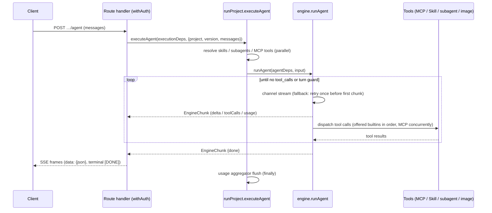

# Agent Studio Architecture

Agent Studio is a production-level single Next.js 16 full-stack application. It covers the domains: **project, llm, agents
(subagents + external agent registry), skills, mcp, chat, cost/usage**.

**Where to start**: read this file top-to-bottom, then trace one request through the code —
execution starts at `src/application/execution/runProject.ts` (the facade every entry point
calls) and descends into `src/application/llm/engine.ts` (the tool loop; see its
`AGENTS.md` for the loop invariants). The [Request Flow](#request-flow-execution) section
below is the map.

## Stack

- Node.js 24, pnpm 11 (`packageManager` pinned)
- Next.js 16 App Router, React 19, TypeScript strict
- Mantine 9 (`@mantine/core` + hooks/form/notifications/charts, `@tabler/icons-react`)
- Better Auth 1.6 + Google OAuth (custom DynamoDB adapter)
- AWS DynamoDB Single Table Design

## Clean Architecture Layers

```
src/
  domain/           # Entities + repository ports. Pure TS. No framework/AWS imports.
    project/  llm/  chat/  skill/  mcp/  agent/  usage/  settings/  trace/
  application/      # Use cases. Depends on domain ports only.
  infrastructure/   # Adapters (app-facing code reaches them via the composition root).
    db/             # Single-table client, key builders, repositories
    llm/            # OpenAI-compatible provider channels, streaming
    mcp/            # MCP HTTP client
    a2a/  agent/  slack/  github/  storage/  net/  crypto/  health/
                    # A2A + external-agent clients, Slack, skills-repo sync, S3 image
                    # store, SSRF guard, AES, readiness probes
  app/              # Next.js App Router: pages + route handlers (presentation)
    api/            # Route handlers call application use cases, never repositories directly
    _components/    # The shared UI kit: Modal, Badge, CardGrid, HeaderRows, form styles,
                    # code blocks, copy buttons. A piece of UI that repeats across pages
                    # belongs here, with one owner
  components/       # App chrome: the header the root layout mounts (carrying the theme
                    # toggle and user menu), and the landing page's sign-in button
  lib/              # Cross-cutting glue: composition root (container.ts), auth/session,
                    # config + runtime-settings, SSE helpers
  shared/           # Dependency-free helpers (dates, slugs, timeouts, PKCE, constant-time
                    # compare). The bottom of the graph: it imports nothing from `@/`
```

Dependency rule: `app → application → domain ← infrastructure`. Route handlers and pages must
not import from `infrastructure/` directly except through the composition root
(`src/lib/container.ts`), which wires ports to adapters. `src/lib` is a cross-cutting leaf
both application and infrastructure may import (config, runtime-settings, session); domain
must never import it. Application code receives its dependencies — it must not import the
composition root (`container.ts`) itself.

Composition is distributed across a few deliberate wiring sites: `src/lib/container.ts`
(repositories, the domain ports — `SecretCipher`, `UrlPolicy`, `RemoteAgentDispatcher`,
`McpToolProbe`, `McpSessionFactory` — the four registry-slice singletons, and
`executionDeps`/`imageDeps`, including the required LLM/image channels, so a missing
injection is a type error rather than a silent network call),
`src/app/api/chats/_deps.ts` (the `ChatDeps` bag), and
`src/app/api/slack/events/_lib/` (the `SlackEventDeps` bag: bound `runAgent` + the
`SlackClientPort`, mirroring `ChatDeps`). Three DI styles are in use on purpose: factory
`createXUseCases(repo)` for registry slices (their shared CRUD core lives in
`src/application/registry/registryUseCases.ts`), free functions taking the repo as the
first argument for the project slice, and deps-bag interfaces (`ChatDeps`,
`ExecutionDeps`, `SlackEventDeps`) for execution paths. New slices should prefer factory
or deps-bag.

## DynamoDB Single Table Design

One table (env `DYNAMODB_TABLE_NAME`, default `agent-studio`), keys `PK` (S) / `SK` (S),
GSIs: `GSI1` (`GSI1PK`/`GSI1SK`), `GSI2` (`GSI2PK`/`GSI2SK`). All items carry `entityType`.

| Entity | PK | SK | GSI1PK | GSI1SK |
|---|---|---|---|---|
| Auth (better-auth model rows) | `AUTH#{model}#{id}` | `ITEM` | `AUTH#{model}` | `{id}` |
| Auth unique lock (email, token, ...) | `AUTHUNIQUE#{model}#{field}#{value}` | `LOCK` | — | — |
| Project | `PROJECT#{name}` | `META` | `TYPE#PROJECT` | `{name}` |
| Project version | `PROJECT#{name}` | `VERSION#{versionName}` | — | — |
| Project API token | `PROJECT#{name}` | `APITOKEN` | — | — |
| Webhook trigger | `PROJECT#{name}` | `TRIGGER#{triggerId}` | — | — |
| Trigger delivery | `PROJECT#{name}` | `TRIGGERRUN#{triggerId}#{startedAt}#{runId}` | — | — |
| Trigger idempotency claim | `TRIGGERIDEM#{name}#{triggerId}#{key}` | `META` | — | — |
| Chat | `CHAT#{chatId}` | `META` | `CHATOWNER#{email}` | `{updatedAt ISO}` |
| Chat message | `CHAT#{chatId}` | `MSG#{seq zero-padded 6}` | — | — |
| Skill | `SKILL#{name}` | `META` | `TYPE#SKILL` | `{name}` |
| MCP server | `MCP#{name}` | `META` | `TYPE#MCP` | `{name}` |
| External agent (registry) | `AGENT#{name}` | `META` | `TYPE#AGENT` | `{name}` |
| Usage (daily per project) | `USAGE#{projectName}` | `DATE#{yyyy-MM-dd}` | `USAGEDATE#{yyyy-MM-dd}` | `{projectName}` |
| Usage (daily per caller) | `USAGE#{projectName}` | `ACTOR#{yyyy-MM-dd}#{kind}:{id}` | — | — |
| Run concurrency slot | `RUNSLOT#{kind}:{id}` | `SLOT#{index zero-padded 3}` | — | — |
| Slack event dedup | `SLACKEVENT#{eventId}` | `META` | — | — |
| A2A task (inbound) | `A2ATASK#{projectName}#{taskId}` | `META` | — | — |
| Trace | `TRACE#{traceId}` | `META` | `TRACEPROJECT#{projectName}` | `{createdAt ISO}#{traceId}` |
| Trace deletion reference | `PROJECT#{name}` | `TRACE#{createdAt}#{traceId}` | — | — |
| App settings (env overrides) | `SETTINGS#app` | `META` | — | — |

Conventions:
- Published version is a pointer attribute `publishedVersion` on the project `META` item, not a copy.
- Chat META owns an atomic `nextSeq`; message rows use conditionally-created sequence keys.
- Auth unique fields are claimed transactionally with a dedicated lock item. GSI2 remains
  a compatibility lookup for rows created before unique locks were introduced.
- Trace creation transactionally writes a project-partition deletion reference; project
  deletion marks the project first, preventing new versions/traces before child cleanup.
- Usage rows are updated with atomic `ADD` per model: `calls.{model}`, `inputTokens.{model}`,
  `outputTokens.{model}`, `costUsd.{model}` — two-step update: `SET … if_not_exists` to
  materialise the maps, then `ADD calls.#model :calls, …` on the nested number attrs.
  They also carry the cost guard's once-per-day notification claims (`alertedAt`,
  `blockedAt`), taken with a conditional write. The claim lives here rather than on the
  project item because that item's `updatedAt` is the optimistic-concurrency condition for
  every project write — a background marker there would fail a concurrent edit — and because
  a usage row already expires on its own date, which retires the marker with it.
- Row retention (`src/infrastructure/db/ttl.ts`): trace, usage, chat/message, and inbound A2A
  task rows carry a unix-seconds `expiresAt` (the table's TTL attribute, shared with Slack
  dedup rows) so the single table does not grow without bound. Retention runs from the trace
  `createdAt`, the usage `date`, the chat's last activity / a message's `createdAt`, and the
  A2A task's last write; a trace and its deletion reference share one expiry so the ref never
  dangles. Windows default to 30 / 400 / 180 / 1 days and are overridable via
  `TRACE_RETENTION_DAYS` / `USAGE_RETENTION_DAYS` / `CHAT_RETENTION_DAYS` /
  `A2A_TASK_RETENTION_DAYS`. Because the physical TTL purge is only eventually consistent, reads
  also filter out already-expired rows. Enable TTL on `expiresAt` on the prod table
  (`scripts/init-local-table.ts` does this for local).
- Key builders live in `src/infrastructure/db/keys.ts` — never hand-write key strings elsewhere.
- List queries paginate: most through `queryAll()` (`src/infrastructure/db/query.ts`) — a Query
  page caps at 1MB, so an unpaginated list silently truncates. `chatRepository` runs its own
  `LastEvaluatedKey` loops; `traceRepository` is intentionally bounded top-N via `Limit`, and
  keeps pulling pages (bounded) until that limit is filled with live rows, because DynamoDB
  applies `Limit` before the app-side expired-row filter.

Why one table and two GSIs: primary-key access covers everything item-scoped (a project and
its versions share a partition; a chat and its messages share a partition). `GSI1` serves
the heterogeneous "list by kind" patterns — `TYPE#*` catalog listings (projects, skills,
MCPs, agents), `CHATOWNER#{email}` (a user's chats ordered by recency), `USAGEDATE#{date}`
(cross-project daily cost for the dashboard), and `TRACEPROJECT#{name}`. `GSI2` exists
solely for Better Auth unique-field lookups (email/token → auth row).

## Request Flow (Execution)

Six execution entry points converge on the facades in
`src/application/execution/runProject.ts` (`executeVersion` / `executeVersionStream` /
`executeProjectStream` / `executeAgent`) — the composition point that resolves a version's
skills/MCP tools/subagents from repositories, assembles the injected engine deps, and
records usage. To trace any request, start there.

| Entry point | Caller | Facade used |
|---|---|---|
| Predict | `POST …/predict` | `executeProjectStream` (stream) / `collectRun(executeAgent)` for agent projects, `executeVersion` otherwise — so an agent project runs its tool loop here too, and `variables` (which only a prompt template consumes) are ignored for it; image projects → `generateImage`, which edits the request's source `images` when any are sent and generates otherwise |
| OpenAI-compatible | `POST …/chat/completions` | `executeProjectStream` (stream); `executeVersion` / `collectRun(executeAgent)` (non-stream) |
| Agent SSE | `POST …/agent` | `executeAgent` |
| Chat | `POST /api/chats/[chatId]/messages` | `executeAgent` (bound as `ChatDeps.runAgent` in `app/api/chats/_deps.ts`) |
| Slack | `/api/slack/events/[project]` → `handleSlackEvent` | `executeAgent` (via `SlackEventDeps`) |
| A2A | `POST /api/a2a/[name]` → executor | `executeProjectStream` |
| Webhook trigger | `POST /api/triggers/[project]/[trigger]` → `executeDelivery` | `executeProjectStream` (bound in `container.ts` as `triggerRunnerDeps.run`) |

The two table entries not on that list are thin wrappers alongside: `generateImage`
(`src/application/image/generateImage.ts`, the image predict path) and `collectRun`
(`src/app/api/projects/_lib/openai.ts`, which drains `executeAgent` for the non-stream
OpenAI response).

### The run bracket

Exactly four functions admit a top-level run — `executeVersion`, `executeVersionStream`,
`executeAgent` and `generateImage` — and each one opens a bracket
(`src/application/execution/runBracket.ts`) around it. The bracket is the single owner of
everything that wraps a run regardless of how it was started: the in-flight metric
(`beginRun`/`endRun`) and the daily cost guard. `tests/architecture.test.ts` pins it, so a
fifth entry point that skips the bracket is missing its metric as loudly as its guard.

It is *not* "the execution facade", because `generateImage` is not in one: the predict route
and the A2A executor call that module directly. Order is load-bearing at both ends. The
guard runs **before** the metric opens, so a refused run is never counted, traced, or
recorded. `close()` runs **after** the caller has flushed its usage — an agent run buffers
usage until the end, so a settle before the flush would always read a total that excludes
the run being settled.

Two guards hang off it, and they fail in opposite directions on purpose. The **cost guard**
protects money, so a storage blip must not stop the platform: it fails open. The
**concurrency guard** protects the platform itself, so opening it when the store is failing
would add load exactly when the store cannot take it: it fails closed — and costs nothing
extra, since every run reads its project and version from the same table and a store that
cannot answer was about to fail the run anyway. Cost is checked first: a project over budget
should be told so rather than made to queue for a slot it would be refused on regardless.

Concurrency is a **slot index**, not a counter (`src/domain/execution/runSlot.ts`). A counter
is exact only while every process lives to decrement it; an instance killed mid-run leaks its
increment forever, and nothing expires a number. Each of a caller's `0..limit-1` indices is a
row with a lease, claimed by a conditional write — so the limit is exact rather than a bound
two concurrent acquires can overshoot, and a dead instance releases its hold when the lease
runs out. State is shared rather than per-process for the obvious reason: `runMetrics` counts
this instance's runs, so a limit built on it would multiply by the number of instances.
`a2a` gets its own ceiling because its actor id is a constant — the inbound key is shared, so
one identity stands for every machine caller and the per-caller limit would otherwise become
a cap on the whole A2A surface.

The cost guard itself (`src/application/usage/costGuard.ts`) reads one day's row with a
single primary-key `GetItem`, sums every model's `costUsd`, and refuses with
`CostLimitExceededError` (a `RateLimitedError`, so `apiError` emits `Retry-After` — the
seconds to 00:00 UTC, which is exactly when the refusal stops being true). Every read or
write failure inside it fails open. Notification claims are conditional writes on the usage
row, one per threshold, so crossing the alert threshold does not consume the block
notification and two instances crossing together still post once.

`executeProjectStream` is the canonical projectType → strategy dispatch (`agent` runs the
multi-turn tool loop, anything else streams a single-shot completion). New entry points
should call it instead of re-encoding that decision. A subagent transfer dispatches on the
same axis inside `runLocalSubagent`: an `image` child generates, a prompt child runs its
user prompt template with the transfer message as the user turn, and only an `agent` child
enters the tool loop.



Streaming entry points pull the generator's **first chunk before constructing the Response**
(`src/app/api/_lib/sse.ts`). A run refused by a guard throws on that first `next()`, before
producing anything; building the response first would send `200 text/event-stream` and then
deliver the refusal as a data frame, so an SSE caller would never see the 429 or its
`Retry-After`. Holding one chunk lets the throw reach `apiError`, and the stream is otherwise
byte-identical.

### EngineChunk contract

`EngineChunk` (`src/domain/llm/types.ts`) is the wire unit between the engine and every
consumer (chat persistence, Slack, OpenAI reshaping, A2A, the browser client). Top-level
chunks carry **no `author`**; only subagent chunks are authored (stamped by the
`runSubagent` wrapper with the subagent's name). `isTopLevelChunk()` is the single owned
predicate — consumers must use it instead of re-deriving author semantics.

| Field | Emitted by | Consumed by |
|---|---|---|
| `delta.content` / `delta.reasoningContent` | engine per stream delta (PII-restored) | top-level only: chat persistence, Slack text, OpenAI chunks, A2A artifact, client answer bubble |
| `delta.toolCalls` | engine when a turn requests tools (display args) | client tool-call rendering; Slack progress indicator |
| `toolResult` | engine after each tool finishes | chat tool rows (displayed, and replayed into context for the last N turns), client tool panel |
| `warning` | run setup, before the first token, for a binding it could not use (deleted skill/subagent, unreachable or blocked MCP server, tools past the per-run cap) | chat warning banner, Slack warning suffix, `Trace.warnings`; never ends the stream |
| `image` | GenerateImage / EditImage builtins, and image-project subagents | consumed **regardless of author** (delegating to an image subagent is how an agent draws): chat image persistence (S3), Slack upload, OpenAI `images` extension, client gallery |
| `usage` | engine once per model call | `collectRun` response usage; DB recording is separate (`recordUsage` / aggregator inside the engine loop) |
| `error` | engine on failure (mid-stream — no retry); authored when a transfer fails | every consumer surfaces it, but only a **top-level** error ends the stream — an authored one is a tool error the parent may still answer from |
| `done` | engine when the loop ends without tool calls — **not** when the turn guard stops it | OpenAI `finish_reason` (`stop` with `done`, `length` without), client finalize |
| `author` | subagent chunks only — the **innermost** agent | consumers filter via `isTopLevelChunk`; client shows the running agent |
| `authorPath` | subagent chunks only — the chain, outermost first | client renders `sample-agent → simple-image`; the trace recorder groups a transfer by its first element |
| `traceId` | subagent chunks (stamped by `runProject`) | client correlates a chunk to its subagent's trace |

## Error Handling

Two deliberate strategies coexist:

- **HTTP path (before a stream starts)**: use cases throw `AppError` subclasses
  (`src/application/errors.ts` — Validation/NotFound/Forbidden/Conflict/RateLimited; chat
  adds `Chat*` subclasses extending the same base). `RateLimitedError` carries the seconds
  to wait, because the thing that knows *why* a request was refused is the only thing that
  knows when it stops being refused; `apiError` turns that into `Retry-After`.
  Route handlers map any thrown error through
  `apiError` (`src/app/api/_lib/http.ts`); `parseName` validates `[name]` params as slugs
  by throwing `ValidationError`. The registry slices share this contract via
  `createRegistryUseCases` (`src/application/registry/registryUseCases.ts`): missing →
  `NotFoundError`, duplicate create → `ConflictError`, SSRF-blocked URL at the write
  boundary → `ValidationError` (`assertAllowedUrl` wraps the infrastructure `SsrfError`,
  which stays layer-local).
- **In-stream path (after the first chunk)**: failures are values, not exceptions — the
  engine yields an `{error}` chunk (no retry mid-stream), subagent failures yield an
  authored error chunk, and dispatch guards degrade instead of failing the run (an
  SSRF-blocked or unreachable MCP server is skipped with a warning; a hung MCP request
  aborts after 120s and becomes a tool-error string the model can react to).

## Domain Semantics

### Project / Version
- `Project { name (slug, immutable id), displayName, description,
  projectType: 'llm' | 'agent' | 'image', ownerEmail, departmentCode?,
  publishedVersion?, slack? (per-project Slack bot credentials, AES-encrypted),
  costLimits? (daily spend guards), createdAt, updatedAt }`
- `CostLimits { alertThresholdUsd?, blockThresholdUsd?, alertSlackChannel? }` — the window is
  the UTC day because that is the grain the usage row is keyed at; a guard on any other
  window would need an aggregate that does not exist. Both thresholds are optional and
  independent. Enforced by the run bracket (see [Request Flow](#request-flow-execution)).
- `Version { versionName, systemPrompt, userPromptTemplate, model, fallbackModel?, parameters
  (temperature, maxTokens, reasoningEffort?, piiFiltering, structuredOutput?/jsonSchema,
  imageGeneration?/imageModel?), mcpList: McpBinding[], skillList: string[],
  subagentList: {name, type:'local'|'remote'}[], maxTurn?, createdAt }`
- `McpBinding { name, headers?: Record<string, string | null>, tools?: string[] }` — binds the
  version to a registry MCP server. `tools` narrows which of that server's tools the run
  offers (absent/empty = all of them); a run declares at most 120 MCP tools in total and
  reports what it had to leave out. The URL is always the registry's; `headers` layers over the server's
  own headers at dispatch (string = replace/add, `null` = remove a default, matched
  case-insensitively), so one registry server serves many projects under different
  credentials. Override values carry the same AES-encrypt/mask lifecycle as registry
  headers, which makes a version the first entity holding secrets: API responses go through
  `toVersionView`, while execution paths read the repository value and decrypt at dispatch.
  Rows written before overrides existed stored `mcpList` as `string[]`; reads normalize them
  and the API still accepts that shape.
- Template variables `{{var}}` rendered server-side before dispatch.
- Version writes validate capability fit for catalog models (agent projects require
  `capabilities.tools`; `structuredOutput` requires the capability); unknown/custom model
  ids stay allowed with a warning ($0 cost until added to the catalog).
- Version writes also validate that `mcpList`/`skillList`/`subagentList` entries resolve
  (`VersionRefRepos`, injected by the route from the composition root), and that the project
  type can actually run them — only `agent` projects do, so a binding added to any other type
  is rejected instead of being stored, shown in the editor and silently ignored at run time.
  On update only newly added entries are checked in both cases, so deleting a registry entry
  never strands the versions that already referenced it, and configuration stored before
  these rules stays editable (and removable).
- Which version a run executes is owned by `resolveRunnableVersion`
  (`src/application/project/resolveRunnableVersion.ts`): the published pointer always
  wins; only interactive surfaces (chat) opt into falling back to the newest draft;
  external surfaces (Slack, A2A, subagent transfers) are published-only so drafts never
  leak.

### LLM Engine (`src/application/llm/engine.ts` — public contract)
- All text generation speaks the OpenAI Chat Completions protocol; model ids are
  `provider/model` (e.g. `openai/gpt-5-mini`, `google/gemini-3.1-flash-lite`). By default
  every id goes to the `LLM_BASE_URL` channel; per-provider channels (runtime-settings
  override, else `LLM_PROVIDER_<PROVIDER>_*` env) route by the id's provider prefix
  (`src/infrastructure/llm/channel.ts`).
- `runPrompt(input): Promise<RunResult>` — single-shot; supports streaming via
  `runPromptStream(input): AsyncGenerator<EngineChunk>`.
- `runAgent(input): AsyncGenerator<EngineChunk>` — recursive multi-turn tool loop:
  - turn guard `currentTurn >= maxTurn` (default 50) stops the loop
  - all tool_calls of one response aggregate into ONE assistant message, then tool results
    append, then recurse with `turn + 1`
  - a builtin serves a call only when that builtin was **offered** this run (the offered
    names come from `buildAgentTools`, never from dep presence): `Skill` (progressive skill
    loading), `transfer_to_agent` (subagent transfer — local recursion or remote agent HTTP
    call; budget guard `turn + 2 >= maxTurn` rejects transfer), `GenerateImage` (image
    generation via the injected `generateImage` dep; results persist to S3 when configured),
    `EditImage` (edit an existing image by handle id via the injected `editImage` dep). Any
    other name is an MCP tool; `BUILTIN_TOOL_NAMES` is reserved during alias allocation so an
    MCP tool never carries a name a builtin might claim.
  - the MCP calls of one response run concurrently (≤5 in flight) while builtins run in call
    order; results, tool messages and the assistant `tool_calls` stay in call order
  - one turn's tool-result text is capped (`MAX_TOOL_RESULT_CHARS_PER_TURN`, 200KB, spent in
    call order): a truncated result says so and one that no longer fits becomes `Error: …`
    Both image deps are injected only when the version opts in via
    `parameters.imageGeneration: true`; the model is `parameters.imageModel` when set and
    still image-capable, else the registry's default image model. Whether that model's
    provider implements the edit endpoint is only known at dispatch, so a refusal comes back
    as a tool-result error rather than hiding the tool
  - image handles: a per-run registry ids the inline `data:` images of the input messages and
    every image the run produced (`img_1`, `img_2`, …). `EditImage` and `transfer_to_agent`'s
    `image_ids` take an id, so the engine resolves bytes and the deps stay pure I/O. An
    `https://` image part gets no handle — the provider fetches those itself, so the bytes are
    not in hand. The registry is filled when a run can edit or can transfer; otherwise skipped
  - subagent transfer passes the model-written `message` plus the bytes of any `image_ids` it
    named — an image-project child then *edits* those instead of drawing anew, and an agent
    child sees them as image content parts. A remote (A2A) child cannot take images and says
    so rather than dropping them. The child's final text returns as a "For context: ..."
    user message
  - it also carries the conversation so far as a rendered, PII-masked transcript bounded by
    `MAX_TRANSFER_CONTEXT_CHARS` (8,000) — text inside the child's user turn, never replayed
    messages, so the child cannot read the parent's answers as its own. The turn being
    answered is excluded (the `message` already is it), an agent child passes the same
    transcript on so a grandchild inherits the original conversation, and an **image** child
    receives the bare `message` because that message is its image prompt. See
    `src/application/llm/AGENTS.md` for the full contract
  - local transfers carry an ancestry chain (`src/application/execution/runProject.ts`):
    transferring to a project already on the chain, or nesting past
    `MAX_SUBAGENT_DEPTH` (5), is refused as an authored error chunk. Turn accounting
    alone cannot bound this — a child version carries its own `maxTurn` and can raise
    the ceiling its parent was running under
  - top-level chunks are unauthored; subagent chunks carry `author` (see the
    EngineChunk contract above)
- Fallback: on 429/5xx from the primary model **before the first chunk**, retry once with
  `fallbackModel`; a mid-stream failure yields an `{error}` chunk and does not retry.
- PII filtering: when `parameters.piiFiltering` is true, emails and phone numbers in
  outbound messages/variables are regex-masked with reversible format-preserving
  `[[PII:…]]` tokens before dispatch (`src/application/llm/pii.ts`); originals are
  restored in responses — streaming included (token-boundary buffering) — and the mapping
  carries across subagent transfers, while tool args/results re-entering engine context
  stay masked. **Outbound MCP dispatch is not masked**: `callMcpTool` gets the restored
  arguments (a tool needs the real address), so the toggle bounds what the LLM and the engine
  context see, not what a third-party MCP server sees. Best-effort (regex; emails + phones
  only). Off = byte-identical to the unfiltered path.
- Cost: computed from registry pricing at the call site (`calculateCost` /
  `calculateImageCost` in `src/domain/llm/models.ts`) and passed to `recordUsage`, which
  hands it to the usage repository's atomic ADD into the daily usage row. Single-shot runs
  record per call; agent runs buffer per-turn usage in `createUsageAggregator` and flush
  once at run end.
- Model registry `src/domain/llm/models.ts`: `ModelConfig { id, provider, displayName,
  pricing { inputPer1M, outputPer1M, cachedInputPer1M?, imageInputPer1M?,
  imageOutputPer1M?, perImage? }, capabilities { tools, structuredOutput, imageInput,
  reasoning, reasoningWithTools?, imageGeneration? }, contextWindow, maxTokens, hidden?,
  wireId? }`. `wireId` is the name to send once a provider-direct channel strips the
  `provider/` prefix, for a provider that spells the model differently from the router
  convention the registry and every stored version use — Anthropic serves
  `claude-opus-4-8` and 404s on `claude-opus-4.8`. Renaming the entry instead would
  orphan stored versions, which would then price at $0.

### Skills
- Skill = markdown behavior instructions (progressive disclosure): system prompt lists
  name+description table only; model calls builtin `Skill` tool to load the SKILL.md body,
  or a specific attachment via `file_path`.
- Stored in table: `Skill { name, description, content (markdown), files? ({ path, content }[]),
  source?, createdAt, updatedAt }` — `source` marks skills synced from the skills repo
  (e.g. `github:owner/repo`); `files` are attachment files collected under the skill root.
- Sync collects supported text attachments (`src/domain/skill/files.ts`:
  `ALLOWED_SKILL_FILE_EXTENSIONS`) under each `SKILL.md` directory, bounded by per-file /
  per-skill / file-count caps and excluding symlinks; `file_path` is normalized and confined
  to the skill root (no absolute paths, `..`, or cross-skill access). Replacing the skill
  item on re-sync drops stale attachments; skipped files are reported with reasons.

### MCP
- `McpServer { name, url, description?, content?, headers: Record<string,string> (values
  encrypted at rest AES-256-GCM `enc:v1:` prefix, masked on read — length-preserving,
  revealing 2 chars at each end from 9 chars and 4 from 21), createdAt, updatedAt }`.
  `description` is a one-line summary and the only field the model sees (it becomes a row
  in the system prompt's server table); `content` is markdown operator notes shown in the
  console only — unlike a skill's content it is never sent to the model. Descriptions are
  escaped when rendered into the table, so a legacy multi-line value cannot break it.
  These headers are the
  shared default; a version's `McpBinding.headers` may redefine them per project
  (`mergeOutboundHeaders` in `src/infrastructure/crypto/secretEncryption.ts`).
- `url` is SSRF-guarded (`src/infrastructure/net/ssrfGuard.ts`) at registration and dispatch:
  non-http(s) schemes and private/loopback/link-local/metadata addresses are rejected.
  Outbound calls go through `fetchPublicUrl`, which re-resolves and re-checks DNS on every
  request and every redirect hop, pins the connection to the checked address, and refuses
  cross-origin redirects. Dispatchers are pooled per `origin|address` (bounded, evicted
  oldest-first) so repeated tool calls reuse connections — transport only; the guard still
  runs per request, so a host that starts resolving privately is rejected before a pooled
  dispatcher is reached.
- Tool loading via MCP streamable HTTP (`tools/list`, `tools/call` JSON-RPC). The protocol has
  one owner, `McpSession` (`src/infrastructure/mcp/session.ts`) — both the engine's
  `ToolManager` and the registry's "Test connection" probe run on it. Tool name
  collisions get `_1/_2` suffix aliases with reverse mapping. Tool results capped at
  100,000 chars. Servers are contacted in parallel at init (one unreachable server would
  otherwise add its full 120s timeout to time-to-first-token) while alias allocation stays
  in configured order so names are deterministic; sessions are registered before their first
  request and released with a `DELETE` when the run ends (`ToolManager.close()`, called from
  the execution facade's `finally` — including when discovery itself failed or was cancelled).
  A request answered `404` while carrying an `Mcp-Session-Id` means the server has forgotten
  that session, and the transport requires a new one: the session id is dropped and the
  request is replayed once behind a fresh handshake. Replaying is safe because a 404 is a
  session-lookup failure — the server rejected the message before running anything, so a
  `tools/call` that gets one had no effect to repeat. Bounded at one attempt, or an endpoint
  that has genuinely gone would be handshaked against forever. Only the caller whose session
  is still the current one clears it: one model response dispatches its MCP calls together,
  so several can hold the same dead id, and each resetting in turn would abandon a handshake
  another had started and mint one server-side session per caller. Without this a run that
  outlives the server's session TTL — runs here last up to ten minutes — loses every
  remaining tool call, with the model reading `HTTP 404` and no path back.
  After the handshake, requests state the protocol version the **server** agreed to rather
  than the one proposed; a server that answers with another revision is not refused, since
  every revision that answers `initialize` still speaks the tool-list shape this client reads.
- Discovery is cached per `url + headers` (`discoveryCache.ts`, `MCP_DISCOVERY_CACHE_TTL_MS`,
  default 60s, invalidated when the registry entry is edited). On a hit the session is left
  uninitialized and handshakes lazily on its first tool call, so a turn that calls no tool
  makes **no** MCP request at all — a chat used to pay the full handshake per message per
  server. Headers are part of the key so one tenant's tool list never answers another's.
  Failures are cached too, for at most 30s: without it a server that is down — or a
  connection whose token was revoked — re-pays a failing handshake before the first token of
  every message. The window is short because a stale failure hides a recovery while a stale
  success only serves a slightly old tool list, and the stored reason is replayed verbatim so
  a cached failure explains itself exactly as the live one did.
  A server that sends the MCP caching hint `ttlMs` on `tools/list` (SEP-2549, required of
  servers from protocol `2026-07-28`) sets its own entry's lifetime instead: it knows its
  catalogue and the local default is only a guess about someone else's. `0` means do not
  cache, and a paged catalogue takes the shortest of its pages' hints.
  The hint is capped by `MCP_MAX_SERVER_TTL_MS` (default 5 minutes), which exists because an
  entry's lifetime answers two questions with one number. The server's hint answers the first
  — catalogue freshness. The second is how long a registry edit made on one instance goes
  unseen on the others, since `invalidateMcpDiscovery` is process-local; that one belongs to
  the deployment, not to the server, and without a ceiling a server asking for an hour would
  decide it for the whole fleet. The cap is a separate knob rather than a reuse of
  `MCP_DISCOVERY_CACHE_TTL_MS` because raising *that* to admit a hint would also stop
  unhinted servers being re-read, which is the opposite trade. Single-instance deployments
  can raise it freely; `MCP_MAX_SERVER_TTL_MS=0` ignores server hints entirely and returns
  every entry to the local TTL. Absent (every older server) falls back to the local default,
  and `MCP_DISCOVERY_CACHE_TTL_MS=0` wins over any hint, since that setting means caching is
  off and no server may switch it back on.
- **Managed servers** (`runtime: "managed"`, absent = `remote`). A container this
  app starts on its own host through SSM Run Command, reached at
  `127.0.0.1:<port>`. That address is one `UrlPolicy` rejects — correctly, for
  anything an operator types — so trust rests on provenance instead: the
  provisioner recorded the address after binding the port. `isManagedLoopback`
  (`src/domain/mcp/types.ts`) is the only place that decides the bypass applies,
  and it is narrow on purpose: the entry must claim `managed` *and* carry a
  literal loopback address. A hostname resolving to 127.0.0.1 is refused (it can
  resolve elsewhere between check and request), as is a `remote` entry pointing
  at loopback — that address was typed. The registry refuses to move a managed
  entry's url for the same reason, and the lifecycle use case refuses to store a
  non-loopback address even when the provisioner reports one, stopping the
  container it named. The provisioner takes an image reference and a port, never
  a command, and the shell string is assembled only from values matched against
  narrow patterns; images must come from the configured registry. Unset
  `MANAGED_MCP_INSTANCE_ID`/`MANAGED_MCP_REGISTRY` means the routes answer 503
  rather than half-enable the feature. The stored row carries `image`, `envRefs`
  and `containerPort` — everything a restart needs, because at restart time
  there is no operator to ask again. `containerPort` is a request, not a
  guarantee: only an adapter that publishes a port mapping can honour it, and
  the deployed one shares a network namespace instead, so it tells the container
  which port to bind (`PORT`) and ignores the stored value.
- **Surviving a redeploy.** A managed container joins this app's own network
  namespace (`--network container:<MANAGED_MCP_NETWORK_CONTAINER>`), which is the
  only way a loopback address means the same thing at both ends. Docker resolves
  that name to a container *id* when the workload starts and never re-resolves
  it, so replacing this app leaves the container running in a namespace nothing
  can address — healthy to `docker inspect`, reachable by nobody. `reconcile`
  (`src/application/mcp/managedMcpUseCases.ts`), fired from `instrumentation.ts`
  at boot and never awaited, probes every managed entry and restarts the ones
  that do not answer; a 401 counts as an answer, since recreating a container
  over a credential fixes nothing. `status` reports reachability separately from
  liveness for the same reason — reporting only the latter is what made this
  invisible. Sharing a namespace also means **one app instance per host**: a
  container belongs to exactly one.
- **OAuth** (MCP authorization spec, 2025-06-18). A registry entry may carry an `auth` block
  discovered once at registration (RFC 9728 protected-resource metadata → RFC 8414
  authorization-server metadata, both re-validated through `urlPolicy` and required to be
  https); the run path never fetches a well-known document. Credentials are **per project**,
  in their own `PROJECT#<name> / MCPCONN#<server>` item — not on the version (a snapshot of
  configuration history) and not on the project item (whose `updatedAt` guards publish with
  optimistic concurrency). That split is what lets one shared entry serve a different
  provider app per project. Client credentials are entered by an owner or issued by RFC 7591
  dynamic registration; a public client with no secret sends `none` whatever the server's
  metadata preferred. Every authorization and token request carries the RFC 8707 `resource`
  parameter — the spec makes it unconditional, and it is what stops a token issued for one
  MCP server being replayed against another. PKCE S256 is mandatory, `state` is single-use
  with a 10-minute TTL, and the callback re-checks project ownership because it can change
  while the user is at the provider. Registrations declare `application_type: "web"`
  (SEP-837) rather than leaving the OpenID Connect default to be applied for them.
  Two things are bound to the authorization server's `issuer`, both because every registry
  entry shares one callback URI and an admin can re-point an entry at any time:
  - The callback validates RFC 9207 `iss` before the code is redeemed (SEP-2468). The
    expected issuer is recorded on the pending-state item beside the PKCE verifier — not
    read back off the registry entry, which is exactly what a re-discovery may have changed
    — and compared literally: no case, port, trailing-slash or percent-encoding
    normalisation, each of which is another way for two issuers to compare equal. A missing
    `iss` is fatal only where the server's metadata advertises
    `authorization_response_iss_parameter_supported`. The same check runs on error responses,
    so provider-controlled `error_description` text is never relayed from a redirect this
    app cannot attribute.
  - A connection's client credentials carry the `issuer` they were registered with
    (SEP-2352), and its tokens carry the RFC 8707 `resource` they were minted for. Both are
    checked before anything is handed out, on the refresh path *and* on the path that only
    reads a live token — a bearer token has an audience, so serving one unchecked is the
    same mistake as spending the client secret. The entry's current `auth` block travels
    with the call from both callers, which already hold it, so the check costs no read.
    When an entry moves to another authorization server, dynamically registered credentials
    are re-registered there and the tokens the old client authorized are dropped;
    hand-entered ones are refused with the issuer to register at.
  Editing an entry's **URL** drops its `auth` block outright, for the same reason: the block
  was read out of the old address's well-known documents, so keeping it would leave the entry
  describing a server it no longer points at. The entry falls back to its own headers until
  an admin re-runs Discover — and once they do, the two checks above catch every connection
  that belonged to the old server. Deleting and recreating an entry under the same name is
  caught the same way, which matters because the registry is admin-owned while connections
  are owner-owned and the only thing joining them is the name.

  Tokens refresh only within a margin derived from
  `MAX_RUN_DURATION_MS`, so a token cannot expire mid-run *and* the header stays
  byte-identical between runs — refreshing every run would change the discovery cache key
  every run. Refresh is a compare-and-set on the stored refresh token: providers that rotate
  them revoke the previous one, so the loser of a race uses the winner's token instead.
  Only a refused grant marks a connection `needs_reauth`; a 5xx or timeout leaves it alone.
  A 401 at discovery is reported as "reconnect", never as "unreachable".
  A connection **supplies** credentials rather than gating the server. The resolved token is
  applied last at dispatch — over the registry entry's headers and the binding's overrides —
  so a version cannot substitute its own `Authorization` for the project's connection. And
  when no connection is available (never made, or revoked), the server still runs on whatever
  those headers hold; it is dropped with a warning only when they hold nothing. Discovering
  OAuth on an entry adds a way to authenticate it and must not take away the one an operator
  already configured, so one entry can serve a static-header project and an OAuth project
  side by side.
- A tool's **image** results (`image` blocks, and `resource` blobs with an image mime type)
  come back as bytes rather than being dropped. The engine registers them, streams them to
  the user, and attaches them to the turn as a follow-up user message — only when the model
  accepts image input, since a text-only model would reject the parts and fail the turn.
- Agent runs append a "Connected MCP Servers" table (server name, description, aliased
  tool names) to the system prompt so the model knows which server a tool group belongs
  to; servers that are unreachable or expose no tools are omitted.

### Triggers
- `WebhookTrigger { projectName, triggerId (slug), kind, description, enabled, secret
  (AES-encrypted, masked on read), variables?, payloadMode, allowConcurrent,
  createdAt, updatedAt }`. Triggers and their delivery history both live in the project
  partition, so the project cascade delete already removes them and a trigger's runs are one
  `begins_with`; run rows carry a TTL (`TRIGGER_RUN_RETENTION_DAYS`, default 30) because a
  delivery log is not a record to keep.
- **Published only**, via `resolveRunnableVersion` — a draft is configuration in progress,
  and an external system firing at one would run whatever an editor happened to have saved.
- `triggerId` is a slug under the same rule as a project name, normalised client-side by the
  shared `toSlug` and enforced by the schema.
- The secret is stored encrypted rather than hashed, so it is revealable through
  `POST …/reveal` — the same trade the project API token makes, and the same reasoning for
  POST-not-GET and for logging every reveal.
- The secret is compared with `cipher.decryptEquals` (constant time) **before** the enabled
  flag is read, so a disabled trigger cannot answer a wrong secret differently from an
  enabled one — that difference is an oracle for which triggers exist.
- `Idempotency-Key` is claimed with a conditional write (24h TTL), the same shape as the
  Slack event claim.
- `allowConcurrent: false` (the default) is enforced by reusing a **run slot**: "at most one
  in flight, and a dead instance's hold expires" is exactly what `RunSlotRepository` already
  is. Off by default because a webhook that fires faster than the run takes would otherwise
  pile runs up until the cost guard notices.
- `payloadMode` decides what the payload becomes. `variables` flattens its scalar top-level
  fields over the trigger's fixed ones — only strings can be substituted into a template, so
  a nested object is dropped rather than rendered as `[object Object]`. `message` serialises
  it into the user turn, which is what an agent project can reason about.
- Every refusal is a history row with a status, including a skip: an operator must be able to
  tell "it never fired" from "it fired and failed" without reading logs.
- The endpoint answers **202** and runs through `after()`, like the Slack path: a run here can
  last ten minutes and no webhook sender waits that long. Same durability gap as Slack, too —
  an instance lost mid-delivery leaves a row stuck in `running`, which is what the durable
  worker in the schedule-trigger milestone would close for both.

### External Agents (registry, A2A-lite)
- `ExternalAgent { name, url (OpenAI-compatible or agent endpoint), protocol? ('openai' |
  'a2a', absent = openai), description, headers (encrypted like MCP), createdAt, updatedAt }`
  — usable as `type:'remote'` subagents. `url` is SSRF-guarded like MCP.

### Chat
- `Chat { chatId, title, ownerEmail, projectName?, createdAt, updatedAt }`,
  messages append-only with `seq`. Chat execution uses the agent engine directly
  (no HTTP self-call), streams SSE to the client.
- `ChatMessage` is a discriminated union on `role` (`user` | `assistant` | `tool`) —
  a tool row always carries `toolCallId`, an assistant row may carry
  `toolCalls`/`images`, and illegal combinations are unrepresentable.
- A run persists one flattened assistant message holding the accumulated text, the run's
  **top-level** `toolCalls` and any `warnings` it reported, preceded by its tool rows —
  including a subagent's and a transfer's, which carry `author`/`displayOnly` so a reader
  sees what ran while replay refuses them. Replay pairs
  each row with the call that declared it — within the run a user message delimits, since
  ids are only unique there — and re-emits it after that message, bounded by the last N
  assistant turns and a total character budget. The conversation itself is bounded too, by
  whole runs; what does not fit is reported as a `warning`, not dropped in silence.

### Usage / Cost
- Daily per-project per-model aggregates (see table design). Dashboard reads
  `USAGEDATE#{date}` GSI partitions across a range and regroups client-side by
  project/provider/model.
- **Who spent it** is a second row, not another dimension on the first. Projects are a
  shared catalog — any signed-in user may run any project — so the project name does not
  identify the spender. `RunActor { kind, id }` (`src/domain/execution/actor.ts`) names one:
  `user` (email), `project-token` (the *owner's* email, since a token authenticates as them —
  the kind is the only thing keeping a machine's spend apart from that person's own runs),
  `slack` (Slack user id; Slack hands over no email and guessing a mapping would bill the
  wrong person), `a2a` (a constant — the key is shared, so there is nobody to name).
- The split is deliberate. `UsageRow` holds a map per metric keyed by model; keying those by
  `actor|model` instead would grow one item with the number of distinct callers, and a busy
  project would approach the 400KB item limit within a day — while the dashboard, which only
  ever asks for project totals, would pay to read every caller on every request. A separate
  `ACTOR#{date}#{actor}` row in the same partition keeps both reads exactly as wide as their
  question, and the project cascade already deletes the whole partition.
- The project total is written first and unconditionally; the actor row follows. Attribution
  is additive — a path that cannot name its caller still records the spend it caused.
- Per-caller reads are owner/admin gated (`GET /api/projects/[name]/usage/actors`) on the
  same reasoning as traces: project *totals* are open because the catalog is shared, but a
  breakdown by caller names individuals and what they ran.
- The actor is the **run's**, not the turn's: `createUsageAggregator` is bound with it once,
  so the calls a subagent transfer makes on another project are still attributed to whoever
  started the run. `RunOrigin { actor?, ancestry }` carries both down every transfer hop —
  they always travel together, so they are one value rather than two parameters threaded
  side by side through eight signatures.

## API Surface (App Router route handlers)

Request/response shapes, auth, and error cases: see [API.md](API.md).

```
POST /api/projects                          create
GET  /api/projects                          list
GET|PUT|DELETE /api/projects/[name]
GET|POST /api/projects/[name]/versions
GET|PUT|DELETE /api/projects/[name]/versions/[version]
POST /api/projects/[name]/publish           set publishedVersion
GET  /api/projects/[name]/usage/actors      per-caller daily spend (owner/admin)
GET  /api/projects/[name]/traces            trace list (owner/admin)
GET  /api/projects/[name]/traces/[traceId]  trace detail (owner/admin)
POST /api/projects/[name]/versions/[version]/predict        (version = name | 'published')
POST /api/projects/[name]/versions/[version]/chat/completions   OpenAI-compatible
POST /api/projects/[name]/versions/[version]/agent          SSE stream
POST /api/projects/[name]/preview           assemble an unsaved draft's prompt without running it, owner/admin
GET|POST|DELETE /api/projects/[name]/token  per-project API token, owner/admin (POST returns raw token once)
POST /api/projects/[name]/token/reveal      read that token back in plaintext, owner/admin
POST /api/settings/a2a-key                  issue/reissue the app-wide A2A key, admin-only
POST /api/settings/a2a-key/reveal           read the effective A2A key in plaintext, admin-only
GET|POST /api/projects/[name]/triggers          webhook triggers (owner/admin)
PUT|DELETE /api/projects/[name]/triggers/[trigger]
POST /api/projects/[name]/triggers/[trigger]/reveal read the secret back (owner/admin)
GET  /api/projects/[name]/triggers/[trigger]/runs   delivery history
POST /api/triggers/[project]/[trigger]      webhook delivery, gated by X-Trigger-Secret
GET|PUT|DELETE /api/projects/[name]/slack   per-project Slack bot, owner/admin (+ POST …/slack/test)
GET  /api/projects/[name]/a2a               project A2A exposure status
GET|POST /api/skills, /api/mcps, /api/agents (+ [name] GET|PUT|DELETE)
GET|POST /api/skills/sync                   skills-repo sync status / run
POST /api/mcps/[name]/tools                 MCP connection test
POST /api/mcps/managed                      start a managed MCP container + entry, admin-only
GET|DELETE /api/mcps/managed/[name]         its running state / remove container and entry
POST /api/mcps/managed/[name]/restart       re-create the container in this app's namespace (202; poll GET)
POST|DELETE /api/mcps/[name]/auth           OAuth discovery for a registry server (admin)
GET  /api/projects/[name]/mcp-connections   this project's OAuth connections (owner)
PUT|DELETE …/mcp-connections/[server]       save client credentials / disconnect (owner)
POST …/mcp-connections/[server]/authorize   returns the provider URL to open (owner)
POST …/mcp-connections/[server]/tools       tools as this project sees them (owner)
GET  /api/mcps/oauth/callback               the authorization server's redirect target
POST /api/agents/[name]/message             external-agent test message
GET|POST /api/chats, GET|DELETE /api/chats/[chatId]
POST /api/chats/[chatId]/messages           streams SSE
GET  /api/me                                the viewer's admin flags (isAdmin, isConfiguredAdmin)
GET|PUT /api/settings                       admin runtime overrides
GET  /api/usages/summary?from&to
GET  /api/models
GET  /api/a2a                               A2A-published project list
GET  /api/a2a/[name]/.well-known/agent-card.json   public Agent Card
POST /api/a2a/[name]                        JSON-RPC, gated by X-A2A-Key
POST /api/slack/events/[project]              project Slack webhook
GET|POST /api/auth/[...all]                  Better Auth login flow (Google OAuth)
GET  /api/health                            liveness (static 200)
GET  /api/ready                             readiness (DynamoDB + LLM reachability)
GET  /api/metrics                           Prometheus scrape (in-flight/failed runs, duration, unknown models)
```

All routes require a Better Auth session except the unauthenticated endpoints:
`/api/auth/*` (the Better Auth login flow itself), `/api/health`, `/api/ready`,
`/api/metrics`,
`/api/slack/events/*` (verified by signing secret), `/api/triggers/*` (verified by the
trigger's own secret), `POST /api/a2a/[name]`
(gated by `A2A_API_KEY`), and the public Agent Card GET. The three execution endpoints
(`predict`, `chat/completions`, `agent`) also accept a per-project API token via
`Authorization: Bearer <token>` in place of the session — resolved by
`authenticateExecution` (`src/app/api/projects/_lib/executionAuth.ts`), which verifies the
token against the `PROJECT#{name}` `APITOKEN` item and runs as the project owner. The stored
token is AES-encrypted and compared in constant time after decryption; a token issued before
tokens were revealable is stored as a SHA-256 hash and still verifies by hash.
`/api/health` is liveness — a static 200 answering "is the process serving". `/api/ready`
is readiness — it probes DynamoDB and the LLM channel for reachability (short timeout,
details not surfaced) and returns 503 when a downstream is unreachable or the instance is
draining after SIGTERM (`src/shared/lifecycle.ts`), so the load balancer deregisters it while
in-flight work drains. Point the LB health check at `/api/ready`, restart checks at
`/api/health`.

On a horizontally-scaled deployment, readiness is the wrong place for the LLM check: the
provider is shared by every instance, so one provider blip would mark the whole fleet
unready at once — including the console, chats and dashboards, none of which need the
provider. There, point readiness at `/api/health` too and let the platform's own
deregistration handle draining (a `preStop` pause covers the endpoint-propagation window).

## Observability

Every top-level run gets a **correlation id** when the bracket admits it, carried in an
`AsyncLocalStorage` (`src/shared/runContext.ts`) and stamped on every log line the run
produces: `[mcp run=… trace=…] …`. It is deliberately *not* the trace id — traces are sampled
on the non-agent paths (`TRACE_SAMPLE_RATE`, default 0.1), so a trace id as the correlation
id would leave nine out of ten prompt and image runs with nothing to correlate on, and
sampling does not favour the runs worth reading logs for. A trace, when there is one, is
linked into the context by the recorder's constructor instead.

`AsyncLocalStorage` rather than a threaded parameter because a run is a generator consumed
across many awaits, and the code that logs is usually several layers below the code that
knows which run it is. `enterWith` rather than `run(store, cb)` because the caller is a
bracket, not a wrapper it could hand a callback to — which makes **where** it is called
load-bearing: it must run before the bracket's first `await`, or it binds to the bracket's
own continuation and never reaches the run that produces the lines.

`enterWith` does not survive the generator delegation on the two paths that start work
outside a request, so `after()` callers open the scope themselves with
`withRunContext` — the webhook delivery with its **delivery id** (what the history row and
console show) and the Slack handler with the **event id** (what the dedup claim is keyed by).
An already-open scope wins inside `openRun`: minting a second id underneath would split one
delivery's lines across two.

`src/shared/logger.ts` is the single owner of writing to the console, pinned by
`tests/architecture.test.ts`. It lives in `shared` because every layer above needs it;
`domain` is exempt from the rule because it imports nothing from `@/` at all, so its one
counter-keeping line cannot reach the logger.

`/api/metrics` is the Prometheus scrape endpoint. It reports the number of top-level runs
in flight on this instance (`src/lib/runMetrics.ts`), which is the signal to autoscale on:
runs are I/O bound, so an instance saturated with them still reads as idle CPU. Alerting
keys on `agent_studio_runs_failed_total` and `agent_studio_run_duration_seconds` instead —
the gauge says how busy an instance is and nothing about whether the work is succeeding or
how long it now takes. A cancelled run (a client that hung up) is not counted as a failure,
or a page full of users navigating away would read as an outage. The histogram's top finite
bucket is 600s, the run deadline itself, so anything past it is a run that outlived its own
limit. It also reports `agent_studio_unknown_model_calls_total` and `agent_studio_unknown_models` — a
correctness signal rather than a scaling one: a model id missing from the registry still
runs, but its usage is booked at $0, so the miss is invisible in the cost dashboard it
corrupts. Counters are per-process and name no project, user, or model — the only label any of them
carries is a histogram's `le`. A label whose values are unbounded turns one metric into a
time series per value, which is also why unknown model ids are counted rather than labelled.

Projects are a shared catalog: any signed-in user may read and run any
project, but mutations (update/delete/publish, version create/update, Slack config) go
through `assertProjectWritable`, which returns 403 for anyone who is neither the owner nor a
configured admin. Two project sub-resources that expose other users' data are gated the
same way on *read*: traces (runtime inputs/outputs) and the Slack config (masked bot token
/ signing secret + manifest). MCP/agent/skill registries are shared: reads are open to any
signed-in user, while mutations go through `withAdminAuth` and are restricted to the
effective admin list when set (unset allows any signed-in user).

The admin override is checked inside `assertProjectWritable` rather than passed in by its
twenty-odd callers: the rule is "owner or admin", and a flag one caller forgot to thread
would silently narrow it back to owner-only on that path alone. The function is named for
that rule and not for the owner — anything that genuinely needs *ownership* (attribution,
whose credentials to dispatch with, whom to notify) must read `project.ownerEmail`. It uses
`isConfiguredAdmin`, not the `isAdminEmail` that `withAdminAuth` uses — the two agree
except when no admin list is configured, where the registry check stays open ("no
restriction") and the ownership override closes. Treating "no list" as "everyone is an
admin" here would hand every signed-in user write access to every project.

Both flags are therefore sent to the browser by `GET /api/me`, under the same two names.
The console gate for "may I edit this project" must mirror `assertProjectWritable`, so it
reads `isConfiguredAdmin`; using `isAdmin` there offered every user an edit form for every
project on a deployment with no admin list, and every save 403'd.

Two consequences of the override are handled rather than assumed away. It is logged —
`[authz] admin … is acting on project …` — because the write can destroy the row that would
have identified who made it, and a project's API token authenticates *as its owner*, so an
admin reveal leaves that line plus the `[token] … revealed by …` one. And the settings read
it needs fails closed: a settings-store outage denies the override instead of turning a
non-owner's deterministic 403 into a 500.

Runtime settings: the admin-only `/settings` page stores overrides for selected env vars
(admin/allowed-domain lists, default LLM channel, per-provider LLM channels, skills repo,
A2A key, public base URL) in the `SETTINGS#app` item.
`src/lib/runtime-settings.ts` resolves effective values — DB override → env fallback —
through a process-local in-memory cache (`SETTINGS_CACHE_TTL_MS`, default 5s, invalidated
on write). On a horizontally-scaled deployment a settings change (e.g. A2A-key rotation,
admin demotion) propagates to other instances only as their own cache entries expire, so
the TTL bounds how long a revoked credential keeps working somewhere in the fleet — hence
the short default. Immediate cross-instance revocation would need a shared invalidation
signal.
Secret overrides are AES-encrypted at rest and decrypted for outbound dispatch (and at read
only to reveal the edge characters of long values in the admin masked view); a stored
provider list replaces the whole `LLM_PROVIDER_*` env set. Bootstrap env (`AES_ENCRYPTION_KEY`,
Better Auth, Google OAuth, DynamoDB, `STAGE`) stays env-only. SSE responses use
`text/event-stream` with `data: {json}\n\n` framing and a terminal `data: [DONE]`.

Generated secrets: the two credentials Agent Studio issues itself carry a prefix naming
product and kind (`src/shared/generatedSecret.ts`) — `asa_` for the app-wide A2A key, `ast_`
for a project API token, `asw_` for a webhook trigger secret — so a leaked string is traceable to what it opens. Both are issued
from the console. The A2A key is an ordinary settings override: encrypted, then masked on
every later read. A project API token is stored AES-encrypted for the same reason — the
owner can read it back later through `POST /api/projects/[name]/token/reveal`, which is a
POST rather than a GET because the body is a live credential, and every reveal is logged
with the caller's email. Its display mask is computed at generation and stored beside the
ciphertext so listing a token costs no decryption; the mask carries only the prefix and the
edge characters it reveals, never enough to reconstruct the token.

Because the token is encrypted rather than hashed, the datastore alone is not enough to use
one, but the datastore plus `AES_ENCRYPTION_KEY` is — treat that key as the thing standing
between a table dump and live project credentials. Tokens issued before revealing existed
are stored as a SHA-256 hash instead: they still verify, but cannot be shown again, so the
console offers regeneration. Verification ignores the prefix either way, so tokens issued
under the older `sk_proj_` prefix keep working.

## Auth

Better Auth 1.6, Google OAuth only, custom DynamoDB adapter over the single table
(`src/infrastructure/db/authAdapter.ts`). Session read helper `getSessionUser()` in `src/lib/session.ts`;
route handlers wrap themselves in `withAuth(...)`, which returns a 401 `Response` when
there is no session and otherwise passes the `SessionUser` as the handler's first argument.

Pages have their own gate in `src/middleware.ts`, which owns the list of public paths (`/`
and `/login`) and redirects everything else to `/login?next=…` when the session cookie is
absent. It is an optimistic check — a present-but-invalid cookie reaches the page and gets
its 401 from the API behind it — so it is a redirect, not an authorization decision. `/api`
is outside the matcher: those routes authenticate themselves and must answer a programmatic
caller with a 401 rather than an HTML redirect. The `next` value is sanitised by
`safeNextPath` (`src/shared/safeNextPath.ts`) so the flow cannot be aimed off-origin.

## UI Pages

```
/                     dashboard when signed in, landing page otherwise
/login                sign-in screen; where the middleware sends a signed-out visitor
/projects             project catalog (cards)
/projects/[name]      orchestration playground (prompt editor, model picker, run/stream)
/projects/[name]/versions | usage | traces | api-reference | settings
/chats  /chats/[chatId]
/skills  /tools (MCP)  /agents  (each + /[name] detail page)
/dashboard            cost dashboard (range picker, group by project/provider/model)
/settings             admin-only runtime env-var overrides
```

UI text is in English. Mantine components provide the structure and the styling; the
theme in `src/app/theme.ts` is the single owner of the brand palette and of the component
defaults that used to be hand-written class constants, so a button or input is never
styled at the call site. Anything Mantine cannot express — the chart palette, the code
block's syntax colours, the chat bubble's edges — lives in a CSS module or in
`globals.css` and reads Mantine's CSS variables, never a hardcoded neutral.

The header offers system/light/dark themes through `useMantineColorScheme`, with
`ColorSchemeScript` applying the stored preference before first paint. The control renders
the default until mount: the preference exists only in the browser, so showing it during
SSR would be a hydration mismatch.

## Glossary

The word "agent" is overloaded; these are the distinct concepts:

- **agent project** (`projectType: 'agent'`) — a studio project that runs the multi-turn
  tool loop.
- **subagent** (`SubagentRef` on a version) — another project (local) or registry agent
  (remote) a run can transfer to via the `transfer_to_agent` builtin.
- **external agent** (`ExternalAgent`) — a registry entry for an outside endpoint
  (OpenAI-compatible or A2A), usable as a remote subagent.
- **MCP server** (`McpServer`, the `/tools` UI page) — a registered MCP endpoint whose
  tools the engine can call; "tools" alone refers to the OpenAI tool-calling mechanism.
- Invocation verbs: routes say **predict**, the facade says **execute**
  (`executeVersion`/`executeAgent`/`executeProjectStream`), the engine says **run**
  (`runPrompt`/`runAgent`). Same pipeline, three altitude levels.

## Environment

See `.env.example`. `STAGE` = local | alpha | prod. Local DynamoDB via
`DYNAMODB_ENDPOINT=http://localhost:8083`; `scripts/init-local-table.ts` creates the
table + GSIs. The integration check runs against a second instance on `8084`, and against
`agent-studio-test` rather than `agent-studio`, so it cannot cascade-delete data the dev
app is using. Both instances are shared with the other projects on this machine
(`compose.yaml` pins the compose project name), which is why the table name is the
isolation boundary rather than the port.

## Verification

- `pnpm typecheck` (tsc --noEmit, strict) and `pnpm build` must pass.
- `pnpm test` runs Vitest unit tests (engine loop & fallback, cost calc, template rendering,
  Slack verification/dedup, SSRF guard, settings, and more — see `tests/`).
