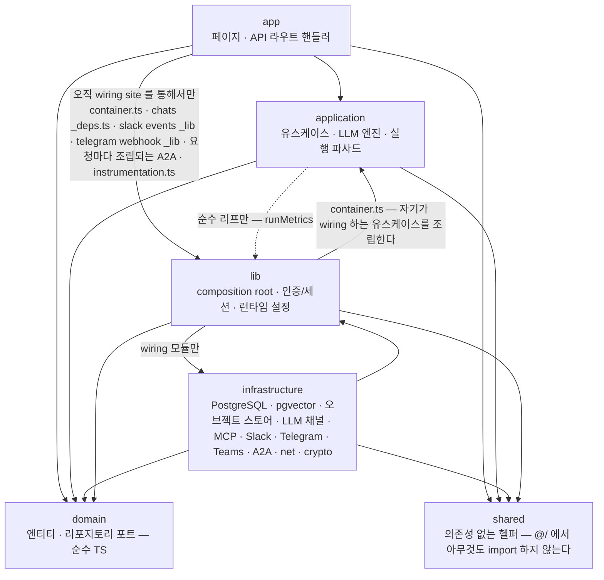
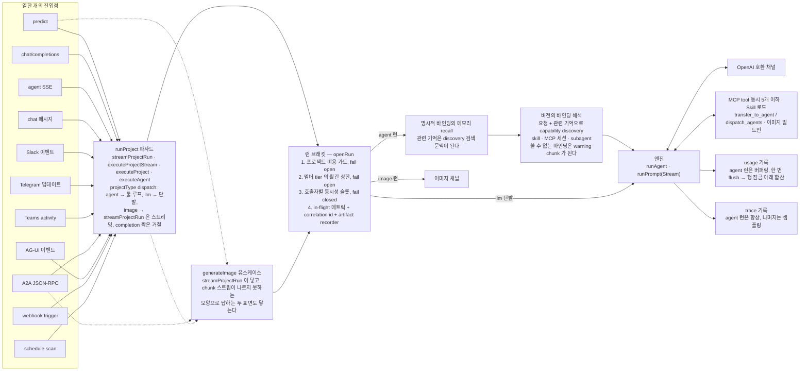
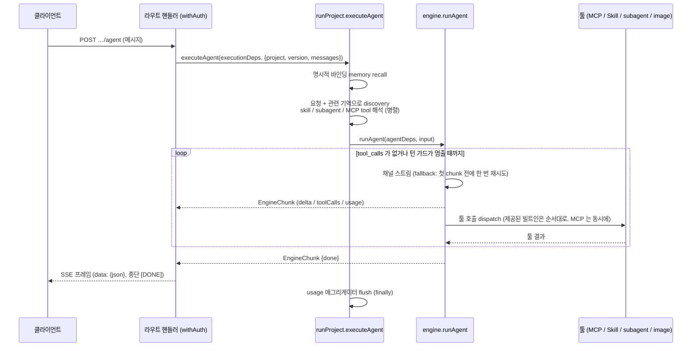
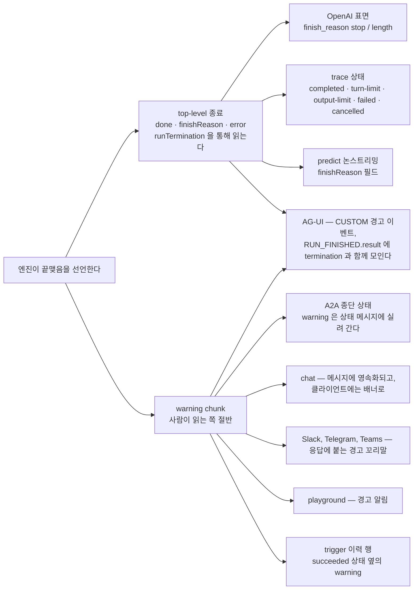

# 아키텍처

**모든 런이 지나는 형태**, 그리고 왜 그 형태인지. 레이어, 하나의 데이터베이스, 진입점에서
엔진까지의 경로, 그리고 실패가 어떻게 밖으로 되돌아 나오는지를 다룬다. 코드를 고치기 전에
읽을 문서다.

각 *서브시스템*이 무엇을 결정하는지는 [`design/`](design/) 에 파일 하나씩으로 있고, 아래
[서브시스템](#서브시스템)에 색인돼 있다. 이 파일은 그것들이 모두 그 안에 놓이는 바탕이다.

의도적으로 다루지 *않는* 것: HTTP 계약([API.md](API.md)),
환경변수([CONFIGURATION.md](CONFIGURATION.md)), 배포와 관측
([OPERATIONS.md](OPERATIONS.md)), 보안 모델([SECURITY.md](SECURITY.md)).

**어디서 시작할 것인가**: 이 파일을 처음부터 끝까지 읽어라. 그럴 만큼 짧다. 그다음 요청
하나를 코드로 따라가라. 실행은 `src/application/execution/runProject.ts` 에서 시작한다.
모든 진입점이 호출하는 파사드이며, [image](design/execution.md#images) project 만 예외다.
그리고 툴 루프인 `src/application/llm/engine.ts` 로 내려간다.
[요청 흐름](#요청-흐름) 절이 그 지도다.

Agent Studio 는 **project, llm, agents(subagent + 외부 agent registry), skills, mcp, chat,
cost/usage** 도메인을 아우르는 하나의 Next.js 16 풀스택 애플리케이션이다.

그리고 그 애플리케이션은 **기업이 자기 네트워크 안에 설치해 운영하는** 것이다. 한 설치는 한
기업이고 멀티테넌시가 없으며, 부팅·로그인·런·콘솔은 바깥으로 나가는 경로가 없는 IDC 에서도
동작해야 한다. 이 문장은 취향이 아니라 아래 구조 전부의 이유다. 헥사고날 포트가 이렇게 많은
것도, 모든 provider 트래픽이 OpenAI 호환 프로토콜 하나로 좁혀진 것도, 저장소가 PostgreSQL
하나로 모이고 벡터마저 같은 데이터베이스 안에 있는 것도, 밖으로 나가는 연결이 하나같이
*배포가 켜는 옵션* 인 것도 같은 제약에서 나온다. 그 제약을 코드에서 어떻게 지키는지는
[AGENTS.md](../AGENTS.md#offline-and-infrastructure) 의 규칙이, 설치하는 쪽에서 무엇을 뜻하는지는
[INSTALL.md](INSTALL.md) 가 답한다.

## 무엇을 위한 시스템인가

테넌트 격리 축이 없는 것은 빠진 기능이 아니라 위 결정의 결과다. 한 설치 안의 접근은 멤버
등급과 프로젝트 공개 범위로 갈린다([SECURITY.md](SECURITY.md#인가-모델)). 그리고 그 정체성이
아키텍처에 강제하는 것은 하나다. **필수 경로는 밖으로 나가지 않는다.** 부팅·로그인·런·콘솔은
아웃바운드 0 으로 끝까지 동작하고, 밖으로 나가는 연결은 전부 선택이다.

| 필수 경로 | 무엇 위에 서는가 |
|---|---|
| 부팅 | PostgreSQL 하나. 스키마는 앱이 부팅 때 만든다 |
| 로그인 | 배포가 켠 방식 하나. 사내 OIDC(Keycloak · Entra ID · Okta …) 또는 비밀번호 |
| 런 | OpenAI 호환 엔드포인트 하나. 사내 vLLM · LM Studio · Ollama 도 같은 프로토콜이다 |
| 콘솔 | 앱 자신 |

나머지는 전부 선택이고, 없으면 **그 기능만** 꺼진다. 아티팩트를 담을 S3 호환 스토어, 모델
카탈로그의 원격 읽기, 플러그인 저장소 sync, MCP 서버, Slack · Telegram · Teams, 나가는 A2A 호출,
`FetchUrl`, Bedrock 임베딩. 각각을 폐쇄망에서 무엇으로 대신하는지는
[INSTALL.md](INSTALL.md#폐쇄망) 의 표가 소유한다.

**그래서 변경에 걸리는 규칙**: 위 네 경로에 새 외부 호스트나 관리형 서비스를 넣는 변경은 정체성
위반이다. 새 의존은 포트 뒤 선택 어댑터로 두고, 그것이 없을 때 무엇이 꺼지는지를 말한다.
말하지 않은 채 조용히 비활성이 되는 기능은 이 저장소에서 손실로 친다(AGENTS.md 의 *Report what
was lost*).

## 스택

- Node.js 24, pnpm 11 (`packageManager` 로 고정)
- Next.js 16 App Router, React 19, TypeScript strict (`noUncheckedIndexedAccess`)
- Mantine 9 (`@mantine/core` + hooks/form/notifications/charts, `@tabler/icons-react`)
- Better Auth 1.7. 자기 Postgres 테이블 위에서, OIDC · Google · 비밀번호 중 배포가 켠 것으로
- PostgreSQL 16+ (pgvector) 하나. 아이템 테이블 `items`, Better Auth 의 테이블, `catalog_vectors`
- 런이 만든 것을 담는 S3 호환 오브젝트 스토어 (선택, MinIO, S3, Ceph RGW …)

## 레이어

```
src/
  domain/           # 엔티티 + 리포지토리 포트. 순수 TS. 프레임워크/AWS import 없음.
    project/  llm/  chat/  skill/  mcp/  agent/  usage/  settings/  trace/
    execution/  security/  slack/  telegram/  teams/  messaging/  trigger/  sync/
    audit/  plugin/  member/  a2a/  agui/  catalog/  vector/  artifact/  document/  net/
  application/      # 유스케이스. 도메인 포트에만 의존하고, composition root 에는 절대
                    # 의존하지 않는다 — deps 는 주입되지, 끌어오지 않는다.
    llm/            # 엔진: 툴 루프, 에이전트 런 조립, 툴 결과 예산, PII 마스킹,
                    # 컨텍스트 예산, 문서 파트
    execution/      # 파사드, 바인딩 + MCP 툴 해석, 서브에이전트, 이미지 툴
    run/            # 최상위 런을 감싸는 것: 브래킷, 동시성 가드, 미등록 모델 정책,
                    # 트레이스 수명주기
    chat/  slack/  telegram/  teams/  a2a/  agui/  trigger/  image/
                    # 런을 이끄는 표면들, 그리고 이미지 경로
    messaging/      # 모든 채팅봇 표면이 공유하는 것: 턴 파이프라인, 첨부 제한, 편집으로
                    # 답을 전달하는 장부, 플랫폼 히스토리가 없는 표면의 transcript 규칙 —
                    # domain/messaging 의 reply 포트 위에서
    document/       # 첨부 원본 보관, File 도구와 파일 접근 범위
    artifact/       # 런이 남긴 것: 유일한 행 작성자, 브래킷에서의 캡처, 서명 URL 수명
    audit/          # 감사 행의 유일한 작성자, 그리고 그 흔적을 다시 읽기
    catalog/        # capability 인덱스: reindex, 검색, 쿼리 임베딩 캐시
    project/  registry/  skill/  mcp/  agent/  usage/  trace/  settings/  health/
    plugin/  member/
  infrastructure/   # 어댑터 (app 쪽 코드는 composition root 를 통해 닿는다).
    db/             # 커넥션 풀, 아이템 스토어(store.ts), 스키마 마이그레이션, 키 빌더,
                    # 리포지토리
    llm/            # OpenAI 호환 프로바이더 채널, 스트리밍
    mcp/            # MCP HTTP 클라이언트, 세션, 디스커버리 캐시, Docker 프로비저너
    documents/      # 네이티브 문서 파서·생성기·편집기, 제한된 자식 프로세스 워커
    vector/         # capability 카탈로그가 인덱싱되는 pgvector 스토어 (catalog_vectors)
    plugin/  archive/
                    # 저장소 트리 → plugins 스냅샷 워커 (GitHub 와 업로드 아카이브가 공유),
                    # 업로드된 tar 리더
    a2a/  agent/  slack/  telegram/  teams/  github/  storage/  net/  crypto/
    health/  telemetry/
                    # A2A + 외부 에이전트 클라이언트, Slack, Telegram, Teams, plugins 저장소
                    # 클라이언트, S3 호환 오브젝트 스토어와 proxied 주소의 토큰, SSRF 가드,
                    # AES, readiness 프로브, OTel 트레이스 내보내기
  app/              # Next.js App Router: 페이지 + 라우트 핸들러 (프레젠테이션)
    api/            # 라우트 핸들러는 application 유스케이스를 부르지, 리포지토리를 직접 부르지 않는다
      _lib/         # 라우트 핸들러 접착제: SSE 프레이밍, `apiError`, 본문 크기 제한, 모든
                    # 채팅 플랫폼이 공유하는 웹훅 꼬리 (claim → ack → work → settle)
    _components/    # 공유 UI 키트: CardGrid, HeaderRows, 폼 스타일, 코드 블록, 복사 버튼.
                    # 페이지마다 반복되는 UI 조각은 여기, 소유자 하나로
    _lib/           # 페이지들이 공유하는 브라우저 쪽 접착제: 청크가 온 transfer 체인,
                    # 첨부 컴포저, 툴 호출 표시, viewer 훅
    _i18n/          # 두 메시지 카탈로그 (en.ts 가 정본) 와 콘솔이 제공되는 로케일 쿠키
  components/       # 앱 크롬: 루트 레이아웃이 마운트하는 헤더 (테마 토글, 사용자 메뉴),
                    # 랜딩 페이지의 로그인 버튼
  lib/              # 횡단 접착제: composition root (container.ts), auth/session,
                    # 콘솔이 게이트하는 viewer 플래그 (viewer.ts), config +
                    # runtime-settings, 공개 URL, 런 메트릭
  shared/           # 의존성 없는 헬퍼 (날짜, 타임아웃, PKCE, 상수시간 비교, 스트림 배관,
                    # 텍스트 자르기, 로거). 이름 규칙이나 포맷처럼 도메인 타입이 소유하는
                    # 것은 여기가 아니라 domain/ 이다 — domain 은 이 층을 import 할 수 없다.
                    # 그래프의 바닥: `@/` 에서 아무것도 import 하지 않는다
  proxy.ts          # 페이지 로그인 게이트. 공개 페이지 판정은 shared/pageAccess.ts 를 읽는다
  instrumentation.ts
                    # 부트, 서버가 연결을 받기 전: fail-fast 설정 검증, 종료 시그널
                    # 핸들러, 감사 싱크, managed MCP 복구 스윕
```

마지막 둘은 레이어가 아니라 모듈이다: 요청 *안*이 아니라 요청 *둘레*에서 도는 것들이고,
각각의 소유자는 다른 문서에 있다. 페이지 게이트는
[SECURITY.md](SECURITY.md#두-개의-게이트-의도적으로), 부팅이 무엇을 검사하고 프로세스가 어떻게
내려가는지는 [CONFIGURATION.md](CONFIGURATION.md#부팅-시-검증) 와
[OPERATIONS.md](OPERATIONS.md#draining).

**의존성 규칙: `app → application → domain ← infrastructure`.**

- `domain` 은 `@/` 에서 `domain` 외에는 아무것도 import 하지 않는다. 프레임워크도, AWS
  SDK 도, 인증 라이브러리도, `shared` 조차도 안 된다.
- `application` 은 의존성을 *받는다*. composition root 를 절대 import 하면 안 된다.
  의존성은 *주입*되는 것이지 끌어오는 것이 아니다. 서드파티 패키지도 같은 방식으로,
  `domain` 과 같은 모양의 규칙으로 금지된다. 긍정형으로 서술해 **domain, 의존성 없는 shared 헬퍼와 표준
  라이브러리**다. 블록리스트는 이미 누군가 후회한 의존성만 이름
  붙이기 때문이다. `@a2a-js/sdk` 가 유일하게 명시된 예외다: A2A 프로토콜 *자체*가 그
  executor 가 구현하는 계약이고, 포트를 두면 태스크 생명주기를 우리 타입으로 다시
  적으면서 얻는 것이 없다.
- `infrastructure` 는 `application` 도 `app` 도 import 하지 않고, `process.env` 도 읽지
  않는다. 어댑터에 필요한 설정은 `lib/config.ts` 가 선언하며, 파싱과 경고를 그쪽이
  소유한다. 모듈 스코프에서 읽으면 아무도 선언하지 않고, 아무도 주입하지 않았으며, 부팅
  검증이 한 번도 확인하지 않은 프로세스 전역 상수가 된다.
- `src/lib` 은 설정·인증·composition 을 연결하는 서버 접착제다. infrastructure 는 이를
  import 할 수 있지만 application 은 순수 리프인 `runMetrics` 만 허용된다. `domain` 은
  어느 `lib` 모듈도 import 하지 않는다.
- 라우트 핸들러와 페이지는 `infrastructure/` 를 직접 import 하면 안 된다. 오직 wiring
  site 를 통해서만 한다.



### 조립은 의도적으로 고른 몇 곳에서만

조립(composition)은 한 파일에 모으지 않고 분산돼 있다. 실행 표면마다 정말로 다른 bag 이
필요하기 때문이다. **일곱 곳이 어댑터 위에 유스케이스를 조립하며, 그 외에는 어디서도
하면 안 된다.** composition root 말고도 세 개의 `lib` 모듈이 어댑터에 직접 닿는다.
`auth.ts`(Better Auth 를 이 앱의 커넥션 풀 위에 조립한다), `runtime-settings.ts` 와
`memberAccess.ts`(각각 캐시 뒤에서 리포지토리 하나를 감싼다). 그리고 `tests/architecture.test.ts` 가 정확히 그
셋만을 `lib` 의 wiring 모듈로 지정한다. 나머지 `lib` 파일은 전부 리프다.

| Wiring site | 조립하는 것 |
|---|---|
| `src/lib/container.ts` | 리포지토리들, domain 포트들(`SecretCipher`, `UrlPolicy`, `RemoteAgentDispatcher`, `McpToolProbe`, `McpSessionFactory`), 모든 유스케이스 싱글턴. 세 개의 registry 슬라이스(`skillUseCases` / `mcpUseCases` / `agentUseCases`)와 그 옆에 얹힌 것들(managed MCP, MCP OAuth, trigger, settings). 그리고 `executionDeps` / `imageDeps` / `triggerRunnerDeps`. 필수인 LLM 채널과 이미지 채널까지 포함하므로, 주입이 빠지면 조용한 네트워크 호출이 아니라 타입 에러가 된다 |
| `src/app/api/chats/_deps.ts` | `ChatDeps` bag (바인딩된 `runAgent` + 리포지토리들) |
| `src/app/api/slack/events/_lib/` | `SlackEventDeps` bag (바인딩된 `runAgent` + `SlackClientPort`), `ChatDeps` 와 같은 모양 |
| `src/app/api/telegram/webhook/_lib/` | `TelegramEventDeps` bag (바인딩된 `runAgent` + `TelegramClientPort` + transcript 저장소), Slack 쪽과 같은 모양. 셋 다 모든 chat-bot 표면이 공통으로 지니는 절반인 `MessagingDeps` 를 확장한다 |
| `src/app/api/teams/messages/_lib/` | `TeamsEventDeps` bag (바인딩된 `runAgent` + `TeamsClientPort` + transcript 저장소), 같은 모양 |
| `src/app/api/a2a/[name]/route.ts` | 요청마다 이뤄지는 A2A 조립: `executionDeps` 위의 `ProjectA2aExecutor` 를 감싸는 SDK 의 request/transport 핸들러. 핸들러가 프로젝트 하나의 카드를 중심으로 만들어지므로 요청 단위다 |
| `src/instrumentation.ts` | 부팅 경로: 스키마 마이그레이션(advisory lock 아래), 부트스트랩 관리자, `auditRepository` 위의 process-wide audit sink, 저장된 문서와 HTTP 소스 위에 조립한 모델 카탈로그 refresher, 그리고 managed MCP 재개. 구조상 wiring site 다. 이 파일이 런타임을 Node 서버라고 판단하기 전까지 composition root 자체가 로드되지 않고, audit sink 는 **await 되는** 부팅 경로에서 wiring 돼야 하기 때문이다 ([감사 기록](design/observability.md#audit-기록) 참고) |

두 가지 DI 스타일을 의도적으로 함께 쓴다:

- **팩토리** `createXUseCases(...)`. registry 슬라이스용(공유 CRUD 코어는
  `src/application/registry/registryUseCases.ts` 에 있다)과 project 슬라이스용
  (`createProjectUseCases`, `createVersionUseCases`). 리포지토리를 첫 인자로 받는 자유
  함수들은 이미 리포지토리를 쥐고 있는 application 모듈을 위해 계속 export 된 채로 남고,
  라우트는 바인딩된 객체를 받는다.
- **Deps-bag 인터페이스**(`ChatDeps`, `ExecutionDeps`, `SlackEventDeps`,
  `TelegramEventDeps`, `TeamsEventDeps`). 실행 경로용.

새 슬라이스는 둘 중 하나를 써야 한다.

### 규칙은 기계적이며, 희망 사항이 아니다

`tests/architecture.test.ts` 는 위의 모든 레이어 규칙을 **빈 허용 목록**으로 강제하고,
거기에 더해 이름 붙인 **단일 소유자 불변식** 묶음을 강제한다. 어떤 결정의 사본이 두 번째로
등장하면 실패하고, 소유자가 그 정의를 *잃어버려도* 실패한다(그렇지 않으면 통과로 읽힐
것이기 때문이다). 소유자 목록은 [OWNERSHIP.md](OWNERSHIP.md) 다.

단일 소유자 규칙이 있는 이유는 이 코드베이스가 실제로 계속 겪은 실패가 그것이기
때문이다: `McpTool` 은 이미 서로 어긋난 정의 네 개에 이르렀고, 스토어의 조건부 쓰기 에러
이름은 일곱 개 호출 지점에 적혀 있었는데 그중 트랜잭션 형태를 처리한 것은 하나뿐이었으며,
이미지 usage 접기(collapse)는 각각 따로 네 번 유도됐다.

**위반을 조용히 추가하는 것은 불가능하다. import 를 고쳐라. 규칙을 넓히지 마라.**

## PostgreSQL 아이템 테이블 설계

데이터베이스 하나(`DATABASE_URL`, pgvector 확장 포함)에 테이블 세 묶음이 있고, 스키마는
앱이 부팅 때 `src/infrastructure/db/migrations.ts` 로 만든다. 버전별로 멱등한 문장들이
`schema_migrations` 에 기록되고, 인스턴스가 여럿이어도 advisory lock 아래에서 한 번만
적용된다. `pnpm db:migrate` 는 앱을 띄우지 않고 같은 일을 한다.

- **`items`**. 이 앱의 모든 엔티티가 들어가는 *아이템 테이블*. 행은 `pk`/`sk`(둘 다
  `COLLATE "C"`. 정렬 키는 바이트 순서로 쓰인 문자열이라 로케일 정렬이 범위 쿼리를 깨뜨린다)
  와 JSONB 문서 `data` 이고, `GSI1PK`/`GSI1SK`/`GSI2PK`/`GSI2SK` 와 `expiresAt` 은 문서에서
  파생되는 **generated column**(`gsi1pk` …, `expires_at`)으로 부분 인덱스를 받는다. 키
  카탈로그(`keys.ts`)와 접근 패턴은 단일 테이블 설계 그대로이고, 리포지토리는 전부
  `src/infrastructure/db/store.ts` 의 *키 주소 스토어*를 지난다. 아래 [관례](#관례).
- **Better Auth 의 테이블**. `user`, `session`, `account`, `verification`. 라이브러리 자신의
  Postgres 어댑터가 소유하고, 유니크 제약은 진짜 제약이다. `memberRepository` 가 `user` 를
  테이블로 읽는 유일한 다른 독자다.
- **`catalog_vectors`**. capability 카탈로그의 임베딩(`key`, `embedding vector`,
  `metadata jsonb`). 폭을 선언하지 않는다: 폭은 `EMBEDDING_DIM` 이고 재색인이 모든 행을
  다시 쓴다. 수천 행이라 인덱스 없이 정확 스캔한다 (`src/infrastructure/vector/pgVectorStore.ts`).

아이템 테이블의 키는 `PK` / `SK` 이며 `GSI1`(`GSI1PK`/`GSI1SK`)과 `GSI2`(`GSI2PK`/`GSI2SK`)
를 둔다. 주요 엔티티 행은 `entityType`으로 구분하며 claim·counter 같은 보조 행은 키와 상태 필드로 구분한다.

| 엔티티 | PK | SK | GSI1PK | GSI1SK |
|---|---|---|---|---|
| Project | `PROJECT#{name}` | `META` | `TYPE#PROJECT` | `{name}` |
| 삭제된 Project 이름 tombstone | `PROJECT#{name}` | `META` | — | — |
| Project version | `PROJECT#{name}` | `VERSION#{versionName}` | — | — |
| Project API 토큰 | `PROJECT#{name}` | `APITOKEN` | — | — |
| Project 의 MCP OAuth 연결 | `PROJECT#{name}` | `MCPCONN#{server}` | — | — |
| 진행 중인 MCP OAuth 인가 | `MCPOAUTH#{state}` | `META` | — | — |
| Trigger (webhook / schedule) | `PROJECT#{name}` | `TRIGGER#{triggerId}` | schedule 만: `TYPE#SCHEDULE` | schedule 만: `{name}#{triggerId}` |
| Trigger 런 (delivery / firing) | `PROJECT#{name}` | `TRIGGERRUN#{triggerId}#{startedAt}#{runId}` | — | — |
| Trigger 중복 제거 claim (`Idempotency-Key` / `schedule:{instant}`) | `TRIGGERIDEM#{name}#{triggerId}#{key}` | `META` | — | — |
| 오디오 작업 | `PROJECT#{name}` | `AUDIOJOB#{id}` | 비종료 작업만: `AUDIOJOBDUE` | `{dueAt}#{name}#{id}` |
| 오디오 기본 설정 | `PROJECT#{name}` | `AUDIOCONFIG` | — | — |
| 오디오 중복 방지 / 발생별 한도 / 활성 slot | `PROJECT#{name}` | `AUDIOSOURCE#{sourceKey}` / `AUDIOOCCURRENCE#{occurrence}` / `AUDIOSLOTS` | — | — |
| 비공개 원본·파생 파일 inventory | `SOURCEFILE#{id}` | `META` | 미삭제 파일만: `SOURCEFILEEXPIRY` | `{retireAt}#{name}#{id}` |
| 암호화된 원본 참조 | `SOURCEREFERENCE#{id}` | `META` | — | — |
| 멱등 사용량 receipt | `PROJECT#{name}` | `USAGERECEIPT#{id}` | — | — |
| Chat | `CHAT#{chatId}` | `META` | `CHATOWNER#{email}` | `{updatedAt ISO}` |
| Chat 메시지 | `CHAT#{chatId}` | `MSG#{seq zero-padded 6}` | — | — |
| Chat 런 로그 (리플레이 버퍼, 짧은 TTL) | `CHAT#{chatId}` | `RUNLOG#{runId}#{seq zero-padded 6}` | — | — |
| Skill | `SKILL#{name}` | `META` | `TYPE#SKILL` | `{name}` |
| MCP 서버 | `MCP#{name}` | `META` | `TYPE#MCP` | `{name}` |
| 외부 Agent (registry) | `AGENT#{name}` | `META` | `TYPE#AGENT` | `{name}` |
| Plugin | `PLUGIN#{name}` | `META` | `TYPE#PLUGIN` | `{name}` |
| Plugins-sync 리포트 (소스 repo 별) | `PLUGINSYNC#{repo}` | `REPORT` | — | — |
| Plugins-sync 리스 | `PLUGINSYNC#{repo}` | `LOCK` | — | — |
| Usage (프로젝트별 일간) | `USAGE#{projectName}` | `DATE#{yyyy-MM-dd}` | `USAGEDATE#{yyyy-MM-dd}` | `{projectName}` |
| Usage (호출자별 일간) | `USAGE#{projectName}` | `ACTOR#{yyyy-MM-dd}#{kind}:{id}` | — | — |
| Usage 월간 임계값 claim | `USAGE#{projectName}` | `MONTHCLAIM#{yyyy-MM}` | — | — |
| Usage (멤버별, 일별, 프로젝트별) | `USAGEMEMBER#{email}` | `DATE#{yyyy-MM-dd}#{projectName}` | — | — |
| 런 동시성 슬롯 | `RUNSLOT#{kind}:{id}` | `SLOT#{index zero-padded 3}` | — | — |
| Slack 이벤트 중복 제거 | `SLACKEVENT#{eventId}` | `META` | — | — |
| Slack 스레드 참여 (봇이 답한, 또는 음소거된 스레드) | `SLACKTHREAD#{projectName}#{channel}#{threadTs}` | `META` | — | — |
| Telegram 업데이트 중복 제거 (`update_id` 는 봇마다의 카운터이므로 봇으로 한정한다) | `PROJECT#{name}` | `TELEGRAMUPDATE#{botId}#{updateId}` | — | — |
| Telegram 앨범 claim (한 `media_group_id` 에 한 번 답한다) | `PROJECT#{name}` | `TELEGRAMALBUM#{botId}#{mediaGroupId}` | — | — |
| Telegram destination | `PROJECT#{name}` | `TELEGRAMDESTINATION#{botId}#{chatId}#{threadId}` | — | — |
| Teams activity 중복 제거 (App ID 로 한정; activity id 는 대화 안에서만 유일하므로 대화 id 를 앞에 붙인다) | `PROJECT#{name}` | `TEAMSACTIVITY#{appId}#{conversationId}#{activityId}` | — | — |
| 대화 transcript 턴 (플랫폼 히스토리가 없는 chat-bot 표면, Telegram, Teams; project 파티션에 있어 cascade 가 지운다) | `PROJECT#{name}` | `TRANSCRIPT#{conversationKey}#TURN#{createdAt ISO}#{seq}` | — | — |
| Artifact (첨부 원본과 런 출력) | `ARTIFACT#{artifactId}` | `META` | `ARTIFACTPROJECT#{projectName}` | `{createdAt ISO}#{artifactId}` |
| A2A 태스크 (수신) | `A2ATASK#{projectName}#{urlencode(tenant:client)}` | `TASK#{taskId}` | `A2ATASKLIST#{projectName}#{urlencode(tenant:client)}` | `{statusTimestamp ISO}#{taskId}` |
| 원격 대화 (송신 A2A `contextId`) | `PROJECT#{name}` | `REMOTECTX#{agentName}#{conversationKey}` | — | — |
| A2A 클라이언트 키 | `A2ACLIENT#{name}` | `META` | `TYPE#A2ACLIENT` | `{name}` |
| A2A 클라이언트 키 해시 (검증용. 인증은 이 행이 지목한 primary 의 동일 hash 와 client-name 컨텍스트로 복호화한 token 도 확인한다) | `A2AKEYHASH#{sha256}` | `META` | — | — |
| Trace | `TRACE#{traceId}` | `META` | `TRACEPROJECT#{projectName}` | `{createdAt ISO}#{traceId}` |
| Trace 삭제 참조 | `PROJECT#{name}` | `TRACE#{createdAt}#{traceId}` | — | — |
| 감사 기록 | `AUDIT#{yyyy-MM-dd}` | `{createdAt ISO}#{eventId}` | — | — |
| 앱 설정 (환경변수 오버라이드) | `SETTINGS#app` | `META` | — | — |
| Capability catalog reindex lease + 영구 generation (in-place rebuild와 겹친 검색은 결과를 버린다) | `CATALOGREINDEX#global` | `LOCK` | — | — |
| 사용자별 모델 즐겨찾기 | `MODELPREFERENCES#{userId}` | `META` | — | — |
| admin 이 업로드한 모델 카탈로그 문서 (배포당 하나, 발행 카탈로그보다 우선) | `MODELCATALOG#doc` | `META` | — | — |

두 번째 인덱스는 다음 목록을 담당한다:

| 엔티티 | GSI2PK | GSI2SK |
|---|---|---|
| Telegram destination | `TELEGRAMDESTINATION#{name}#{botId}` | `{lastSeenAt ISO}` |
| Artifact (소유자 이메일이 있는 행만, 희소) | `ARTIFACTOWNER#{email}` | `{createdAt ISO}#{artifactId}` |
| 미삭제 파생 파일 | `SOURCEJOB#{project}#{job}` | `{kind}#{id}` |

**왜 테이블 하나에 인덱스 둘인가.** 아이템 범위의 모든 접근은 기본 키로 충분하다: 프로젝트와
그 버전들이 파티션을 공유하고, chat 과 그 메시지들이 파티션을 공유하므로 캐스케이드 삭제가
`DELETE` 한 문장이다. `GSI1` 은 종류별 목록과 시간별 순회를 담당한다. `TYPE#*` 카탈로그
목록, `CHATOWNER#{email}`(사용자의 chat 을 최신순으로), `USAGEDATE#{date}`(대시보드를 위한
프로젝트 횡단 일간 비용), `TRACEPROJECT#{name}`, `ARTIFACTPROJECT#{name}`, `AUDIOJOBDUE`,
`SOURCEFILEEXPIRY`가 그 예다. `GSI2`는 Telegram destination의 최근 활동, Artifact의 소유자,
작업별 파생 파일을 조회한다.
`ARTIFACTOWNER#{email}`은 사용자 actor나 서버가 확정한 ownerEmail이 있는 행에만 기록한다.
개인 문맥으로 실행한 자동화도 개인 목록에 표시된다. 개인 email이 없는 실행 결과는 프로젝트
목록에만 나타나며 임의의 자리표시자 소유자를 만들지 않는다
([Artifacts](design/execution.md#artifacts) 참고). 두 인덱스 모두 `WHERE gsiNpk IS NOT NULL` 인
부분 인덱스라, 속성을 쓰지 않은 행은 인덱스에 존재하지 않는다.

### 관례

- **키 문자열은 `src/infrastructure/db/keys.ts` 에서 온다.** 다른 곳에서 직접 손으로 쓰지
  마라.
- **리포지토리는 `items` 에 raw SQL 을 쓰지 않고 `src/infrastructure/db/store.ts` 를
  지난다.** 스토어가 조건을 행 잠금(`SELECT … FOR UPDATE`) 아래에서 평가하고, 트랜잭션이
  행을 키 순서로 잠가 교착을 막으며, 접두사 쿼리의 상한(`prefix` + U+10FFFF)을 철자하는 자리다.
  두 번째 `FOR UPDATE` 는 그 셋이 어긋날 두 번째 자리다. 조건은 저장된 행에 대한 술어
  (`conditions.exists` / `notExists` / `existsWith` / `existsWithout`)이고, 깨진 전제는
  `ConditionalWriteFailed`(트랜잭션 안에서는 `TransactionCancelled`)로 올라오며 그 이름을
  application 에서 읽는 유일한 곳은 `src/application/errors.ts` 다. 스토어가 소유하지 않는
  테이블만 plain SQL 을 쓴다: Better Auth 의 테이블(`memberRepository`), `catalog_vectors`
  (`pgVectorStore`), 그리고 `skillRepository.describe` 의 프로젝션.
- **이름을 키로 갖는 registry 엔티티는 CRUD 를 `createKeyedRepository` 에서 받는다**
  (`keyedRepository.ts`): 아이템 하나짜리 파티션, SK 는 `META`, 목록은
  `TYPE#<entityType>` GSI1 파티션에서 읽으며, create / update / delete 각각이 파티션이
  이미 존재하는지를 조건으로 건다. Skill, MCP 서버, 외부 agent, plugin 이 이것을 공유하고,
  리포지토리마다 남는 것은 `toItem`/`fromItem` 매퍼뿐이다. 엔티티 고유 필드를 지닌 것은
  그것들뿐이기 때문이다. 이는 [registry 유스케이스 코어](#조립은-의도적으로-고른-몇-곳에서만)
  의 저장소 쪽 짝이다. registry 엔티티 셋이 양쪽 끝에서 공통화됐고, 여기에 plugin 이
  더해진다. plugin 의 유스케이스는 의도적으로 그 팩토리가 아니다(sync 가 유일한
  writer 이므로).
- 발행된 버전은 사본이 아니라 프로젝트 `META` 아이템의 **포인터 속성** `publishedVersion`
  이다.
- Chat `META` 가 원자적 `nextSeq` 를 소유한다. 메시지 행은 조건부로 생성되는 시퀀스 키를
  쓴다.
- **인증 행은 아이템 테이블에 없다.** Better Auth 는 자기 테이블에 쓰고, email·token 의
  유일성은 테이블의 유니크 제약이 지킨다. 잠금 아이템도 호환 조회도 없다.
- Trace 생성은 프로젝트 파티션에 삭제 참조를 트랜잭션으로 함께 쓴다. 프로젝트 삭제는 live
  `META` 를 먼저 목록 인덱스에서 빼고 `deletingAt` 으로 표시한다. 프로젝트 소유 자식 쓰기는
  같은 `META` 의 live 상태를 트랜잭션 안에서 확인하므로 표시 뒤에는 새 version·token·trigger·
  connection·transcript·trace·usage 가 생기지 않는다. 그다음 usage 파티션,
  `TRACEPROJECT#` 인덱스 파티션이 닿는 trace 행(`deleteIndexPartition`), 참조가 지목하는 trace
  행, 프로젝트 파티션의 나머지를 지우고 `META` 는 소유자와 설정을 제거한
  `PROJECT_TOMBSTONE` 으로 바꾼다. 중간 단계가 실패하면 `deletingAt` 행에 소유권 정보가 남고,
  같은 owner/admin 의 다음 DELETE 가 그 cascade 를 이어서 완료한다. 이름은 다시 쓰지 않는다. artifact·chat처럼 project 삭제보다
  오래 보존되는 행이 이름으로 연결되므로, 다른 소유자에게 같은 이름을 주면 서로 다른 생애의
  데이터가 합쳐지기 때문이다.
- **Usage 행은 행 잠금 아래에서 read-modify-write 로 더해진다**. 모델별 맵
  `calls.{model}`, `inputTokens.{model}`, `outputTokens.{model}`, `cachedTokens.{model}`,
  `costUsd.{model}` 에 델타를 더한 행을 통째로 다시 쓰므로, 동시에 끝난 두 런이 모두
  실린다. 행이 이미 존재한 뒤에 추가된 맵은 각 행의 다음 쓰기 때 실체화되므로, 지난 날짜는
  `{}` 로 읽히고 소급 채워지지 않는다. 이 행들은 비용 가드의 하루 한 번짜리 알림
  claim(`alertedAt`, `blockedAt`)도 함께 지니며, 조건부 쓰기로 취득된다. 그 claim 이
  프로젝트 아이템이 아니라 여기 사는 이유는, 프로젝트 아이템의 `updatedAt` 이 모든 프로젝트
  쓰기의 낙관적 동시성 조건이라 거기에 백그라운드 마커를 두면 동시 편집을 실패시키기
  때문이고, 또 usage 행은 이미 자기 날짜에 만료되므로 마커도 함께 물러나기 때문이다.
- **무한히 늘어나는 행은 `expiresAt` 를 갖는다**(`src/infrastructure/db/ttl.ts`). 만료는
  테이블의 기능이 아니라 **틱**이다: schedule-scan 틱마다 `sweepExpiredRows`
  (`store.deleteExpired`, 호출당 5,000행, Better Auth 의 `session` 테이블은
  `memberRepository.deleteExpiredSessions` 가 같은 틱에서)가 지난 행을 지우고, 틱은 1분
  간격이므로 읽기 쪽도 여전히 만료 행을 거른다. 티커가 없는 배포(`SCHEDULE_SCAN_TOKEN` 미설정)는
  아무것도 지우지 않는다. [OPERATIONS.md](OPERATIONS.md#행-보존).
- **목록 쿼리는 `queryItems()` 가 매치 전체를 답한다**. 페이지 상한은 예전 스토어의
  것이었지 호출자의 것이 아니었다. 그래서 경계 없이 자랄 수 있는 목록은 `limit` 을
  넘기고, 읽은 뒤 거르던 목록은 `notExpiredAt` 을 넘겨 필터가 `LIMIT` 보다 먼저 돌게 한다:
  `traceRepository` 는 상위 N 개를 그렇게 **살아 있는** 행으로 채우고, `chatRepository` 의
  사이드바·스레드 읽기도 같은 두 인자를 쓴다.

## 요청 흐름

열한 개의 실행 진입점이 `src/application/execution/runProject.ts` 로 모이고, 이 모듈은
서로 다른 두 질문을 두 층으로 답한다.

| 층 | 함수 | 무엇을 결정하는가 |
|---|---|---|
| **Dispatch**. 진입점이 무엇을 호출하는가 | 런을 chunk 로 받는 표면에는 `streamProjectRun`, 완료(completion)로 답하는 표면에는 `executeProjectStream` / `executeProject`, 언제나 agent project 만 실행하는 표면에는 `executeAgent` | 어떤 `projectType` 이 어떤 전략으로 도는가 |
| **Admit**. 무엇이 런을 시작하는가 | 단발 경로는 `executeVersion` / `executeVersionStream`, 툴 루프는 `executeAgent` | [런 브래킷](#런-브래킷). agent 런은 여기에 더해 버전의 skill·MCP tool·subagent 를 리포지토리에서 해석하고, 주입되는 엔진 deps 를 조립하며, 끝에 usage 를 flush 한다 |

`executeAgent` 는 두 층 모두에 있다. agent 표면이 직접 호출하고, 자기 브래킷을 연다.
**이 모듈 밖에서는 아무것도 `executeVersion` 이나 `executeVersionStream` 을 호출하지
않으며**, 앞으로도 그래야 한다: 거기에 직접 도달하는 것이야말로 호출자가 `projectType`
dispatch 를 건너뛰는 방식이다. 요청을 추적하려면 dispatch 층에서 시작하라.

| 진입점 | 호출자 | 사용하는 파사드 |
|---|---|---|
| Predict | `POST …/predict` | `executeProjectStream`(스트림) / `executeProject`(논스트림). 그래서 agent project 도 여기서 툴 루프를 돌고, (프롬프트 템플릿만 소비하는) `variables` 는 그 경우 무시된다. image project 는 → `generateImage`, 요청에 source `images` 가 오면 편집하고 아니면 생성한다 |
| OpenAI 호환 | `POST …/chat/completions` | `executeProjectStream`(스트림) / `executeProject`(논스트림). image project 는 400 으로 거절된다. 이미지에는 chat completion 이 없다 |
| Agent SSE | `POST …/agent` | `executeAgent` |
| Chat | `POST /api/chats/[chatId]/messages` | `executeAgent` (`ChatDeps.runAgent` 로 바인딩) |
| Slack | `/api/slack/events/[project]` → `handleSlackEvent` → `handleTurn` | `executeAgent` (`SlackEventDeps` 경유) |
| Telegram | `/api/telegram/webhook/[project]` → `handleTelegramUpdate` → `handleTurn` | `executeAgent` (`TelegramEventDeps` 경유). Slack 과 같은 공유 파이프라인 ([design/messaging.md](design/messaging.md)) |
| Teams | `/api/teams/messages/[project]` → `handleTeamsActivity` → `handleTurn` | `executeAgent` (`TeamsEventDeps` 경유). 같은 파이프라인 |
| A2A | `POST /api/a2a/[name]` → executor | `executeProjectStream` |
| AG-UI | `POST /api/agui/[name]` → `streamAguiRun` | `streamProjectRun`. 채팅 패널은 어느 타입이든 그릴 수 있으므로 image project 도 거절하지 않는다. 청크는 `src/application/agui/events.ts` 가 프로토콜의 이벤트로 바꾼다 ([design/agui.md](design/agui.md)) |
| Webhook trigger | `POST /api/webhook/[project]` → `executeDelivery` | `streamProjectRun` (`container.ts` 에서 `triggerRunnerDeps.run` 으로 바인딩). AG-UI 와 함께, image project 를 거절하지 않고 스트리밍하는 dispatch 다. firing 의 행은 텍스트를 담으므로, 그림을 그렸다는 사실을 기록한다 |
| Schedule trigger | `POST /api/triggers/scan` → `scanSchedules` → `executeFiring` | `streamProjectRun` (같은 `triggerRunnerDeps.run`) |



점선 엣지가 이미지 분기다. predict 와 A2A 는 자기 응답 형태를 만들기 위해 `generateImage` 에
직접 닿고, chunk 소비자는 `streamProjectRun` 안에서 image project 를 `generateImageStream` 으로
보낸다. 완성 응답을 만드는 `executeProjectStream` / `executeProject` 만 image project 를
거절한다. 브래킷은 두 경로를 모두 admit 한다. 어떻게 시작됐든 top-level 런을 감싸는 것이
브래킷이다.

`generateImage`(`src/application/image/generateImage.ts`)는 이 모듈 밖에 있지만 런을 같은
방식으로 시작한다. 파사드, predict 라우트, A2A executor 가 직접 닿으며, 그래서 아래의
admit 하는 함수 목록에 함께 들어간다. agent 스트림을 하나의 수집된 답으로 비워 내는
`collectRun` 은 여기에 남아 있고, `executeProject` 가 논스트림 agent 경우에 그것을 쓴다.

`executeProjectStream`(과 그 논스트리밍 짝인 `executeProject`)이 정본
`projectType` → 전략 dispatch 다: `agent` 는 멀티턴 툴 루프를 돌고, `llm` 은 단발 완료를
돌리며, `image` project 는 거절된다. 그 런은 전용 `generateImage` 유스케이스다.

`streamProjectRun` 은 런을 chunk 로 소비하는 표면을 위한 같은 dispatch 다: image project 를
거절하는 대신 스트리밍한다. 이 짝은 **플래그가 아니라 두 개의 계약**이다. 표면이 둘 중
어느 쪽을 호출하는지가 곧 그 표면이 image project 를 애초에 실행할 수 있는지를 선언하는
것이다. `/chat/completions` 는 이미지에 chat completion 이 없으므로 거절하는 쪽을 호출한다.
돌려보낼 것이 없다. trigger runner 는 돌려줄 것이 있으므로 스트리밍하는 쪽을 호출한다:
그림은 과금되고 trace 되며 firing 의 행에 기록되는데, 그 행은 텍스트를 담으므로 빈 성공으로
닫히는 대신 그렇게 적는다. 어떤 project type 이 거절되는지를 boolean 하나로 정하는 것은
거절이 막으려는 바로 그 결함이 될 것이다. 두 번째 이름을 두는 것은 그렇지 않다.

**새 진입점은 이 결정을 다시 인코딩하지 말고 이 중 하나를 호출해야 한다**. 호출 지점이
`projectType`을 직접 묻거나 `container.ts`에서 이미지 chunk를 손으로 조립하면 논스트리밍
거절과 stream 종료가 서로 어긋날 수 있다. subagent transfer 도 `runLocalSubagent` 안에서 같은
축으로 dispatch 한다: `image` 자식은 생성하고, prompt 자식은 transfer 메시지를 사용자 턴으로 삼아
자기 user prompt 템플릿을 돌리며, `agent` 자식만 툴 루프에 들어간다.

### 런 브래킷

정확히 네 함수가 top-level 런을 admit 한다. [admit 층](#요청-흐름)의
`executeVersion`, `executeVersionStream`, `executeAgent`, 그리고 `generateImage`. 그리고
각각이 브래킷(`src/application/run/runBracket.ts`)을 연다. 브래킷은 런이 어떻게
시작됐든 그 런을 감싸는 모든 것의 단일 소유자다: in-flight 메트릭, 프로젝트의 비용 가드,
멤버 tier 의 월간 상한, 호출자별 동시성 가드, 로그 correlation id, 그리고 artifact
recorder([Artifacts](design/execution.md#artifacts) 참고).

네 진입점이 각자 in-flight 메트릭을 열면 비용 가드를 빠뜨릴 수 있는 자리도 네 곳이 된다.
`tests/architecture.test.ts`가 브래킷을 고정하므로,
그것을 건너뛴 다섯 번째 진입점은 가드만큼이나 요란하게 메트릭도 빠뜨리게 된다.

이것은 "실행 파사드"가 *아니다*. `generateImage` 는 파사드 안에 없기 때문이다: predict
라우트와 A2A executor 가 그 모듈을 직접 호출하며, 각각 chunk 스트림이 나르지 못하는 모양으로
답한다. chunk 만 필요한 표면. trigger runner 가 그것이다. 은 대신
`streamProjectRun` 을 통해 닿는다.

**순서는 양쪽 끝에서 모두 하중을 진다.** 가드는 메트릭이 열리기 **전에** 돌아서, 거절된
런은 절대 집계되지도, trace 되지도, 기록되지도 않는다. `close()` 는 호출자가 usage 를
flush 한 **다음에** 돈다. agent 런은 usage 를 끝까지 버퍼링하므로, flush 보다 먼저 settle
하면 정산 대상인 그 런이 빠진 합계를 언제나 읽게 된다.

두 가드보다 앞서 도는 정책이 하나 있다: **버전의 모델에 값을 매길 수 있는가**
(`modelPolicy.ts`). 레지스트리가 갖고 있지 않은 id 도 dispatch 는 되고 $0 으로 장부에
올라가므로, usage 행이 곧 청구서가 되는 배포는 `UNKNOWN_MODEL_POLICY=refuse` 로 두어 아무것도
쓰이기 전에 런을 돌려보낼 수 있다. primary 든 fallback 이든 마찬가지다. primary 가 rate
limit 에 걸릴 때마다 fallback 이 런 전체를 지기 때문이다. 이것이 첫 번째인 이유는, 판단
비용이 전혀 들지 않는 유일한 거절이면서 플랫폼이 바쁘다는 말이 아니라 *설정*이 잘못됐다고
말하는 거절이기 때문이다. 잘못 설정된 버전이 슬롯을 얻으려고 먼저 줄을 설 이유는 없다.
기본값 `allow` 는 모든 배포가 지금까지 겪어 온 동작과 바이트 단위로 동일하고, 이 정책은
브래킷에서 읽는 대신 브래킷으로 주입된다. `application` 은 `src/lib/runtime-settings.ts`
에 닿을 수 없기 때문이다.

**subagent transfer 는 브래킷이 아니지만, 공짜도 아니다.** 자식은 브래킷을 절대 열지
않는다. top-level 런이 아니고, 동시성 가드는 의도적으로 적용되지 않는다. 팬아웃은 대신
`MAX_DISPATCH_TASKS`, transfer 깊이 제한, 그리고 자식에게는 `dispatch_agents` 를 절대
제공하지 않는다는 규칙으로 제한되기 때문이다. *지출*을 제한하는 두 정책은 적용되며, 자식의
버전이 해석되는 자리(`subagentRunner.ts`)에서 검사된다: 값이 매겨지지 않은 자식은 값이
매겨지지 않은 부모와 정확히 같은 만큼 새므로 모델 정책이 적용되고, transfer 는 자기 툴
루프와 자기 usage 행을 가진 다른 프로젝트에서의 온전한 런이므로 **자식 프로젝트의** 일일
비용 가드가 적용된다. 부모의 admit 은 그 프로젝트의 예산에 대해 아무 말도 하지 않았다.

admit 만으로는 충분하지 않았다. block 과 alert 알림을 claim 하는 것은
`settleCostLimit` 인데, 이것이 브래킷이 연 프로젝트에 대해서만 돌았다. 그래서 transfer 로만
도달되는 프로젝트는 지출을 쌓고, 자기 임계값에서 거절을 시작했으며, 아무에게도 알리지
않았다. 이제 부모가 자기 런이 지출한 모든 프로젝트를 usage flush 뒤에 settle 하며(`flush`
가 그것이 어느 프로젝트였는지 알려 준다), 이유는 flush 가 close 보다 앞서는 것과 같다:
합계에는 방금 그 돈을 쓴 런이 포함돼 있어야 한다.

두 가드는 의도적으로 서로 반대 방향으로 실패한다:

- **비용 가드**는 돈을 지키므로 저장소가 잠깐 흔들린다고 플랫폼이 멈춰서는 안 된다:
  **fail open** 이다. **멤버 tier 의 월간 상한**(`memberCostGuard.ts`)도 마찬가지인데,
  이것은 프로젝트가 아니라 사람에게 같은 질문을 던지는 것이다. tier 에
  `monthlyCostCapUsd`(`TIER_LIMITS`)가 있는 `user` actor 는 자기 그달의 행이 그 값에
  이르면 거절된다. 기계 호출자와 프로젝트 토큰은 개인 예산이 없으므로 건너뛴다.
- **동시성 가드**는 플랫폼 자체를 지키므로, 저장소가 실패하는 중에 열어 주면 저장소가
  감당할 수 없는 바로 그때 부하를 더하게 된다: **fail closed** 다. 그리고 추가 비용도
  들지 않는다. 모든 런은 어차피 같은 테이블에서 자기 프로젝트와 버전을 읽고, 답하지 못하는
  저장소라면 그 런은 어차피 실패할 참이었기 때문이다. tier 자신의 `maxConcurrentRuns` 는
  그 멤버의 런에 대해 배포 전역의 호출자별 값을 덮어쓴다. 브래킷은 actor 의
  tier(`resolveActorTier`)를 한 번 해석해 두 가드에 모두 넘긴다.

비용을 먼저 검사한다. 프로젝트 것을 먼저, 그다음 멤버 것을: 예산을 초과한 호출자에게는
어차피 거절될 슬롯을 기다리게 하는 대신 그 사실을 알려 주어야 한다.

**동시성은 카운터가 아니라 슬롯 인덱스다**(`src/domain/execution/runSlot.ts`). 카운터는
모든 프로세스가 감소시킬 때까지 살아 있는 동안에만 정확하다. 런 도중에 죽은 인스턴스는
자기 증가분을 영원히 흘리고, 숫자는 아무것도 만료시키지 않는다. 호출자의 `0..limit-1`
인덱스 각각은 리스와 획득 토큰을 가진 행이며, 조건부 쓰기로 claim 된다. 해제도 그 토큰을
조건으로 걸기 때문에, 만료된 소유자가 그 인덱스를 재사용한 나중 런을 지울 수 없다. 그래서
한도는 동시 획득 둘이나 늦은 해제가 넘어설 수 있는 느슨한 경계가 아니라 정확한 값이고,
죽은 인스턴스는 리스가 다하면 자기 점유를 놓는다. 상태를 프로세스별이 아니라 공유로 둔
이유는 뻔하다: `runMetrics` 는 *이* 인스턴스의 런을 세므로, 그 위에 세운 한도는 인스턴스
수만큼 곱해진다. `a2a` 에 자기 상한이 따로 있는 이유는 공유 키의 actor id 가 상수이기
때문이다. 하나의 신원이 모든 익명 기계 호출자를 대표하므로, 그러지 않으면 호출자별 한도가
A2A 표면 전체의 상한이 돼 버린다. **이름이 붙은 클라이언트 키**는 그 논리가 적용되지 않는
정확한 사례다: 그 actor 는 호출자 하나이므로 일반적인 호출자별 한도를 받는다.

비용 가드(`src/application/usage/costGuard.ts`)는 기본 키 `GetItem` 한 번으로 하루치 행을
읽거나. 월간 임계값이 설정돼 있으면 그달의 일간 행들에 대한 경계 있는 쿼리 한 번으로 읽고,
이 쿼리는 오늘 행도 함께 담으므로 읽기 한 번으로 두 창(window)을 모두 감당한다. 모든
모델의 `costUsd` 를 합산해 `CostLimitExceededError` 로 거절한다. 이것은
`RateLimitedError` 이므로 `apiError` 가 `Retry-After` 를 창이 넘어갈 때까지의 초로 실어
보내는데, 그 시점이 바로 거절이 더는 참이 아니게 되는 때다.

두 가드의 운영 튜닝은 [OPERATIONS.md](OPERATIONS.md#지출-가드와-부하-가드) 에 있다.



### 프리뷰는 모델을 호출하지 않고 런 입력을 조립한다

`previewPrompt`(`src/application/execution/promptPreview.ts`)는 "모델이 실제로 무엇을 읽게
되는가"에 답한다. agent project 에서 그 답은 에디터에 적힌 텍스트가 결코 아니다: 시스템
프롬프트는 dispatch 시점에서야 skill 표, 별칭이 붙은 tool 이름이 담긴 연결된 MCP 서버 표,
transfer 지시문, 이미지 절을 얻는다.

이것을 제대로 맞추는 방법은 **엔진 자신의 빌더를 호출**하는 것이지 그것을 재현하는 것이
아니다. 두 번째 렌더러는 곧 사본이고, 이 사본은 조용히 어긋날 것이다. 런과 어긋난 프리뷰는
맞는 프리뷰와 겉모습이 똑같다. 같은 이유로 프리뷰는 런이 그러듯 **실제 MCP 세션을 연다**:
별칭은 살아 있는 tool 목록을 상대로 할당되므로, 모델이 보게 될 이름을 내놓는 것은 그것밖에
없다. 그 세션들은 반환 전에 해제된다. 프리뷰는 같은 `runStrategyFor` 축도 읽으므로, image
project 는 자기가 갖고 있지도 않은 시스템 메시지 대신 style 과 템플릿이 합쳐진 프롬프트를
프리뷰한다. 런이 조립하는 것과 똑같이 `composeImagePrompt` 가 조립한다.

agent preview에 요청을 입력하면 실제 런처럼 명시적 바인딩에서 memory를 먼저 회상하고, 관련 기억을
동적 capability 검색에 보탠 뒤 시스템 프롬프트의 **What you remember** 블록까지 조립한다. 요청이
없으면 memory를 호출하지 않으며, 그 기억과 그것으로 발견될 capability가 빠졌다고 warning으로
말한다.

프리뷰가 적용하지 않는 것이 하나 있다면 PII 마스킹이다. 요청과 회상 결과가 있어도 프리뷰는 원문으로
조립하며, 필터를 켠 버전은 대신 그 사실을 warning으로 듣는다. agent 버전의 쓰이지 않는 user prompt
템플릿을 알리는 것과 같은 채널이다.

### SSE 응답은 답하기 전에 첫 chunk 를 당겨온다

스트리밍 진입점은 **`Response` 를 구성하기 전에** 제너레이터의 첫 `next()` 를
호출한다(`src/app/api/_lib/sse.ts`). 가드에 거절된 런은 아무것도 만들어 내기 전인 그 첫
호출에서 throw 한다. 응답을 먼저 만들면 `200 text/event-stream` 을 보낸 뒤 거절을 data
프레임으로 전달하게 되어, SSE 호출자는 429 도 그 `Retry-After` 도 영영 보지 못한다. chunk
하나를 붙들고 있으면 그 throw 가 `apiError` 에 닿는다. 그 밖에 data 프레임은 달라지지
않지만, 스트림은 15초마다 `: keepalive` 주석 프레임도 함께 나른다. 유휴 중간
장비(배포된 앱 앞의 리버스 프록시·로드밸런서)는 흔히 60초 동안 바이트가 없는 연결을 끊는데
그것은 이미지 생성 한 번보다 짧고, SSE 파서는 주석 프레임을 버리기 때문이다.

### EngineChunk 계약

`EngineChunk`(`src/domain/llm/types.ts`)는 엔진과 모든 소비자(chat 영속화, Slack 과
Telegram·Teams 가 공유하는 messaging 파이프라인, OpenAI 재구성, A2A, 브라우저 클라이언트) 사이의
전송 단위다. top-level chunk 는 **`author` 를 갖지 않는다**. authored 인 것은 subagent
chunk 뿐이며, `runSubagent` 래퍼가 subagent 의 이름을 찍어 준다. **`isTopLevelChunk()` 가
단일 소유된 술어(predicate)이며**, 소비자는 author 의미를 다시 유도하지 말고 그것을 써야
한다.

| 필드 | 내보내는 곳 | 소비하는 곳 |
|---|---|---|
| `delta.content` | 엔진이 스트림 delta 마다 (PII 복원된 상태로) | top-level 만: chat 영속화, chat 봇의 응답 sink(Slack, Telegram, Teams), OpenAI chunk, A2A artifact, AG-UI 텍스트 메시지, 클라이언트 답변 말풍선 |
| `delta.reasoningContent` | 엔진이 스트림 delta 마다 (PII 복원된 상태로). 단 **버전이 `parameters.reasoningTrace` 를 켰을 때만**. 턴 사이는 답변과 같은 빈 줄로 갈린다. 게이트는 yield 에만 걸린다: 그 턴의 `reasoning_content` 는 어느 쪽이든 assistant 메시지에 실려 프로바이더로 돌아가고, 그것이 컨텍스트 예산에 과금된다 | top-level 만: chat 영속화(`AssistantChatMessage.reasoning`, **보여 주기만 하고 히스토리로 리플레이하지 않는다**), 클라이언트의 라이브 턴, 콘솔의 Playground 와 Compare, AG-UI 의 `REASONING_*` 이벤트. OpenAI 두 모양·A2A·messaging 파이프라인·`/predict` 의 collected 응답·trace recorder 는 **읽지 않는다**. 런 로그는 프레임 대신 메모 한 줄을 넣는다. 토큰 단위로 오는 프레임이 재생 버퍼에서 답변을 밀어내기 때문 |
| `delta.toolCalls` | 턴이 툴을 요청할 때 엔진이 (표시용 인자와 함께) | 클라이언트의 툴 호출 렌더링, chat 봇의 진행 표시(Slack 의 상태 줄이나 체크리스트, Telegram·Teams 의 입력 중 표시), AG-UI 의 `TOOL_CALL_*` |
| `toolResult` | 각 툴이 끝난 뒤 엔진이 | chat 의 툴 행(화면에 표시되고, 최근 N 턴에 대해서는 컨텍스트로 리플레이된다), 클라이언트 툴 패널, AG-UI 의 `TOOL_CALL_RESULT` |
| `warning` | 런이 무언가를 잃는 모든 자리: 셋업 시점에는 쓸 수 없었던 바인딩(삭제된 skill/subagent, 도달 불가하거나 차단된 MCP 서버, 런당 상한을 넘은 tool), 런 도중에는 턴 또는 출력 한도, 컨텍스트 예산 절단, 잘린 transfer transcript, 실패한 transfer, 버려진 document | chat 경고 배너, chat 봇의 경고 꼬리말(Slack, Telegram, Teams), `Trace.warnings`, AG-UI 의 `CUSTOM` 경고 이벤트(그리고 `RUN_FINISHED.result.warnings`). 절대 스트림을 끝내지 않는다 |
| `image` | GenerateImage / EditImage 빌트인, 그리고 image project subagent | **author 와 무관하게** 소비된다(agent 가 그림을 그리는 방법이 곧 image subagent 에 위임하는 것이다): chat 이미지 영속화(오브젝트 스토어), chat 봇의 업로드(Slack, Telegram, Teams), OpenAI `images` 확장, AG-UI 의 `ACTIVITY_SNAPSHOT`(`agent-studio.image`), 클라이언트 갤러리 |
| `file` | 파일을 반환한 툴. `File` 생성·편집, `SaveFile`, MCP 파일 출력 | 이미지 표시와 파일 다운로드를 구분하는 별도의 출력 축이다: chat 은 참조를 영속화하고 다운로드로 제공하며(assistant 메시지의 `files`, 저장될 파일 이름과 함께 읽을 때마다 서명된다), 런 로그는 대신 메모를 넣는다. 바이트는 그것을 저장한 브래킷이 걷어내며 **모델의 컨텍스트에 절대 들어가지 않는다**. 파일을 지목하는 것은 툴 결과 텍스트다. 이름과 media type 은 서버에서 오므로, 그것으로 무언가를 만들기 전에 둘 다 방어적으로 읽는다(`safeFileName`/`baseMediaType`). `image` 를 읽는 모든 표면은 이것도 읽는다. `/predict` 와 두 OpenAI 모양은 `files` 확장으로 싣고, `/agent` 는 프레임에서 키를 서명된 `url` 로 바꾸며, A2A 는 서명된 주소의 URL part 를 발행하고, AG-UI 는 서명된 주소를 `ACTIVITY_SNAPSHOT`(`agent-studio.file`)으로 싣고, messaging 파이프라인은 Slack·Telegram·Teams 응답 아래 링크하며, trigger 의 행은 그것을 이름으로 적는다. 해석은 `producedFiles.ts` 가 소유한다. 한 축을 읽으면서 다른 축을 읽지 않는 모듈은 `tests/architecture.test.ts` 를 실패시킨다 |
| `usage` | 모델 호출마다 한 번씩 엔진이. 실제 호출 모델(`model`)도 싣기 때문에 fallback 턴을 trace 가 primary 로 오인하지 않는다 | `collectRun` 의 응답 usage. 여러 호출을 합산한 응답에서는 모델을 생략한다. DB 기록은 별개다(엔진 루프 안의 `recordUsage` / 애그리게이터) |
| `error` | 실패 시 엔진이(스트림 도중, 재시도 없음). transfer 가 실패하면 authored 로 나간다 | **top-level** 에러만 스트림을 끝낸다. authored 인 것은 거의 모든 소비자가 *버린다*(messaging 파이프라인과 trace recorder 는 예외). 부모가 그것을 지나쳐 답하기 때문이다. 그래서 실패한 transfer 가 잃은 것은 이 필드가 아니라 그 transfer 의 `warning` 으로 독자에게, "For context" 턴으로 모델에게 닿는다 |
| `done` | 루프가 툴 호출 없이 끝날 때 엔진이. 턴 가드가 멈춘 경우는 **아니다** | 아래의 `chunkTermination` 을 통해 읽는다: OpenAI `finish_reason: "stop"`, 클라이언트의 마무리 |
| `finishReason` | `done` 이 말할 수 없는 이유로 런이 끝날 때 엔진이. 턴 가드(`turn-limit`)와 프로바이더의 출력 절단(`output-limit`), 각각 그것을 이름 붙인 `warning` 과 함께 | `chunkTermination`/`runTermination` 을 통해 읽는다: OpenAI `finish_reason: "length"`, trace 상태 `turn-limit`/`output-limit`, A2A 종단 상태 메시지, AG-UI 의 `RUN_FINISHED.result.termination`, predict 의 `finishReason` 필드 |
| `author` | subagent chunk 만. **가장 안쪽** agent | 소비자는 `isTopLevelChunk` 로 거른다. 클라이언트는 지금 도는 agent 를 보여 준다 |
| `authorPath` | subagent chunk 만. 바깥쪽부터 나열한 체인 | 클라이언트는 `sample-agent → simple-image` 로 렌더링한다. trace recorder 는 첫 원소로 transfer 를 묶고 artifact recorder 는 root project 뒤에 전체 경로를 붙여 provenance 로 저장한다 |
| `transferId` | delegation 호출마다. trace sampling과 무관하게 자식의 모든 chunk와 `authorDone`에 같은 값 | trace recorder가 같은 agent로 간 여러 transfer를 각각 한 span으로 묶는다. `traceId`는 선택적인 하위 trace 링크일 뿐 identity가 아니다 |
| `authorDone` | authored 런이 반환될 때 `runSubagent` 래퍼가 | 소비자는 그 체인을 더 이상 활성으로 표시하지 않는다 |
| `traceId` | trace 가 있는 top-level chunk 와 subagent chunk. 각 실행 facade 가 자기 recorder id 를 찍는다 | trigger 이력은 top-level run 에, 클라이언트는 authored chunk 를 그 subagent 의 trace 에 연결한다 |

> **런이 왜 끝났는지는 선언되는 것이지 추론되는 것이 아니다.** `RunTerminationReason`
> (`completed` / `turn-limit` / `output-limit` / `cancelled` / `error`)은
> `src/domain/llm/types.ts` 에 있다. 원시 필드를 읽는 소유된 리더는
> `chunkTermination()` 이고, `runTermination()` 이 그것을 author 게이트와 합성한다.
> 두 질문을 따로 물었던 소비자들은 게이트 하나만 잊으면 자식의 끝맺음을 스트림의
> 끝맺음으로 읽게 되는 자리에 있었다. `done` 의 *부재*로부터 추론하는 것이 취소를
> `finish_reason: "length"` 로 보고하던 원인이었고, 프로바이더 자신의
> `finish_reason` 을 무시하는 것이 `max_tokens` 에서 잘린 응답을 정상 종료로
> 보고하던 원인이었다(이제는 채널에서 엔진이 읽어 온 `output-limit` 이 그것을 말한다).
> 정상 완료는 전송상 `done: true` 그대로다(reason 이 생기기 전 계약과 바이트 단위로
> 동일하다). `cancelled` 는 chunk 로 절대 나타나지 않는다. 취소된 제너레이터는 throw
> 하거나 return 되기 때문이고, 그것을 말할 수 있는 것은 소비자 자신의 신호뿐이다.
> 스트림을 대변하는 것은 **top-level** 종료뿐이다: authored 인 것은 자식의 것이고,
> 부모의 툴 결과로 흡수되며, 그 스트림의 끝은 이미 `authorDone` 이 말했다.



## 에러 처리

의도적으로 두 전략이 공존하며, 스트림이 시작됐는지 여부로 갈린다.

**HTTP 경로(스트림이 시작되기 전)**. 유스케이스는 `AppError` 하위 클래스를 throw 한다
(`src/application/errors.ts`: Validation / NotFound / Forbidden / Conflict / RateLimited /
Upstream / RunDeadline. Upstream 은 다른 시스템의 실패에 대한 502 이고, RunDeadline 은 이
배포가 `MAX_RUN_DURATION_MS` 로 스스로 멈춘 런에 대한 504 다. 아무것도 실패하지 않았고 답이
허용된 시간보다 오래 걸렸을 뿐이라, 호출자의 재시도 판단이 그 둘의 구분에 달려 있다. chat 은
같은 베이스 위에 `Chat*` 하위 클래스를 더한다). `RateLimitedError` 는 기다려야 할 초를 함께 지닌다. 요청이 *왜*
거절됐는지 아는 것만이 언제 거절이 풀리는지도 알기 때문이다. `apiError`
(`src/app/api/_lib/http.ts`)가 그것을 `Retry-After` 로 바꾸고, throw 된 모든 에러를
매핑하며, 해당 없는 것은 일반 500 으로 떨어뜨린다. `parseName` 은 `[name]` 파라미터를
slug 로 검증하며 `ValidationError` 를 throw 한다. registry 슬라이스들은
`createRegistryUseCases` 를 통해 이 계약을 공유한다: 없음 → `NotFoundError`, 중복 생성 →
`ConflictError`, 쓰기 경계에서 SSRF 로 차단된 URL → `ValidationError`(`assertAllowedUrl`
가 infrastructure 의 `SsrfError` 를 감싸며, 그 에러는 레이어 안에 머문다).

**스트림 내 경로(첫 chunk 이후)**. 실패는 예외가 아니라 값이다. 엔진은 `{error}` chunk 를
yield 하고 재시도하지 않는다. subagent 실패는 *authored* 에러 chunk 를 yield 하며 부모는
그것을 딛고도 답할 수 있다. 그리고 dispatch 가드는 런을 실패시키는 대신 기능을 낮춰 진행한다.
SSRF 로 차단됐거나 도달 불가한 MCP 서버는 `warning` 과 함께 건너뛰고, 멈춰 버린 MCP 요청은
타임아웃 뒤 중단되어 모델이 반응할 수 있는 툴 에러 문자열이 된다.

## 서브시스템

여기까지가 모든 런이 지나는 형태다. 각 서브시스템이 무엇을 *결정하는지*. 그리고 왜 그렇게
결정했는지. 는 [`design/`](design/) 에 파일 하나씩으로 있다. 별개의 파일인 이유는 별개의
주제이기 때문이다: MCP 세션에 대한 질문과 Slack 참여에 대한 질문이 함께 답해진 적은 단 한
번도 없다.

| 파일 | 답하는 것 |
|---|---|
| [design/execution.md](design/execution.md) | project 와 version 이 무엇인지, 엔진의 툴 루프, 그림을 그리는 세 경로, 그리고 런이 남기는 것 |
| [design/mcp.md](design/mcp.md) | registry 항목, 프로토콜을 소유하는 세션, discovery 캐시, 루프백 위의 managed 컨테이너, 프로젝트별 OAuth |
| [design/messaging.md](design/messaging.md) | 모든 chat-bot 표면이 공유하는 것. 턴 파이프라인, 응답 포트, webhook 꼬리. 과 각 플랫폼 고유의 결정이 시작되는 지점 |
| [design/slack.md](design/slack.md) | 응답이 어떻게 전달되는지, 받은 메시지 중 어느 것이 봇을 향한 것인지, 런이 워크스페이스에서 무엇을 읽어도 되는지 |
| [design/telegram.md](design/telegram.md) | 아무것도 스트리밍되지 않는 곳에서 제자리 편집되는 응답, 어느 업데이트가 봇을 향한 것인지, 그리고 후속 질문이 자기 맥락을 싣고 다니는 transcript |
| [design/teams.md](design/teams.md) | Bot Framework 토큰이 인증의 전부인 이유, Markdown 을 네이티브로 그리는 편집 응답, 어느 activity 가 봇을 향한 것인지 |
| [design/capabilities.md](design/capabilities.md) | 점진적 공개(progressive disclosure)로 제공되는 Skill, 런이 검색할 수 있는 전역 capability 카탈로그, 그리고 메모리가 어디 사는지 |
| [design/triggers.md](design/triggers.md) | 하나의 webhook, 개수 제한 없는 schedule, 그리고 인스턴스가 붙든 채 죽은 firing 을 마감하는 스윕 |
| [design/chat.md](design/chat.md) | 자기 연결보다 오래 사는 런, 리플레이 로그, 그리고 첨부가 턴에 닿는 방식 |
| [design/observability.md](design/observability.md) | 감사 행, usage 행과 그 귀속(attribution), 그리고 trace |
| [design/agents-a2a.md](design/agents-a2a.md) | 외부 엔드포인트에 대한 registry 항목, 그리고 A2A 의 양방향 |
| [design/agui.md](design/agui.md) | 사용자를 마주하는 앱이 project 를 임베드하는 표면. 청크가 이벤트가 되는 방식, 클라이언트 tool 이 턴을 끝내는 이유 |

두 서브시스템은 여기에 더해 자기 **불변식**을 코드 옆에 두고 있으며, 그 파일들이 해당
코드를 고칠 때 무엇이 유지돼야 하는지의 권위다: `src/application/llm/AGENTS.md`(툴 루프)와
`src/application/chat/AGENTS.md`(영속화와 리플레이). `design/` 파일은 왜인지를 말하고,
`AGENTS.md` 는 무엇을 깨면 안 되는지를 말한다.

## UI

```
/                     로그인 상태면 overview, 아니면 랜딩 페이지
/login                로그인 화면; 페이지 게이트가 로그아웃 방문자를 보내는 곳
/projects             project 카탈로그 (카드)
/projects/[name]      오케스트레이션 playground (프롬프트 편집기, 모델 선택, run/stream)
/projects/[name]/versions | usage | traces | artifacts | api-reference | integrations | settings | compare
/chats  /chats/[chatId]
/artifacts            내 첨부 원본과 런 출력; project 자체 탭이 나머지를 담는다
/skills  /tools (MCP)  /agents  /plugins  (각각 + /[name] 상세 페이지)
/dashboard            `/` 로 리다이렉트, `/` 가 마지막 섹션으로 비용 대시보드를 담는다
/profile              내 tier, 그것이 제한하는 것, 이번 UTC 달의 지출
/guide                콘솔을 처음 쓰는 사람을 위한 가이드 — 개념, 첫 프로젝트,
                      호출 창구, 비용과 한도. 두 언어 모두 메시지 카탈로그에 있다
/members              admin 전용 워크스페이스 멤버 목록, 가입·마지막 로그인 시각 포함
/models               Text·Image·Embedding·Rerank·Transcription 모델 레지스트리, member tier 이상 읽기 가능;
                      enable 토글과 completion 모델별 도달성 테스트는 admin 전용
/audit                admin 전용 민감 작업 감사 추적
/settings             admin 전용 런타임 env-var 오버라이드
```

콘솔은 **영어와 한국어**를 쓰며, 라우트 세그먼트가 아니라 쿠키로 결정된다
(`src/app/_i18n/`): `en.ts` 가 정본이고 `ko.ts` 는 그것에 대해 타입이 매겨져 있어서, 한쪽에만
추가되고 다른 쪽에 없는 키는 한국어 페이지 안에 영어 문자열을 렌더링하는 대신 `pnpm
typecheck` 를 실패시킨다. 에러 메시지와 제품 명사는 두 카탈로그 모두에서 영어로 남는다.
근거와 새 문자열이 따라야 할 규칙은 [../AGENTS.md](../AGENTS.md#chat-and-console) 에
있다. 구조와 스타일은 Mantine 컴포넌트가 제공한다. `src/app/theme.ts` 의 테마가 브랜드
팔레트와 컴포넌트 기본값의 **단일 소유자**이므로, 버튼이나
입력이 호출 지점에서 스타일링되는 일은 없다. Mantine 이 표현할 수 없는 것. 차트 팔레트, 코드
블록의 문법 색, chat 말풍선의 모서리. 은 CSS 모듈이나 `globals.css` 에 살면서 Mantine 의
CSS 변수를 읽지, 하드코딩된 중립색을 읽지 않는다.

작업 화면은 중립 배경과 경계가 있는 표면을 사용하며, 브랜드 색은 주요 행동과 선택 상태를
표시한다. 위험 행동은 컴포넌트의 의미 색상을 유지한다. 본문 바로가기는 `AppShell.Main`에
키보드 초점을 옮기고, 내비게이션은 현재 항목이 자체 스크롤 영역 안에 보이도록 한다.
개요는 최근 프로젝트와 대화를 자원 수·비용보다 먼저 표시한다.

카탈로그 검색은 전체 항목과 표시 항목을 구분한다. 결과 수와 초기화 행동은 `CatalogSearch`가
표시하며, 실제 검색 필드와 추가 필터는 각 페이지가 소유한다. Projects는 이름·설명과 유형으로
필터링하며, `/projects?create=1`은 생성 권한이 있는 사용자에게 생성 모달을 연 뒤 요청을 소비한다.
Models의 관리자 설정은 기본 접힌 영역으로 제공한다. 새 대화는 프로젝트 로딩이 끝난 뒤 선택과
설명을 보여주며, 사용할 프로젝트가 없으면 Projects·가이드로 안내한다. 메시지 입력은 Enter로
전송하고 Shift+Enter로 줄바꿈하며, IME와 명시적 실행 중단 계약을 유지한다.

헤더는 `useMantineColorScheme` 을 통해 system/light/dark 테마를 제공하고,
`ColorSchemeScript` 가 저장된 선호를 첫 페인트 전에 적용한다. 컨트롤은 마운트 전까지
기본값을 렌더링한다: 선호는 브라우저에만 있으므로 SSR 중에 그것을 보여 주면 하이드레이션
불일치가 되기 때문이다.

**크롬(chrome)을 누구를 위해 그리는지는 서버에서 해석되고**, 루트 레이아웃에서 `AppLayout`
에 prop 으로 넘어간다(플래그는 `src/lib/viewer.ts` 의 `resolveViewer` 가 소유하고,
마운트 후에 묻는 페이지에게는 `GET /api/me` 가 같은 호출이다). 클라이언트의 `useSession()`은
SSR 중 쿠키를 읽지 못해 `isPending`을 로그인 상태로 오인할 수 있다. 그러면 로그아웃 방문자에게
내비게이션을 먼저 렌더링한 뒤 하이드레이션에서 없애는 깜빡임과 정보 노출이 생긴다. 뷰어별
shell은 프리렌더할 수 없으므로 **모든 페이지 라우트는 요청 시점에 렌더링된다**. navbar 를
접는 것만으로도 부족하다. 접힌 navbar 도 문서
안에는 있으므로, 아무도 로그인하지 않았을 때는 그 내용을 아예 렌더링하지 않는다.

각 프로젝트의 **API Reference** 탭은 콘솔 밖에서 그 프로젝트를 호출하는 방법을 문서화한다.
자기 이름과 발행된 버전이 채워져 있고, 엔드포인트마다 복사 가능한 curl 예제가 있으며,
OpenAI 호환 엔드포인트에는 Python/Node.js SDK 샘플이 있다. 자격 증명은
`$PROJECT_API_TOKEN` 같은 자리표시자로만 나타난다.

## 용어

"agent" 라는 단어는 과부하돼 있다. 다음이 서로 구별되는 개념들이다.

- **agent project** (`projectType: 'agent'`). 멀티턴 툴 루프를 도는 studio project.
- **subagent** (버전 위의 `SubagentRef`). 런이 `transfer_to_agent` 빌트인으로 넘어갈 수
  있는 다른 project(로컬)나 registry agent(원격).
- **external agent** (`ExternalAgent`). 외부 엔드포인트(OpenAI 호환 또는 A2A)에 대한
  registry 항목. 원격 subagent 로 쓸 수 있다.
- **MCP server** (`McpServer`, UI 의 `/tools` 페이지). 엔진이 그 tool 을 호출할 수 있는
  등록된 MCP 엔드포인트. "Tools" 만 쓰면 OpenAI 의 tool calling 메커니즘을 가리킨다.
- **actor** (`RunActor`). 귀속을 위해, 누가 런을 일으켰는지. 그 런이 돌린 project 가
  아니다. `user` 와 `project-token` actor 의 id 는 email 이며 MCP 요청의 보호된 사용자
  신원으로도 전달된다. 다른 actor 의 id 는 email 로 해석하지 않으며, Slack 은 profile 에서
  확인한 email 을 actor 와 별도로 전달한다.
- **런 브래킷**. top-level 런을 감싸는 것: 가드, 메트릭, correlation id.
- 호출 동사: 라우트는 **predict** 라 하고, 파사드는 **execute** 라 하며
  (`executeVersion`/`executeAgent`/`executeProjectStream`), 엔진은 **run** 이라 한다
  (`runPrompt`/`runAgent`). 같은 파이프라인의 세 가지 고도(altitude)다.
