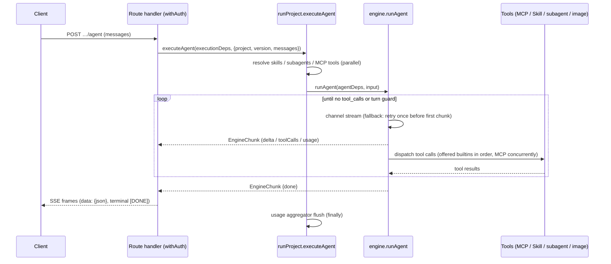

# Architecture

How Agent Studio is put together, and **why** — the design decisions, their trade-offs, and
the invariants that hold them in place. It is the document to read before changing code.

It deliberately does *not* cover: the HTTP contract ([API.md](API.md)), environment variables
([CONFIGURATION.md](CONFIGURATION.md)), deployment and observability
([OPERATIONS.md](OPERATIONS.md)), or the security model ([SECURITY.md](SECURITY.md)).

**Where to start**: read this file top-to-bottom, then trace one request through the code.
Execution starts at `src/application/execution/runProject.ts` — the facade every entry point
calls — and descends into `src/application/llm/engine.ts`, the tool loop. The
[Request flow](#request-flow) section is the map.

Agent Studio is a single Next.js 16 full-stack application covering the domains **project,
llm, agents (subagents + external agent registry), skills, mcp, chat, cost/usage**.

## Stack

- Node.js 24, pnpm 11 (`packageManager` pinned)
- Next.js 16 App Router, React 19, TypeScript strict (`noUncheckedIndexedAccess`)
- Mantine 9 (`@mantine/core` + hooks/form/notifications/charts, `@tabler/icons-react`)
- Better Auth 1.6 + Google OAuth (custom DynamoDB adapter)
- AWS DynamoDB single-table design

## Layers

```
src/
  domain/           # Entities + repository ports. Pure TS. No framework/AWS imports.
    project/  llm/  chat/  skill/  mcp/  agent/  usage/  settings/  trace/
    execution/  security/  slack/  trigger/
  application/      # Use cases. Depends on domain ports only.
  infrastructure/   # Adapters (app-facing code reaches them via the composition root).
    db/             # Single-table client, key builders, repositories
    llm/            # OpenAI-compatible provider channels, streaming
    mcp/            # MCP HTTP client, session, discovery cache
    a2a/  agent/  slack/  github/  storage/  net/  crypto/  health/
                    # A2A + external-agent clients, Slack, skills-repo sync, S3 image
                    # store, SSRF guard, AES, readiness probes
  app/              # Next.js App Router: pages + route handlers (presentation)
    api/            # Route handlers call application use cases, never repositories directly
    _components/    # The shared UI kit: Modal, Badge, CardGrid, HeaderRows, form styles,
                    # code blocks, copy buttons. A piece of UI that repeats across pages
                    # belongs here, with one owner
  components/       # App chrome: the header the root layout mounts (theme toggle, user
                    # menu), and the landing page's sign-in button
  lib/              # Cross-cutting glue: composition root (container.ts), auth/session,
                    # config + runtime-settings, run metrics
  shared/           # Dependency-free helpers (dates, slugs, timeouts, PKCE, constant-time
                    # compare, logger). The bottom of the graph: imports nothing from `@/`
```

**Dependency rule: `app → application → domain ← infrastructure`.**

- `domain` imports nothing from `@/` beyond `domain` — no framework, no AWS SDK, no auth
  library, not even `shared`.
- `application` receives its dependencies. It must never import the composition root: deps
  are *injected*, never pulled.
- `infrastructure` imports no `application` and no `app`.
- `src/lib` is a cross-cutting leaf both application and infrastructure may import (config,
  runtime-settings, session); `domain` never does.
- Route handlers and pages must not import `infrastructure/` directly — only through a
  wiring site.

### Composition, in a few deliberate places

Composition is distributed rather than centralised in one file, because the three execution
surfaces need genuinely different bags:

| Wiring site | Wires |
|---|---|
| `src/lib/container.ts` | Repositories; the domain ports (`SecretCipher`, `UrlPolicy`, `RemoteAgentDispatcher`, `McpToolProbe`, `McpSessionFactory`); the four registry-slice singletons; `executionDeps` / `imageDeps` — including the required LLM and image channels, so a missing injection is a type error rather than a silent network call |
| `src/app/api/chats/_deps.ts` | The `ChatDeps` bag (bound `runAgent` + repositories) |
| `src/app/api/slack/events/_lib/` | The `SlackEventDeps` bag (bound `runAgent` + `SlackClientPort`), mirroring `ChatDeps` |

Three DI styles are in use on purpose:

- **Factory** `createXUseCases(repo)` for the registry slices — their shared CRUD core lives
  in `src/application/registry/registryUseCases.ts`.
- **Free functions taking the repo as the first argument** for the project slice.
- **Deps-bag interfaces** (`ChatDeps`, `ExecutionDeps`, `SlackEventDeps`) for execution paths.

New slices should prefer factory or deps-bag.

### The rules are mechanical, not aspirational

`tests/architecture.test.ts` enforces every layer rule above with an **empty allowlist**,
plus a set of named **single-owner invariants** that fail when a second copy of a decision
appears — and also when the owner *loses* the definition, which would otherwise read as a
pass. The owner list is in [../AGENTS.md](../AGENTS.md#single-owner-invariants).

The single-owner rules exist because this is the failure the codebase actually kept hitting:
`McpTool` reached four definitions that had already drifted apart, the DynamoDB
conditional-write error name was spelled out at seven call sites — only one of which handled
the transactional form — and the image-usage collapse was derived independently four times.

**Adding a violation is not quietly possible. Fix the import; do not widen the rule.**

## DynamoDB single-table design

One table (`DYNAMODB_TABLE_NAME`, default `agent-studio`), keys `PK` (S) / `SK` (S), with
`GSI1` (`GSI1PK`/`GSI1SK`) and `GSI2` (`GSI2PK`/`GSI2SK`). All items carry `entityType`.

| Entity | PK | SK | GSI1PK | GSI1SK |
|---|---|---|---|---|
| Auth (better-auth model rows) | `AUTH#{model}#{id}` | `ITEM` | `AUTH#{model}` | `{id}` |
| Auth unique lock (email, token, …) | `AUTHUNIQUE#{model}#{field}#{value}` | `LOCK` | — | — |
| Project | `PROJECT#{name}` | `META` | `TYPE#PROJECT` | `{name}` |
| Project version | `PROJECT#{name}` | `VERSION#{versionName}` | — | — |
| Project API token | `PROJECT#{name}` | `APITOKEN` | — | — |
| Project MCP OAuth connection | `PROJECT#{name}` | `MCPCONN#{server}` | — | — |
| Webhook trigger | `PROJECT#{name}` | `TRIGGER#{triggerId}` | — | — |
| Trigger delivery | `PROJECT#{name}` | `TRIGGERRUN#{triggerId}#{startedAt}#{runId}` | — | — |
| Trigger idempotency claim | `TRIGGERIDEM#{name}#{triggerId}#{key}` | `META` | — | — |
| Chat | `CHAT#{chatId}` | `META` | `CHATOWNER#{email}` | `{updatedAt ISO}` |
| Chat message | `CHAT#{chatId}` | `MSG#{seq zero-padded 6}` | — | — |
| Skill | `SKILL#{name}` | `META` | `TYPE#SKILL` | `{name}` |
| MCP server | `MCP#{name}` | `META` | `TYPE#MCP` | `{name}` |
| External agent (registry) | `AGENT#{name}` | `META` | `TYPE#AGENT` | `{name}` |
| Usage (daily per project) | `USAGE#{projectName}` | `DATE#{yyyy-MM-dd}` | `USAGEDATE#{yyyy-MM-dd}` | `{projectName}` |
| Usage (daily per caller) | `USAGE#{projectName}` | `ACTOR#{yyyy-MM-dd}#{kind}:{id}` | — | — |
| Run concurrency slot | `RUNSLOT#{kind}:{id}` | `SLOT#{index zero-padded 3}` | — | — |
| Slack event dedup | `SLACKEVENT#{eventId}` | `META` | — | — |
| A2A task (inbound) | `A2ATASK#{projectName}#{taskId}` | `META` | — | — |
| Trace | `TRACE#{traceId}` | `META` | `TRACEPROJECT#{projectName}` | `{createdAt ISO}#{traceId}` |
| Trace deletion reference | `PROJECT#{name}` | `TRACE#{createdAt}#{traceId}` | — | — |
| App settings (env overrides) | `SETTINGS#app` | `META` | — | — |

**Why one table and two GSIs.** Primary-key access covers everything item-scoped: a project
and its versions share a partition, a chat and its messages share a partition, so a cascade
delete is one query. `GSI1` serves the heterogeneous "list by kind" patterns — `TYPE#*`
catalog listings, `CHATOWNER#{email}` (a user's chats by recency), `USAGEDATE#{date}`
(cross-project daily cost for the dashboard), `TRACEPROJECT#{name}`. `GSI2` exists solely for
Better Auth unique-field lookups.

### Conventions

- **Key strings come from `src/infrastructure/db/keys.ts`.** Never hand-write one elsewhere.
- The published version is a **pointer attribute** `publishedVersion` on the project `META`
  item, not a copy.
- Chat `META` owns an atomic `nextSeq`; message rows use conditionally-created sequence keys.
- Auth unique fields are claimed transactionally with a dedicated lock item. `GSI2` remains a
  compatibility lookup for rows created before the locks existed.
- Trace creation transactionally writes a project-partition deletion reference; project
  deletion marks the project first, preventing new versions/traces before child cleanup.
- **Usage rows use atomic `ADD` per model** — `calls.{model}`, `inputTokens.{model}`,
  `outputTokens.{model}`, `costUsd.{model}` — in two steps: `SET … if_not_exists` to
  materialise the maps, then `ADD` on the nested number attributes. They also carry the cost
  guard's once-per-day notification claims (`alertedAt`, `blockedAt`), taken with a
  conditional write. Those claims live here rather than on the project item because that
  item's `updatedAt` is the optimistic-concurrency condition for every project write — a
  background marker there would fail a concurrent edit — and because a usage row already
  expires on its own date, which retires the marker with it.
- **Rows that grow without bound carry `expiresAt`** (`src/infrastructure/db/ttl.ts`), the
  table's TTL attribute. Retention windows and the requirement to enable TTL on the
  production table are in [OPERATIONS.md](OPERATIONS.md#row-retention).
- **List queries paginate.** Most go through `queryAll()` (`src/infrastructure/db/query.ts`):
  a single Query page caps at 1MB, so an unpaginated list silently truncates. `chatRepository`
  runs its own `LastEvaluatedKey` loops; `traceRepository` is intentionally bounded top-N via
  `Limit` and keeps pulling bounded pages until that limit is filled with **live** rows,
  because DynamoDB applies `Limit` before the app-side expired-row filter.

## Request flow

Seven execution entry points converge on the facades in
`src/application/execution/runProject.ts` (`executeVersion` / `executeVersionStream` /
`executeProjectStream` / `executeAgent`) — the composition point that resolves a version's
skills, MCP tools and subagents from repositories, assembles the injected engine deps, and
records usage. To trace any request, start there.

| Entry point | Caller | Facade used |
|---|---|---|
| Predict | `POST …/predict` | `executeProjectStream` (stream) / `collectRun(executeAgent)` for agent projects, `executeVersion` otherwise — so an agent project runs its tool loop here too, and `variables` (which only a prompt template consumes) are ignored for it; image projects → `generateImage`, which edits the request's source `images` when any are sent and generates otherwise |
| OpenAI-compatible | `POST …/chat/completions` | `executeProjectStream` (stream); `executeVersion` / `collectRun(executeAgent)` (non-stream) |
| Agent SSE | `POST …/agent` | `executeAgent` |
| Chat | `POST /api/chats/[chatId]/messages` | `executeAgent` (bound as `ChatDeps.runAgent`) |
| Slack | `/api/slack/events/[project]` → `handleSlackEvent` | `executeAgent` (via `SlackEventDeps`) |
| A2A | `POST /api/a2a/[name]` → executor | `executeProjectStream` |
| Webhook trigger | `POST /api/triggers/[project]/[trigger]` → `executeDelivery` | `executeProjectStream` (bound in `container.ts` as `triggerRunnerDeps.run`) |

Two thin wrappers sit alongside: `generateImage`
(`src/application/image/generateImage.ts`, the image predict path) and `collectRun`
(`src/app/api/projects/_lib/openai.ts`, which drains `executeAgent` for the non-stream
OpenAI response).

`executeProjectStream` is the canonical `projectType` → strategy dispatch (`agent` runs the
multi-turn tool loop; anything else streams a single-shot completion). **New entry points
should call it instead of re-encoding that decision** — three call sites used to ask it for
themselves, so a new project type meant finding all three. A subagent transfer dispatches on
the same axis inside `runLocalSubagent`: an `image` child generates, a prompt child runs its
user prompt template with the transfer message as the user turn, and only an `agent` child
enters the tool loop.

### The run bracket

Exactly four functions admit a top-level run — `executeVersion`, `executeVersionStream`,
`executeAgent` and `generateImage` — and each opens a bracket
(`src/application/execution/runBracket.ts`). The bracket is the single owner of everything
that wraps a run regardless of how it was started: the in-flight metric, the daily cost
guard, the per-caller concurrency guard, and the log correlation id.

Each of those four used to open the in-flight metric for itself, which is exactly why the
cost guard had four places it could be forgotten. `tests/architecture.test.ts` now pins the
bracket, so a fifth entry point that skips it is missing its metric as loudly as its guard.

It is *not* "the execution facade", because `generateImage` is not in one: the predict route
and the A2A executor call that module directly.

**Order is load-bearing at both ends.** The guards run **before** the metric opens, so a
refused run is never counted, traced, or recorded. `close()` runs **after** the caller has
flushed its usage — an agent run buffers usage until the end, so a settle before the flush
would always read a total that excludes the run being settled.

The two guards fail in opposite directions, on purpose:

- The **cost guard** protects money, so a storage blip must not stop the platform: it fails
  **open**.
- The **concurrency guard** protects the platform itself, so opening it when the store is
  failing would add load exactly when the store cannot take it: it fails **closed** — and
  costs nothing extra, since every run reads its project and version from the same table and
  a store that cannot answer was about to fail the run anyway.

Cost is checked first: a project over budget should be told so rather than made to queue for
a slot it would be refused on regardless.

**Concurrency is a slot index, not a counter** (`src/domain/execution/runSlot.ts`). A counter
is exact only while every process lives to decrement it; an instance killed mid-run leaks its
increment forever, and nothing expires a number. Each of a caller's `0..limit-1` indices is a
row with a lease, claimed by a conditional write — so the limit is exact rather than a bound
two concurrent acquires can overshoot, and a dead instance releases its hold when the lease
runs out. State is shared rather than per-process for the obvious reason: `runMetrics` counts
*this* instance's runs, so a limit built on it would multiply by the number of instances.
`a2a` gets its own ceiling because its actor id is a constant — the inbound key is shared, so
one identity stands for every machine caller and the per-caller limit would otherwise become
a cap on the whole A2A surface.

The cost guard (`src/application/usage/costGuard.ts`) reads one day's row with a single
primary-key `GetItem`, sums every model's `costUsd`, and refuses with `CostLimitExceededError`
— a `RateLimitedError`, so `apiError` emits `Retry-After` set to the seconds until 00:00 UTC,
which is exactly when the refusal stops being true.

Operational tuning for both guards is in [OPERATIONS.md](OPERATIONS.md#spend-and-load-guards).



### SSE responses pull the first chunk before answering

Streaming entry points call the generator's first `next()` **before constructing the
`Response`** (`src/app/api/_lib/sse.ts`). A run refused by a guard throws on that first call,
before producing anything; building the response first would send `200 text/event-stream` and
then deliver the refusal as a data frame, so an SSE caller would never see the 429 or its
`Retry-After`. Holding one chunk lets the throw reach `apiError`, and the stream is otherwise
byte-identical.

### EngineChunk contract

`EngineChunk` (`src/domain/llm/types.ts`) is the wire unit between the engine and every
consumer (chat persistence, Slack, OpenAI reshaping, A2A, the browser client). Top-level
chunks carry **no `author`**; only subagent chunks are authored, stamped by the `runSubagent`
wrapper with the subagent's name. **`isTopLevelChunk()` is the single owned predicate** —
consumers must use it instead of re-deriving author semantics.

| Field | Emitted by | Consumed by |
|---|---|---|
| `delta.content` / `delta.reasoningContent` | engine per stream delta (PII-restored) | top-level only: chat persistence, Slack text, OpenAI chunks, A2A artifact, client answer bubble |
| `delta.toolCalls` | engine when a turn requests tools (display args) | client tool-call rendering; Slack progress indicator |
| `toolResult` | engine after each tool finishes | chat tool rows (displayed, and replayed into context for the last N turns), client tool panel |
| `warning` | run setup, before the first token, for a binding it could not use (deleted skill/subagent, unreachable or blocked MCP server, tools past the per-run cap) | chat warning banner, Slack warning suffix, `Trace.warnings`; never ends the stream |
| `image` | GenerateImage / EditImage builtins, and image-project subagents | consumed **regardless of author** (delegating to an image subagent is how an agent draws): chat image persistence (S3), Slack upload, OpenAI `images` extension, client gallery |
| `usage` | engine once per model call | `collectRun` response usage; DB recording is separate (`recordUsage` / aggregator inside the engine loop) |
| `error` | engine on failure (mid-stream — no retry); authored when a transfer fails | every consumer surfaces it, but only a **top-level** error ends the stream — an authored one is a tool error the parent may still answer from |
| `done` | engine when the loop ends without tool calls — **not** when the turn guard stops it | OpenAI `finish_reason` (`stop` with `done`, `length` without), client finalize |
| `author` | subagent chunks only — the **innermost** agent | consumers filter via `isTopLevelChunk`; client shows the running agent |
| `authorPath` | subagent chunks only — the chain, outermost first | client renders `sample-agent → simple-image`; the trace recorder groups a transfer by its first element |
| `traceId` | subagent chunks (stamped by `runProject`) | client correlates a chunk to its subagent's trace |

> The `done`-absence inference is a known weak spot: cancellation and mid-stream errors also
> produce no `done`, so a cancelled run is currently reported as `finish_reason: "length"`.
> Tracked as the `run-termination` milestone in [MILESTONES.md](MILESTONES.md).

## Error handling

Two deliberate strategies coexist, split by whether a stream has started.

**HTTP path (before a stream starts)** — use cases throw `AppError` subclasses
(`src/application/errors.ts`: Validation / NotFound / Forbidden / Conflict / RateLimited; chat
adds `Chat*` subclasses on the same base). `RateLimitedError` carries the seconds to wait,
because the thing that knows *why* a request was refused is the only thing that knows when it
stops being refused; `apiError` (`src/app/api/_lib/http.ts`) turns that into `Retry-After` and
maps any thrown error, falling back to a generic 500. `parseName` validates `[name]` params as
slugs by throwing `ValidationError`. The registry slices share this contract via
`createRegistryUseCases`: missing → `NotFoundError`, duplicate create → `ConflictError`,
SSRF-blocked URL at the write boundary → `ValidationError` (`assertAllowedUrl` wraps the
infrastructure `SsrfError`, which stays layer-local).

**In-stream path (after the first chunk)** — failures are values, not exceptions. The engine
yields an `{error}` chunk and does not retry; subagent failures yield an *authored* error
chunk the parent may still answer from; and dispatch guards degrade instead of failing the
run — an SSRF-blocked or unreachable MCP server is skipped with a `warning`, and a hung MCP
request aborts after its timeout and becomes a tool-error string the model can react to.

## Domain semantics

### Project / Version

```ts
Project { name (slug, immutable id), displayName, description,
          projectType: 'llm' | 'agent' | 'image', ownerEmail, departmentCode?,
          publishedVersion?, slack?, costLimits?, createdAt, updatedAt }

Version { versionName, systemPrompt, userPromptTemplate, model, fallbackModel?,
          parameters { temperature, maxTokens, reasoningEffort?, piiFiltering,
                       structuredOutput?/jsonSchema, imageGeneration?/imageModel? },
          mcpList: McpBinding[], skillList: string[],
          subagentList: { name, type: 'local' | 'remote' }[], maxTurn?, createdAt }
```

- `CostLimits { alertThresholdUsd?, blockThresholdUsd?, alertSlackChannel? }` — the window is
  the **UTC day**, because that is the grain the usage row is keyed at; a guard on any other
  window would need an aggregate that does not exist.
- `McpBinding { name, headers?: Record<string, string | null>, tools?: string[] }` binds the
  version to a registry MCP server. `tools` narrows which of that server's tools the run
  offers. **The URL is always the registry's**; `headers` layers over the server's own headers
  at dispatch (string = replace/add, `null` = remove a default, matched case-insensitively),
  so one registry server serves many projects under different credentials. Override values
  carry the same AES-encrypt/mask lifecycle as registry headers — which makes a version the
  first entity holding secrets: API responses go through `toVersionView`, while execution
  paths read the repository value and decrypt at dispatch. Rows written before overrides
  existed stored `mcpList` as `string[]`; reads normalise them and the API still accepts that
  shape.
- Template variables `{{var}}` are rendered server-side before dispatch.
- Version writes validate **capability fit** for catalog models (agent projects require
  `capabilities.tools`; `structuredOutput` requires the capability). Unknown/custom model ids
  stay allowed with a warning — and are priced at $0 until added to the catalog.
- Version writes also validate that `mcpList`/`skillList`/`subagentList` entries **resolve**
  (`VersionRefRepos`, injected by the route from the composition root), and that the project
  type can actually run them — only `agent` projects do, so a binding added to any other type
  is rejected rather than stored, shown in the editor and silently ignored at run time. On
  update only *newly added* entries are checked, so deleting a registry entry never strands
  the versions that already referenced it, and configuration stored before these rules stays
  editable and removable.
- **Which version a run executes** is owned by `resolveRunnableVersion`
  (`src/application/project/resolveRunnableVersion.ts`): the published pointer always wins;
  only interactive surfaces (chat) opt into falling back to the newest draft; external
  surfaces (Slack, A2A, webhook triggers, subagent transfers) are published-only, so drafts
  never leak.

### LLM engine

`src/application/llm/engine.ts` is **pure logic with everything injected** — channel,
`recordUsage`, `callMcpTool`, `loadSkillContent`, `runSubagent`, `generateImage`, `editImage`
— so it is tested with no network and no DB via `tests/fakeChannel.ts`.

> `src/application/llm/AGENTS.md` is the authority on the loop invariants. Read it before
> editing `engine.ts` or `pii.ts`.

- All text generation speaks the **OpenAI Chat Completions protocol**; model ids are
  `provider/model`. Routing is described in
  [CONFIGURATION.md](CONFIGURATION.md#llm-channels).
- `runPrompt(input): Promise<RunResult>` — single-shot, with `runPromptStream` for streaming.
- `runAgent(input): AsyncGenerator<EngineChunk>` — the recursive multi-turn tool loop:
  - A turn guard (`currentTurn >= maxTurn`, default 50) stops the loop.
  - **All `tool_calls` of one response aggregate into ONE assistant message**, then tool
    results append, then the loop recurses with `turn + 1`.
  - A builtin serves a call only when that builtin was **offered** this run — the offered
    names come from `buildAgentTools`, never from dep presence. The builtins are `Skill`
    (progressive skill loading), `transfer_to_agent` (subagent transfer: local recursion or a
    remote agent HTTP call; a budget guard `turn + 2 >= maxTurn` rejects the transfer),
    `dispatch_agents` (several subagents at once, answers collected into one budgeted tool
    result — offered to **top-level runs only**, so the number of concurrent children does not
    grow with transfer depth), `GenerateImage`, and `EditImage`. **Any other name is an MCP
    tool**, and `BUILTIN_TOOL_NAMES` is reserved during alias allocation so an MCP tool never
    carries a name a builtin might claim.
  - The MCP calls of one response run **concurrently** (≤5 in flight) while builtins run in
    call order; results, tool messages and the assistant `tool_calls` all stay in call order.
  - One turn's tool-result text is capped (200KB, spent in call order): a truncated result
    says so, and one that no longer fits becomes `Error: …`.
  - Both image deps are injected **only** when the version opts in via
    `parameters.imageGeneration: true`; the model is `parameters.imageModel` when set and
    still image-capable, else the registry's default image model. Whether that model's
    provider implements the edit endpoint is only known at dispatch, so a refusal comes back
    as a tool-result error rather than hiding the tool.
  - **Image handles**: a per-run registry ids the inline `data:` images of the input messages
    and every image the run produced (`img_1`, `img_2`, …). `EditImage` and
    `transfer_to_agent`'s `image_ids` take an id, so the engine resolves bytes and the deps
    stay pure I/O. An `https://` image part gets **no** handle — the provider fetches those
    itself, so the bytes are not in hand. The registry is filled only when a run can edit or
    can transfer.
  - A **subagent transfer** passes the model-written `message` plus the bytes of any
    `image_ids` it named — an image-project child then *edits* those instead of drawing anew,
    and an agent child sees them as image content parts. A remote (A2A) child cannot take
    images and says so rather than dropping them. The child's final text returns as a
    "For context: …" user message.
  - It also carries the conversation so far as a rendered, PII-masked transcript bounded by
    8,000 chars — **text inside the child's user turn, never replayed messages**, so the child
    cannot read the parent's answers as its own. The turn being answered is excluded (the
    `message` already is it), an agent child passes the same transcript on so a grandchild
    inherits the original conversation, and an **image** child receives the bare `message`,
    because that message is its image prompt.
  - Local transfers carry an **ancestry chain**: transferring to a project already on the
    chain, or nesting past depth 5, is refused as an authored error chunk. Turn accounting
    alone cannot bound this — a child version carries its own `maxTurn` and can raise the
    ceiling its parent was running under.
- **Fallback**: on a retryable error (429/5xx) from the primary model **before the first
  chunk**, retry once with `fallbackModel`. A mid-stream failure yields an `{error}` chunk and
  does not retry.
- **PII filtering** (`parameters.piiFiltering`): emails and phone numbers in outbound
  messages and variables are regex-masked with reversible format-preserving `[[PII:…]]` tokens
  before dispatch (`src/application/llm/pii.ts`); originals are restored in responses —
  streaming included, with token-boundary buffering — and the mapping carries across subagent
  transfers, while tool args/results re-entering engine context stay masked. **Outbound MCP
  dispatch is not masked** — see [SECURITY.md](SECURITY.md#pii-filtering-and-where-it-stops).
  Off is byte-identical to the unfiltered path.
- **Cost** is computed from registry pricing at the call site (`calculateCost` /
  `calculateImageCost` in `src/domain/llm/models.ts`) and passed to `recordUsage`, which hands
  it to the usage repository's atomic `ADD`. Single-shot runs record per call; agent runs
  buffer per-turn usage in `createUsageAggregator` and flush once at run end.
- **Model registry** `src/domain/llm/models.ts`:
  `ModelConfig { id, provider, displayName, pricing { inputPer1M, outputPer1M,
  cachedInputPer1M?, imageInputPer1M?, imageOutputPer1M?, perImage? },
  capabilities { tools, structuredOutput, imageInput, reasoning, reasoningWithTools?,
  imageGeneration? }, contextWindow, maxTokens, hidden?, wireId? }`. See
  [CONFIGURATION.md](CONFIGURATION.md#model-registry-and-wireid) for `wireId` and drift
  checking.

### Skills

A skill is markdown behaviour instructions delivered by **progressive disclosure**: the system
prompt lists a name + description table only, and the model calls the builtin `Skill` tool to
load the `SKILL.md` body — or a specific attachment via `file_path`.

```ts
Skill { name, description, content (markdown), files?: { path, content }[],
        source?, createdAt, updatedAt }
```

`source` marks skills synced from the skills repo (e.g. `github:owner/repo`); `files` are
attachment files collected under the skill root.

Sync reads `skills/<name>/SKILL.md` from the configured GitHub repo — the parent directory
name is the slug — and collects supported text attachments (`src/domain/skill/files.ts`:
`ALLOWED_SKILL_FILE_EXTENSIONS`) under each `SKILL.md` directory, bounded by per-file,
per-skill and file-count caps and excluding symlinks. `file_path` is normalised and confined
to the skill root: no absolute paths, no `..`, no cross-skill access. Replacing the skill item
on re-sync drops stale attachments; skipped files are reported with reasons.

**The repo is the source of truth for synced skills**; locally created skills with other names
are untouched.

### MCP

```ts
McpServer { name, url, description?, content?, runtime?: 'remote' | 'managed',
            headers: Record<string, string>,   // encrypted at rest, masked on read
            auth?, image?, args?, endpointPath?, containerPort?,
            createdAt, updatedAt }
```

`description` is a one-line summary and **the only field the model sees** — it becomes a row
in the system prompt's server table. `content` is markdown operator notes shown in the console
only; unlike a skill's content it never reaches the model. Descriptions are escaped when
rendered into the table, so a legacy multi-line value cannot break it.

Agent runs append a **"Connected MCP Servers"** table (server name, description, aliased tool
names) to the system prompt so the model knows which server a tool group belongs to; servers
that are unreachable or expose no tools are omitted.

#### Transport and sessions

Tool loading uses MCP streamable HTTP (`tools/list`, `tools/call` JSON-RPC). The protocol has
**one owner**, `McpSession` (`src/infrastructure/mcp/session.ts`) — both the engine's
`ToolManager` and the registry's "Test connection" probe run on it.

- Tool-name collisions get `_1`/`_2` suffix aliases with a reverse mapping. Tool results are
  capped at 100,000 chars.
- Servers are contacted **in parallel** at init (one unreachable server would otherwise add
  its full timeout to time-to-first-token) while alias allocation stays in configured order,
  so names are deterministic.
- Sessions are registered before their first request and released with a `DELETE` when the run
  ends (`ToolManager.close()`, called from the execution facade's `finally` — including when
  discovery itself failed or was cancelled).
- A request answered **`404` while carrying an `Mcp-Session-Id`** means the server has
  forgotten that session and the transport requires a new one: the session id is dropped and
  the request is replayed **once** behind a fresh handshake. Replaying is safe because a 404
  is a session-lookup failure — the server rejected the message before running anything, so a
  `tools/call` that gets one had no effect to repeat. Bounded at one attempt, or an endpoint
  that has genuinely gone would be handshaked against forever. **Only the caller whose session
  is still the current one clears it**: one model response dispatches its MCP calls together,
  so several can hold the same dead id, and each resetting in turn would abandon a handshake
  another had started and mint one server-side session per caller. Without this, a run that
  outlives the server's session TTL — runs here last up to ten minutes — loses every remaining
  tool call, with the model reading `HTTP 404` and no path back.
- After the handshake, requests state the protocol version the **server** agreed to rather
  than the one proposed; a server answering with another revision is not refused, since every
  revision that answers `initialize` still speaks the tool-list shape this client reads.
- A tool's **image** results (`image` blocks, and `resource` blobs with an image mime type)
  come back as bytes rather than being dropped: the engine registers them, streams them to the
  user, and attaches them to the turn as a follow-up user message — only when the model
  accepts image input, since a text-only model would reject the parts and fail the turn.

#### Discovery cache

Discovery is cached per `url + headers` (`discoveryCache.ts`). On a hit the session is left
uninitialized and handshakes lazily on its first tool call, so **a turn that calls no tool
makes no MCP request at all** — a chat used to pay the full handshake per message per server.
Headers are part of the key so one tenant's tool list never answers another's.

Failures are cached too, briefly. A server that sends the caching hint `ttlMs` on `tools/list`
(SEP-2549) sets its own entry's lifetime — it knows its catalogue, and the local default is
only a guess about someone else's — bounded by a separate ceiling. The full reasoning for two
knobs, and their values, is in [CONFIGURATION.md](CONFIGURATION.md#mcp).

#### Managed servers

`runtime: "managed"` is a container **this app starts on its own host** through SSM Run
Command, reached at `127.0.0.1:<port>`. That address is one the URL policy rejects —
correctly, for anything an operator types — so trust rests on **provenance** instead: the
provisioner recorded the address after binding the port. The narrowness of that bypass is a
security property; see
[SECURITY.md](SECURITY.md#the-managed-loopback-exception).

The stored row carries `image`, `args`, `endpointPath` and `containerPort` — everything a
restart needs, because at restart time there is no operator to ask again. `containerPort` is a
*request*, not a guarantee: only an adapter that publishes a port mapping can honour it, and
the deployed one shares a network namespace instead, so it tells the container which port to
bind (`PORT`) and ignores the stored value. `{{PORT}}` in an argument becomes the effective
listen port, so images that do not honour the `PORT` environment variable still work in both
mapped-port and shared-network deployments.

**Surviving a redeploy.** A managed container joins this app's own network namespace, which is
the only way a loopback address means the same thing at both ends. Docker resolves that
container name to an **id** when the workload starts and never re-resolves it, so replacing
this app leaves the container running in a namespace nothing can address — healthy to
`docker inspect`, reachable by nobody. `reconcile` (`src/application/mcp/managedMcpUseCases.ts`),
fired from `instrumentation.ts` at boot and never awaited, probes every managed entry and
restarts the ones that do not answer. `status` reports **reachability separately from
liveness** for the same reason: reporting only the latter is what made this invisible. Sharing
a namespace also means **one app instance per host** — a container belongs to exactly one.

#### OAuth

A registry entry may carry an `auth` block discovered once at registration; **the run path
never fetches a well-known document.**

The placement decision is the architectural one: credentials are **per project**, in their own
`PROJECT#<name> / MCPCONN#<server>` item — not on the version (a snapshot of configuration
history) and not on the project item (whose `updatedAt` is the optimistic-concurrency
condition for publish). That split is what lets one shared registry entry serve a different
provider app per project, and it is why the registry is admin-owned while connections are
owner-owned.

A connection **supplies** credentials rather than gating the server. The resolved token is
applied last at dispatch — over the registry entry's headers and the binding's overrides — so
a version cannot substitute its own `Authorization` for the project's connection. When no
connection is available the server still runs on whatever those headers hold; it is dropped
with a warning only when they hold nothing. Discovering OAuth on an entry adds a way to
authenticate it and must not take away one an operator already configured, so a single entry
can serve a static-header project and an OAuth project side by side.

Token refresh happens only within a margin derived from `MAX_RUN_DURATION_MS`, so a token
cannot expire mid-run *and* the header stays byte-identical between runs — refreshing every
run would change the discovery cache key every run.

The protocol-level checks (PKCE, `resource`, `iss`, issuer binding) are in
[SECURITY.md](SECURITY.md#mcp-oauth).

### Triggers

```ts
WebhookTrigger { projectName, triggerId (slug), kind, description, enabled,
                 secret (AES-encrypted, masked on read), variables?, payloadMode,
                 allowConcurrent, createdAt, updatedAt }
```

- Triggers and their delivery history both live in the **project partition**, so the project
  cascade delete already removes them and a trigger's runs are one `begins_with`. Run rows
  carry a TTL, because a delivery log is not a record to keep.
- **Published only**, via `resolveRunnableVersion` — a draft is configuration in progress, and
  an external system firing at one would run whatever an editor happened to have saved.
- `triggerId` is a slug under the same rule as a project name, normalised client-side by the
  shared `toSlug` and enforced by the schema.
- The secret is compared in constant time **before** the enabled flag is read, so a disabled
  trigger cannot answer a wrong secret differently from an enabled one — that difference is an
  oracle for which triggers exist.
- `Idempotency-Key` is claimed with a conditional write (24h TTL), the same shape as the Slack
  event claim.
- `allowConcurrent: false` (the default) is enforced by **reusing a run slot**: "at most one
  in flight, and a dead instance's hold expires" is exactly what `RunSlotRepository` already
  is. Off by default, because a webhook firing faster than the run takes would otherwise pile
  runs up until the cost guard notices.
- `payloadMode` decides what the payload becomes. `variables` flattens its scalar top-level
  fields over the trigger's fixed ones — only strings can be substituted into a template, so a
  nested object is dropped rather than rendered as `[object Object]`. `message` serialises it
  into the user turn, which is what an agent project can reason about.
- **Every refusal is a history row with a status**, including a skip: an operator must be able
  to tell "it never fired" from "it fired and failed" without reading logs.
- The endpoint answers **202** and runs through `after()`, like the Slack path: a run here can
  last ten minutes and no webhook sender waits that long. Same durability gap as Slack, too —
  an instance lost mid-delivery leaves a row stuck in `running`, which is what the durable
  worker in the `schedule-trigger` milestone would close for both.

### External agents (registry)

```ts
ExternalAgent { name, url, protocol?: 'openai' | 'a2a' (absent = openai),
                description, headers (encrypted like MCP), createdAt, updatedAt }
```

Usable as `type: 'remote'` subagents and via the test-message endpoint. `url` is SSRF-guarded
like MCP.

### Slack

Bots are **per project**: `/api/slack/events/[project]` is the only events endpoint, and it
resolves that project's own bot token and signing secret, so an event always runs that project
and no selector is needed.

**How a reply is delivered is one decision, owned by `src/application/slack/replyStream.ts`.**
The sink it hands back opens on the first output and prefers `chat.startStream` →
`chat.appendStream` → `chat.stopStream`, which is what the agent surface renders as text
arriving and what Slack rate-limits generously (Tier 4). A workspace that cannot stream falls
back to `chat.postMessage` + `chat.update`, paced at Slack's documented one edit per three
seconds and marked with a trailing indicator so an interim state does not read as a finished
answer. Streaming sends **deltas**, so the sink advances its flushed offset only on a
successful write: a rejected append is re-sent with the next one instead of being lost.
Streaming into a channel additionally names the recipient (`recipient_user_id` /
`recipient_team_id`); a DM does not.

The **agent experience** is answered natively where the surface offers it (a DM, not a channel
thread): progress goes to `assistant.threads.setStatus` — "is thinking…", then each tool by
name — rather than overwriting the message body, and the opening question of a new thread names
it via `assistant.threads.setTitle`. Opening the agent container is its own event, handled by
`handleThreadStart` rather than by a run: `app_home_opened` on the Messages tab (the agent
messaging experience) pins the project's suggested prompts, and the legacy
`assistant_thread_started` also introduces the project, because unlike `app_home_opened` it
fires once per thread rather than on every visit. `app_context_changed` is deliberately not
subscribed to — acting on the channel a user is looking at needs per-user context storage that
does not exist.

Suggested prompts are per-project configuration (`SlackIntegration.suggestedPrompts`, at most
four — `src/domain/slack/types.ts` owns the shape and the cap). They reach Slack twice: in the
generated manifest's `features.agent_view`, and at runtime through
`assistant.threads.setSuggestedPrompts`. The runtime path is what lets a prompt change take
effect on its own, but it depends on the manifest: an app whose Slack config predates the
`app_home_opened` subscription never receives the event, so its prompts only ever come from the
manifest and changing them means applying the manifest again.

A mention inside a thread carries the thread (its 50 most recent turns) as multi-turn context.
Image attachments are downloaded with the bot token — the mention's own images first, then
whatever budget is left goes to the newest images in the 10 most recent turns of the thread, so
"make the picture I sent blue" still has the picture without re-fetching a long thread's whole
history. Only humans' pictures count; the bot's own uploads are skipped, and anything skipped is
reported in the reply.

Events are deduplicated exactly-once via `slackEventRepository.claim` (a conditional put) whose
claim is a **lease** settled by `settle` — an instance that dies mid-processing leaves a
reclaimable claim rather than an event recorded as handled by nobody.

### A2A

**Inbound**: every project with a published version serves a public Agent Card and a JSON-RPC
endpoint. Task state is persisted per project in the single table (`createA2aTaskStore`), so it
survives redeploys and is shared across instances, with a terminal-state-guarding conditional
write so a concurrent complete/cancel never regresses a finished task. Rows are TTL-expired.

**Outbound**: an agent registered with protocol `A2A` and its Agent Card URL. Custom headers
are sent on card resolution and RPC calls.

SSE framing differs by protocol: `sseResponse` uses the OpenAI `[DONE]` terminator,
`sseResponseRaw` uses A2A JSON-RPC framing (`src/app/api/_lib/sse.ts`).

### Chat

```ts
Chat { chatId, title, ownerEmail, projectName?, createdAt, updatedAt }
```

Messages are append-only with a `seq`. Chat execution uses the agent engine directly — no HTTP
self-call — and streams SSE to the client.

`ChatMessage` is a discriminated union on `role` (`user` | `assistant` | `tool`): a tool row
always carries `toolCallId`, an assistant row may carry `toolCalls`/`images`, and illegal
combinations are unrepresentable.

A run persists **one flattened assistant message** holding the accumulated text, the run's
top-level `toolCalls` and any `warnings` it reported, preceded by its tool rows — including a
subagent's and a transfer's, which carry `author`/`displayOnly` so a reader sees what ran while
replay refuses them.

**Tool traffic is replayed.** `toEngineMessages` pairs each stored tool row with the call that
declared it and re-emits it *after* that message — storage order within a turn is the reverse
of the wire order. Pairing is scoped to the run a user message delimits, because a tool-call id
is only unique within the run that made it. A call with no stored result is dropped rather than
orphaned. The context is bounded three ways — the last N assistant turns, a tool-text budget,
and a history budget over whole runs — and **every drop is reported as a `warning` chunk**
rather than made silently.

> `src/application/chat/AGENTS.md` is the authority here. Read it before changing `run.ts` or
> `messageMapping.ts`.

### Usage and cost attribution

Daily per-project per-model aggregates (see the [key map](#dynamodb-single-table-design)). The
dashboard reads `USAGEDATE#{date}` GSI partitions across a range and regroups client-side by
project / provider / model.

**Who spent it is a second row, not another dimension on the first.** Projects are a shared
catalog — any signed-in user may run any project — so the project name does not identify the
spender. `RunActor { kind, id }` (`src/domain/execution/actor.ts`) names one:

| Kind | Id | Why |
|---|---|---|
| `user` | email | — |
| `project-token` | the **owner's** email | A token authenticates as them; the *kind* is what keeps a machine's spend apart from that person's own runs |
| `slack` | Slack user id | Slack hands over no email, and guessing a mapping would bill the wrong person |
| `a2a` | the constant `shared-key` | The key is shared, so there is nobody to name |
| `webhook` | `{project}:{triggerId}` | — |

The split into a separate `ACTOR#{date}#{actor}` row is deliberate. `UsageRow` holds a map per
metric keyed by model; keying those by `actor|model` instead would grow one item with the
number of distinct callers, and a busy project would approach the 400KB item limit within a day
— while the dashboard, which only ever asks for project totals, would pay to read every caller
on every request. A separate row in the same partition keeps both reads exactly as wide as
their question, and the project cascade already deletes the whole partition.

The project total is written **first and unconditionally**; the actor row follows. Attribution
is additive — a path that cannot name its caller still records the spend it caused.

**The actor is the run's, not the turn's.** `createUsageAggregator` is bound with it once, so
the calls a subagent transfer makes on another project are still attributed to whoever started
the run. `RunOrigin { actor?, ancestry }` carries both down every transfer hop — they always
travel together, so they are one value rather than two parameters threaded side by side through
eight signatures.

### Traces

Agent runs always persist model/tool/subagent spans; non-agent and image predict runs are
sampled. Spans keep only bounded metadata — character counts, tokens, cost, duration, subagent
trace ids. **Raw prompts and tool results are not stored.** Details in
[OPERATIONS.md](OPERATIONS.md#tracing).

## UI

```
/                     dashboard when signed in, landing page otherwise
/login                sign-in screen; where the page gate sends a signed-out visitor
/projects             project catalog (cards)
/projects/[name]      orchestration playground (prompt editor, model picker, run/stream)
/projects/[name]/versions | usage | traces | api-reference | settings
/chats  /chats/[chatId]
/skills  /tools (MCP)  /agents  (each + /[name] detail page)
/dashboard            cost dashboard (range picker, group by project/provider/model)
/settings             admin-only runtime env-var overrides
```

UI text is in English. Mantine components provide the structure and the styling; the theme in
`src/app/theme.ts` is the **single owner** of the brand palette and of the component defaults
that used to be hand-written class constants, so a button or input is never styled at the call
site. Anything Mantine cannot express — the chart palette, the code block's syntax colours, the
chat bubble's edges — lives in a CSS module or in `globals.css` and reads Mantine's CSS
variables, never a hardcoded neutral.

The header offers system/light/dark themes through `useMantineColorScheme`, with
`ColorSchemeScript` applying the stored preference before first paint. The control renders the
default until mount: the preference exists only in the browser, so showing it during SSR would
be a hydration mismatch.

Each project's **API Reference** tab documents how to call that project from outside the
console, with its own name and published version filled in, a copyable curl example per
endpoint, and Python/Node.js SDK samples for the OpenAI-compatible endpoint. Credentials appear
only as `$PROJECT_API_TOKEN`-style placeholders.

## Glossary

The word "agent" is overloaded; these are the distinct concepts.

- **agent project** (`projectType: 'agent'`) — a studio project that runs the multi-turn tool
  loop.
- **subagent** (`SubagentRef` on a version) — another project (local) or registry agent
  (remote) a run can transfer to via the `transfer_to_agent` builtin.
- **external agent** (`ExternalAgent`) — a registry entry for an outside endpoint
  (OpenAI-compatible or A2A), usable as a remote subagent.
- **MCP server** (`McpServer`, the `/tools` UI page) — a registered MCP endpoint whose tools
  the engine can call. "Tools" alone refers to the OpenAI tool-calling mechanism.
- **actor** (`RunActor`) — who caused a run, for attribution. Not the project it ran.
- **run bracket** — what wraps a top-level run: guards, metric, correlation id.
- Invocation verbs: routes say **predict**, the facade says **execute**
  (`executeVersion`/`executeAgent`/`executeProjectStream`), the engine says **run**
  (`runPrompt`/`runAgent`). Same pipeline, three altitude levels.
