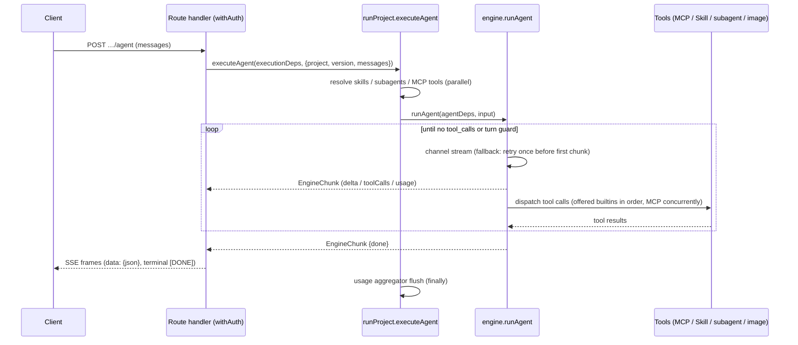

# Agent Studio Architecture

Agent Studio is a production-level single Next.js 16 full-stack application. It covers the domains: **project, llm, agents
(subagents + external agent registry), skills, mcp, chat, cost/usage**.

**Where to start**: read this file top-to-bottom, then trace one request through the code —
execution starts at `src/application/execution/runProject.ts` (the facade every entry point
calls) and descends into `src/application/llm/engine.ts` (the tool loop; see its
`AGENTS.md` for the loop invariants). The [Request Flow](#request-flow-execution) section
below is the map.

## Stack

- Node.js 22, pnpm 11 (`packageManager` pinned)
- Next.js 16 App Router, React 19, TypeScript strict
- Tailwind CSS v4 (CSS-first config via `@import "tailwindcss"` — no tailwind.config file)
- Better Auth 1.6 + Google OAuth (custom DynamoDB adapter)
- AWS DynamoDB Single Table Design

## Clean Architecture Layers

```
src/
  domain/           # Entities + repository ports. Pure TS. No framework/AWS imports.
    project/  llm/  chat/  skill/  mcp/  agent/  usage/  settings/  trace/
  application/      # Use cases. Depends on domain ports only.
  infrastructure/   # Adapters (app-facing code reaches them via the composition root).
    db/             # Single-table client, key builders, repositories
    llm/            # OpenAI-compatible provider channels, streaming
    mcp/            # MCP HTTP client
    a2a/  agent/  slack/  github/  storage/  net/  crypto/  health/
                    # A2A + external-agent clients, Slack, skills-repo sync, S3 image
                    # store, SSRF guard, AES, readiness probes
  app/              # Next.js App Router: pages + route handlers (presentation)
    api/            # Route handlers call application use cases, never repositories directly
  components/       # Shared React components
  lib/              # Cross-cutting glue: composition root (container.ts), auth/session,
                    # config + runtime-settings, SSE helpers
```

Dependency rule: `app → application → domain ← infrastructure`. Route handlers and pages must
not import from `infrastructure/` directly except through the composition root
(`src/lib/container.ts`), which wires ports to adapters. `src/lib` is a cross-cutting leaf
both application and infrastructure may import (config, runtime-settings, session); domain
must never import it. Application code receives its dependencies — it must not import the
composition root (`container.ts`) itself.

Composition is distributed across a few deliberate wiring sites: `src/lib/container.ts`
(repositories + `executionDeps`/`imageDeps` — including the required LLM/image channels, so
a missing injection is a type error rather than a silent network call),
`src/application/{agent,mcp,skill,settings}/index.ts` (each slice instantiates its
`createXUseCases(repo)` singleton — agent/mcp/skill share the registry CRUD core,
settings has its own use cases), `src/app/api/chats/_deps.ts` (the `ChatDeps` bag), and
`src/app/api/slack/events/_lib/` (the `SlackEventDeps` bag: bound `runAgent` + the
`SlackClientPort`, mirroring `ChatDeps`). Three DI styles are in use on purpose: factory
`createXUseCases(repo)` for registry slices (their shared CRUD core lives in
`src/application/registry/registryUseCases.ts`), free functions taking the repo as the
first argument for the project slice, and deps-bag interfaces (`ChatDeps`,
`ExecutionDeps`, `SlackEventDeps`) for execution paths. New slices should prefer factory
or deps-bag.

## DynamoDB Single Table Design

One table (env `DYNAMODB_TABLE_NAME`, default `agent-studio`), keys `PK` (S) / `SK` (S),
GSIs: `GSI1` (`GSI1PK`/`GSI1SK`), `GSI2` (`GSI2PK`/`GSI2SK`). All items carry `entityType`.

| Entity | PK | SK | GSI1PK | GSI1SK |
|---|---|---|---|---|
| Auth (better-auth model rows) | `AUTH#{model}#{id}` | `ITEM` | `AUTH#{model}` | `{id}` |
| Auth unique lock (email, token, ...) | `AUTHUNIQUE#{model}#{field}#{value}` | `LOCK` | — | — |
| Project | `PROJECT#{name}` | `META` | `TYPE#PROJECT` | `{name}` |
| Project version | `PROJECT#{name}` | `VERSION#{versionName}` | — | — |
| Project API token | `PROJECT#{name}` | `APITOKEN` | — | — |
| Chat | `CHAT#{chatId}` | `META` | `CHATOWNER#{email}` | `{updatedAt ISO}` |
| Chat message | `CHAT#{chatId}` | `MSG#{seq zero-padded 6}` | — | — |
| Skill | `SKILL#{name}` | `META` | `TYPE#SKILL` | `{name}` |
| MCP server | `MCP#{name}` | `META` | `TYPE#MCP` | `{name}` |
| External agent (registry) | `AGENT#{name}` | `META` | `TYPE#AGENT` | `{name}` |
| Usage (daily per project) | `USAGE#{projectName}` | `DATE#{yyyy-MM-dd}` | `USAGEDATE#{yyyy-MM-dd}` | `{projectName}` |
| Slack event dedup | `SLACKEVENT#{eventId}` | `META` | — | — |
| A2A task (inbound) | `A2ATASK#{projectName}#{taskId}` | `META` | — | — |
| Trace | `TRACE#{traceId}` | `META` | `TRACEPROJECT#{projectName}` | `{createdAt ISO}#{traceId}` |
| Trace deletion reference | `PROJECT#{name}` | `TRACE#{createdAt}#{traceId}` | — | — |
| App settings (env overrides) | `SETTINGS#app` | `META` | — | — |

Conventions:
- Published version is a pointer attribute `publishedVersion` on the project `META` item, not a copy.
- Chat META owns an atomic `nextSeq`; message rows use conditionally-created sequence keys.
- Auth unique fields are claimed transactionally with a dedicated lock item. GSI2 remains
  a compatibility lookup for rows created before unique locks were introduced.
- Trace creation transactionally writes a project-partition deletion reference; project
  deletion marks the project first, preventing new versions/traces before child cleanup.
- Usage rows are updated with atomic `ADD` per model: `calls.{model}`, `inputTokens.{model}`,
  `outputTokens.{model}`, `costUsd.{model}` — two-step update: `SET … if_not_exists` to
  materialise the maps, then `ADD calls.#model :calls, …` on the nested number attrs.
- Row retention (`src/infrastructure/db/ttl.ts`): trace, usage, chat/message, and inbound A2A
  task rows carry a unix-seconds `expiresAt` (the table's TTL attribute, shared with Slack
  dedup rows) so the single table does not grow without bound. Retention runs from the trace
  `createdAt`, the usage `date`, the chat's last activity / a message's `createdAt`, and the
  A2A task's last write; a trace and its deletion reference share one expiry so the ref never
  dangles. Windows default to 30 / 400 / 180 / 1 days and are overridable via
  `TRACE_RETENTION_DAYS` / `USAGE_RETENTION_DAYS` / `CHAT_RETENTION_DAYS` /
  `A2A_TASK_RETENTION_DAYS`. Because the physical TTL purge is only eventually consistent, reads
  also filter out already-expired rows. Enable TTL on `expiresAt` on the prod table
  (`scripts/init-local-table.ts` does this for local).
- Key builders live in `src/infrastructure/db/keys.ts` — never hand-write key strings elsewhere.
- List queries paginate: most through `queryAll()` (`src/infrastructure/db/query.ts`) — a Query
  page caps at 1MB, so an unpaginated list silently truncates. `chatRepository` runs its own
  `LastEvaluatedKey` loops; `traceRepository` is intentionally bounded top-N via `Limit`, and
  keeps pulling pages (bounded) until that limit is filled with live rows, because DynamoDB
  applies `Limit` before the app-side expired-row filter.

Why one table and two GSIs: primary-key access covers everything item-scoped (a project and
its versions share a partition; a chat and its messages share a partition). `GSI1` serves
the heterogeneous "list by kind" patterns — `TYPE#*` catalog listings (projects, skills,
MCPs, agents), `CHATOWNER#{email}` (a user's chats ordered by recency), `USAGEDATE#{date}`
(cross-project daily cost for the dashboard), and `TRACEPROJECT#{name}`. `GSI2` exists
solely for Better Auth unique-field lookups (email/token → auth row).

## Request Flow (Execution)

Six execution entry points converge on the facades in
`src/application/execution/runProject.ts` (`executeVersion` / `executeVersionStream` /
`executeProjectStream` / `executeAgent`) — the composition point that resolves a version's
skills/MCP tools/subagents from repositories, assembles the injected engine deps, and
records usage. To trace any request, start there.

| Entry point | Caller | Facade used |
|---|---|---|
| Predict | `POST …/predict` | `executeProjectStream` (stream) / `collectRun(executeAgent)` for agent projects, `executeVersion` otherwise — so an agent project runs its tool loop here too, and `variables` (which only a prompt template consumes) are ignored for it; image projects → `generateImage`, which edits the request's source `images` when any are sent and generates otherwise |
| OpenAI-compatible | `POST …/chat/completions` | `executeProjectStream` (stream); `executeVersion` / `collectRun(executeAgent)` (non-stream) |
| Agent SSE | `POST …/agent` | `executeAgent` |
| Chat | `POST /api/chats/[chatId]/messages` | `executeAgent` (bound as `ChatDeps.runAgent` in `app/api/chats/_deps.ts`) |
| Slack | `/api/slack/events/[project]` → `handleSlackEvent` | `executeAgent` (via `SlackEventDeps`) |
| A2A | `POST /api/a2a/[name]` → executor | `executeProjectStream` |

The two table entries not on that list are thin wrappers alongside: `generateImage`
(`src/application/image/generateImage.ts`, the image predict path) and `collectRun`
(`src/app/api/projects/_lib/openai.ts`, which drains `executeAgent` for the non-stream
OpenAI response).

`executeProjectStream` is the canonical projectType → strategy dispatch (`agent` runs the
multi-turn tool loop, anything else streams a single-shot completion). New entry points
should call it instead of re-encoding that decision.



### EngineChunk contract

`EngineChunk` (`src/domain/llm/types.ts`) is the wire unit between the engine and every
consumer (chat persistence, Slack, OpenAI reshaping, A2A, the browser client). Top-level
chunks carry **no `author`**; only subagent chunks are authored (stamped by the
`runSubagent` wrapper with the subagent's name). `isTopLevelChunk()` is the single owned
predicate — consumers must use it instead of re-deriving author semantics.

| Field | Emitted by | Consumed by |
|---|---|---|
| `delta.content` / `delta.reasoningContent` | engine per stream delta (PII-restored) | top-level only: chat persistence, Slack text, OpenAI chunks, A2A artifact, client answer bubble |
| `delta.toolCalls` | engine when a turn requests tools (display args) | client tool-call rendering; Slack progress indicator |
| `toolResult` | engine after each tool finishes | chat tool rows (displayed, and replayed into context for the last N turns), client tool panel |
| `warning` | run setup, before the first token, for a binding it could not use (deleted skill/subagent, unreachable or blocked MCP server, tools past the per-run cap) | chat warning banner, Slack warning suffix, `Trace.warnings`; never ends the stream |
| `image` | GenerateImage / EditImage builtins, and image-project subagents | consumed **regardless of author** (delegating to an image subagent is how an agent draws): chat image persistence (S3), Slack upload, OpenAI `images` extension, client gallery |
| `usage` | engine once per model call | `collectRun` response usage; DB recording is separate (`recordUsage` / aggregator inside the engine loop) |
| `error` | engine on failure (mid-stream — no retry); authored when a transfer fails | every consumer surfaces it, but only a **top-level** error ends the stream — an authored one is a tool error the parent may still answer from |
| `done` | engine when the loop ends without tool calls — **not** when the turn guard stops it | OpenAI `finish_reason` (`stop` with `done`, `length` without), client finalize |
| `author` | subagent chunks only — the **innermost** agent | consumers filter via `isTopLevelChunk`; client shows the running agent |
| `authorPath` | subagent chunks only — the chain, outermost first | client renders `sample-agent → simple-image`; the trace recorder groups a transfer by its first element |
| `traceId` | subagent chunks (stamped by `runProject`) | client correlates a chunk to its subagent's trace |

## Error Handling

Two deliberate strategies coexist:

- **HTTP path (before a stream starts)**: use cases throw `AppError` subclasses
  (`src/application/errors.ts` — Validation/NotFound/Forbidden/Conflict; chat adds `Chat*`
  subclasses extending the same base). Route handlers map any thrown error through
  `apiError` (`src/app/api/_lib/http.ts`); `parseName` validates `[name]` params as slugs
  by throwing `ValidationError`. The registry slices share this contract via
  `createRegistryUseCases` (`src/application/registry/registryUseCases.ts`): missing →
  `NotFoundError`, duplicate create → `ConflictError`, SSRF-blocked URL at the write
  boundary → `ValidationError` (`assertAllowedUrl` wraps the infrastructure `SsrfError`,
  which stays layer-local).
- **In-stream path (after the first chunk)**: failures are values, not exceptions — the
  engine yields an `{error}` chunk (no retry mid-stream), subagent failures yield an
  authored error chunk, and dispatch guards degrade instead of failing the run (an
  SSRF-blocked or unreachable MCP server is skipped with a warning; a hung MCP request
  aborts after 120s and becomes a tool-error string the model can react to).

## Domain Semantics

### Project / Version
- `Project { name (slug, immutable id), displayName, description,
  projectType: 'llm' | 'agent' | 'image', ownerEmail, departmentCode?,
  publishedVersion?, slack? (per-project Slack bot credentials, AES-encrypted),
  createdAt, updatedAt }`
- `Version { versionName, systemPrompt, userPromptTemplate, model, fallbackModel?, parameters
  (temperature, maxTokens, reasoningEffort?, piiFiltering, structuredOutput?/jsonSchema,
  imageGeneration?/imageModel?), mcpList: McpBinding[], skillList: string[],
  subagentList: {name, type:'local'|'remote'}[], maxTurn?, createdAt }`
- `McpBinding { name, headers?: Record<string, string | null>, tools?: string[] }` — binds the
  version to a registry MCP server. `tools` narrows which of that server's tools the run
  offers (absent/empty = all of them); a run declares at most 120 MCP tools in total and
  reports what it had to leave out. The URL is always the registry's; `headers` layers over the server's
  own headers at dispatch (string = replace/add, `null` = remove a default, matched
  case-insensitively), so one registry server serves many projects under different
  credentials. Override values carry the same AES-encrypt/mask lifecycle as registry
  headers, which makes a version the first entity holding secrets: API responses go through
  `toVersionView`, while execution paths read the repository value and decrypt at dispatch.
  Rows written before overrides existed stored `mcpList` as `string[]`; reads normalize them
  and the API still accepts that shape.
- Template variables `{{var}}` rendered server-side before dispatch.
- Version writes validate capability fit for catalog models (agent projects require
  `capabilities.tools`; `structuredOutput` requires the capability); unknown/custom model
  ids stay allowed with a warning ($0 cost until added to the catalog).
- Version writes also validate that `mcpList`/`skillList`/`subagentList` entries resolve
  (`VersionRefRepos`, injected by the route from the composition root), and that the project
  type can actually run them — only `agent` projects do, so a binding added to any other type
  is rejected instead of being stored, shown in the editor and silently ignored at run time.
  On update only newly added entries are checked in both cases, so deleting a registry entry
  never strands the versions that already referenced it, and configuration stored before
  these rules stays editable (and removable).
- Which version a run executes is owned by `resolveRunnableVersion`
  (`src/application/project/resolveRunnableVersion.ts`): the published pointer always
  wins; only interactive surfaces (chat) opt into falling back to the newest draft;
  external surfaces (Slack, A2A, subagent transfers) are published-only so drafts never
  leak.

### LLM Engine (`src/application/llm/engine.ts` — public contract)
- All text generation speaks the OpenAI Chat Completions protocol; model ids are
  `provider/model` (e.g. `openai/gpt-5-mini`, `google/gemini-3.1-flash-lite`). By default
  every id goes to the `LLM_BASE_URL` channel; per-provider channels (runtime-settings
  override, else `LLM_PROVIDER_<PROVIDER>_*` env) route by the id's provider prefix
  (`src/infrastructure/llm/channel.ts`).
- `runPrompt(input): Promise<RunResult>` — single-shot; supports streaming via
  `runPromptStream(input): AsyncGenerator<EngineChunk>`.
- `runAgent(input): AsyncGenerator<EngineChunk>` — recursive multi-turn tool loop:
  - turn guard `currentTurn >= maxTurn` (default 50) stops the loop
  - all tool_calls of one response aggregate into ONE assistant message, then tool results
    append, then recurse with `turn + 1`
  - a builtin serves a call only when that builtin was **offered** this run (the offered
    names come from `buildAgentTools`, never from dep presence): `Skill` (progressive skill
    loading), `transfer_to_agent` (subagent transfer — local recursion or remote agent HTTP
    call; budget guard `turn + 2 >= maxTurn` rejects transfer), `GenerateImage` (image
    generation via the injected `generateImage` dep; results persist to S3 when configured),
    `EditImage` (edit an existing image by handle id via the injected `editImage` dep). Any
    other name is an MCP tool; `BUILTIN_TOOL_NAMES` is reserved during alias allocation so an
    MCP tool never carries a name a builtin might claim.
  - the MCP calls of one response run concurrently (≤5 in flight) while builtins run in call
    order; results, tool messages and the assistant `tool_calls` stay in call order
  - one turn's tool-result text is capped (`MAX_TOOL_RESULT_CHARS_PER_TURN`, 200KB, spent in
    call order): a truncated result says so and one that no longer fits becomes `Error: …`
    Both image deps are injected only when the version opts in via
    `parameters.imageGeneration: true`; the model is `parameters.imageModel` when set and
    still image-capable, else the registry's default image model. Whether that model's
    provider implements the edit endpoint is only known at dispatch, so a refusal comes back
    as a tool-result error rather than hiding the tool
  - image handles: a per-run registry ids the inline `data:` images of the input messages and
    every image the run produced (`img_1`, `img_2`, …). `EditImage` and `transfer_to_agent`'s
    `image_ids` take an id, so the engine resolves bytes and the deps stay pure I/O. An
    `https://` image part gets no handle — the provider fetches those itself, so the bytes are
    not in hand. The registry is filled when a run can edit or can transfer; otherwise skipped
  - subagent transfer passes ONLY the model-written `message` (no parent history) plus the
    bytes of any `image_ids` it named — an image-project child then *edits* those instead of
    drawing anew, and an agent child sees them as image content parts. A remote (A2A) child
    cannot take images and says so rather than dropping them. The child's final text returns
    as a "For context: ..." user message
  - local transfers carry an ancestry chain (`src/application/execution/runProject.ts`):
    transferring to a project already on the chain, or nesting past
    `MAX_SUBAGENT_DEPTH` (5), is refused as an authored error chunk. Turn accounting
    alone cannot bound this — a child version carries its own `maxTurn` and can raise
    the ceiling its parent was running under
  - top-level chunks are unauthored; subagent chunks carry `author` (see the
    EngineChunk contract above)
- Fallback: on 429/5xx from the primary model **before the first chunk**, retry once with
  `fallbackModel`; a mid-stream failure yields an `{error}` chunk and does not retry.
- PII filtering: when `parameters.piiFiltering` is true, emails and phone numbers in
  outbound messages/variables are regex-masked with reversible format-preserving
  `[[PII:…]]` tokens before dispatch (`src/application/llm/pii.ts`); originals are
  restored in responses — streaming included (token-boundary buffering) — and the mapping
  carries across subagent transfers, while tool args/results re-entering engine context
  stay masked. **Outbound MCP dispatch is not masked**: `callMcpTool` gets the restored
  arguments (a tool needs the real address), so the toggle bounds what the LLM and the engine
  context see, not what a third-party MCP server sees. Best-effort (regex; emails + phones
  only). Off = byte-identical to the unfiltered path.
- Cost: computed from registry pricing at the call site (`calculateCost` /
  `calculateImageCost` in `src/domain/llm/models.ts`) and passed to `recordUsage`, which
  hands it to the usage repository's atomic ADD into the daily usage row. Single-shot runs
  record per call; agent runs buffer per-turn usage in `createUsageAggregator` and flush
  once at run end.
- Model registry `src/domain/llm/models.ts`: `ModelConfig { id, provider, displayName,
  pricing { inputPer1M, outputPer1M, cachedInputPer1M?, imageInputPer1M?,
  imageOutputPer1M?, perImage? }, capabilities { tools, structuredOutput, imageInput,
  reasoning, reasoningWithTools?, imageGeneration? }, contextWindow, maxTokens, hidden? }`.

### Skills
- Skill = markdown behavior instructions (progressive disclosure): system prompt lists
  name+description table only; model calls builtin `Skill` tool to load the SKILL.md body,
  or a specific attachment via `file_path`.
- Stored in table: `Skill { name, description, content (markdown), files? ({ path, content }[]),
  source?, createdAt, updatedAt }` — `source` marks skills synced from the skills repo
  (e.g. `github:owner/repo`); `files` are attachment files collected under the skill root.
- Sync collects supported text attachments (`src/domain/skill/files.ts`:
  `ALLOWED_SKILL_FILE_EXTENSIONS`) under each `SKILL.md` directory, bounded by per-file /
  per-skill / file-count caps and excluding symlinks; `file_path` is normalized and confined
  to the skill root (no absolute paths, `..`, or cross-skill access). Replacing the skill
  item on re-sync drops stale attachments; skipped files are reported with reasons.

### MCP
- `McpServer { name, url, description?, content?, headers: Record<string,string> (values
  encrypted at rest AES-256-GCM `enc:v1:` prefix, masked on read — length-preserving,
  revealing 2 chars at each end from 9 chars and 4 from 21), createdAt, updatedAt }`.
  `description` is a one-line summary and the only field the model sees (it becomes a row
  in the system prompt's server table); `content` is markdown operator notes shown in the
  console only — unlike a skill's content it is never sent to the model. Descriptions are
  escaped when rendered into the table, so a legacy multi-line value cannot break it.
  These headers are the
  shared default; a version's `McpBinding.headers` may redefine them per project
  (`mergeOutboundHeaders` in `src/infrastructure/crypto/secretEncryption.ts`).
- `url` is SSRF-guarded (`src/infrastructure/net/ssrfGuard.ts`) at registration and dispatch:
  non-http(s) schemes and private/loopback/link-local/metadata addresses are rejected.
  Outbound calls go through `fetchPublicUrl`, which re-resolves and re-checks DNS on every
  request and every redirect hop, pins the connection to the checked address, and refuses
  cross-origin redirects. Dispatchers are pooled per `origin|address` (bounded, evicted
  oldest-first) so repeated tool calls reuse connections — transport only; the guard still
  runs per request, so a host that starts resolving privately is rejected before a pooled
  dispatcher is reached.
- Tool loading via MCP streamable HTTP (`tools/list`, `tools/call` JSON-RPC). The protocol has
  one owner, `McpSession` (`src/infrastructure/mcp/session.ts`) — both the engine's
  `ToolManager` and the registry's "Test connection" probe run on it. Tool name
  collisions get `_1/_2` suffix aliases with reverse mapping. Tool results capped at
  100,000 chars. Servers are contacted in parallel at init (one unreachable server would
  otherwise add its full 120s timeout to time-to-first-token) while alias allocation stays
  in configured order so names are deterministic; sessions are registered before their first
  request and released with a `DELETE` when the run ends (`ToolManager.close()`, called from
  the execution facade's `finally` — including when discovery itself failed or was cancelled).
- Discovery is cached per `url + headers` (`discoveryCache.ts`, `MCP_DISCOVERY_CACHE_TTL_MS`,
  default 60s, invalidated when the registry entry is edited). On a hit the session is left
  uninitialized and handshakes lazily on its first tool call, so a turn that calls no tool
  makes **no** MCP request at all — a chat used to pay the full handshake per message per
  server. Failures are never cached; headers are part of the key so one tenant's tool list
  never answers another's.
- A tool's **image** results (`image` blocks, and `resource` blobs with an image mime type)
  come back as bytes rather than being dropped. The engine registers them, streams them to
  the user, and attaches them to the turn as a follow-up user message — only when the model
  accepts image input, since a text-only model would reject the parts and fail the turn.
- Agent runs append a "Connected MCP Servers" table (server name, description, aliased
  tool names) to the system prompt so the model knows which server a tool group belongs
  to; servers that are unreachable or expose no tools are omitted.

### External Agents (registry, A2A-lite)
- `ExternalAgent { name, url (OpenAI-compatible or agent endpoint), protocol? ('openai' |
  'a2a', absent = openai), description, headers (encrypted like MCP), createdAt, updatedAt }`
  — usable as `type:'remote'` subagents. `url` is SSRF-guarded like MCP.

### Chat
- `Chat { chatId, title, ownerEmail, projectName?, createdAt, updatedAt }`,
  messages append-only with `seq`. Chat execution uses the agent engine directly
  (no HTTP self-call), streams SSE to the client.
- `ChatMessage` is a discriminated union on `role` (`user` | `assistant` | `tool`) —
  a tool row always carries `toolCallId`, an assistant row may carry
  `toolCalls`/`images`, and illegal combinations are unrepresentable.
- A run persists one flattened assistant message holding the accumulated text and the run's
  **top-level** `toolCalls`, preceded by its tool rows. Replay pairs each row with the call
  that declared it and re-emits it after that message, bounded by the last N assistant turns
  and a total character budget — so a follow-up question can see what the tools returned
  without letting tool output crowd out the conversation.

### Usage / Cost
- Daily per-project per-model aggregates (see table design). Dashboard reads
  `USAGEDATE#{date}` GSI partitions across a range and regroups client-side by
  project/provider/model.

## API Surface (App Router route handlers)

Request/response shapes, auth, and error cases: see [API.md](API.md).

```
POST /api/projects                          create
GET  /api/projects                          list
GET|PUT|DELETE /api/projects/[name]
GET|POST /api/projects/[name]/versions
GET|PUT|DELETE /api/projects/[name]/versions/[version]
POST /api/projects/[name]/publish           set publishedVersion
GET  /api/projects/[name]/traces            trace list (owner-only)
GET  /api/projects/[name]/traces/[traceId]  trace detail (owner-only)
POST /api/projects/[name]/versions/[version]/predict        (version = name | 'published')
POST /api/projects/[name]/versions/[version]/chat/completions   OpenAI-compatible
POST /api/projects/[name]/versions/[version]/agent          SSE stream
GET|POST|DELETE /api/projects/[name]/token  per-project API token, owner-only (POST returns raw token once)
POST /api/settings/a2a-key                  issue/reissue the app-wide A2A key, admin-only
GET|PUT|DELETE /api/projects/[name]/slack   per-project Slack bot, owner-only (+ POST …/slack/test)
GET  /api/projects/[name]/a2a               project A2A exposure status
GET|POST /api/skills, /api/mcps, /api/agents (+ [name] GET|PUT|DELETE)
GET|POST /api/skills/sync                   skills-repo sync status / run
POST /api/mcps/[name]/tools                 MCP connection test
POST /api/agents/[name]/message             external-agent test message
GET|POST /api/chats, GET|DELETE /api/chats/[chatId]
POST /api/chats/[chatId]/messages           streams SSE
GET|PUT /api/settings                       admin runtime overrides
GET  /api/usages/summary?from&to
GET  /api/models
GET  /api/a2a                               A2A-published project list
GET  /api/a2a/[name]/.well-known/agent-card.json   public Agent Card
POST /api/a2a/[name]                        JSON-RPC, gated by X-A2A-Key
POST /api/slack/events/[project]              project Slack webhook
GET|POST /api/auth/[...all]                  Better Auth login flow (Google OAuth)
GET  /api/health                            liveness (static 200)
GET  /api/ready                             readiness (DynamoDB + LLM reachability)
GET  /api/metrics                           Prometheus scrape (in-flight runs)
```

All routes require a Better Auth session except the unauthenticated endpoints:
`/api/auth/*` (the Better Auth login flow itself), `/api/health`, `/api/ready`,
`/api/metrics`,
`/api/slack/events/*` (verified by signing secret), `POST /api/a2a/[name]`
(gated by `A2A_API_KEY`), and the public Agent Card GET. The three execution endpoints
(`predict`, `chat/completions`, `agent`) also accept a per-project API token via
`Authorization: Bearer <token>` in place of the session — resolved by
`authenticateExecution` (`src/app/api/projects/_lib/executionAuth.ts`), which verifies the
token's SHA-256 hash against the `PROJECT#{name}` `APITOKEN` item and runs as the project
owner. Only the hash is stored; the raw token is shown once at generation.
`/api/health` is liveness — a static 200 answering "is the process serving". `/api/ready`
is readiness — it probes DynamoDB and the LLM channel for reachability (short timeout,
details not surfaced) and returns 503 when a downstream is unreachable or the instance is
draining after SIGTERM (`src/lib/lifecycle.ts`), so the load balancer deregisters it while
in-flight work drains. Point the LB health check at `/api/ready`, restart checks at
`/api/health`.

On a horizontally-scaled deployment, readiness is the wrong place for the LLM check: the
provider is shared by every instance, so one provider blip would mark the whole fleet
unready at once — including the console, chats and dashboards, none of which need the
provider. There, point readiness at `/api/health` too and let the platform's own
deregistration handle draining (a `preStop` pause covers the endpoint-propagation window).

`/api/metrics` is the Prometheus scrape endpoint. It reports the number of top-level runs
in flight on this instance (`src/lib/runMetrics.ts`), which is the signal to autoscale on:
runs are I/O bound, so an instance saturated with them still reads as idle CPU. Counters
are per-process and name no project, user, or model.

Projects are a shared catalog: any signed-in user may read and run any
project, but mutations (update/delete/publish, version create/update, Slack config) are
owner-only — `assertProjectOwner` returns 403 for non-owners. Two project sub-resources
that expose other users' data are owner-only *reads* as well: traces (runtime
inputs/outputs) and the Slack config (masked bot token / signing secret + manifest).
MCP/agent/skill registries are shared: reads are open to any signed-in user, while
mutations go through
`withAdminAuth` and are restricted to the effective admin list when set (unset allows any
signed-in user).

Runtime settings: the admin-only `/settings` page stores overrides for selected env vars
(admin/allowed-domain lists, default LLM channel, per-provider LLM channels, skills repo,
A2A key, public base URL) in the `SETTINGS#app` item.
`src/lib/runtime-settings.ts` resolves effective values — DB override → env fallback —
through a process-local in-memory cache (`SETTINGS_CACHE_TTL_MS`, default 5s, invalidated
on write). On a horizontally-scaled deployment a settings change (e.g. A2A-key rotation,
admin demotion) propagates to other instances only as their own cache entries expire, so
the TTL bounds how long a revoked credential keeps working somewhere in the fleet — hence
the short default. Immediate cross-instance revocation would need a shared invalidation
signal.
Secret overrides are AES-encrypted at rest and decrypted for outbound dispatch (and at read
only to reveal the edge characters of long values in the admin masked view); a stored
provider list replaces the whole `LLM_PROVIDER_*` env set. Bootstrap env (`AES_ENCRYPTION_KEY`,
Better Auth, Google OAuth, DynamoDB, `STAGE`) stays env-only. SSE responses use
`text/event-stream` with `data: {json}\n\n` framing and a terminal `data: [DONE]`.

Generated secrets: the two credentials Agent Studio issues itself carry a prefix naming
product and kind (`src/lib/generatedSecret.ts`) — `asa_` for the app-wide A2A key, `ast_`
for a project API token — so a leaked string is traceable to what it opens. Both are issued
from the console and shown in full exactly once. The A2A key is an ordinary settings
override: encrypted, then masked on every later read. A project API token is stored as a
SHA-256 hash and is unrecoverable, so its display mask is computed at generation and stored
beside the hash — it carries only the prefix and the edge characters a mask reveals, never
enough to reconstruct the token. Verification compares hashes and ignores the prefix, so
tokens issued under the older `sk_proj_` prefix keep working.

## Auth

Better Auth 1.6, Google OAuth only, custom DynamoDB adapter over the single table
(`src/lib/auth-adapter.ts`). Session read helper `getSessionUser()` in `src/lib/session.ts`;
route handlers wrap themselves in `withAuth(...)`, which returns a 401 `Response` when
there is no session and otherwise passes the `SessionUser` as the handler's first argument.

## UI Pages

```
/                     dashboard when signed in, landing page otherwise
/projects             project catalog (cards)
/projects/[name]      orchestration playground (prompt editor, model picker, run/stream)
/projects/[name]/versions | usage | traces | api-reference | settings
/chats  /chats/[chatId]
/skills  /tools (MCP)  /agents  (each + /[name] detail page)
/dashboard            cost dashboard (range picker, group by project/provider/model)
/settings             admin-only runtime env-var overrides
```

UI text is in English. Tailwind v4 utilities provide the structural styling. The header
offers system/light/dark themes backed by a root class and browser-local preference;
system mode follows `prefers-color-scheme`. Inline styles are limited to runtime-derived
chart colors and bar widths.

## Glossary

The word "agent" is overloaded; these are the distinct concepts:

- **agent project** (`projectType: 'agent'`) — a studio project that runs the multi-turn
  tool loop.
- **subagent** (`SubagentRef` on a version) — another project (local) or registry agent
  (remote) a run can transfer to via the `transfer_to_agent` builtin.
- **external agent** (`ExternalAgent`) — a registry entry for an outside endpoint
  (OpenAI-compatible or A2A), usable as a remote subagent.
- **MCP server** (`McpServer`, the `/tools` UI page) — a registered MCP endpoint whose
  tools the engine can call; "tools" alone refers to the OpenAI tool-calling mechanism.
- Invocation verbs: routes say **predict**, the facade says **execute**
  (`executeVersion`/`executeAgent`/`executeProjectStream`), the engine says **run**
  (`runPrompt`/`runAgent`). Same pipeline, three altitude levels.

## Environment

See `.env.example`. `STAGE` = local | alpha | prod. Local DynamoDB via
`DYNAMODB_ENDPOINT_URL=http://localhost:8000`; `scripts/init-local-table.ts` creates the
table + GSIs.

## Verification

- `pnpm typecheck` (tsc --noEmit, strict) and `pnpm build` must pass.
- `pnpm test` runs Vitest unit tests (engine loop & fallback, cost calc, template rendering,
  Slack verification/dedup, SSRF guard, settings, and more — see `tests/`).
