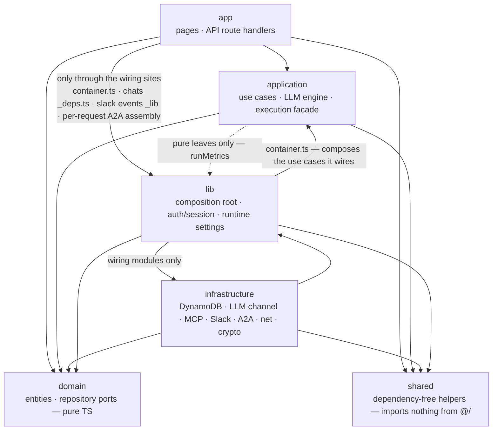
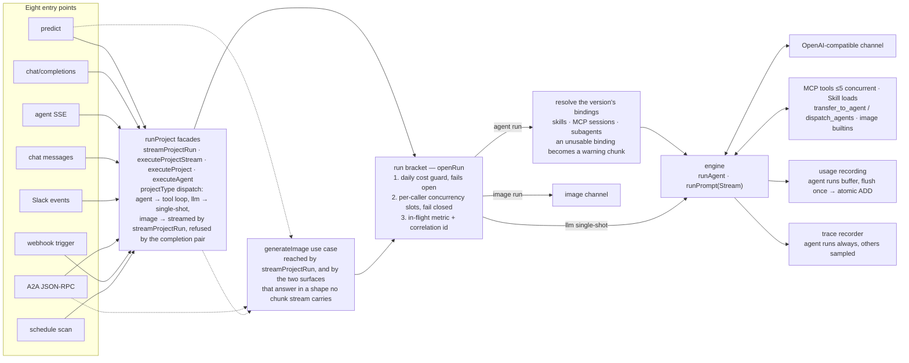
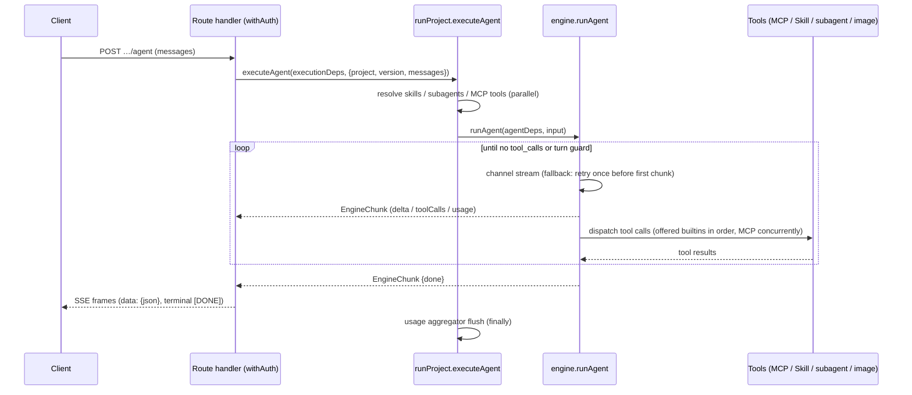
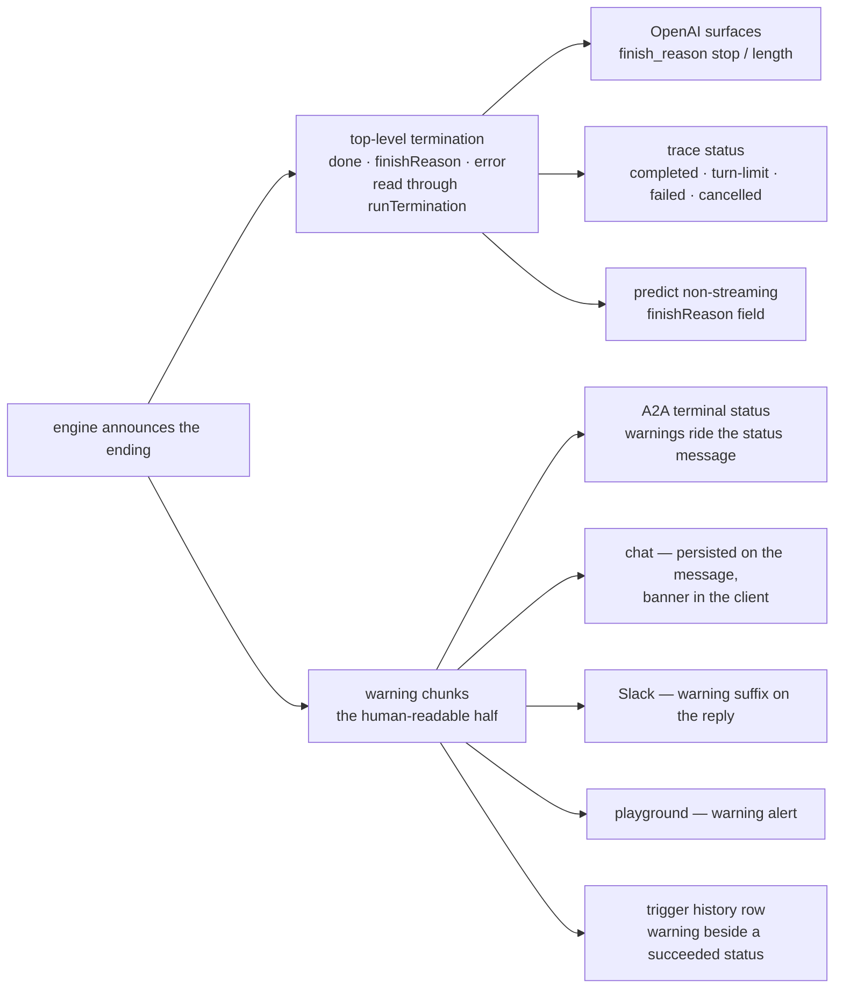

# Architecture

How Agent Studio is put together, and **why** — the design decisions, their trade-offs, and
the invariants that hold them in place. It is the document to read before changing code.

It deliberately does *not* cover: the HTTP contract ([API.md](API.md)), environment variables
([CONFIGURATION.md](CONFIGURATION.md)), deployment and observability
([OPERATIONS.md](OPERATIONS.md)), or the security model ([SECURITY.md](SECURITY.md)).

**Where to start**: read this file top-to-bottom, then trace one request through the code.
Execution starts at `src/application/execution/runProject.ts` — the facade every entry point
calls, an [image](#images) project excepted — and descends into
`src/application/llm/engine.ts`, the tool loop. The [Request flow](#request-flow) section is
the map.

Agent Studio is a single Next.js 16 full-stack application covering the domains **project,
llm, agents (subagents + external agent registry), skills, mcp, chat, cost/usage**.

## Stack

- Node.js 24, pnpm 11 (`packageManager` pinned)
- Next.js 16 App Router, React 19, TypeScript strict (`noUncheckedIndexedAccess`)
- Mantine 9 (`@mantine/core` + hooks/form/notifications/charts, `@tabler/icons-react`)
- Better Auth 1.6 + Google OAuth (custom DynamoDB adapter)
- AWS DynamoDB single-table design

## Layers

```
src/
  domain/           # Entities + repository ports. Pure TS. No framework/AWS imports.
    project/  llm/  chat/  skill/  mcp/  agent/  usage/  settings/  trace/
    execution/  security/  slack/  trigger/  sync/  audit/
  application/      # Use cases. Depends on domain ports only, and never on the
                    # composition root — deps are injected, never pulled.
    llm/            # The engine: tool loop, PII masking, context budget, document parts
    execution/      # The facades, the run bracket, binding + MCP tool resolution
    chat/  slack/  a2a/  trigger/  image/
                    # The surfaces that drive a run, and the image path
    audit/          # The one writer of an audit row, and reading the trail back
    project/  registry/  skill/  mcp/  agent/  usage/  trace/  settings/  health/
  infrastructure/   # Adapters (app-facing code reaches them via the composition root).
    db/             # Single-table client, key builders, repositories
    llm/            # OpenAI-compatible provider channels, streaming
    mcp/            # MCP HTTP client, session, discovery cache
    a2a/  agent/  slack/  github/  storage/  net/  crypto/  health/
                    # A2A + external-agent clients, Slack, the skills- and tools-repo
                    # clients, S3 image store, SSRF guard, AES, readiness probes
  app/              # Next.js App Router: pages + route handlers (presentation)
    api/            # Route handlers call application use cases, never repositories directly
      _lib/         # Route-handler glue: SSE framing, `apiError`, body size limits
    _components/    # The shared UI kit: CardGrid, HeaderRows, form styles, code blocks,
                    # copy buttons. A piece of UI that repeats across pages belongs here,
                    # with one owner
    _lib/           # Browser-side glue the pages share: the transfer chains a chunk came
                    # from, attachment composers, tool-call display, the viewer hook
  components/       # App chrome: the header the root layout mounts (theme toggle, user
                    # menu), and the landing page's sign-in button
  lib/              # Cross-cutting glue: composition root (container.ts), auth/session,
                    # the viewer flags the console gates on (viewer.ts), config +
                    # runtime-settings, public URLs, run metrics
  shared/           # Dependency-free helpers (dates, slugs, timeouts, PKCE, constant-time
                    # compare, logger). The bottom of the graph: imports nothing from `@/`
  proxy.ts          # The page sign-in gate, and the single owner of which pages are public
  instrumentation.ts
                    # Boot, before the server accepts connections: fail-fast config
                    # validation, shutdown signal handlers, the audit sink, and the
                    # managed-MCP repair sweep
```

The last two are modules, not layers: they are what runs *around* a request rather than in
one, and each is owned elsewhere — [SECURITY.md](SECURITY.md#two-gates-on-purpose) for the page
gate, [CONFIGURATION.md](CONFIGURATION.md#boot-time-validation) and
[OPERATIONS.md](OPERATIONS.md#draining) for what boot checks and how the process winds down.

**Dependency rule: `app → application → domain ← infrastructure`.**

- `domain` imports nothing from `@/` beyond `domain` — no framework, no AWS SDK, no auth
  library, not even `shared`.
- `application` receives its dependencies. It must never import the composition root: deps
  are *injected*, never pulled. Third-party packages are banned from it the same way, and by
  the same shape of rule as `domain`'s — stated positively, as **the domain and the standard
  library and nothing else**, because a blocklist only names the dependencies somebody
  already regretted. `@a2a-js/sdk` is the one named exception: the A2A protocol *is* the
  contract its executor implements, and a port would restate the task lifecycle in our own
  types to gain nothing.
- `infrastructure` imports no `application` and no `app`, and reads no `process.env` — a
  setting an adapter needs is declared in `lib/config.ts`, which owns the parse and the
  warning. Read at module scope it would be a process-wide constant nothing declared, nobody
  injected, and the boot validation never checked.
- `src/lib` is a cross-cutting leaf both application and infrastructure may import (config,
  runtime-settings, session); `domain` never does.
- Route handlers and pages must not import `infrastructure/` directly — only through a
  wiring site.



### Composition, in a few deliberate places

Composition is distributed rather than centralised in one file, because the three execution
surfaces need genuinely different bags:

| Wiring site | Wires |
|---|---|
| `src/lib/container.ts` | Repositories; the domain ports (`SecretCipher`, `UrlPolicy`, `RemoteAgentDispatcher`, `McpToolProbe`, `McpSessionFactory`); every use-case singleton — the three registry slices (`skillUseCases` / `mcpUseCases` / `agentUseCases`) plus the ones layered beside them (managed MCP, MCP OAuth, triggers, settings); `executionDeps` / `imageDeps` / `triggerRunnerDeps` — including the required LLM and image channels, so a missing injection is a type error rather than a silent network call |
| `src/app/api/chats/_deps.ts` | The `ChatDeps` bag (bound `runAgent` + repositories) |
| `src/app/api/slack/events/_lib/` | The `SlackEventDeps` bag (bound `runAgent` + `SlackClientPort`), mirroring `ChatDeps` |
| `src/app/api/a2a/[name]/route.ts` | Per-request A2A assembly: the SDK's request/transport handlers around `ProjectA2aExecutor` over `executionDeps` — per request because the handler is built around one project's card |

Three DI styles are in use on purpose:

- **Factory** `createXUseCases(repo)` for the registry slices — their shared CRUD core lives
  in `src/application/registry/registryUseCases.ts`.
- **Free functions taking the repo as the first argument** for the project slice.
- **Deps-bag interfaces** (`ChatDeps`, `ExecutionDeps`, `SlackEventDeps`) for execution paths.

New slices should prefer factory or deps-bag.

### The rules are mechanical, not aspirational

`tests/architecture.test.ts` enforces every layer rule above with an **empty allowlist**,
plus a set of named **single-owner invariants** that fail when a second copy of a decision
appears — and also when the owner *loses* the definition, which would otherwise read as a
pass. The owner list is in [../AGENTS.md](../AGENTS.md#single-owner-invariants).

The single-owner rules exist because this is the failure the codebase actually kept hitting:
`McpTool` reached four definitions that had already drifted apart, the DynamoDB
conditional-write error name was spelled out at seven call sites — only one of which handled
the transactional form — and the image-usage collapse was derived independently four times.

**Adding a violation is not quietly possible. Fix the import; do not widen the rule.**

## DynamoDB single-table design

One table (`DYNAMODB_TABLE_NAME`, default `agent-studio`), keys `PK` (S) / `SK` (S), with
`GSI1` (`GSI1PK`/`GSI1SK`) and `GSI2` (`GSI2PK`/`GSI2SK`). All items carry `entityType`.

| Entity | PK | SK | GSI1PK | GSI1SK |
|---|---|---|---|---|
| Auth (better-auth model rows) | `AUTH#{model}#{id}` | `ITEM` | `AUTH#{model}` | `{id}` |
| Auth unique lock (email, token, …) | `AUTHUNIQUE#{model}#{field}#{value}` | `LOCK` | — | — |
| Project | `PROJECT#{name}` | `META` | `TYPE#PROJECT` | `{name}` |
| Project version | `PROJECT#{name}` | `VERSION#{versionName}` | — | — |
| Project API token | `PROJECT#{name}` | `APITOKEN` | — | — |
| Project MCP OAuth connection | `PROJECT#{name}` | `MCPCONN#{server}` | — | — |
| MCP OAuth authorization in flight | `MCPOAUTH#{state}` | `META` | — | — |
| Trigger (webhook / schedule) | `PROJECT#{name}` | `TRIGGER#{triggerId}` | schedule only: `TYPE#SCHEDULE` | schedule only: `{name}#{triggerId}` |
| Trigger run (delivery / firing) | `PROJECT#{name}` | `TRIGGERRUN#{triggerId}#{startedAt}#{runId}` | — | — |
| Trigger dedup claim (`Idempotency-Key` / `schedule:{instant}`) | `TRIGGERIDEM#{name}#{triggerId}#{key}` | `META` | — | — |
| Chat | `CHAT#{chatId}` | `META` | `CHATOWNER#{email}` | `{updatedAt ISO}` |
| Chat message | `CHAT#{chatId}` | `MSG#{seq zero-padded 6}` | — | — |
| Chat run log (replay buffer, short TTL) | `CHAT#{chatId}` | `RUNLOG#{runId}#{seq zero-padded 6}` | — | — |
| Skill | `SKILL#{name}` | `META` | `TYPE#SKILL` | `{name}` |
| MCP server | `MCP#{name}` | `META` | `TYPE#MCP` | `{name}` |
| External agent (registry) | `AGENT#{name}` | `META` | `TYPE#AGENT` | `{name}` |
| Plugin | `PLUGIN#{name}` | `META` | `TYPE#PLUGIN` | `{name}` |
| Usage (daily per project) | `USAGE#{projectName}` | `DATE#{yyyy-MM-dd}` | `USAGEDATE#{yyyy-MM-dd}` | `{projectName}` |
| Usage (daily per caller) | `USAGE#{projectName}` | `ACTOR#{yyyy-MM-dd}#{kind}:{id}` | — | — |
| Usage monthly-threshold claim | `USAGE#{projectName}` | `MONTHCLAIM#{yyyy-MM}` | — | — |
| Run concurrency slot | `RUNSLOT#{kind}:{id}` | `SLOT#{index zero-padded 3}` | — | — |
| Slack event dedup | `SLACKEVENT#{eventId}` | `META` | — | — |
| A2A task (inbound) | `A2ATASK#{projectName}#{taskId}` | `META` | — | — |
| A2A client key | `A2ACLIENT#{name}` | `META` | `TYPE#A2ACLIENT` | `{name}` |
| A2A client key hash (verification) | `A2AKEYHASH#{sha256}` | `META` | — | — |
| Trace | `TRACE#{traceId}` | `META` | `TRACEPROJECT#{projectName}` | `{createdAt ISO}#{traceId}` |
| Trace deletion reference | `PROJECT#{name}` | `TRACE#{createdAt}#{traceId}` | — | — |
| Audit record | `AUDIT#{yyyy-MM-dd}` | `{createdAt ISO}#{eventId}` | — | — |
| App settings (env overrides) | `SETTINGS#app` | `META` | — | — |

**Why one table and two GSIs.** Primary-key access covers everything item-scoped: a project
and its versions share a partition, a chat and its messages share a partition, so a cascade
delete is one query. `GSI1` serves the heterogeneous "list by kind" patterns — `TYPE#*`
catalog listings, `CHATOWNER#{email}` (a user's chats by recency), `USAGEDATE#{date}`
(cross-project daily cost for the dashboard), `TRACEPROJECT#{name}`. `GSI2` exists solely for
Better Auth unique-field lookups.

### Conventions

- **Key strings come from `src/infrastructure/db/keys.ts`.** Never hand-write one elsewhere.
- **A name-keyed registry entity gets its CRUD from `createKeyedRepository`**
  (`keyedRepository.ts`): single-item partition, SK `META`, listed from the
  `TYPE#<entityType>` GSI1 partition, with create / update / delete each conditioned on
  whether the partition already exists. Skills, MCP servers and external agents share it, and
  only the `toItem`/`fromItem` mappers stay per-repository, because only they carry
  entity-specific fields. It is the storage-side counterpart of the
  [registry use-case core](#composition-in-a-few-deliberate-places) — the same three entities,
  factored at both ends.
- The published version is a **pointer attribute** `publishedVersion` on the project `META`
  item, not a copy.
- Chat `META` owns an atomic `nextSeq`; message rows use conditionally-created sequence keys.
- Auth unique fields are claimed transactionally with a dedicated lock item. `GSI2` remains a
  compatibility lookup for rows created before the locks existed.
- Trace creation transactionally writes a project-partition deletion reference; project
  deletion marks the project first, preventing new versions/traces before child cleanup.
- **Usage rows use atomic `ADD` per model** — `calls.{model}`, `inputTokens.{model}`,
  `outputTokens.{model}`, `costUsd.{model}` — in two steps: `SET … if_not_exists` to
  materialise the maps, then `ADD` on the nested number attributes. They also carry the cost
  guard's once-per-day notification claims (`alertedAt`, `blockedAt`), taken with a
  conditional write. Those claims live here rather than on the project item because that
  item's `updatedAt` is the optimistic-concurrency condition for every project write — a
  background marker there would fail a concurrent edit — and because a usage row already
  expires on its own date, which retires the marker with it.
- **Rows that grow without bound carry `expiresAt`** (`src/infrastructure/db/ttl.ts`), the
  table's TTL attribute. Retention windows and the requirement to enable TTL on the
  production table are in [OPERATIONS.md](OPERATIONS.md#row-retention).
- **List queries paginate.** Most go through `queryAll()` (`src/infrastructure/db/query.ts`):
  a single Query page caps at 1MB, so an unpaginated list silently truncates. `chatRepository`
  runs its own `LastEvaluatedKey` loops; `traceRepository` is intentionally bounded top-N via
  `Limit` and pulls up to five pages to fill that limit with **live** rows, because DynamoDB
  applies `Limit` before the app-side expired-row filter — bounded, so a partition of expired
  rows cannot turn one list into a scan.

## Request flow

Eight execution entry points converge on `src/application/execution/runProject.ts`, which
answers two separate questions in two tiers.

| Tier | Functions | What it decides |
|---|---|---|
| **Dispatch** — what an entry point calls | `streamProjectRun` for a surface that takes a run as chunks; `executeProjectStream` / `executeProject` for one that answers with a completion; `executeAgent` for the surfaces that only ever run agent projects | which strategy a `projectType` runs |
| **Admit** — what starts a run | `executeVersion` / `executeVersionStream` for the single-shot path, `executeAgent` for the tool loop | the [run bracket](#the-run-bracket); an agent run additionally resolves the version's skills, MCP tools and subagents from repositories, assembles the injected engine deps, and flushes usage at the end |

`executeAgent` is in both tiers — an agent surface calls it directly, and it opens its own
bracket. **Nothing outside this module calls `executeVersion` or `executeVersionStream`**, and
nothing should: arriving at one directly is exactly how a caller skips the `projectType`
dispatch. To trace a request, start at the dispatch tier.

| Entry point | Caller | Facade used |
|---|---|---|
| Predict | `POST …/predict` | `executeProjectStream` (stream) / `executeProject` (non-stream) — so an agent project runs its tool loop here too, and `variables` (which only a prompt template consumes) are ignored for it; image projects → `generateImage`, which edits the request's source `images` when any are sent and generates otherwise |
| OpenAI-compatible | `POST …/chat/completions` | `executeProjectStream` (stream) / `executeProject` (non-stream); an image project is refused with 400 — an image has no chat completion |
| Agent SSE | `POST …/agent` | `executeAgent` |
| Chat | `POST /api/chats/[chatId]/messages` | `executeAgent` (bound as `ChatDeps.runAgent`) |
| Slack | `/api/slack/events/[project]` → `handleSlackEvent` | `executeAgent` (via `SlackEventDeps`) |
| A2A | `POST /api/a2a/[name]` → executor | `executeProjectStream` |
| Webhook trigger | `POST /api/triggers/[project]/[trigger]` → `executeDelivery` | `streamProjectRun` (bound in `container.ts` as `triggerRunnerDeps.run`) — the one dispatch that streams an image project rather than refusing it; a firing's row records that it drew, since the row carries text |
| Schedule trigger | `POST /api/triggers/scan` → `scanSchedules` → `executeFiring` | `executeProjectStream` (same `triggerRunnerDeps.run`) |



The dashed edges are the image branch: every image-capable surface asks `runStrategyFor`
and hands an `image` project to `generateImage` *before* asking the facade, which refuses it.
The bracket admits both paths — it is what wraps a top-level run however it started.

`generateImage` (`src/application/image/generateImage.ts`) sits outside this module but starts
a run the same way — the predict route, the A2A executor and the trigger runner reach it
directly, which is why it joins the admitting functions below. `collectRun`, which drains an
agent stream into one collected answer, stays here, where `executeProject` uses it for the
non-stream agent case.

`executeProjectStream` (and `executeProject`, its non-streaming counterpart) is the
canonical `projectType` → strategy dispatch: `agent` runs the multi-turn tool loop, `llm`
runs a single-shot completion, and an `image` project is refused — its run is the dedicated
`generateImage` use case.

`streamProjectRun` is the same dispatch for a surface that consumes a run as chunks: it
streams an image project instead of refusing it. The pair is **two contracts, not a flag** —
which one a surface calls is that surface declaring whether an image project is something it
can run at all. `/chat/completions` calls the refusing one because an image has no chat
completion — there is nothing to send back. The trigger runner calls the streaming one
because there is something: the picture is billed, traced, and recorded on the firing's row,
which carries text and says so rather than closing as an empty success. A boolean deciding
whether a project type is refused would be the defect the refusal exists to prevent; a second
name is not.

**New entry points should call one of these instead of re-encoding the decision** — three
call sites used to ask it for themselves, the two non-streaming routes had diverged on the
image case, and a fourth copy lived in `container.ts`, where it also assembled the image
chunks by hand and left out the run's ending. A subagent transfer dispatches on
the same axis inside `runLocalSubagent`: an `image` child generates, a prompt child runs its
user prompt template with the transfer message as the user turn, and only an `agent` child
enters the tool loop.

### The run bracket

Exactly four functions admit a top-level run — the [admit tier](#request-flow)'s
`executeVersion`, `executeVersionStream` and `executeAgent`, plus `generateImage` — and each
opens a bracket (`src/application/execution/runBracket.ts`). The bracket is the single owner
of everything that wraps a run regardless of how it was started: the in-flight metric, the
daily cost guard, the per-caller concurrency guard, and the log correlation id.

Each of those four used to open the in-flight metric for itself, which is exactly why the
cost guard had four places it could be forgotten. `tests/architecture.test.ts` now pins the
bracket, so a fifth entry point that skips it is missing its metric as loudly as its guard.

It is *not* "the execution facade", because `generateImage` is not in one: the predict
route, the A2A executor and the trigger runner call that module directly.

**Order is load-bearing at both ends.** The guards run **before** the metric opens, so a
refused run is never counted, traced, or recorded. `close()` runs **after** the caller has
flushed its usage — an agent run buffers usage until the end, so a settle before the flush
would always read a total that excludes the run being settled.

One policy runs ahead of both guards: **whether the version's models can be priced at all**
(`modelPolicy.ts`). An id the registry does not carry still dispatches and is booked at $0, so
a deployment whose usage rows become an invoice can set `UNKNOWN_MODEL_POLICY=refuse` and have
the run turned away before anything is spent — primary and fallback alike, since a fallback
carries the whole run whenever the primary is rate-limited. It is first because it is the one
refusal that costs nothing to decide and says the *configuration* is wrong rather than that
the platform is busy; a misconfigured version should not first queue for a slot. Default
`allow` is byte-identical to the behaviour every deployment has had, and the policy is
injected into the bracket rather than read there, because `application` may not reach
`src/lib/runtime-settings.ts`.

**A subagent transfer is not a bracket, but it is not free either.** A child never opens one —
it is not a top-level run, and the concurrency guard deliberately does not apply, since fan-out
is bounded instead by `MAX_DISPATCH_TASKS`, the transfer depth limit, and the rule that a child
is never offered `dispatch_agents`. The two policies that bound *spend* do apply, checked where
the child's version resolves (`subagentRunner.ts`): the model policy, because an unpriced child
leaks exactly as much as an unpriced parent, and the **child project's** daily cost guard,
because a transfer is a whole run on another project with its own tool loop and its own usage
rows — and its parent's admission said nothing about that project's budget.

The two guards fail in opposite directions, on purpose:

- The **cost guard** protects money, so a storage blip must not stop the platform: it fails
  **open**.
- The **concurrency guard** protects the platform itself, so opening it when the store is
  failing would add load exactly when the store cannot take it: it fails **closed** — and
  costs nothing extra, since every run reads its project and version from the same table and
  a store that cannot answer was about to fail the run anyway.

Cost is checked first: a project over budget should be told so rather than made to queue for
a slot it would be refused on regardless.

**Concurrency is a slot index, not a counter** (`src/domain/execution/runSlot.ts`). A counter
is exact only while every process lives to decrement it; an instance killed mid-run leaks its
increment forever, and nothing expires a number. Each of a caller's `0..limit-1` indices is a
row with a lease, claimed by a conditional write — so the limit is exact rather than a bound
two concurrent acquires can overshoot, and a dead instance releases its hold when the lease
runs out. State is shared rather than per-process for the obvious reason: `runMetrics` counts
*this* instance's runs, so a limit built on it would multiply by the number of instances.
`a2a` gets its own ceiling because the shared key's actor id is a constant — one identity
stands for every anonymous machine caller, and the per-caller limit would otherwise become a
cap on the whole A2A surface. A **named client key** is exactly the case where that reasoning
does not apply: its actor is one caller, so it takes the ordinary per-caller limit.

The cost guard (`src/application/usage/costGuard.ts`) reads one day's row with a single
primary-key `GetItem` — or, when a monthly threshold is configured, one bounded query over
the month's daily rows, which carries today's row too and so serves both windows in one read
— sums every model's `costUsd`, and refuses with `CostLimitExceededError` — a
`RateLimitedError`, so `apiError` emits `Retry-After` set to the seconds until the window
rolls over, which is exactly when the refusal stops being true.

Operational tuning for both guards is in [OPERATIONS.md](OPERATIONS.md#spend-and-load-guards).



### Preview assembles what a run would send, without sending it

`previewPrompt` (`src/application/execution/promptPreview.ts`) answers "what will the model
actually read", which for an agent project is never the text in the editor: the system prompt
gains the skill table, the connected-MCP-server table with its aliased tool names, the transfer
instructions and the image section only at dispatch.

It gets that right by **calling the engine's own builders** rather than reproducing them. A
second renderer is a copy, and this copy would drift silently — a preview that disagrees with
the run looks exactly like one that is right. For the same reason it **opens real MCP
sessions**, as a run does: aliases are allocated against live tool lists, so nothing else
yields the names the model will see. Those sessions are released before it returns. It reads
the same `runStrategyFor` axis too, so an image project previews its rendered template (which
*is* its prompt) rather than a system prompt it has none of.

PII masking is the one thing it does not apply: masking rewrites content per run and what it
masks depends on the turn's own text, which a preview does not have. A version with the filter
on is told so as a warning instead — the same channel that reports an agent version's unused
user-prompt template.

### SSE responses pull the first chunk before answering

Streaming entry points call the generator's first `next()` **before constructing the
`Response`** (`src/app/api/_lib/sse.ts`). A run refused by a guard throws on that first call,
before producing anything; building the response first would send `200 text/event-stream` and
then deliver the refusal as a data frame, so an SSE caller would never see the 429 or its
`Retry-After`. Holding one chunk lets the throw reach `apiError`; beyond that the data frames
are unchanged, though the stream also carries a `: keepalive` comment frame every 15s — idle
middleboxes (the ALB in front of the deployed app) cut a connection with no bytes for 60s,
which is shorter than one image generation, and SSE parsers discard comment frames.

### EngineChunk contract

`EngineChunk` (`src/domain/llm/types.ts`) is the wire unit between the engine and every
consumer (chat persistence, Slack, OpenAI reshaping, A2A, the browser client). Top-level
chunks carry **no `author`**; only subagent chunks are authored, stamped by the `runSubagent`
wrapper with the subagent's name. **`isTopLevelChunk()` is the single owned predicate** —
consumers must use it instead of re-deriving author semantics.

| Field | Emitted by | Consumed by |
|---|---|---|
| `delta.content` / `delta.reasoningContent` | engine per stream delta (PII-restored) | top-level only: chat persistence, Slack text, OpenAI chunks, A2A artifact, client answer bubble |
| `delta.toolCalls` | engine when a turn requests tools (display args) | client tool-call rendering; Slack progress indicator |
| `toolResult` | engine after each tool finishes | chat tool rows (displayed, and replayed into context for the last N turns), client tool panel |
| `warning` | run setup, before the first token, for a binding it could not use (deleted skill/subagent, unreachable or blocked MCP server, tools past the per-run cap) | chat warning banner, Slack warning suffix, `Trace.warnings`; never ends the stream |
| `image` | GenerateImage / EditImage builtins, and image-project subagents | consumed **regardless of author** (delegating to an image subagent is how an agent draws): chat image persistence (S3), Slack upload, OpenAI `images` extension, client gallery |
| `usage` | engine once per model call | `collectRun` response usage; DB recording is separate (`recordUsage` / aggregator inside the engine loop) |
| `error` | engine on failure (mid-stream — no retry); authored when a transfer fails | only a **top-level** error ends the stream. An authored one is *dropped* by nearly every consumer (Slack and the trace recorder excepted) because the parent answers past it — so what a failed transfer lost reaches the reader as that transfer's `warning`, and the model as its "For context" turn, not through this field |
| `done` | engine when the loop ends without tool calls — **not** when the turn guard stops it | read through `chunkTermination` (below): OpenAI `finish_reason: "stop"`, client finalize |
| `finishReason` | engine when a run ends for a reason `done` cannot say — the turn guard (`turn-limit`) and a provider output cut (`output-limit`), each alongside a `warning` naming it | read through `chunkTermination`/`runTermination`: OpenAI `finish_reason: "length"`, trace status `turn-limit`, A2A terminal status message, predict's `finishReason` field |
| `author` | subagent chunks only — the **innermost** agent | consumers filter via `isTopLevelChunk`; client shows the running agent |
| `authorPath` | subagent chunks only — the chain, outermost first | client renders `sample-agent → simple-image`; the trace recorder groups a transfer by its first element |
| `authorDone` | the `runSubagent` wrapper when an authored run returns | consumers stop showing that chain as active |
| `traceId` | subagent chunks (stamped by `runProject`) | client correlates a chunk to its subagent's trace |

> **Why a run ended is announced, never inferred.** `RunTerminationReason`
> (`completed` / `turn-limit` / `output-limit` / `cancelled` / `error`) lives in
> `src/domain/llm/types.ts`; `chunkTermination()` is the owned reader of the raw
> fields and `runTermination()` composes it with the author gate — consumers that
> asked the two questions separately were one forgotten gate away from reading a
> child's ending as the stream's. Reasoning from the *absence* of `done` is what
> used to report a cancellation as `finish_reason: "length"`, and ignoring the
> provider's own `finish_reason` is what reported a response cut at `max_tokens`
> as a normal stop (`output-limit` now says it, engine-read from the channel).
> Normal completion stays `done: true` on the wire (byte-identical to the
> pre-reason contract); `cancelled` never appears as a chunk, because a cancelled
> generator throws or is returned — only the consumer's own signal can say it.
> Only a **top-level** termination speaks for the stream: an authored one is a
> child's, absorbed into the parent's tool result, its stream-end already said by
> `authorDone`.



## Error handling

Two deliberate strategies coexist, split by whether a stream has started.

**HTTP path (before a stream starts)** — use cases throw `AppError` subclasses
(`src/application/errors.ts`: Validation / NotFound / Forbidden / Conflict / RateLimited /
Upstream — the last a 502 for another system's failure; chat adds `Chat*` subclasses on the
same base). `RateLimitedError` carries the seconds to wait,
because the thing that knows *why* a request was refused is the only thing that knows when it
stops being refused; `apiError` (`src/app/api/_lib/http.ts`) turns that into `Retry-After` and
maps any thrown error, falling back to a generic 500. `parseName` validates `[name]` params as
slugs by throwing `ValidationError`. The registry slices share this contract via
`createRegistryUseCases`: missing → `NotFoundError`, duplicate create → `ConflictError`,
SSRF-blocked URL at the write boundary → `ValidationError` (`assertAllowedUrl` wraps the
infrastructure `SsrfError`, which stays layer-local).

**In-stream path (after the first chunk)** — failures are values, not exceptions. The engine
yields an `{error}` chunk and does not retry; subagent failures yield an *authored* error
chunk the parent may still answer from; and dispatch guards degrade instead of failing the
run — an SSRF-blocked or unreachable MCP server is skipped with a `warning`, and a hung MCP
request aborts after its timeout and becomes a tool-error string the model can react to.

## Domain semantics

### Project / Version

```ts
Project { name (slug, immutable id), displayName, description,
          projectType: 'llm' | 'agent' | 'image', ownerEmail, departmentCode?,
          publishedVersion?, slack?, costLimits?, createdAt, updatedAt }

Version { projectName, versionName, systemPrompt, userPromptTemplate, model, fallbackModel?,
          parameters { temperature?, maxTokens?, reasoningEffort?, piiFiltering,
                       callerContext?, structuredOutput?/jsonSchema,
                       imageGeneration?/imageModel? },
          mcpList: McpBinding[], skillList: string[],
          subagentList: { name, type: 'local' | 'remote' }[], maxTurn?, createdAt }
```

- `CostLimits { alertThresholdUsd?, blockThresholdUsd?, alertSlackChannel? }` — the window is
  the **UTC day**, because that is the grain the usage row is keyed at; a guard on any other
  window would need an aggregate that does not exist.
- `McpBinding { name, headers?: Record<string, string | null>, tools?: string[] }` binds the
  version to a registry MCP server. `tools` narrows which of that server's tools the run
  offers. **The URL is always the registry's**; `headers` layers over the server's own headers
  at dispatch (string = replace/add, `null` = remove a default, matched case-insensitively),
  so one registry server serves many projects under different credentials. Override values
  carry the same AES-encrypt/mask lifecycle as registry headers — which makes a version the
  first entity holding secrets: API responses go through `toVersionView`, while execution
  paths read the repository value and decrypt at dispatch. Rows written before overrides
  existed stored `mcpList` as `string[]`; reads normalise them and the API still accepts that
  shape.
- Template variables `{{var}}` are rendered server-side before dispatch.
- Version writes validate **capability fit** for catalog models (agent projects require
  `capabilities.tools`; `structuredOutput` requires the capability). Unknown/custom model ids
  stay allowed with a warning — and are priced at $0 until added to the catalog.
- Version writes also validate that `mcpList`/`skillList`/`subagentList` entries **resolve**
  (`VersionRefRepos`, injected by the route from the composition root), and that the project
  type can actually run them — only `agent` projects do, so a binding added to any other type
  is rejected rather than stored, shown in the editor and silently ignored at run time. On
  update only *newly added* entries are checked, so deleting a registry entry never strands
  the versions that already referenced it, and configuration stored before these rules stays
  editable and removable.
- **Which version a run executes** is owned by `resolveRunnableVersion`
  (`src/application/project/resolveRunnableVersion.ts`): the published pointer always wins;
  only interactive surfaces (chat) opt into falling back to the newest draft; external
  surfaces (Slack, A2A, webhook triggers, subagent transfers) are published-only, so drafts
  never leak.

### LLM engine

`src/application/llm/engine.ts` is **pure logic with everything injected** — channel,
`recordUsage`, `callMcpTool`, `loadSkillContent`, `runSubagent`, `generateImage`, `editImage`
— so it is tested with no network and no DB via `tests/fakeChannel.ts`.

> `src/application/llm/AGENTS.md` is the authority on the loop invariants. Read it before
> editing `engine.ts` or `pii.ts`.

```mermaid
flowchart TB
  start["turn start"]
  guard{"turn ≥ maxTurn?"}
  turnlimit["warning +<br/>finishReason: turn-limit"]
  call["model call — stream<br/>retryable failure before the first chunk:<br/>one fallback retry"]
  miderr["mid-stream failure:<br/>error chunk, no retry — stream ends"]
  hascalls{"tool calls?"}
  cut{"provider said<br/>finish_reason length?"}
  outputlimit["warning +<br/>finishReason: output-limit"]
  finished["done: true"]
  dispatch["announce every call, then dispatch:<br/>builtins in call order · MCP concurrently ≤5<br/>an output-cut turn warns once; arguments that<br/>did not parse get an error result, never a dispatch"]
  budget["per-turn cap + run context budget<br/>a cut carries a marker, the run warns once"]
  append["ONE assistant message + tool results<br/>+ post-context messages — all charged"]

  start --> guard
  guard -->|yes| turnlimit
  guard -->|no| call
  call -.-> miderr
  call --> hascalls
  hascalls -->|no| cut
  cut -->|yes| outputlimit
  cut -->|no| finished
  hascalls -->|yes| dispatch --> budget --> append -->|"turn + 1<br/>(a transfer: + 2)"| start
```

Every exit is announced — `done` for a finish, `finishReason` for a limit, an `error` chunk
for a failure — which is what lets consumers read the ending instead of inferring it.

- All text generation speaks the **OpenAI Chat Completions protocol**; model ids are
  `provider/model`. Routing is described in
  [CONFIGURATION.md](CONFIGURATION.md#llm-channels).
- `runPrompt(deps, input): Promise<RunResult>` — single-shot, with `runPromptStream` for
  streaming.
- `runAgent(deps, input): AsyncGenerator<EngineChunk>` — the recursive multi-turn tool loop:
  - A turn guard (`turn >= maxTurn`, default 50) stops the loop — announced, not
    silent: a `warning` names the limit for the reader and a `finishReason: "turn-limit"`
    chunk names it for consumers (see the termination note under the EngineChunk contract).
  - **All `tool_calls` of one response aggregate into ONE assistant message**, then tool
    results append, then the loop recurses with `turn + 1`.
  - A builtin serves a call only when that builtin was **offered** this run — the offered
    names come from `buildAgentTools`, never from dep presence. The builtins are `Skill`
    (progressive skill loading), `transfer_to_agent` (subagent transfer: local recursion or a
    remote agent HTTP call; a budget guard `turn + 2 >= maxTurn` rejects the transfer),
    `dispatch_agents` (several subagents at once, answers collected into one budgeted tool
    result — offered to **top-level runs only**, so the number of concurrent children does not
    grow with transfer depth), `GenerateImage`, and `EditImage`. **Any other name is an MCP
    tool**, and `BUILTIN_TOOL_NAMES` is reserved during alias allocation so an MCP tool never
    carries a name a builtin might claim.
  - The MCP calls of one response run **concurrently** (≤5 in flight) while builtins run in
    call order; results, tool messages and the assistant `tool_calls` all stay in call order.
  - One turn's tool-result text is capped (200KB, spent in call order): a truncated result
    says so, and one that no longer fits becomes `Error: …`.
  - Underneath the per-turn caps sits the **run-wide context budget**
    (`src/application/llm/contextBudget.ts`, the single owner): a ceiling derived from the
    model's `contextWindow` — the minimum of primary and fallback, minus the version's
    `maxTokens` and a headroom — that the input, tool definitions, every turn's output, tool
    results and a transfer's answer (the one spot nothing bounded) are charged against.
    What no longer fits is cut with a marker and reported once as a `warning`, so a
    tool-heavy run on a small-window model truncates instead of dying on a provider 400.
    Tokens are estimated conservatively from character classes (the values and their
    rationale are in [CONFIGURATION.md](CONFIGURATION.md#the-run-wide-context-budget));
    an unregistered model has no window to derive from and runs unbudgeted. The budget
    bounds what the run *adds* — the input `messages` stay the caller's: only chat trims
    history (its server-side store is the one unbounded input source), while every other
    surface relays what the caller composed, because silently rewriting a caller's request
    is worse than the provider's own overflow answer.
  - Both image deps are injected **only** when the version opts in via
    `parameters.imageGeneration: true`; the model is `parameters.imageModel` when set and
    still image-capable, else the registry's default image model. Whether that model's
    provider implements the edit endpoint is only known at dispatch, so a refusal comes back
    as a tool-result error rather than hiding the tool.
  - **Image handles**: a per-run registry ids the inline `data:` images of the input messages
    and every image the run produced (`img_1`, `img_2`, …). `EditImage` and
    `transfer_to_agent`'s `image_ids` take an id, so the engine resolves bytes and the deps
    stay pure I/O. An `https://` image part gets **no** handle — the provider fetches those
    itself, so the bytes are not in hand. The registry is filled only when a run can edit or
    can transfer.
  - A **subagent transfer** passes the model-written `message` plus the bytes of any
    `image_ids` it named — an image-project child then *edits* those instead of drawing anew,
    and an agent child sees them as image content parts. A remote (A2A) child cannot take
    images and says so rather than dropping them. The child's final text returns as a
    "For context: …" user message. When the child returned **nothing**, that message carries
    the reason its stream reported (`Error: …`) instead of an empty answer, and one `warning`
    tells the reader the same thing — a child never throws, so its failure exists only as an
    authored `error` chunk, which nearly every consumer drops. The returned text decides:
    a child that answered despite a failure along the way is reported as having answered.
  - It also carries the conversation so far as a rendered, PII-masked transcript bounded by
    8,000 chars — **text inside the child's user turn, never replayed messages**, so the child
    cannot read the parent's answers as its own. The turn being answered is excluded (the
    `message` already is it), an agent child passes the same transcript on so a grandchild
    inherits the original conversation, and an **image** child receives the bare `message`,
    because that message is its image prompt.
  - Local transfers carry an **ancestry chain**: transferring to a project already on the
    chain, or nesting past depth 5, is refused as an authored error chunk. Turn accounting
    alone cannot bound this — a child version carries its own `maxTurn` and can raise the
    ceiling its parent was running under.
- **Fallback**: on a retryable error (429/5xx) from the primary model **before the first
  chunk**, retry once with `fallbackModel`. A mid-stream failure yields an `{error}` chunk and
  does not retry.
- **PII filtering** (`parameters.piiFiltering`): emails, phone numbers, Korean registration
  numbers and Luhn-valid card numbers in outbound
  messages and variables are regex-masked with reversible format-preserving `[[PII:…]]` tokens
  before dispatch (`src/application/llm/pii.ts`); originals are restored in responses —
  streaming included, with token-boundary buffering — and the mapping carries across subagent
  transfers, while tool args/results re-entering engine context stay masked. **Outbound MCP
  dispatch is not masked** — see [SECURITY.md](SECURITY.md#pii-filtering-and-where-it-stops).
  Off is byte-identical to the unfiltered path.
- **Cost** is computed from registry pricing at the call site (`calculateCost` /
  `calculateImageCost` in `src/domain/llm/models.ts`) and passed to `recordUsage`, which hands
  it to the usage repository's atomic `ADD`. Single-shot runs record per call; agent runs
  buffer per-turn usage in `createUsageAggregator` and flush once at run end.
- **Model registry** `src/domain/llm/models.ts`:
  `ModelConfig { id, provider, displayName, pricing { inputPer1M, outputPer1M,
  cachedInputPer1M?, imageInputPer1M?, imageOutputPer1M?, perImage? },
  capabilities { tools, structuredOutput, imageInput, reasoning, reasoningWithTools?,
  imageGeneration? }, contextWindow, maxTokens, hidden?, wireId? }`. See
  [CONFIGURATION.md](CONFIGURATION.md#model-registry-and-wireid) for `wireId` and drift
  checking.

### Images

Three paths draw a picture, and they meet at one port — `ImageChannel`
(`src/domain/llm/imageChannel.ts`) — rather than at one use case, because what reaches them
differs: a route, a model's tool call, a transfer.

| Path | Runs in | Model |
|---|---|---|
| An `image` project | `generateImage` (`src/application/image/generateImage.ts`) | the version's own `model` |
| The `GenerateImage` / `EditImage` builtins of an agent run | `src/application/execution/imageTool.ts` | `parameters.imageModel` while it is still image-capable, else `DEFAULT_IMAGE_MODEL` — the first registry entry carrying the capability |
| An `image` project reached through a transfer | `runImageSubagent` (same file) | the child version's own `model` |

**Generating and editing is one decision, read off the input.** Every path calls `editImage`
when it holds source bytes and `generateImage` when it does not — the distinction the Images
API itself draws. That is what lets "now make it night" land on a picture the user attached,
one the run drew, or one a transfer handed to an image child through its `image_ids`, without
any of them needing a separate tool.

**Where the capability is checked decides what a refusal looks like.** `generateImage`
validates `capabilities.imageGeneration` and renders the prompt *before* opening the run
bracket, so a misconfigured version is a `400` rather than a run that spent a slot. The
builtins answer the same question at wiring time — a version that did not opt into
`parameters.imageGeneration` is never offered them, and a stored `imageModel` that has since
left the registry falls back to the default instead of silently disabling the tool. An image
subagent can only answer it mid-stream, so it does, as an authored `error` chunk. Whether the
resolved model's provider implements the *edit* endpoint is unknowable until dispatch, which
is why that refusal is a tool-result error rather than a hidden tool.

**The port states an intent; the adapter speaks each provider's dialect.** Unlike Chat
Completions — a de-facto standard every provider implements, which is why
`src/infrastructure/llm/channel.ts` has no provider branch at all — the Images API is *not*
one shape. `size` and `quality` on the port are the vocabulary the tool schema offers the
model, and a model knows nothing about which provider will serve it; translating them is
`src/infrastructure/llm/imageChannel.ts`'s job, and it is the one reader of
`ResolvedTarget.providerName`. xAI names the same intent `aspect_ratio` + `resolution`,
**refuses** unknown arguments rather than ignoring them (`400 Argument not supported: size`),
defaults `response_format` to a URL this adapter cannot use, and takes edits as
`application/json` only — its API documents the OpenAI SDK's multipart `images.edit()` as
unsupported, so that one call is hand-rolled over `fetch`. A provider added here needs its
dialect checked, not assumed: `tests/imageChannelAdapter.test.ts` pins each one's wire form.

**The mime type is read, never assumed.** It used to be hardcoded `image/png`, which held only
because that is OpenAI's default output format; xAI answers JPEG. The value is not cosmetic —
it becomes the S3 object's extension and `Content-Type` under an immutable cache header, the
`data:` prefix on bytes handed back to a *second* model, the Slack upload's filename and the
A2A artifact's type.

**Usage collapses in exactly one place.** An image model bills three token counts and a usage
row carries two; `toImageUsageRecord` (`src/domain/llm/models.ts`) owns that collapse for all
three paths. A provider that reports no token counts at all — xAI prices these per image and
says so as `cost_in_usd_ticks` — records zeros, and `calculateImageCost` falls back to the
registry's `perImage`, which is what is actually billed. Recording it is telemetry — the
provider has already drawn and billed the image, so a failed write is logged rather than
turned into a 500 that throws the result away.

**Where the bytes go is the consumer's decision, not the engine's.** The same `image` chunk
reaches every surface — how to read one is in the [EngineChunk contract](#enginechunk-contract)
— and each does something different with it: chats upload through the optional `storeImage`
port and persist the **object key**, Slack uploads to the thread once the run ends, the
OpenAI-compatible surface carries an `images` extension, predict returns them beside the text.
With no object storage configured a chat image renders during the live stream only, and says so
rather than leaving a gap.

**A stored image is a key, and its address is minted per read.** The row used to hold a public
URL, which made a transcript a permanent grant to whoever saw it. `resolveImageUrl`
(`src/domain/chat/imageRefs.ts`) owns the one compatibility rule — a `key` is signed, a legacy
`url` is passed through — because two readers ask, and a second spelling is how one of them
quietly stops showing half the images. Both resolve *before* mapping, which is what keeps
`toEngineMessages` the pure synchronous function its replay contract is tested through.

The two lifetimes differ for a reason that is easy to get backwards: a chat view is read by a
person who already has the page, so 15 minutes is generous, while a **replay** hands the URL to
the model *provider*, which fetches it at whatever point in a run that may last
`MAX_RUN_DURATION_MS`. The replay lifetime is therefore derived from the run deadline rather
than written down, or raising the deadline would silently start failing turns on images the
user can see in their own transcript. An image that cannot be signed is dropped from the
message: on the replay path an unfetchable URL fails the whole turn.

**Nothing in the app deletes an object.** A chat row expires by DynamoDB TTL, which the
application never observes, so there is no moment at which it could cascade — expiry is the
bucket's lifecycle rule, on the deployment checklist in
[OPERATIONS.md](OPERATIONS.md#operational-checklist-for-a-new-deployment).

### Skills

A skill is markdown behaviour instructions delivered by **progressive disclosure**: the system
prompt lists a name + description table only, and the model calls the builtin `Skill` tool to
load the `SKILL.md` body — or a specific attachment via `file_path`.

```ts
Skill { name, description, content (markdown), files?: { path, content }[],
        source?, createdAt, updatedAt }
```

`source` marks skills synced from the plugins repo (`github:<repo>#<plugin>` — the repo and
the plugin that declared it) — and it is what tells an orphan from an entry someone wrote in
the console, so the sync stamps what it creates and never reports a name it did not. `files`
are attachment files collected under the skill root.

The plugins sync (`syncPluginsFromSnapshot`, `src/application/plugin/syncPlugins.ts`) reads
an [Agent Plugins 1.0.0](https://agent-plugins.org/) repository (`PLUGINS_REPO`): every
directory holding a `plugin.json` is one plugin (a root nested inside another is refused),
and each plugin's skills are the immediate children of its `skills/` directory holding a
SKILL.md that conforms to the Agent Skills spec — frontmatter `name` matching the directory,
`description` present and within the spec's cap. Interpretation of `plugin.json` and
`mcp.json` is domain-owned (`src/domain/plugin/types.ts`); the GitHub client only fetches.
Supported text attachments are collected under each skill root
(`src/domain/skill/files.ts`: `ALLOWED_SKILL_FILE_EXTENSIONS`), bounded by per-file,
per-skill and file-count caps and excluding symlinks. `file_path` is normalised and confined
to the skill root: no absolute paths, no `..`, no cross-skill access. An overwrite replaces
the whole skill item, so stale attachments drop with it; skipped files are reported with
reasons.

Each plugin also becomes a row (`Plugin` in `src/domain/plugin/types.ts`: manifest metadata
plus the component names it declared) — the one thing the sync upserts unconditionally,
because nothing on it is operator-authored. The console's Plugins page lists them.

**The repository owns what it declared; a person owns deletion**
(`src/domain/sync/types.ts` owns the skip vocabulary; the kind-qualified report lives in
`src/domain/plugin/sync.ts`): a repo-sourced entry — including one adopted from another
origin, provenance rewritten with it — is brought to the repository's version automatically,
while an orphaned one is deleted only when the caller names it. See the sync contract in
[API.md](API.md#registry-and-integration-operations). Hand-registered entries are never
touched.

### MCP

```ts
McpServer { name, url, description?, content?, source?, runtime?: 'remote' | 'managed',
            headers: Record<string, string>,   // encrypted at rest, masked on read
            auth?,
            // managed only; `environment` is encrypted at rest like `headers`
            image?, args?, endpointPath?, containerPort?, environment?, envRefs?,
            createdAt, updatedAt }
```

`description` is a one-line summary and **the only field the model sees** — it becomes a row
in the system prompt's server table. `content` is markdown operator notes shown in the console
only; unlike a skill's content it never reaches the model. Descriptions are escaped when
rendered into the table, so a legacy multi-line value cannot break it.

Registry entries also arrive through the plugins sync: a plugin's `mcp.json` declares its
servers, and only `type: "streamable-http"` entries are bound — `stdio` would mean executing
a repository-supplied command on the host, so it is reported and skipped, never run
(`classifyMcpJsonServer` in `src/domain/plugin/types.ts` is the one transport decision). The
closed mcp.json schema has no description field, so each server's model-facing description
and operator notes ride in the plugin's `org.opspresso.agent-studio/mcp/<server>.md`
extension document — the reverse-domain client-extension convention the spec defines. The
stakes are higher here than for skills: an entry also holds encrypted headers and a
discovered OAuth block, so headers declared in mcp.json are never imported (the dropped
names are reported), even a caller-named overwrite replaces only the document-owned fields,
and each URL faces the same outbound guard a typed one does — a refusal is a skip, not a
failed sync.

Agent runs append a **"Connected MCP Servers"** table (server name, description, aliased tool
names) to the system prompt so the model knows which server a tool group belongs to; servers
that are unreachable or expose no tools are omitted.

#### Transport and sessions

Tool loading uses MCP streamable HTTP (`tools/list`, `tools/call` JSON-RPC). The protocol has
**one owner**, `McpSession` (`src/infrastructure/mcp/session.ts`) — both the engine's
`ToolManager` and the registry's "Test connection" probe run on it.

- Tool-name collisions get `_1`/`_2` suffix aliases with a reverse mapping, and the same
  aliasing carries a name a **provider** would refuse: MCP allows 128 characters and a dot
  (`admin.tools.list` is the spec's own example) where a function name is
  `[A-Za-z0-9_-]{1,64}`. The name is normalised into one instead of the tool being dropped,
  silently, like a collision alias — the server is still called by the name it published.
  Only a name with nothing to build an alias out of is refused. Tool results are capped at
  100,000 chars.
- Servers are contacted **in parallel** at init (one unreachable server would otherwise add
  its full timeout to time-to-first-token) while alias allocation stays in configured order,
  so names are deterministic.
- Sessions are registered before their first request and released with a `DELETE` when the run
  ends (`ToolManager.close()`, called from the execution facade's `finally` — including when
  discovery itself failed or was cancelled).
- A request answered **`404` while carrying an `Mcp-Session-Id`** means the server has
  forgotten that session and the transport requires a new one: the session id is dropped and
  the request is replayed **once** behind a fresh handshake. Replaying is safe because a 404
  is a session-lookup failure — the server rejected the message before running anything, so a
  `tools/call` that gets one had no effect to repeat. Bounded at one attempt, or an endpoint
  that has genuinely gone would be handshaked against forever. **Only the caller whose session
  is still the current one clears it**: one model response dispatches its MCP calls together,
  so several can hold the same dead id, and each resetting in turn would abandon a handshake
  another had started and mint one server-side session per caller. Without this, a run that
  outlives the server's session TTL — runs here last up to ten minutes — loses every remaining
  tool call, with the model reading `HTTP 404` and no path back.
- After the handshake, requests state the protocol version the **server** agreed to rather
  than the one proposed; a server answering with another revision is not refused, since every
  revision that answers `initialize` still speaks the tool-list shape this client reads.
- Every POST also mirrors its body into **`Mcp-Method`**, and a request that names something
  into **`Mcp-Name`** (SEP-2243, required of a client from protocol `2026-07-28`), so a gateway
  or rate limiter can route and meter without parsing the body. Older servers ignore a header
  they do not know, which is what makes sending them now free. They are applied **after** a
  registry entry's own headers, unlike the protocol version: they are derived from the body,
  and a server that reads them rejects a request where the two disagree (`-32020`), so an entry
  that happened to name one would otherwise fail every call made through it. A name outside
  printable ASCII travels Base64-encoded (`=?base64?…?=`) — unreachable through the tool
  manager, which refuses any name outside `[A-Za-z0-9_-]`, but the session owns the protocol
  for every caller.
- A result marked **`resultType: "input_required"`** — the server needs an approval or a
  missing argument before it can answer (MRTR, protocol `2026-07-28`) — is reported as its own
  failure rather than falling through the "no content" check, which would send an operator to
  look at a server behaving exactly as its protocol says it should. This client does not answer
  those requests. A result omitting the field is an ordinary one, as the spec requires.
- A tool's **image** results (`image` blocks, and `resource` blobs with an image mime type)
  come back as bytes rather than being dropped: the engine registers them, streams them to the
  user, and attaches them to the turn as a follow-up user message — only when the model
  accepts image input, since a text-only model would reject the parts and fail the turn.
- **Every other content type is read as the protocol defines it.** A `resource_link` becomes
  its URI plus whatever identifies it — it is a pointer the model can ask for, not a payload.
  An `audio` block is named and stops there, because a turn carries only text and images, so
  the model is told a recording exists and can ask for a transcript. A type this client has
  not learned is **named rather than called invalid**: the protocol keeps gaining them, and a
  server ahead of us is not a broken one.
- **`structuredContent` is read when the server sent no content blocks.** Serializing it into
  a text block is only a SHOULD, so a server that skips it is still answering — that result
  used to be reported as "no content", a failure report about a call that succeeded. Content
  blocks win when both are present, since the text block is the serialization. An `isError`
  result with nothing to explain it keeps the **verdict** rather than reporting the emptiness;
  an empty `content` array is a call that succeeded with nothing to say (a delete that
  removed something), not a failure, and no longer reaches the model as the string `[]`.
- A **401 from a tool call** flags the connection for reconnection exactly as one from
  discovery does, and it has to: discovery is cached, so a run with a warm cache makes its
  first request to that server *at the first tool call*, and a token revoked since the last
  discovery can surface nowhere else. Recorded once per server however many calls it rejects,
  and applied when the run releases its sessions. Every tool failure also names the tool and
  the server — a run may bind several, and a bare `HTTP 500` points at none of them.

#### Discovery cache

Discovery is cached per `url + headers` (`discoveryCache.ts`). On a hit the session is left
uninitialized and handshakes lazily on its first tool call, so **a turn that calls no tool
makes no MCP request at all** — a chat used to pay the full handshake per message per server.
Headers are part of the key so one tenant's tool list never answers another's.

Failures are cached too, briefly. A server that sends the caching hint `ttlMs` on `tools/list`
(SEP-2549) sets its own entry's lifetime — it knows its catalogue, and the local default is
only a guess about someone else's — bounded by a separate ceiling. The full reasoning for two
knobs, and their values, is in [CONFIGURATION.md](CONFIGURATION.md#mcp).

#### Managed servers

`runtime: "managed"` is a container **this app starts on its own host** through SSM Run
Command, reached at `127.0.0.1:<port>`. That address is one the URL policy rejects —
correctly, for anything an operator types — so trust rests on **provenance** instead: the
provisioner recorded the address after binding the port. The narrowness of that bypass is a
security property; see
[SECURITY.md](SECURITY.md#the-managed-loopback-exception).

The stored row carries `image`, `args`, `endpointPath`, `containerPort` and the container's
environment — everything a restart needs, because at restart time there is no operator to ask
again. The environment arrives two ways on purpose: `envRefs` names SSM parameters, so those
values never enter this table at all, while `environment` holds the ones that had nowhere else
to live and is encrypted at rest like every other stored credential. `PORT` is refused in it,
because the runtime owns that.

`containerPort` is a *request*, not a guarantee: only an adapter that publishes a port mapping
can honour it, and the deployed one shares a network namespace instead, so it tells the
container which port to bind (`PORT`) and ignores the stored value. `{{PORT}}` in an argument
becomes the effective listen port, so images that do not honour the `PORT` environment
variable still work in both mapped-port and shared-network deployments.

**Surviving a redeploy.** A managed container joins this app's own network namespace, which is
the only way a loopback address means the same thing at both ends. Docker resolves that
container name to an **id** when the workload starts and never re-resolves it, so replacing
this app leaves the container running in a namespace nothing can address — healthy to
`docker inspect`, reachable by nobody. `reconcile` (`src/application/mcp/managedMcpUseCases.ts`),
fired from `instrumentation.ts` at boot and never awaited, probes every managed entry and
restarts the ones that do not answer. `status` reports **reachability separately from
liveness** for the same reason: reporting only the latter is what made this invisible. Sharing
a namespace also means **one app instance per host** — a container belongs to exactly one.

#### OAuth

A registry entry may carry an `auth` block discovered once at registration; **the run path
never fetches a well-known document.**

The placement decision is the architectural one: credentials are **per project**, in their own
`PROJECT#<name> / MCPCONN#<server>` item — not on the version (a snapshot of configuration
history) and not on the project item (whose `updatedAt` is the optimistic-concurrency
condition for publish). That split is what lets one shared registry entry serve a different
provider app per project, and it is why the registry is admin-owned while connections are
owner-owned.

A connection **supplies** credentials rather than gating the server. The resolved token is
applied last at dispatch — over the registry entry's headers and the binding's overrides — so
a version cannot substitute its own `Authorization` for the project's connection. When no
connection is available the server still runs on whatever those headers hold; it is dropped
with a warning only when they hold nothing. Discovering OAuth on an entry adds a way to
authenticate it and must not take away one an operator already configured, so a single entry
can serve a static-header project and an OAuth project side by side.

Token refresh happens only within a margin derived from `MAX_RUN_DURATION_MS`, so a token
cannot expire mid-run *and* the header stays byte-identical between runs — refreshing every
run would change the discovery cache key every run.

The protocol-level checks (PKCE, `resource`, `iss`, issuer binding) are in
[SECURITY.md](SECURITY.md#mcp-oauth).

### Triggers

```ts
WebhookTrigger  { projectName, triggerId (slug), kind: "webhook", description, enabled,
                  secret (AES-encrypted, masked on read), variables?, payloadMode,
                  allowConcurrent, createdAt, updatedAt }
ScheduleTrigger { …same base…, kind: "schedule", cron, timezone (IANA), message? }
```

- Triggers and their delivery history both live in the **project partition**, so the project
  cascade delete already removes them and a trigger's runs are one `begins_with`. Run rows
  carry a TTL, because a delivery log is not a record to keep.
- **Published only**, via `resolveRunnableVersion` — a draft is configuration in progress, and
  an external system firing at one would run whatever an editor happened to have saved.
- `triggerId` is a slug under the same rule as a project name, normalised client-side by the
  shared `toSlug` and enforced by the schema.
- The secret is compared in constant time **before** the enabled flag is read, so a disabled
  trigger cannot answer a wrong secret differently from an enabled one — that difference is an
  oracle for which triggers exist.
- `Idempotency-Key` is claimed with a conditional write (24h TTL), the same shape as the Slack
  event claim.
- `allowConcurrent: false` (the default) is enforced by **reusing a run slot**: "at most one
  in flight, and a dead instance's hold expires" is exactly what `RunSlotRepository` already
  is. Off by default, because a webhook firing faster than the run takes would otherwise pile
  runs up until the cost guard notices.
- `payloadMode` decides what the payload becomes. `variables` flattens its scalar top-level
  fields over the trigger's fixed ones — only strings can be substituted into a template, so a
  nested object is dropped rather than rendered as `[object Object]`. `message` serialises it
  into the user turn, which is what an agent project can reason about.
- **Every refusal is a history row with a status**, including a skip: an operator must be able
  to tell "it never fired" from "it fired and failed" without reading logs.
- The endpoint answers **202** and runs through `after()`, like the Slack path: a run here can
  last ten minutes and no webhook sender waits that long. An instance lost mid-delivery leaves
  a row stuck in `running`, which the [repair sweep](#repairing-a-lost-firing) finishes as
  `failed` — driven by the scan tick and by the trigger's own next delivery, so a deployment
  with no ticker is covered too. Slack keeps the gap on purpose: a lost event leaves no row to
  finish, only a user without an answer, and re-running it collides with the non-idempotence
  the schedule decision already ruled on.

#### Schedules

**The scheduler boundary** — the deployment decision this feature waited on — is a
**Kubernetes CronJob ticking an authenticated endpoint** (`POST /api/triggers/scan`, shared
token, once a minute). The ticker holds no state and no cron knowledge: which occurrences are
due, who wins each one, and what runs is all decided in `scanSchedules`, so ticking twice,
from two places, or late is safe. The alternatives lost on state: EventBridge Scheduler puts
per-trigger CRUD in the AWS control plane — a second copy of the trigger table that can drift
from the real one — and a dedicated worker Deployment duplicates the whole runtime for a poll
loop the app can already serve. Three consumers were weighed, not one: Slack events and
webhook deliveries share the same ack-then-`after()` durability gap, and a stateless tick
against claimed work generalises to both — but migrating them is deliberately **not** part of
this decision; at three consumers it stops being a deployment choice and becomes a rewrite of
three execution paths. What the tick did take on afterwards is the *ledger* half of that gap
for webhooks, which needs no migration at all — see below.

- **"Exactly once" is the claim's property, not the ticker's.** Each occurrence (a UTC minute
  instant) is claimed with the same conditional write that dedups webhook deliveries, key
  `schedule:{instant}`. Any number of instances may scan concurrently; one write wins.
- **A claim is permanent — a crashed firing is not re-executed.** A run is not idempotent (its
  tools have side effects) and the next occurrence is the natural retry. What a lost instance
  leaves behind is a row stuck in `running`, which the repair sweep below finishes.
- **One trigger's failure is its own.** Every repository call in the tick is fenced per
  trigger and per occurrence; a throw after a claim was won writes a skip row — the claim is
  never offered again — and lands in the summary's `errors` count instead of aborting the
  tick with earlier claims stranded.
- **Cron evaluation has one owner**, `src/domain/trigger/cron.ts`: five standard fields read
  as wall clock in the trigger's IANA timezone, occurrences keyed by UTC instant — so DST
  needs no special cases (a spring-forward time never occurs; a fall-back time occurs twice,
  each instant its own claim).
- The scan looks back a bounded **catch-up window** (10 minutes): a missed tick or a short
  scanner outage loses nothing, anything older is missed for good — which also bounds how many
  runs a recovery can start at once. Overlapping windows are safe; the claim deduplicates.
  Occurrences older than the trigger's **last edit** never fire, so creating or re-enabling a
  schedule mid-window cannot back-fire instants from before the operator's decision. With
  overlap disallowed, catch-up runs the **newest** occurrence and records the stale ones as
  superseded rather than executing them late. One tick's admitted firings are driven through
  a bounded pool (8), not one background task each.
- Schedule rows alone carry `GSI1` (`TYPE#SCHEDULE`), so one index query enumerates them
  across projects and webhook rows stay invisible to the firing scan. The repair sweep below
  reaches both, by a different route and for a reason.
- A schedule has **no secret and no payload**: nothing external presents credentials, and
  every firing runs the trigger's fixed `variables`/`message` against the published version,
  attributed to the `schedule` actor kind.

#### Repairing a lost firing

Both kinds acknowledge first and run in `after()`, so an instance killed mid-firing leaves a
row claiming a run is in flight when nothing is. `repairLostRuns`
(`src/application/trigger/repairLostRuns.ts`) is the single owner of when that row is dead and
what closes it, for **both** kinds: a `running` row older than `RUN_LEASE_SECONDS` plus a
ten-minute margin is finished as `failed`. The margin is not a tick's worth of slack —
`startedAt` is stamped when the firing is *admitted*, not when the backgrounded run starts, so
it has to cover the distance between the two. Repairing late is cosmetic; repairing a live run
brands a healthy instance as lost.

It corrects the **ledger, not the work**. Re-running is what the schedule crash policy already
ruled out, and a webhook has no next occurrence to retry into anyway.

**Two callers, because one tick is not a guarantee.** The scan sweeps every project on a gated
tick; a webhook delivery sweeps its own trigger as it finishes. The second is what covers a
deployment that serves webhooks and configures no ticker at all — a supported shape
([OPERATIONS.md](OPERATIONS.md)), and one where the tick-only sweep would leave every stranded
row `running` forever. The delivery's sweep runs after its own row is closed and reads a window
a whole lease in the past, so it can neither delay the sender nor mistake its own firing for
wreckage. It costs one bounded query per delivery — paid on every firing rather than on a tick,
which is the price of not depending on a component the deployment may not have.

**The window is bounded by start time, not by recency.** `listRuns` takes a `startedBefore`
bound that maps onto the sort key, because the row a sweep is looking for is by definition old:
a trigger taking ten deliveries a minute writes hundreds of rows inside one lease, and the
newest fifty of those never include the one that needs finishing — it only sinks further the
longer it stays stranded. Bounding the query costs the same read and asks the right question.

**The sweep walks projects rather than an index**, which is the design decision here. Schedule
rows carry `TYPE#SCHEDULE` because the tick fires them every minute — enumeration is that
scan's hot path. Repair is the opposite: gated to every fifth minute, and run only to find
wreckage. Granting webhook rows a matching index would cover only rows written *after* it
existed, and a webhook trigger predating the repair is exactly the one most likely to have
stranded a row already — so the index would miss the rows it was added for. `projects.list()`
plus one trigger query per project reads everything that exists today and needs no backfill.
Each project and each trigger is fenced: one unreadable partition costs the sweep a count in
`errors`, not the tick.

### External agents (registry)

```ts
ExternalAgent { name, url, protocol?: 'openai' | 'a2a' (absent = openai),
                description, headers (encrypted like MCP), createdAt, updatedAt }
```

Usable as `type: 'remote'` subagents and via the test-message endpoint. `url` is SSRF-guarded
like MCP.

### Capability catalog

One **global** index over everything a run could reach — every skill, every MCP server and the
tools it offers, every external agent. Not per project: which of them a given run may use is
decided at dispatch from its version's bindings, and an index that had already made that
decision would need rebuilding whenever a project changed.

```
CapabilityEntry { kind: 'skill' | 'mcpServer' | 'mcpTool' | 'agent', name, toolName?, description }
key = kind#name  (or kind#name#toolName)          — src/domain/catalog/types.ts
```

An MCP server appears **twice over**, and the two answer different questions. A `mcpTool` entry
is what a request matches — "leave a comment on a PR" lives in a tool's description and nowhere
else — while `mcpServer` is what a version can actually bind. A server that refuses discovery
still gets the second one: an OAuth server nobody has connected looks exactly like a broken one
from here, and it is precisely the entry someone needs in order to connect it.

`reindexCatalog` rewrites the whole index and **then** deletes what it did not write. That order
is the contract: a crash between the two leaves stale entries the next tick clears, where the
reverse leaves a window with a live capability missing and searches silently under-answering. It
runs on the same CronJob token as the schedule scan and the plugins sync
(`POST /api/catalog/reindex`), and never on a registry write — a save that succeeded must not
500 because indexing failed, and the catalog only affects what a run *discovers*.

**A completed plugins sync is the one exception**, and the difference is what a failure would
cost. A sync is the single event that moves the most of the registry at once — a merge can add,
rename or retire a dozen skills and servers together — so waiting up to an hour would mean runs
discovering a skill the registry no longer has. By the time it reindexes the sync has already
committed and its report is already persisted, so a failure changes nothing and is logged and
swallowed; the next tick repairs it. It is also the only way a **local** deployment refreshes at
all, since the CronJob exists only in the cluster.

Search takes **several queries**, because a run has two things to say about what it needs: the
version's system prompt (what this agent is generally for) and the newest user turns (what it
is being asked now — a short window rather than the last turn alone, because a follow-up like
"review the first one" names nothing while the turn before it named everything, and the
capability the conversation was already using must not stop being found the moment the user
refers back to it). Averaging them into one point describes neither. Each entry keeps its best
score rather than the sum, so breadth does not outrank fit. Two corrections sit on top of the
vector: a query naming something exactly is boosted over a description that merely reads like
it, and results are cut by **two floors, whichever is higher**. The ratio (a fraction of the
best score) keeps a strong field from dragging in its weak tail; absolute cosine numbers do not
survive an embedding-model change, so that part cannot be absolute. But a ratio alone cannot
see that *nothing* matches — half of the best bad score is still a bad score, and a request the
catalog has nothing for comes back full. `DEFAULT_MIN_SCORE` is the floor that says no.

Both numbers belong to the **embedding model**, not to the search, and they do not transfer —
see [CONFIGURATION.md](CONFIGURATION.md#choosing-an-embedding-model) for the measurements that
put this deployment on Cohere v4. The short version: its registry is described in English and
queried in Korean, and that is the one case the alternatives cannot resolve.

**Each query is ranked and cut against its own best, then the survivors are merged.** Sharing
one cut across both lets the stronger query erase the weaker: a system prompt reading "당신은
Slack 어시스턴트" puts `slack` at 0.583, so a ratio taken over the union sits at 0.408 and
drops `github` at 0.393 — the entry the request actually named. Two queries asking different
questions cannot share a proportional cut.

**Discovery at run time is opt-in and strictly additive.** `parameters.dynamicCapabilities`
turns it on; `resolveRunTools` then appends what it finds to the version's own lists *before*
resolving, so every later stage — the prompt tables, the tool enums, the reachability checks —
treats bound and discovered alike. Bindings are never displaced, reordered or truncated. An MCP server whose credentials are a per-project OAuth
connection is added **only where the project has already connected it** — authorizing one in
the console says this project may use it, and discovery reads the connection rows rather than
resolving the credential, which would refresh tokens and make it a writer. A failure of the
catalog degrades to the bindings with a warning rather than failing the run — as does a version
that asked for discovery on a deployment with no catalog, which is otherwise indistinguishable
from one where the search simply found nothing.

**What was *found* is not a warning.** `resolveRunTools` returns it separately, as `discovered`.
It was a `warning` chunk, which meant every healthy run of a discovery-enabled version reported
one — a yellow alert on every chat turn, a non-empty `warnings` in every answer, and anything
keying on "did this run report a loss" firing on all of them. `collectedWarning` owns what a run
lost, and finding a capability is the opposite. A run logs it; the Playground preview renders it
on its own, which is the one place an author cannot see it any other way — what a run actually
*used* is already in its tool traffic.

The engine knows none of this. Discovery widens the arrays `assembleAgentRun` already receives —
and the version it hands back, so `buildSubagentRunner` builds its dispatch map from the same
list the model was told about. Given the caller's own version instead, a discovered agent sat in
the transfer enum and answered `Unknown agent` the moment the model used it.

### Slack

Bots are **per project**: `/api/slack/events/[project]` is the only events endpoint, and it
resolves that project's own bot token and signing secret, so an event always runs that project
and no selector is needed.

**How a reply is delivered is one decision, owned by `src/application/slack/replyStream.ts`.**
The sink it hands back opens on the first output and prefers `chat.startStream` →
`chat.appendStream` → `chat.stopStream`, which is what the agent surface renders as text
arriving and what Slack rate-limits generously (Tier 4). A workspace that cannot stream falls
back to `chat.postMessage` + `chat.update`, paced at Slack's documented one edit per three
seconds and marked with a trailing indicator so an interim state does not read as a finished
answer. Streaming sends **deltas**, so the sink advances its flushed offset only on a
successful write: a rejected append is re-sent with the next one instead of being lost.
Streaming into a channel additionally names the recipient (`recipient_user_id` /
`recipient_team_id`); a DM does not.

The **agent experience** is answered natively where the surface offers it (a DM, not a channel
thread): progress goes to `assistant.threads.setStatus` — "is thinking…", then each tool by
name — rather than overwriting the message body, and the opening question of a new thread names
it via `assistant.threads.setTitle`. The thinking status carries `loading_messages`, which Slack
rotates as an animated indicator, and **a heartbeat re-sends it every 45 seconds**: Slack expires
a status two minutes after it is set, and a run may take longer, so a status set once would
vanish while the agent was still working. The heartbeat runs on its own clock rather than on
chunk arrival, because the case it exists for — a slow provider, a long tool — is exactly the one
where no chunks arrive. Opening the agent container is its own event, handled by
`handleThreadStart` rather than by a run: `app_home_opened` on the Messages tab (the agent
messaging experience) pins the project's suggested prompts, and the legacy
`assistant_thread_started` also introduces the project, because unlike `app_home_opened` it
fires once per thread rather than on every visit. `app_context_changed` is deliberately not
subscribed to — acting on the channel a user is looking at needs per-user context storage that
does not exist.

Suggested prompts are per-project configuration (`SlackIntegration.suggestedPrompts`, at most
four — `src/domain/slack/types.ts` owns the shape and the cap). They reach Slack twice: in the
generated manifest's `features.agent_view`, and at runtime through
`assistant.threads.setSuggestedPrompts`. The runtime path is what lets a prompt change take
effect on its own, but it depends on the manifest: an app whose Slack config predates the
`app_home_opened` subscription never receives the event, so its prompts only ever come from the
manifest and changing them means applying the manifest again.

**Who is asking** reaches the model only when the version opts in
(`parameters.callerContext`). The opt-in gates the *lookup*, not just the prompt — a project
that did not ask does not send anyone's id to Slack's profile API either. With it on,
`users.info` resolves the asker through `callerFrom`, the single place a `RunCaller` is built
and its attacker-controlled name is made prompt-safe (name, timezone, avatar **URL**;
deliberately no email — see [SECURITY.md](SECURITY.md#caller-context)). The engine renders it as
a caller block next to the run clock, and when a thread holds more than one human every turn —
including the newest — is prefixed with its speaker. One human needs no labels.

Resolution happens **after** the status line goes out and over **the turns that survived the
history slice**, not the whole thread Slack returned: a cold cache is several round trips, and
neither the acknowledgement nor a dropped turn should pay for them. Profiles are cached per
workspace, bounded in size (`src/infrastructure/slack/profileCache.ts`), and a failed lookup
costs the reply nothing.

A mention inside a thread carries the thread (its 50 most recent turns) as multi-turn context.
Image attachments are downloaded with the bot token — the mention's own images first, then
whatever budget is left goes to the newest images in the 10 most recent turns of the thread, so
"make the picture I sent blue" still has the picture without re-fetching a long thread's whole
history. Only humans' pictures count; the bot's own uploads are skipped, and anything skipped is
reported in the reply.

**Document attachments** are read into the turn as text (see [Attachments](#attachments)), and
only from the current message: a document is expensive to fetch and parse where an image is
not, and its text is already in the thread from the turn that sent it. A Slack file lives
behind `url_private` and needs this bot's token, which is why no URL-fetching MCP tool can
stand in for reading one. A file that is neither an image nor a readable document is the only
thing still reported as ignored.

Events are deduplicated exactly-once via `slackEventRepository.claim` (a conditional put) whose
claim is a **lease** settled by `settle` — an instance that dies mid-processing leaves a
reclaimable claim rather than an event recorded as handled by nobody.

### A2A

**Inbound**: every project with a published version serves a public Agent Card and a JSON-RPC
endpoint. Task state is persisted per project in the single table (`createA2aTaskStore`), so it
survives redeploys and is shared across instances, with a terminal-state-guarding conditional
write so a concurrent complete/cancel never regresses a finished task. Rows are TTL-expired.

**Outbound**: an agent registered with protocol `A2A` and its Agent Card URL. Custom headers
are sent on card resolution and RPC calls.

SSE framing differs by protocol: `sseResponse` uses the OpenAI `[DONE]` terminator,
`sseResponseRaw` uses A2A JSON-RPC framing (`src/app/api/_lib/sse.ts`).

### Chat

```ts
Chat { chatId, title, ownerEmail, projectName?, createdAt, updatedAt }
```

Messages are append-only with a `seq`. Chat execution uses the agent engine directly — no HTTP
self-call — and streams SSE to the client.

One chat carries **one run at a time**: `claimChatRun` (`src/application/chat/runLease.ts`)
takes a conditional-write lease on the chat row (`activeRunId`, expiring after
`RUN_LEASE_SECONDS`), and a second send while it holds is a `ChatConflictError` (409). This is
separate from the per-caller run-slot guard: that bounds a *person's* concurrency, this keeps
two runs from interleaving one chat's append-only history.

#### A run outlives its connection

A chat run used to end when the browser did. The SSE layer aborted it on `cancel()`, so a
reload, a closed tab or a hard navigation left a half-written answer and a dangling user turn.
It now **detaches** instead: `detachOnReturn` (`src/shared/detachOnReturn.ts`) turns the
consumer's `return()` into "the reader left", keeps pulling the run to completion in the
background, and the route registers the remainder with `after()` so a graceful shutdown waits
for it. The chat routes therefore pass **no `AbortController`** to `sseResponse` — the one they
mint is wired to the cancel watch instead.

That makes stopping a run an explicit act: `DELETE /api/chats/{chatId}/runs/{runId}` writes
`cancelRequestedAt` on the chat row and `watchChatCancel` polls for it, because the instance
serving the press is not necessarily the one running the answer — the same shape the A2A
executor uses for `tasks/cancel`. The engine rethrows whichever abort it was given, so *which*
kind it was survives on the signal's reason and is read back by `endNoticeFor`: a stop and a
claim that has moved on each end the run the way a finished one ends, with their own note
streamed **and** persisted onto the message the run just saved.

To let a reader come back, `teeToRunLog` (`src/application/chat/runLog.ts`) keeps a **replay
log**: short-TTL rows in the chat's own partition, each carrying a batch of the run's frames.
It writes **nothing while a reader is attached** — they are seeing every frame already — and
flushes the whole run so far the moment the connection drops, then every 500ms after.
`GET /api/chats/{chatId}/runs/{runId}/stream` replays it from the start and follows it, and
`getChat` reports `activeRun` so a browser that reloaded knows what to ask for. Ordering is the
contract: **persist → terminal entry → release the lease**, which is why the lease release
lives in `runLog.ts` rather than in `runAndPersist`.

Two things the log deliberately cannot do. Image bytes never go in it (a note goes in their
place; the picture arrives with the persisted message, or not at all when no object storage is
configured — which the note says). And while one window is attached the log is empty, so a
second window watching the same run sees nothing until the first closes — reported after five
seconds rather than left looking stalled.

On the client the stream is owned by a module-level store (`src/app/chats/_lib/runStore.ts`),
above the router, so a navigation cannot interrupt a turn: components subscribe through
`useSyncExternalStore` and a view that remounts finds the run still going. The store folds
every frame into its entry as it lands but **notifies subscribers on a collection window**,
because a notification is a render of the whole thread; the window widens as the answer does,
since the render it schedules gets more expensive the more markdown there is to re-parse.
`MessageView` is memoised against a reference-stable message array so a streaming reply
redraws itself and nothing else.

The **viewport belongs to `use-stick-to-bottom`** (`ChatThread`), not to an effect: it follows
the reply only while the reader is already at the bottom, offers a jump-to-latest control when
they are not, and is overruled by exactly one thing — sending a message. What it replaced
scrolled on every render, which both trapped the reader at the bottom and, being a `smooth`
scroll restarted dozens of times a second, made the thread judder. Two constraints it imposes
are easy to undo by accident and are commented where they live: the jump control reads
`isNearBottom` (geometry) rather than `isAtBottom` (intent, and unavailable mid-resize), and
nothing inside the thread may be a scroll container on both axes, or it swallows the wheel
events the library follows. A stream that ends
without the `{ ended: true }` frame is a lost connection, not a finished run, so the store
asks `GET /api/chats/{chatId}/runs/{runId}` whether it is still going and reattaches to the
replay endpoint — from the start, which is safe because `reduceChunk` is a pure fold. Its
reconnect budget counts *consecutive* failures: a ten-minute reply survives any number of cuts
that reconnect cleanly, under a lifetime ceiling so a stream that opens and dies every time
still ends.

`ChatMessage` is a discriminated union on `role` (`user` | `assistant` | `tool`): a tool row
always carries `toolCallId`, an assistant row may carry `toolCalls`/`images`, a user row may
carry `images`/`documents`, and illegal combinations are unrepresentable.

A run persists **one flattened assistant message** holding the accumulated text, the run's
top-level `toolCalls` and any `warnings` it reported, preceded by its tool rows — including a
subagent's and a transfer's, which carry `author`/`displayOnly` so a reader sees what ran while
replay refuses them.

**Tool traffic is replayed.** `toEngineMessages` pairs each stored tool row with the call that
declared it and re-emits it *after* that message — storage order within a turn is the reverse
of the wire order. Pairing is scoped to the run a user message delimits, because a tool-call id
is only unique within the run that made it. A call with no stored result is dropped rather than
orphaned. The context is bounded three ways: the last N assistant turns (older tool traffic
is simply not replayed), a tool-text budget (a truncated result carries an inline
`…[truncated]` marker the model can see), and a history budget over whole runs — whose drops
are the ones **reported as a `warning` chunk**.

> `src/application/chat/AGENTS.md` is the authority here. Read it before changing `run.ts` or
> `messageMapping.ts`.

### Attachments

A turn may carry two kinds of attachment, and they take different routes.

**Images** travel as bytes. They become `image_url` content parts, the engine registers a
handle for each so a run can edit them, and the model must declare `imageInput` — sending a
part a text-only model rejects fails the whole turn.

**Documents become text at the surface that received them.** PDF, plain text, Markdown,
CSV/TSV, JSON, YAML, XML and HTML are read into the turn as text parts rather than as
provider-native file parts. That is a decision about this deployment rather than a
simplification: a model id may be served by the default router **or** by its own provider's
OpenAI-compatible endpoint (`LLM_PROVIDER_<NAME>_BASE_URL`), and those disagree about how — or
whether — a file part may be sent, while `ModelCapabilities` is per *model* and cannot express
a difference belonging to the channel. Text needs no capability gate at all, and it survives
chat persistence, replay and the PII filter unchanged.

| Piece | Owner |
|---|---|
| Caps, and which files are documents (`documentKind`) | `src/domain/llm/documentLimits.ts` |
| Extraction (a port — it needs a PDF parser) | `src/domain/llm/documentExtractor.ts`, adapter over `unpdf` in `src/infrastructure/llm/` |
| Budgets, warnings, and the wrapper the model reads | `src/application/llm/documentParts.ts` |
| Whether bytes are text at all | `decodeUtf8Text` in `src/shared/utf8Text.ts` |
| A user turn's body, sent and replayed | `turnContent` in `src/application/llm/documentParts.ts` |

**An all-text turn stays a string.** Only images make a content-parts array necessary, and
only images are gated on a model declaring it can take them. Wrapping text in parts merely
because a document is present would put a shape on the wire that no turn used before, for no
gain — the parts are concatenated anyway — and would give back exactly the channel-independence
that made text the right choice. `turnContent` owns that, for the send and the replay alike.

Two properties are load-bearing. **Nothing is lost quietly** — a truncated document, one that
failed to parse, one past the per-turn count: each becomes a `warning`, because a document
that contributed nothing looks exactly like a model that ignored it. And **a file that yields
no text is a reported failure, never an empty success**: "this is a scan with no text layer"
is actionable, while an empty string reads as "the document is empty".

`decodeUtf8Text` exists because `Buffer.toString("utf-8")` never throws — invalid sequences
become U+FFFD — so the naive decode turns a PDF into replacement characters and reports
success. It decides on the bytes (a UTF-8 round trip, plus a NUL check for ASCII UTF-16),
never on the declared content type, which is absent or wrong often enough to lose real files.
The same decision guards MCP tool results: a non-image `resource.blob` that is not text is now
named and omitted rather than dumped.

### Audit records

A sensitive act leaves a row, not only a log line, and the two are kept side by side because
they answer to different readers. A log line reaches whoever is already tailing the stream, is
retained by whatever ships it, and cannot answer "who changed the admin list last quarter". An
audit row answers exactly that and nothing else.

```ts
AuditEvent { eventId, actorEmail,
             action: 'secret.reveal' | 'secret.rotate' | 'secret.revoke'
                   | 'project.admin-override' | 'settings.update'
                   | 'project.delete' | 'registry.delete',
             target,        // `kind:name` — `project:my-bot`, `skill:pdf-reader`
             detail?, createdAt }
```

**One writer**, `recordAudit` (`src/application/audit/recordAudit.ts`), pinned by
`tests/architecture.test.ts`. Every recorded act goes through it; a second writer would spell `target` its
own way, and a filter that worked for reveals would quietly return nothing for deletions —
which is the characteristic failure of a drifted audit trail, since it looks like an absence
of events rather than a bug. The store is **pushed in** by the composition root for the same
reason `setAdminCheck` is: a call site that had to pass it could forget, and one unrecorded act
is indistinguishable from one that never happened. `src/instrumentation.ts` wires it on the
**awaited** boot path rather than leaving it to the composition root's own import: not every
recording route needs something from the container — the A2A-key reveal needs nothing — and a
request served before that floating import resolved would reveal a credential and record
nothing.

**A failed write is logged, not thrown.** The act already happened; refusing it afterwards
would turn a storage blip into an outage of every sensitive operation at once. The pre-existing
`log.warn` lines at each site are deliberately kept for exactly this case — they are what
remains when the audit store is the thing that failed.

`action` is a closed set so the reader is a filter rather than a text search, and so recording
a new kind of act is a deliberate edit. `detail` never carries a credential: a settings write
records *which* keys moved, never their values, and two of those keys are secrets.

Rows are keyed by the **UTC day** they happened on and read a day at a time, the shape usage
already uses — it keeps a deployment's whole history from appending to one partition. Nothing
in the app updates or deletes one; expiry is the table's TTL. A record its subject can amend is
not a record, and it is what makes a *deleted* project's owner still answerable, since the
cascade takes every other row that knew.

### Usage and cost attribution

Daily per-project per-model aggregates (see the [key map](#dynamodb-single-table-design)). The
dashboard reads `USAGEDATE#{date}` GSI partitions across a range and regroups client-side by
project / provider / model.

**Who spent it is a second row, not another dimension on the first.** Projects are a shared
catalog — any signed-in user may run any project — so the project name does not identify the
spender. `RunActor { kind, id }` (`src/domain/execution/actor.ts`) names one:

| Kind | Id | Why |
|---|---|---|
| `user` | email | — |
| `project-token` | the **owner's** email | A token authenticates as them; the *kind* is what keeps a machine's spend apart from that person's own runs |
| `slack` | Slack user id | Slack hands over no email, and guessing a mapping would bill the wrong person |
| `a2a` | the constant `shared-key`, or the client key's name | The shared key names nobody; a named client key names its holder, so their runs are attributed and bounded per client |
| `webhook` | `{project}:{triggerId}` | — |
| `schedule` | `{project}:{triggerId}` | — |

The split into a separate `ACTOR#{date}#{actor}` row is deliberate. `UsageRow` holds a map per
metric keyed by model; keying those by `actor|model` instead would grow one item with the
number of distinct callers, and a busy project would approach the 400KB item limit within a day
— while the dashboard, which only ever asks for project totals, would pay to read every caller
on every request. A separate row in the same partition keeps both reads exactly as wide as
their question, and the project cascade already deletes the whole partition.

The project total is written **first and unconditionally**; the actor row follows. Attribution
is additive — a path that cannot name its caller still records the spend it caused.

**The actor is the run's, not the turn's.** `createUsageAggregator` is bound with it once, so
the calls a subagent transfer makes on another project are still attributed to whoever started
the run. `RunOrigin { actor?, caller?, ancestry }` carries them down every transfer hop —
`caller` being who the actor is *in words*, for versions that opt into caller context; a
subagent is answering, and billing, the same person as its parent, so the values always
travel together as one rather than as parameters threaded side by side through eight
signatures.

### Traces

```ts
Trace     { traceId, projectName, versionName, projectType, actor?, ancestry?,
            status: 'completed' | 'turn-limit' | 'failed' | 'cancelled',
            spans: TraceSpan[], spansDropped?, warnings?,
            startedAt, endedAt, durationMs, error?, createdAt }
TraceSpan { spanId, kind: 'model' | 'tool' | 'subagent', name, author?,
            startedAt, endedAt, durationMs, status: 'ok' | 'error', input?, output? }
```

Agent runs always persist model/tool/subagent spans; non-agent and image predict runs are
sampled. Spans keep only bounded metadata — character counts, tokens, cost, duration, subagent
trace ids. **Raw prompts and tool results are not stored.** Retention, sampling and who may
read a trace are in [OPERATIONS.md](OPERATIONS.md#tracing).

**A trace is assembled from the same chunks the user sees.** `TraceRecorder`
(`src/application/trace/recorder.ts`) observes the `EngineChunk` stream instead of being
called from instrumentation points scattered through the loop, so a new tool or builtin is
traced without anything having to remember it. It reads the ending through `runTermination`,
which is what keeps a child's turn limit from marking its parent's trace.

**`turn-limit` is a status of its own** because a run the turn guard stopped never produced a
final answer. Recording it as `completed` made the one run worth investigating read as normal
on the traces page.

**One transfer is one span, whatever depth it reached.** A subagent entry is keyed by the
direct child *and* its trace id, so a deeper hop rolls into the transfer that started it while
two transfers to the same agent stay two spans. The chain is then readable in both directions:
`ancestry` upwards to the top-level run, a span's subagent trace id downwards into the child's
own trace.

**Every accumulator is bounded**, because a trace is a single DynamoDB item: 100 spans, with
the rest counted in `spansDropped` rather than vanishing; 20 warnings; and 1,000 characters of
any one error or warning string.

## UI

```
/                     overview when signed in, landing page otherwise
/login                sign-in screen; where the page gate sends a signed-out visitor
/projects             project catalog (cards)
/projects/[name]      orchestration playground (prompt editor, model picker, run/stream)
/projects/[name]/versions | usage | traces | api-reference | settings
/chats  /chats/[chatId]
/skills  /tools (MCP)  /agents  (each + /[name] detail page)
/dashboard            redirects to `/`, which carries the cost dashboard as its last section
/members              admin-only workspace member list with join and last-login times
/audit                admin-only sensitive-action audit trail
/settings             admin-only runtime env-var overrides
```

UI text is in English. Mantine components provide the structure and the styling; the theme in
`src/app/theme.ts` is the **single owner** of the brand palette and of the component defaults
that used to be hand-written class constants, so a button or input is never styled at the call
site. Anything Mantine cannot express — the chart palette, the code block's syntax colours, the
chat bubble's edges — lives in a CSS module or in `globals.css` and reads Mantine's CSS
variables, never a hardcoded neutral.

The header offers system/light/dark themes through `useMantineColorScheme`, with
`ColorSchemeScript` applying the stored preference before first paint. The control renders the
default until mount: the preference exists only in the browser, so showing it during SSR would
be a hydration mismatch.

**Who the chrome is drawn for is resolved on the server**, in the root layout, and handed to
`AppLayout` as a prop (`resolveViewer` in `src/lib/viewer.ts` owns the flags, and
`GET /api/me` is the same call for the pages that ask after mounting). The nav used to read
`useSession()`, which has no cookie during SSR and answers `isPending` — counted as signed in,
so the server drew the whole navigation for every visitor and a signed-out one watched it
disappear once the session resolved. That is a hydration mismatch, a visible flash, and the
shape of the workspace handed to someone `src/proxy.ts` turns away. The consequence is that a
per-viewer shell cannot be prerendered, so **every page route renders on demand**; the
prerendered ones were only ever a shell built for nobody, which React discarded on hydration
anyway. Collapsing the navbar is not enough either — a collapsed navbar is still in the
document, so its contents are not rendered at all when nobody is signed in.

Each project's **API Reference** tab documents how to call that project from outside the
console, with its own name and published version filled in, a copyable curl example per
endpoint, and Python/Node.js SDK samples for the OpenAI-compatible endpoint. Credentials appear
only as `$PROJECT_API_TOKEN`-style placeholders.

## Glossary

The word "agent" is overloaded; these are the distinct concepts.

- **agent project** (`projectType: 'agent'`) — a studio project that runs the multi-turn tool
  loop.
- **subagent** (`SubagentRef` on a version) — another project (local) or registry agent
  (remote) a run can transfer to via the `transfer_to_agent` builtin.
- **external agent** (`ExternalAgent`) — a registry entry for an outside endpoint
  (OpenAI-compatible or A2A), usable as a remote subagent.
- **MCP server** (`McpServer`, the `/tools` UI page) — a registered MCP endpoint whose tools
  the engine can call. "Tools" alone refers to the OpenAI tool-calling mechanism.
- **actor** (`RunActor`) — who caused a run, for attribution. Not the project it ran.
- **run bracket** — what wraps a top-level run: guards, metric, correlation id.
- Invocation verbs: routes say **predict**, the facade says **execute**
  (`executeVersion`/`executeAgent`/`executeProjectStream`), the engine says **run**
  (`runPrompt`/`runAgent`). Same pipeline, three altitude levels.
