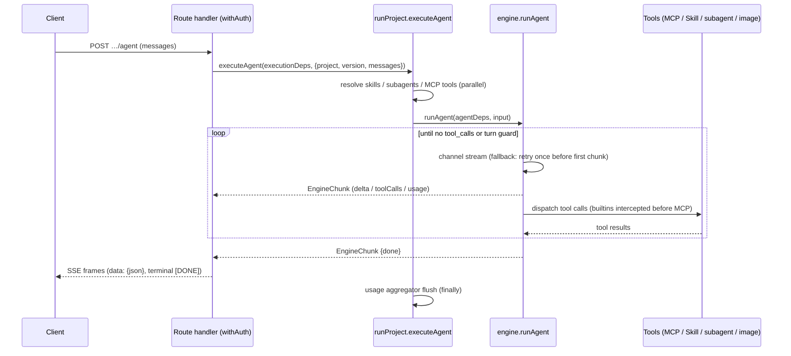

# Agent Studio Architecture

Agent Studio is a production-level single Next.js 16 full-stack application. It covers the domains: **project, llm, agents
(subagents + external agent registry), skills, mcp, chat, cost/usage**.

**Where to start**: read this file top-to-bottom, then trace one request through the code —
execution starts at `src/application/execution/runProject.ts` (the facade every entry point
calls) and descends into `src/application/llm/engine.ts` (the tool loop; see its
`AGENTS.md` for the loop invariants). The [Request Flow](#request-flow-execution) section
below is the map.

## Stack

- Node.js 22, pnpm 11 (`packageManager` pinned)
- Next.js 16 App Router, React 19, TypeScript strict
- Tailwind CSS v4 (CSS-first config via `@import "tailwindcss"` — no tailwind.config file)
- Better Auth 1.6 + Google OAuth (custom DynamoDB adapter)
- AWS DynamoDB Single Table Design

## Clean Architecture Layers

```
src/
  domain/           # Entities + repository ports. Pure TS. No framework/AWS imports.
    project/  llm/  chat/  skill/  mcp/  agent/  usage/  settings/  trace/
  application/      # Use cases. Depends on domain ports only.
  infrastructure/   # Adapters (app-facing code reaches them via the composition root).
    db/             # Single-table client, key builders, repositories
    llm/            # OpenAI-compatible provider channels, streaming
    mcp/            # MCP HTTP client
    a2a/  slack/  github/  storage/  net/  crypto/   # A2A client, Slack, skills-repo sync, S3 image store, SSRF guard, AES
  app/              # Next.js App Router: pages + route handlers (presentation)
    api/            # Route handlers call application use cases, never repositories directly
  components/       # Shared React components
  lib/              # Cross-cutting glue: composition root (container.ts), auth/session,
                    # config + runtime-settings, SSE helpers
```

Dependency rule: `app → application → domain ← infrastructure`. Route handlers and pages must
not import from `infrastructure/` directly except through the composition root
(`src/lib/container.ts`), which wires ports to adapters. `src/lib` is a cross-cutting leaf
both application and infrastructure may import (config, runtime-settings, session); domain
must never import it. Application code receives its dependencies — it must not import the
composition root (`container.ts`) itself.

Composition is distributed across a few deliberate wiring sites: `src/lib/container.ts`
(repositories + `executionDeps`/`imageDeps` — including the required LLM/image channels, so
a missing injection is a type error rather than a silent network call),
`src/application/{agent,mcp,skill,settings}/index.ts` (each slice instantiates its
`createXUseCases(repo)` singleton — agent/mcp/skill share the registry CRUD core,
settings has its own use cases), `src/app/api/chats/_deps.ts` (the `ChatDeps` bag), and
`src/app/api/slack/events/_lib/` (the `SlackEventDeps` bag: bound `runAgent` + the
`SlackClientPort`, mirroring `ChatDeps`). Three DI styles are in use on purpose: factory
`createXUseCases(repo)` for registry slices (their shared CRUD core lives in
`src/application/registry/registryUseCases.ts`), free functions taking the repo as the
first argument for the project slice, and deps-bag interfaces (`ChatDeps`,
`ExecutionDeps`, `SlackEventDeps`) for execution paths. New slices should prefer factory
or deps-bag.

## DynamoDB Single Table Design

One table (env `DYNAMODB_TABLE_NAME`, default `agent-studio`), keys `PK` (S) / `SK` (S),
GSIs: `GSI1` (`GSI1PK`/`GSI1SK`), `GSI2` (`GSI2PK`/`GSI2SK`). All items carry `entityType`.

| Entity | PK | SK | GSI1PK | GSI1SK |
|---|---|---|---|---|
| Auth (better-auth model rows) | `AUTH#{model}#{id}` | `ITEM` | `AUTH#{model}` | `{id}` |
| Auth unique lock (email, token, ...) | `AUTHUNIQUE#{model}#{field}#{value}` | `LOCK` | — | — |
| Project | `PROJECT#{name}` | `META` | `TYPE#PROJECT` | `{name}` |
| Project version | `PROJECT#{name}` | `VERSION#{versionName}` | — | — |
| Chat | `CHAT#{chatId}` | `META` | `CHATOWNER#{email}` | `{updatedAt ISO}` |
| Chat message | `CHAT#{chatId}` | `MSG#{seq zero-padded 6}` | — | — |
| Skill | `SKILL#{name}` | `META` | `TYPE#SKILL` | `{name}` |
| MCP server | `MCP#{name}` | `META` | `TYPE#MCP` | `{name}` |
| External agent (registry) | `AGENT#{name}` | `META` | `TYPE#AGENT` | `{name}` |
| Usage (daily per project) | `USAGE#{projectName}` | `DATE#{yyyy-MM-dd}` | `USAGEDATE#{yyyy-MM-dd}` | `{projectName}` |
| Slack event dedup | `SLACKEVENT#{eventId}` | `META` | — | — |
| A2A task (inbound) | `A2ATASK#{projectName}#{taskId}` | `META` | — | — |
| Trace | `TRACE#{traceId}` | `META` | `TRACEPROJECT#{projectName}` | `{createdAt ISO}#{traceId}` |
| Trace deletion reference | `PROJECT#{name}` | `TRACE#{createdAt}#{traceId}` | — | — |
| App settings (env overrides) | `SETTINGS#app` | `META` | — | — |

Conventions:
- Published version is a pointer attribute `publishedVersion` on the project `META` item, not a copy.
- Chat META owns an atomic `nextSeq`; message rows use conditionally-created sequence keys.
- Auth unique fields are claimed transactionally with a dedicated lock item. GSI2 remains
  a compatibility lookup for rows created before unique locks were introduced.
- Trace creation transactionally writes a project-partition deletion reference; project
  deletion marks the project first, preventing new versions/traces before child cleanup.
- Usage rows are updated with atomic `ADD` per model: `calls.{model}`, `inputTokens.{model}`,
  `outputTokens.{model}`, `costUsd.{model}` — two-step update: `SET … if_not_exists` to
  materialise the maps, then `ADD calls.#model :calls, …` on the nested number attrs.
- Row retention (`src/infrastructure/db/ttl.ts`): trace, usage, chat/message, and inbound A2A
  task rows carry a unix-seconds `expiresAt` (the table's TTL attribute, shared with Slack
  dedup rows) so the single table does not grow without bound. Retention runs from the trace
  `createdAt`, the usage `date`, the chat's last activity / a message's `createdAt`, and the
  A2A task's last write; a trace and its deletion reference share one expiry so the ref never
  dangles. Windows default to 30 / 400 / 180 / 1 days and are overridable via
  `TRACE_RETENTION_DAYS` / `USAGE_RETENTION_DAYS` / `CHAT_RETENTION_DAYS` /
  `A2A_TASK_RETENTION_DAYS`. Because the physical TTL purge is only eventually consistent, reads
  also filter out already-expired rows. Enable TTL on `expiresAt` on the prod table
  (`scripts/init-local-table.ts` does this for local).
- Key builders live in `src/infrastructure/db/keys.ts` — never hand-write key strings elsewhere.
- List queries paginate: most through `queryAll()` (`src/infrastructure/db/query.ts`) — a Query
  page caps at 1MB, so an unpaginated list silently truncates. `chatRepository` runs its own
  `LastEvaluatedKey` loops; `traceRepository` is intentionally bounded top-N via `Limit`.

Why one table and two GSIs: primary-key access covers everything item-scoped (a project and
its versions share a partition; a chat and its messages share a partition). `GSI1` serves
the heterogeneous "list by kind" patterns — `TYPE#*` catalog listings (projects, skills,
MCPs, agents), `CHATOWNER#{email}` (a user's chats ordered by recency), `USAGEDATE#{date}`
(cross-project daily cost for the dashboard), and `TRACEPROJECT#{name}`. `GSI2` exists
solely for Better Auth unique-field lookups (email/token → auth row).

## Request Flow (Execution)

Six execution entry points converge on the facade functions in
`src/application/execution/runProject.ts` — the composition point that resolves a version's
skills/MCP tools/subagents from repositories, assembles the injected engine deps, and
records usage. To trace any request, start there.

| Entry point | Caller | Facade used |
|---|---|---|
| Predict | `POST …/predict` | `executeVersion` / `executeVersionStream`; image projects → `generateImage` |
| OpenAI-compatible | `POST …/chat/completions` | `executeProjectStream` (stream); `executeVersion` / `collectRun(executeAgent)` (non-stream) |
| Agent SSE | `POST …/agent` | `executeAgent` |
| Chat | `POST /api/chats/[chatId]/messages` | `executeAgent` (bound as `ChatDeps.runAgent` in `app/api/chats/_deps.ts`) |
| Slack | `/api/slack/events/[project]` → `handleSlackEvent` | `executeAgent` (via `SlackEventDeps`) |
| A2A | `POST /api/a2a/[name]` → executor | `executeProjectStream` |

`executeProjectStream` is the canonical projectType → strategy dispatch (`agent` runs the
multi-turn tool loop, anything else streams a single-shot completion). New entry points
should call it instead of re-encoding that decision.



### EngineChunk contract

`EngineChunk` (`src/domain/llm/types.ts`) is the wire unit between the engine and every
consumer (chat persistence, Slack, OpenAI reshaping, A2A, the browser client). Top-level
chunks carry **no `author`**; only subagent chunks are authored (stamped by the
`runSubagent` wrapper with the subagent's name). `isTopLevelChunk()` is the single owned
predicate — consumers must use it instead of re-deriving author semantics.

| Field | Emitted by | Consumed by |
|---|---|---|
| `delta.content` / `delta.reasoningContent` | engine per stream delta (PII-restored) | top-level only: chat persistence, Slack text, OpenAI chunks, A2A artifact, client answer bubble |
| `delta.toolCalls` | engine when a turn requests tools (display args) | client tool-call rendering; Slack progress indicator |
| `toolResult` | engine after each tool finishes | chat tool rows (UI-only, not replayed), client tool panel |
| `image` | GenerateImage builtin | chat image persistence (S3), Slack upload, client gallery |
| `usage` | engine once per model call | `collectRun` response usage; DB recording is separate (`recordUsage` / aggregator inside the engine loop) |
| `error` | engine on failure (mid-stream — no retry) | every consumer surfaces it and stops |
| `done` | engine when the loop ends without tool calls | OpenAI `finish_reason`, client finalize |
| `author` | subagent chunks only | consumers filter via `isTopLevelChunk`; client shows an author badge |

## Error Handling

Two deliberate strategies coexist:

- **HTTP path (before a stream starts)**: use cases throw `AppError` subclasses
  (`src/application/errors.ts` — Validation/NotFound/Forbidden/Conflict; chat adds `Chat*`
  subclasses extending the same base). Route handlers map any thrown error through
  `apiError` (`src/app/api/_lib/http.ts`); `parseName` validates `[name]` params as slugs
  by throwing `ValidationError`. The registry slices share this contract via
  `createRegistryUseCases` (`src/application/registry/registryUseCases.ts`): missing →
  `NotFoundError`, duplicate create → `ConflictError`, SSRF-blocked URL at the write
  boundary → `ValidationError` (`assertAllowedUrl` wraps the infrastructure `SsrfError`,
  which stays layer-local).
- **In-stream path (after the first chunk)**: failures are values, not exceptions — the
  engine yields an `{error}` chunk (no retry mid-stream), subagent failures yield an
  authored error chunk, and dispatch guards degrade instead of failing the run (an
  SSRF-blocked or unreachable MCP server is skipped with a warning; a hung MCP request
  aborts after 120s and becomes a tool-error string the model can react to).

## Domain Semantics

### Project / Version
- `Project { name (slug, immutable id), displayName, description,
  projectType: 'llm' | 'agent' | 'image', ownerEmail, departmentCode?,
  publishedVersion?, slack? (per-project Slack bot credentials, AES-encrypted),
  createdAt, updatedAt }`
- `Version { versionName, systemPrompt, userPromptTemplate, model, fallbackModel?, parameters
  (temperature, maxTokens, reasoningEffort?, piiFiltering, structuredOutput?/jsonSchema,
  imageGeneration?/imageModel?), mcpList: string[], skillList: string[],
  subagentList: {name, type:'local'|'remote'}[], maxTurn?, createdAt }`
- Template variables `{{var}}` rendered server-side before dispatch.
- Version writes validate capability fit for catalog models (agent projects require
  `capabilities.tools`; `structuredOutput` requires the capability); unknown/custom model
  ids stay allowed with a warning ($0 cost until added to the catalog).
- Which version a run executes is owned by `resolveRunnableVersion`
  (`src/application/project/resolveRunnableVersion.ts`): the published pointer always
  wins; only interactive surfaces (chat) opt into falling back to the newest draft;
  external surfaces (Slack, A2A, subagent transfers) are published-only so drafts never
  leak.

### LLM Engine (`src/application/llm/engine.ts` — public contract)
- All text generation speaks the OpenAI Chat Completions protocol; model ids are
  `provider/model` (e.g. `openai/gpt-5-mini`, `google/gemini-3.1-flash-lite`). By default
  every id goes to the `LLM_BASE_URL` channel; per-provider channels (runtime-settings
  override, else `LLM_PROVIDER_<PROVIDER>_*` env) route by the id's provider prefix
  (`src/infrastructure/llm/channel.ts`).
- `runPrompt(input): Promise<RunResult>` — single-shot; supports streaming via
  `runPromptStream(input): AsyncGenerator<EngineChunk>`.
- `runAgent(input): AsyncGenerator<EngineChunk>` — recursive multi-turn tool loop:
  - turn guard `currentTurn >= maxTurn` (default 50) stops the loop
  - all tool_calls of one response aggregate into ONE assistant message, then tool results
    append, then recurse with `turn + 1`
  - builtin tools intercepted before MCP dispatch: `Skill` (progressive skill loading),
    `transfer_to_agent` (subagent transfer — local recursion or remote agent HTTP call;
    budget guard `turn + 2 >= maxTurn` rejects transfer), `GenerateImage` (image
    generation via the injected `generateImage` dep; results persist to S3 when configured).
    `generateImage` is injected only when the version opts in via
    `parameters.imageGeneration: true`; the model is `parameters.imageModel` when set and
    still image-capable, else the registry's default image model
  - subagent transfer passes ONLY the model-written `message` (no parent history);
    child's final text returns as a "For context: ..." user message
  - top-level chunks are unauthored; subagent chunks carry `author` (see the
    EngineChunk contract above)
- Fallback: on 429/5xx from the primary model **before the first chunk**, retry once with
  `fallbackModel`; a mid-stream failure yields an `{error}` chunk and does not retry.
- PII filtering: when `parameters.piiFiltering` is true, emails and phone numbers in
  outbound messages/variables are regex-masked with reversible format-preserving
  `[[PII:…]]` tokens before dispatch (`src/application/llm/pii.ts`); originals are
  restored in responses — streaming included (token-boundary buffering) — and the mapping
  carries across subagent transfers, while tool args/results re-entering engine context
  stay masked. Best-effort (regex; emails + phones only). Off = byte-identical to the
  unfiltered path.
- Cost: computed from registry pricing at the call site (`calculateCost` /
  `calculateImageCost` in `src/domain/llm/models.ts`) and passed to `recordUsage`, which
  hands it to the usage repository's atomic ADD into the daily usage row. Single-shot runs
  record per call; agent runs buffer per-turn usage in `createUsageAggregator` and flush
  once at run end.
- Model registry `src/domain/llm/models.ts`: `ModelConfig { id, provider, displayName,
  pricing { inputPer1M, outputPer1M, cachedInputPer1M?, imageInputPer1M?,
  imageOutputPer1M?, perImage? }, capabilities { tools, structuredOutput, imageInput,
  reasoning, reasoningWithTools?, imageGeneration? }, contextWindow, maxTokens, hidden? }`.

### Skills
- Skill = markdown behavior instructions (progressive disclosure): system prompt lists
  name+description table only; model calls builtin `Skill` tool to load the SKILL.md body,
  or a specific attachment via `file_path`.
- Stored in table: `Skill { name, description, content (markdown), files? ({ path, content }[]),
  source?, createdAt, updatedAt }` — `source` marks skills synced from the skills repo
  (e.g. `github:owner/repo`); `files` are attachment files collected under the skill root.
- Sync collects supported text attachments (`src/domain/skill/files.ts`:
  `ALLOWED_SKILL_FILE_EXTENSIONS`) under each `SKILL.md` directory, bounded by per-file /
  per-skill / file-count caps and excluding symlinks; `file_path` is normalized and confined
  to the skill root (no absolute paths, `..`, or cross-skill access). Replacing the skill
  item on re-sync drops stale attachments; skipped files are reported with reasons.

### MCP
- `McpServer { name, url, description?, headers: Record<string,string> (values encrypted
  at rest AES-256-GCM `enc:v1:` prefix, masked on read — length-preserving, revealing the
  first/last 2 chars of values ≥20 chars), createdAt, updatedAt }`
- `url` is SSRF-guarded (`src/infrastructure/net/ssrfGuard.ts`) at registration and dispatch:
  non-http(s) schemes and private/loopback/link-local/metadata addresses are rejected.
- Tool loading via MCP streamable HTTP (`tools/list`, `tools/call` JSON-RPC). Tool name
  collisions get `_1/_2` suffix aliases with reverse mapping. Tool results capped at
  100,000 chars.
- Agent runs append a "Connected MCP Servers" table (server name, description, aliased
  tool names) to the system prompt so the model knows which server a tool group belongs
  to; servers that are unreachable or expose no tools are omitted.

### External Agents (registry, A2A-lite)
- `ExternalAgent { name, url (OpenAI-compatible or agent endpoint), protocol? ('openai' |
  'a2a', absent = openai), description, headers (encrypted like MCP), createdAt, updatedAt }`
  — usable as `type:'remote'` subagents. `url` is SSRF-guarded like MCP.

### Chat
- `Chat { chatId, title, ownerEmail, projectName?, createdAt, updatedAt }`,
  messages append-only with `seq`. Chat execution uses the agent engine directly
  (no HTTP self-call), streams SSE to the client.
- `ChatMessage` is a discriminated union on `role` (`user` | `assistant` | `tool`) —
  a tool row always carries `toolCallId`, an assistant row may carry
  `toolCalls`/`images`, and illegal combinations are unrepresentable.

### Usage / Cost
- Daily per-project per-model aggregates (see table design). Dashboard reads
  `USAGEDATE#{date}` GSI partitions across a range and regroups client-side by
  project/provider/model.

## API Surface (App Router route handlers)

Request/response shapes, auth, and error cases: see [API.md](API.md).

```
POST /api/projects                          create
GET  /api/projects                          list
GET|PUT|DELETE /api/projects/[name]
GET|POST /api/projects/[name]/versions
GET|PUT|DELETE /api/projects/[name]/versions/[version]
POST /api/projects/[name]/publish           set publishedVersion
GET  /api/projects/[name]/traces            trace list (owner-only)
GET  /api/projects/[name]/traces/[traceId]  trace detail (owner-only)
POST /api/projects/[name]/versions/[version]/predict        (version = name | 'published')
POST /api/projects/[name]/versions/[version]/chat/completions   OpenAI-compatible
POST /api/projects/[name]/versions/[version]/agent          SSE stream
GET|PUT|DELETE /api/projects/[name]/slack   per-project Slack bot, owner-only (+ POST …/slack/test)
GET  /api/projects/[name]/a2a               project A2A exposure status
GET|POST /api/skills, /api/mcps, /api/agents (+ [name] GET|PUT|DELETE)
GET|POST /api/skills/sync                   skills-repo sync status / run
POST /api/mcps/[name]/tools                 MCP connection test
POST /api/agents/[name]/message             external-agent test message
GET|POST /api/chats, GET|DELETE /api/chats/[chatId]
POST /api/chats/[chatId]/messages           streams SSE
GET|PUT /api/settings                       admin runtime overrides
GET  /api/usages/summary?from&to
GET  /api/models
GET  /api/a2a                               A2A-published project list
GET  /api/a2a/[name]/.well-known/agent-card.json   public Agent Card
POST /api/a2a/[name]                        JSON-RPC, gated by X-A2A-Key
POST /api/slack/events/[project]              project Slack webhook
GET|POST /api/auth/[...all]                  Better Auth login flow (Google OAuth)
GET  /api/health                            liveness (static 200)
GET  /api/ready                             readiness (DynamoDB + LLM reachability)
```

All routes require a Better Auth session except the unauthenticated endpoints:
`/api/auth/*` (the Better Auth login flow itself), `/api/health`, `/api/ready`,
`/api/slack/events/*` (verified by signing secret), `POST /api/a2a/[name]`
(gated by `A2A_API_KEY`), and the public Agent Card GET.
`/api/health` is liveness — a static 200 answering "is the process serving". `/api/ready`
is readiness — it probes DynamoDB and the LLM channel for reachability (short timeout,
details not surfaced) and returns 503 when a downstream is unreachable or the instance is
draining after SIGTERM (`src/lib/lifecycle.ts`), so the load balancer deregisters it while
in-flight work drains. Point the LB health check at `/api/ready`, restart checks at
`/api/health`. Projects are a shared catalog: any signed-in user may read and run any
project, but mutations (update/delete/publish, version create/update, Slack config) are
owner-only — `assertProjectOwner` returns 403 for non-owners. Two project sub-resources
that expose other users' data are owner-only *reads* as well: traces (runtime
inputs/outputs) and the Slack config (masked bot token / signing secret + manifest).
MCP/agent/skill registries are shared: reads are open to any signed-in user, while
mutations go through
`withAdminAuth` and are restricted to the effective admin list when set (unset allows any
signed-in user).

Runtime settings: the admin-only `/settings` page stores overrides for selected env vars
(admin/allowed-domain lists, default LLM channel, per-provider LLM channels, skills repo,
A2A key, public base URL) in the `SETTINGS#app` item.
`src/lib/runtime-settings.ts` resolves effective values — DB override → env fallback —
through an in-memory cache (30s TTL, invalidated on write; single-instance assumption).
Secret overrides are AES-encrypted at rest and decrypted for outbound dispatch (and at read
only to reveal the first/last 2 chars of long values in the admin masked view); a stored
provider list replaces the whole `LLM_PROVIDER_*` env set. Bootstrap env (`AES_ENCRYPTION_KEY`,
Better Auth, Google OAuth, DynamoDB, `STAGE`) stays env-only. SSE responses use
`text/event-stream` with `data: {json}\n\n` framing and a terminal `data: [DONE]`.

## Auth

Better Auth 1.6, Google OAuth only, custom DynamoDB adapter over the single table
(`src/lib/auth-adapter.ts`). Session read helper `getSessionUser()` in `src/lib/session.ts`;
route handlers wrap themselves in `withAuth(...)`, which returns a 401 `Response` when
there is no session and otherwise passes the `SessionUser` as the handler's first argument.

## UI Pages

```
/                     dashboard when signed in, landing page otherwise
/projects             project catalog (cards)
/projects/[name]      orchestration playground (prompt editor, model picker, run/stream)
/projects/[name]/versions | settings | usage
/chats  /chats/[chatId]
/skills  /tools (MCP)  /agents
/dashboard            cost dashboard (range picker, group by project/provider/model)
/settings             admin-only runtime env-var overrides
```

UI text is in English. Tailwind v4 utilities provide the structural styling. The header
offers system/light/dark themes backed by a root class and browser-local preference;
system mode follows `prefers-color-scheme`. Inline styles are limited to runtime-derived
chart colors and bar widths.

## Glossary

The word "agent" is overloaded; these are the distinct concepts:

- **agent project** (`projectType: 'agent'`) — a studio project that runs the multi-turn
  tool loop.
- **subagent** (`SubagentRef` on a version) — another project (local) or registry agent
  (remote) a run can transfer to via the `transfer_to_agent` builtin.
- **external agent** (`ExternalAgent`) — a registry entry for an outside endpoint
  (OpenAI-compatible or A2A), usable as a remote subagent.
- **MCP server** (`McpServer`, the `/tools` UI page) — a registered MCP endpoint whose
  tools the engine can call; "tools" alone refers to the OpenAI tool-calling mechanism.
- Invocation verbs: routes say **predict**, the facade says **execute**
  (`executeVersion`/`executeAgent`/`executeProjectStream`), the engine says **run**
  (`runPrompt`/`runAgent`). Same pipeline, three altitude levels.

## Environment

See `.env.example`. `STAGE` = local | alpha | prod. Local DynamoDB via
`DYNAMODB_ENDPOINT_URL=http://localhost:8000`; `scripts/init-local-table.ts` creates the
table + GSIs.

## Verification

- `pnpm typecheck` (tsc --noEmit, strict) and `pnpm build` must pass.
- `pnpm test` runs Vitest unit tests (engine loop & fallback, cost calc, template rendering,
  Slack verification/dedup, SSRF guard, settings, and more — see `tests/`).
