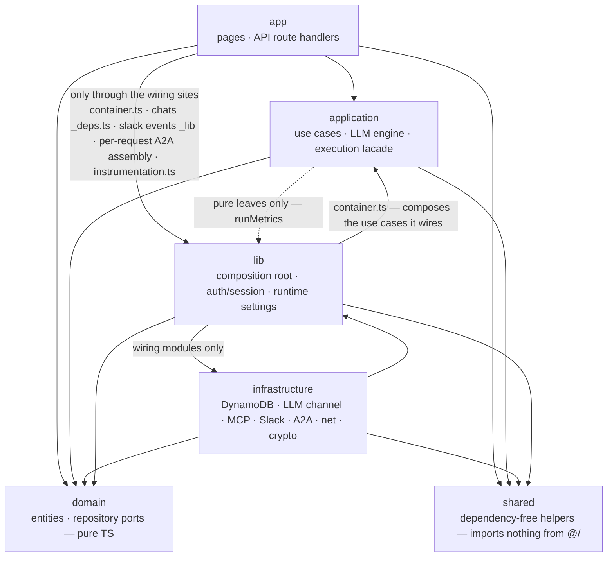
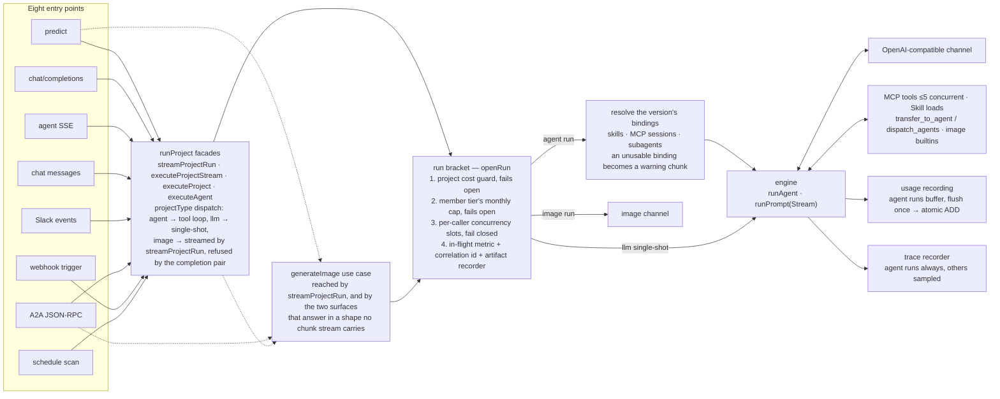
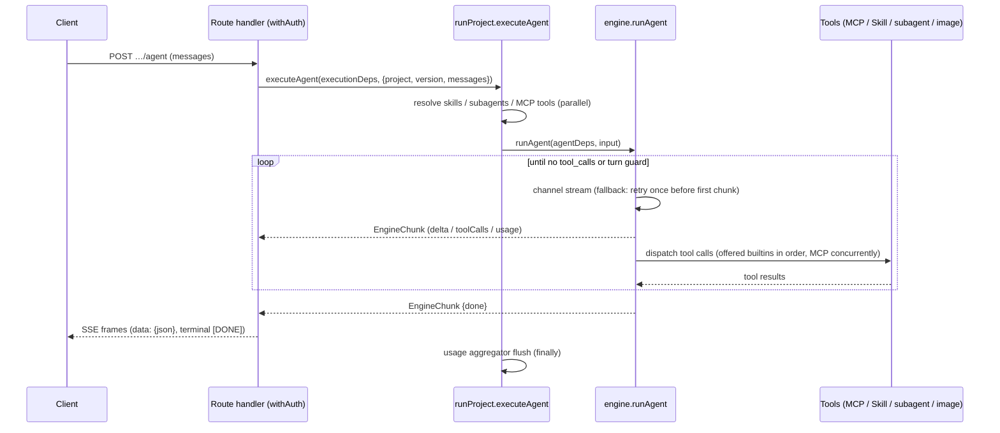
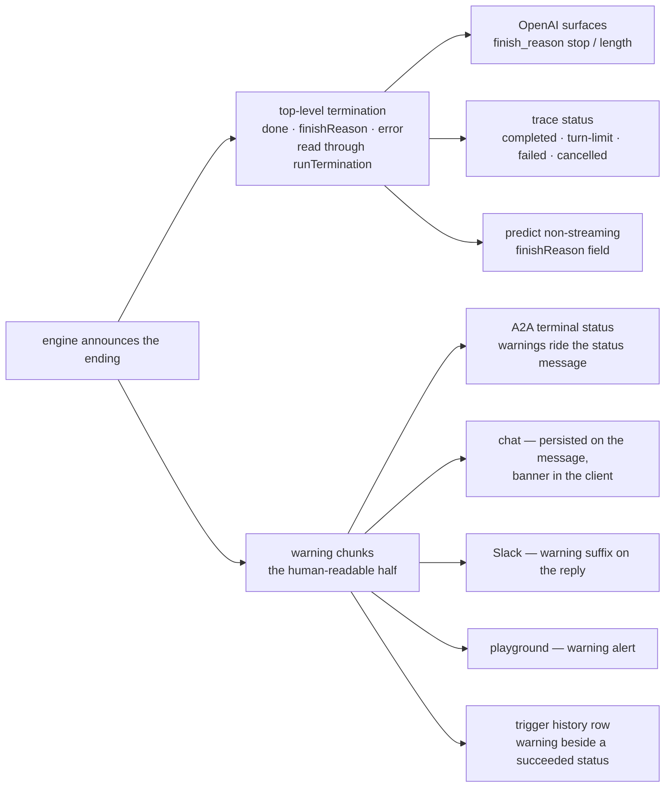

# Architecture

**The shape every run passes through**, and why it has that shape — the layers, the one
table, the path from an entry point to the engine, and how a failure travels back out. It is
the document to read before changing code.

What each *subsystem* decides is one file each in [`design/`](design/), indexed under
[Subsystems](#subsystems) below. This file is what they all sit inside.

It deliberately does *not* cover: the HTTP contract ([API.md](API.md)), environment variables
([CONFIGURATION.md](CONFIGURATION.md)), deployment and observability
([OPERATIONS.md](OPERATIONS.md)), or the security model ([SECURITY.md](SECURITY.md)).

**Where to start**: read this file top-to-bottom — it is short enough to — then trace one
request through the code. Execution starts at `src/application/execution/runProject.ts` — the
facade every entry point calls, an [image](design/execution.md#images) project excepted — and
descends into `src/application/llm/engine.ts`, the tool loop. The
[Request flow](#request-flow) section is the map.

AgentDure is a single Next.js 16 full-stack application covering the domains **project,
llm, agents (subagents + external agent registry), skills, mcp, chat, cost/usage**.

## Stack

- Node.js 24, pnpm 11 (`packageManager` pinned)
- Next.js 16 App Router, React 19, TypeScript strict (`noUncheckedIndexedAccess`)
- Mantine 9 (`@mantine/core` + hooks/form/notifications/charts, `@tabler/icons-react`)
- Better Auth 1.6 + Google OAuth (custom DynamoDB adapter)
- AWS DynamoDB single-table design

## Layers

```
src/
  domain/           # Entities + repository ports. Pure TS. No framework/AWS imports.
    project/  llm/  chat/  skill/  mcp/  agent/  usage/  settings/  trace/
    execution/  security/  slack/  trigger/  sync/  audit/  plugin/  member/
    a2a/  catalog/  vector/  artifact/  net/
  application/      # Use cases. Depends on domain ports only, and never on the
                    # composition root — deps are injected, never pulled.
    llm/            # The engine: tool loop, agent-run assembly, tool-result budgets,
                    # PII masking, context budget, document parts
    execution/      # The facades, binding + MCP tool resolution, subagents, the image tool
    run/            # What wraps a top-level run: the bracket, the concurrency guard,
                    # the unknown-model policy, trace lifecycle
    chat/  slack/  a2a/  trigger/  image/
                    # The surfaces that drive a run, and the image path
    artifact/       # What a run left behind: the one row writer, capture at the bracket,
                    # signed-URL lifetimes
    audit/          # The one writer of an audit row, and reading the trail back
    catalog/        # The capability index: reindex, search, query-embedding cache
    project/  registry/  skill/  mcp/  agent/  usage/  trace/  settings/  health/
    plugin/  member/
  infrastructure/   # Adapters (app-facing code reaches them via the composition root).
    db/             # Single-table client, key builders, repositories
    llm/            # OpenAI-compatible provider channels, streaming
    mcp/            # MCP HTTP client, session, discovery cache
    vector/         # The S3 Vectors store the capability catalog is indexed into
    a2a/  agent/  slack/  github/  storage/  net/  crypto/  health/  telemetry/
                    # A2A + external-agent clients, Slack, the plugins-repo client,
                    # the S3 artifact store, SSRF guard, AES, readiness probes,
                    # OTel trace export
  app/              # Next.js App Router: pages + route handlers (presentation)
    api/            # Route handlers call application use cases, never repositories directly
      _lib/         # Route-handler glue: SSE framing, `apiError`, body size limits
    _components/    # The shared UI kit: CardGrid, HeaderRows, form styles, code blocks,
                    # copy buttons. A piece of UI that repeats across pages belongs here,
                    # with one owner
    _lib/           # Browser-side glue the pages share: the transfer chains a chunk came
                    # from, attachment composers, tool-call display, the viewer hook
    _i18n/          # The two message catalogues (en.ts is the source of truth) and the
                    # locale cookie the console is served in
  components/       # App chrome: the header the root layout mounts (theme toggle, user
                    # menu), and the landing page's sign-in button
  lib/              # Cross-cutting glue: composition root (container.ts), auth/session,
                    # the viewer flags the console gates on (viewer.ts), config +
                    # runtime-settings, public URLs, run metrics
  shared/           # Dependency-free helpers (dates, slugs, timeouts, PKCE, constant-time
                    # compare, logger). The bottom of the graph: imports nothing from `@/`
  proxy.ts          # The page sign-in gate, and the single owner of which pages are public
  instrumentation.ts
                    # Boot, before the server accepts connections: fail-fast config
                    # validation, shutdown signal handlers, the audit sink, and the
                    # managed-MCP repair sweep
```

The last two are modules, not layers: they are what runs *around* a request rather than in
one, and each is owned elsewhere — [SECURITY.md](SECURITY.md#two-gates-on-purpose) for the page
gate, [CONFIGURATION.md](CONFIGURATION.md#boot-time-validation) and
[OPERATIONS.md](OPERATIONS.md#draining) for what boot checks and how the process winds down.

**Dependency rule: `app → application → domain ← infrastructure`.**

- `domain` imports nothing from `@/` beyond `domain` — no framework, no AWS SDK, no auth
  library, not even `shared`.
- `application` receives its dependencies. It must never import the composition root: deps
  are *injected*, never pulled. Third-party packages are banned from it the same way, and by
  the same shape of rule as `domain`'s — stated positively, as **the domain and the standard
  library and nothing else**, because a blocklist only names the dependencies somebody
  already regretted. `@a2a-js/sdk` is the one named exception: the A2A protocol *is* the
  contract its executor implements, and a port would restate the task lifecycle in our own
  types to gain nothing.
- `infrastructure` imports no `application` and no `app`, and reads no `process.env` — a
  setting an adapter needs is declared in `lib/config.ts`, which owns the parse and the
  warning. Read at module scope it would be a process-wide constant nothing declared, nobody
  injected, and the boot validation never checked.
- `src/lib` is a cross-cutting leaf both application and infrastructure may import (config,
  runtime-settings, session); `domain` never does.
- Route handlers and pages must not import `infrastructure/` directly — only through a
  wiring site.



### Composition, in a few deliberate places

Composition is distributed rather than centralised in one file, because the three execution
surfaces need genuinely different bags. **Five sites compose use cases over adapters, and no
others may.** Three `lib` modules besides the composition root reach an adapter directly —
`auth.ts` (the Better Auth storage adapter), `runtime-settings.ts` and `memberAccess.ts` (each
fronting one repository behind a cache) — and `tests/architecture.test.ts` names exactly those
as `lib`'s wiring modules; every other `lib` file is a leaf.

| Wiring site | Wires |
|---|---|
| `src/lib/container.ts` | Repositories; the domain ports (`SecretCipher`, `UrlPolicy`, `RemoteAgentDispatcher`, `McpToolProbe`, `McpSessionFactory`); every use-case singleton — the three registry slices (`skillUseCases` / `mcpUseCases` / `agentUseCases`) plus the ones layered beside them (managed MCP, MCP OAuth, triggers, settings); `executionDeps` / `imageDeps` / `triggerRunnerDeps` — including the required LLM and image channels, so a missing injection is a type error rather than a silent network call |
| `src/app/api/chats/_deps.ts` | The `ChatDeps` bag (bound `runAgent` + repositories) |
| `src/app/api/slack/events/_lib/` | The `SlackEventDeps` bag (bound `runAgent` + `SlackClientPort`), mirroring `ChatDeps` |
| `src/app/api/a2a/[name]/route.ts` | Per-request A2A assembly: the SDK's request/transport handlers around `ProjectA2aExecutor` over `executionDeps` — per request because the handler is built around one project's card |
| `src/instrumentation.ts` | The boot path: the audit sink over `auditRepository`, and the managed-MCP resume. A wiring site by construction — the composition root itself is not loaded until this file decides the runtime is the Node server, and the audit sink has to be wired on the **awaited** boot path (see [Audit records](design/observability.md#audit-records)) |

Two DI styles are in use on purpose:

- **Factory** `createXUseCases(...)` for the registry slices — their shared CRUD core lives
  in `src/application/registry/registryUseCases.ts` — and for the project slice
  (`createProjectUseCases`, `createVersionUseCases`), whose free functions taking the repo as
  the first argument stay exported for application modules that already hold one; a route
  takes the bound object.
- **Deps-bag interfaces** (`ChatDeps`, `ExecutionDeps`, `SlackEventDeps`) for execution paths.

New slices should use one of the two.

### The rules are mechanical, not aspirational

`tests/architecture.test.ts` enforces every layer rule above with an **empty allowlist**,
plus a set of named **single-owner invariants** that fail when a second copy of a decision
appears — and also when the owner *loses* the definition, which would otherwise read as a
pass. The owner list is [OWNERSHIP.md](OWNERSHIP.md).

The single-owner rules exist because this is the failure the codebase actually kept hitting:
`McpTool` reached four definitions that had already drifted apart, the DynamoDB
conditional-write error name was spelled out at seven call sites — only one of which handled
the transactional form — and the image-usage collapse was derived independently four times.

**Adding a violation is not quietly possible. Fix the import; do not widen the rule.**

## DynamoDB single-table design

One table (`DYNAMODB_TABLE_NAME`, default `agentdure`), keys `PK` (S) / `SK` (S), with
`GSI1` (`GSI1PK`/`GSI1SK`) and `GSI2` (`GSI2PK`/`GSI2SK`). All items carry `entityType`.

| Entity | PK | SK | GSI1PK | GSI1SK |
|---|---|---|---|---|
| Auth (better-auth model rows) | `AUTH#{model}#{id}` | `ITEM` | `AUTH#{model}` | `{id}` |
| Auth unique lock (email, token, …) | `AUTHUNIQUE#{model}#{field}#{value}` | `LOCK` | — | — |
| Project | `PROJECT#{name}` | `META` | `TYPE#PROJECT` | `{name}` |
| Project version | `PROJECT#{name}` | `VERSION#{versionName}` | — | — |
| Project API token | `PROJECT#{name}` | `APITOKEN` | — | — |
| Project MCP OAuth connection | `PROJECT#{name}` | `MCPCONN#{server}` | — | — |
| MCP OAuth authorization in flight | `MCPOAUTH#{state}` | `META` | — | — |
| Trigger (webhook / schedule) | `PROJECT#{name}` | `TRIGGER#{triggerId}` | schedule only: `TYPE#SCHEDULE` | schedule only: `{name}#{triggerId}` |
| Trigger run (delivery / firing) | `PROJECT#{name}` | `TRIGGERRUN#{triggerId}#{startedAt}#{runId}` | — | — |
| Trigger dedup claim (`Idempotency-Key` / `schedule:{instant}`) | `TRIGGERIDEM#{name}#{triggerId}#{key}` | `META` | — | — |
| Chat | `CHAT#{chatId}` | `META` | `CHATOWNER#{email}` | `{updatedAt ISO}` |
| Chat message | `CHAT#{chatId}` | `MSG#{seq zero-padded 6}` | — | — |
| Chat run log (replay buffer, short TTL) | `CHAT#{chatId}` | `RUNLOG#{runId}#{seq zero-padded 6}` | — | — |
| Skill | `SKILL#{name}` | `META` | `TYPE#SKILL` | `{name}` |
| MCP server | `MCP#{name}` | `META` | `TYPE#MCP` | `{name}` |
| External agent (registry) | `AGENT#{name}` | `META` | `TYPE#AGENT` | `{name}` |
| Plugin | `PLUGIN#{name}` | `META` | `TYPE#PLUGIN` | `{name}` |
| Plugins-sync report (per source repo) | `PLUGINSYNC#{repo}` | `REPORT` | — | — |
| Plugins-sync lease | `PLUGINSYNC#{repo}` | `LOCK` | — | — |
| Usage (daily per project) | `USAGE#{projectName}` | `DATE#{yyyy-MM-dd}` | `USAGEDATE#{yyyy-MM-dd}` | `{projectName}` |
| Usage (daily per caller) | `USAGE#{projectName}` | `ACTOR#{yyyy-MM-dd}#{kind}:{id}` | — | — |
| Usage monthly-threshold claim | `USAGE#{projectName}` | `MONTHCLAIM#{yyyy-MM}` | — | — |
| Usage (member per day, per project) | `USAGEMEMBER#{email}` | `DATE#{yyyy-MM-dd}#{projectName}` | — | — |
| Run concurrency slot | `RUNSLOT#{kind}:{id}` | `SLOT#{index zero-padded 3}` | — | — |
| Slack event dedup | `SLACKEVENT#{eventId}` | `META` | — | — |
| Slack thread engagement (a thread the bot answered in, or was muted in) | `SLACKTHREAD#{projectName}#{channel}#{threadTs}` | `META` | — | — |
| Artifact (what a run produced; GSI2 `ARTIFACTOWNER#{email}` / `{createdAt ISO}#{artifactId}`, sparse) | `ARTIFACT#{artifactId}` | `META` | `ARTIFACTPROJECT#{projectName}` | `{createdAt ISO}#{artifactId}` |
| A2A task (inbound) | `A2ATASK#{projectName}#{taskId}` | `META` | — | — |
| Remote conversation (outbound A2A `contextId`) | `PROJECT#{name}` | `REMOTECTX#{agentName}#{conversationKey}` | — | — |
| A2A client key | `A2ACLIENT#{name}` | `META` | `TYPE#A2ACLIENT` | `{name}` |
| A2A client key hash (verification) | `A2AKEYHASH#{sha256}` | `META` | — | — |
| Trace | `TRACE#{traceId}` | `META` | `TRACEPROJECT#{projectName}` | `{createdAt ISO}#{traceId}` |
| Trace deletion reference | `PROJECT#{name}` | `TRACE#{createdAt}#{traceId}` | — | — |
| Audit record | `AUDIT#{yyyy-MM-dd}` | `{createdAt ISO}#{eventId}` | — | — |
| App settings (env overrides) | `SETTINGS#app` | `META` | — | — |

**Why one table and two GSIs.** Primary-key access covers everything item-scoped: a project
and its versions share a partition, a chat and its messages share a partition, so a cascade
delete is one query. `GSI1` serves the heterogeneous "list by kind" patterns — `TYPE#*`
catalog listings, `CHATOWNER#{email}` (a user's chats by recency), `USAGEDATE#{date}`
(cross-project daily cost for the dashboard), `TRACEPROJECT#{name}`,
`ARTIFACTPROJECT#{name}`. `GSI2` served Better Auth unique-field lookups alone until artifacts
needed a second axis: `ARTIFACTOWNER#{email}`, written **only** on rows that name a mailbox —
the actor's own for a user or a project token, the asker's resolved address for a Slack run —
so an A2A or trigger artifact is simply absent from that index rather than sitting under a
placeholder (see [Artifacts](design/execution.md#artifacts)).

### Conventions

- **Key strings come from `src/infrastructure/db/keys.ts`.** Never hand-write one elsewhere.
- **A name-keyed registry entity gets its CRUD from `createKeyedRepository`**
  (`keyedRepository.ts`): single-item partition, SK `META`, listed from the
  `TYPE#<entityType>` GSI1 partition, with create / update / delete each conditioned on
  whether the partition already exists. Skills, MCP servers, external agents and plugins share
  it, and only the `toItem`/`fromItem` mappers stay per-repository, because only they carry
  entity-specific fields. It is the storage-side counterpart of the
  [registry use-case core](#composition-in-a-few-deliberate-places) — the three registry
  entities factored at both ends, plus the plugin, whose use case is deliberately not that
  factory (the sync is its only writer).
- The published version is a **pointer attribute** `publishedVersion` on the project `META`
  item, not a copy.
- Chat `META` owns an atomic `nextSeq`; message rows use conditionally-created sequence keys.
- Auth unique fields are claimed transactionally with a dedicated lock item. `GSI2` remains a
  compatibility lookup for rows created before the locks existed, and now also carries the
  sparse artifact-owner index.
- Trace creation transactionally writes a project-partition deletion reference; project
  deletion marks the project first, preventing new versions/traces before child cleanup.
- **Usage rows use atomic `ADD` per model** — `calls.{model}`, `inputTokens.{model}`,
  `outputTokens.{model}`, `cachedTokens.{model}`, `costUsd.{model}` — in two steps:
  `SET … if_not_exists` to materialise the maps, then `ADD` on the nested number attributes.
  A map added after rows exist materialises on each row's next write, so older days read as
  `{}` and are not backfilled. They also carry the cost
  guard's once-per-day notification claims (`alertedAt`, `blockedAt`), taken with a
  conditional write. Those claims live here rather than on the project item because that
  item's `updatedAt` is the optimistic-concurrency condition for every project write — a
  background marker there would fail a concurrent edit — and because a usage row already
  expires on its own date, which retires the marker with it.
- **Rows that grow without bound carry `expiresAt`** (`src/infrastructure/db/ttl.ts`), the
  table's TTL attribute. Retention windows and the requirement to enable TTL on the
  production table are in [OPERATIONS.md](OPERATIONS.md#row-retention).
- **List queries paginate.** Most go through `queryAll()` (`src/infrastructure/db/query.ts`):
  a single Query page caps at 1MB, so an unpaginated list silently truncates. `chatRepository`
  runs its own `LastEvaluatedKey` loops; `traceRepository` is intentionally bounded top-N via
  `Limit` and pulls up to five pages to fill that limit with **live** rows, because DynamoDB
  applies `Limit` before the app-side expired-row filter — bounded, so a partition of expired
  rows cannot turn one list into a scan.

## Request flow

Eight execution entry points converge on `src/application/execution/runProject.ts`, which
answers two separate questions in two tiers.

| Tier | Functions | What it decides |
|---|---|---|
| **Dispatch** — what an entry point calls | `streamProjectRun` for a surface that takes a run as chunks; `executeProjectStream` / `executeProject` for one that answers with a completion; `executeAgent` for the surfaces that only ever run agent projects | which strategy a `projectType` runs |
| **Admit** — what starts a run | `executeVersion` / `executeVersionStream` for the single-shot path, `executeAgent` for the tool loop | the [run bracket](#the-run-bracket); an agent run additionally resolves the version's skills, MCP tools and subagents from repositories, assembles the injected engine deps, and flushes usage at the end |

`executeAgent` is in both tiers — an agent surface calls it directly, and it opens its own
bracket. **Nothing outside this module calls `executeVersion` or `executeVersionStream`**, and
nothing should: arriving at one directly is exactly how a caller skips the `projectType`
dispatch. To trace a request, start at the dispatch tier.

| Entry point | Caller | Facade used |
|---|---|---|
| Predict | `POST …/predict` | `executeProjectStream` (stream) / `executeProject` (non-stream) — so an agent project runs its tool loop here too, and `variables` (which only a prompt template consumes) are ignored for it; image projects → `generateImage`, which edits the request's source `images` when any are sent and generates otherwise |
| OpenAI-compatible | `POST …/chat/completions` | `executeProjectStream` (stream) / `executeProject` (non-stream); an image project is refused with 400 — an image has no chat completion |
| Agent SSE | `POST …/agent` | `executeAgent` |
| Chat | `POST /api/chats/[chatId]/messages` | `executeAgent` (bound as `ChatDeps.runAgent`) |
| Slack | `/api/slack/events/[project]` → `handleSlackEvent` | `executeAgent` (via `SlackEventDeps`) |
| A2A | `POST /api/a2a/[name]` → executor | `executeProjectStream` |
| Webhook trigger | `POST /api/webhook/[project]` → `executeDelivery` | `streamProjectRun` (bound in `container.ts` as `triggerRunnerDeps.run`) — the one dispatch that streams an image project rather than refusing it; a firing's row records that it drew, since the row carries text |
| Schedule trigger | `POST /api/triggers/scan` → `scanSchedules` → `executeFiring` | `streamProjectRun` (same `triggerRunnerDeps.run`) |



The dashed edges are the image branch: every image-capable surface asks `runStrategyFor`
and hands an `image` project to `generateImage` *before* asking the facade, which refuses it.
The bracket admits both paths — it is what wraps a top-level run however it started.

`generateImage` (`src/application/image/generateImage.ts`) sits outside this module but starts
a run the same way — the facade, the predict route and the A2A executor reach it directly,
which is why it joins the admitting functions below. `collectRun`, which drains an
agent stream into one collected answer, stays here, where `executeProject` uses it for the
non-stream agent case.

`executeProjectStream` (and `executeProject`, its non-streaming counterpart) is the
canonical `projectType` → strategy dispatch: `agent` runs the multi-turn tool loop, `llm`
runs a single-shot completion, and an `image` project is refused — its run is the dedicated
`generateImage` use case.

`streamProjectRun` is the same dispatch for a surface that consumes a run as chunks: it
streams an image project instead of refusing it. The pair is **two contracts, not a flag** —
which one a surface calls is that surface declaring whether an image project is something it
can run at all. `/chat/completions` calls the refusing one because an image has no chat
completion — there is nothing to send back. The trigger runner calls the streaming one
because there is something: the picture is billed, traced, and recorded on the firing's row,
which carries text and says so rather than closing as an empty success. A boolean deciding
whether a project type is refused would be the defect the refusal exists to prevent; a second
name is not.

**New entry points should call one of these instead of re-encoding the decision** — three
call sites used to ask it for themselves, the two non-streaming routes had diverged on the
image case, and a fourth copy lived in `container.ts`, where it also assembled the image
chunks by hand and left out the run's ending. A subagent transfer dispatches on
the same axis inside `runLocalSubagent`: an `image` child generates, a prompt child runs its
user prompt template with the transfer message as the user turn, and only an `agent` child
enters the tool loop.

### The run bracket

Exactly four functions admit a top-level run — the [admit tier](#request-flow)'s
`executeVersion`, `executeVersionStream` and `executeAgent`, plus `generateImage` — and each
opens a bracket (`src/application/run/runBracket.ts`). The bracket is the single owner
of everything that wraps a run regardless of how it was started: the in-flight metric, the
project's cost guard, the member tier's monthly cap, the per-caller concurrency guard, the log
correlation id, and the artifact recorder (see [Artifacts](design/execution.md#artifacts)).

Each of those four used to open the in-flight metric for itself, which is exactly why the
cost guard had four places it could be forgotten. `tests/architecture.test.ts` now pins the
bracket, so a fifth entry point that skips it is missing its metric as loudly as its guard.

It is *not* "the execution facade", because `generateImage` is not in one: the predict route
and the A2A executor call that module directly, each answering in a shape no chunk stream
carries. A surface that only needs chunks — the trigger runner is the one — reaches it through
`streamProjectRun` instead.

**Order is load-bearing at both ends.** The guards run **before** the metric opens, so a
refused run is never counted, traced, or recorded. `close()` runs **after** the caller has
flushed its usage — an agent run buffers usage until the end, so a settle before the flush
would always read a total that excludes the run being settled.

One policy runs ahead of both guards: **whether the version's models can be priced at all**
(`modelPolicy.ts`). An id the registry does not carry still dispatches and is booked at $0, so
a deployment whose usage rows become an invoice can set `UNKNOWN_MODEL_POLICY=refuse` and have
the run turned away before anything is spent — primary and fallback alike, since a fallback
carries the whole run whenever the primary is rate-limited. It is first because it is the one
refusal that costs nothing to decide and says the *configuration* is wrong rather than that
the platform is busy; a misconfigured version should not first queue for a slot. Default
`allow` is byte-identical to the behaviour every deployment has had, and the policy is
injected into the bracket rather than read there, because `application` may not reach
`src/lib/runtime-settings.ts`.

**A subagent transfer is not a bracket, but it is not free either.** A child never opens one —
it is not a top-level run, and the concurrency guard deliberately does not apply, since fan-out
is bounded instead by `MAX_DISPATCH_TASKS`, the transfer depth limit, and the rule that a child
is never offered `dispatch_agents`. The two policies that bound *spend* do apply, checked where
the child's version resolves (`subagentRunner.ts`): the model policy, because an unpriced child
leaks exactly as much as an unpriced parent, and the **child project's** daily cost guard,
because a transfer is a whole run on another project with its own tool loop and its own usage
rows — and its parent's admission said nothing about that project's budget.

Admission alone was not enough. `settleCostLimit` is what claims the block and alert
notifications, and it ran only for the project the bracket opened — so a project reached only
through transfers accrued spend, began refusing at its threshold, and told nobody. The parent
settles every project its run spent on, after the usage flush (`flush` reports which they
were), for the same reason the flush precedes the close: the totals have to include the run
that just spent them.

The guards fail in opposite directions, on purpose:

- The **cost guard** protects money, so a storage blip must not stop the platform: it fails
  **open**. So does the **member tier's monthly cap** (`memberCostGuard.ts`), which is the same
  question asked of the person rather than the project — a `user` actor whose tier carries a
  `monthlyCostCapUsd` (`TIER_LIMITS`) is refused once their own month's rows reach it; machine
  callers and project tokens have no personal budget and skip it.
- The **concurrency guard** protects the platform itself, so opening it when the store is
  failing would add load exactly when the store cannot take it: it fails **closed** — and
  costs nothing extra, since every run reads its project and version from the same table and
  a store that cannot answer was about to fail the run anyway. A tier's own
  `maxConcurrentRuns` overrides the deployment-wide per-caller number for that member's runs;
  the bracket resolves the actor's tier (`resolveActorTier`) once and hands it to both guards.

Cost is checked first — the project's, then the member's: a caller over budget should be told
so rather than made to queue for a slot it would be refused on regardless.

**Concurrency is a slot index, not a counter** (`src/domain/execution/runSlot.ts`). A counter
is exact only while every process lives to decrement it; an instance killed mid-run leaks its
increment forever, and nothing expires a number. Each of a caller's `0..limit-1` indices is a
row with a lease and an acquisition token, claimed by a conditional write. Release is conditional
on that token too, so an expired owner cannot delete a later run that reused its index. The limit
is exact rather than a bound two concurrent acquires or a late release can overshoot, and a dead
instance releases its hold when the lease runs out. State is shared rather than per-process for the obvious reason: `runMetrics` counts
*this* instance's runs, so a limit built on it would multiply by the number of instances.
`a2a` gets its own ceiling because the shared key's actor id is a constant — one identity
stands for every anonymous machine caller, and the per-caller limit would otherwise become a
cap on the whole A2A surface. A **named client key** is exactly the case where that reasoning
does not apply: its actor is one caller, so it takes the ordinary per-caller limit.

The cost guard (`src/application/usage/costGuard.ts`) reads one day's row with a single
primary-key `GetItem` — or, when a monthly threshold is configured, one bounded query over
the month's daily rows, which carries today's row too and so serves both windows in one read
— sums every model's `costUsd`, and refuses with `CostLimitExceededError` — a
`RateLimitedError`, so `apiError` emits `Retry-After` set to the seconds until the window
rolls over, which is exactly when the refusal stops being true.

Operational tuning for both guards is in [OPERATIONS.md](OPERATIONS.md#spend-and-load-guards).



### Preview assembles what a run would send, without sending it

`previewPrompt` (`src/application/execution/promptPreview.ts`) answers "what will the model
actually read", which for an agent project is never the text in the editor: the system prompt
gains the skill table, the connected-MCP-server table with its aliased tool names, the transfer
instructions and the image section only at dispatch.

It gets that right by **calling the engine's own builders** rather than reproducing them. A
second renderer is a copy, and this copy would drift silently — a preview that disagrees with
the run looks exactly like one that is right. For the same reason it **opens real MCP
sessions**, as a run does: aliases are allocated against live tool lists, so nothing else
yields the names the model will see. Those sessions are released before it returns. It reads
the same `runStrategyFor` axis too, so an image project previews its style-plus-template
prompt — composed by `composeImagePrompt`, exactly as a run composes it — rather than a
system message it has none of.

PII masking is the one thing it does not apply: masking rewrites content per run and what it
masks depends on the turn's own text, which a preview does not have. A version with the filter
on is told so as a warning instead — the same channel that reports an agent version's unused
user-prompt template.

### SSE responses pull the first chunk before answering

Streaming entry points call the generator's first `next()` **before constructing the
`Response`** (`src/app/api/_lib/sse.ts`). A run refused by a guard throws on that first call,
before producing anything; building the response first would send `200 text/event-stream` and
then deliver the refusal as a data frame, so an SSE caller would never see the 429 or its
`Retry-After`. Holding one chunk lets the throw reach `apiError`; beyond that the data frames
are unchanged, though the stream also carries a `: keepalive` comment frame every 15s — idle
middleboxes (the ALB in front of the deployed app) cut a connection with no bytes for 60s,
which is shorter than one image generation, and SSE parsers discard comment frames.

### EngineChunk contract

`EngineChunk` (`src/domain/llm/types.ts`) is the wire unit between the engine and every
consumer (chat persistence, Slack, OpenAI reshaping, A2A, the browser client). Top-level
chunks carry **no `author`**; only subagent chunks are authored, stamped by the `runSubagent`
wrapper with the subagent's name. **`isTopLevelChunk()` is the single owned predicate** —
consumers must use it instead of re-deriving author semantics.

| Field | Emitted by | Consumed by |
|---|---|---|
| `delta.content` / `delta.reasoningContent` | engine per stream delta (PII-restored) | top-level only: chat persistence, Slack text, OpenAI chunks, A2A artifact, client answer bubble |
| `delta.toolCalls` | engine when a turn requests tools (display args) | client tool-call rendering; Slack progress indicator |
| `toolResult` | engine after each tool finishes | chat tool rows (displayed, and replayed into context for the last N turns), client tool panel |
| `warning` | anywhere a run loses something: at setup for a binding it could not use (deleted skill/subagent, unreachable or blocked MCP server, tools past the per-run cap), and mid-run for a turn or output limit, a context-budget cut, a truncated transfer transcript, a failed transfer, a dropped document | chat warning banner, Slack warning suffix, `Trace.warnings`; never ends the stream |
| `image` | GenerateImage / EditImage builtins, and image-project subagents | consumed **regardless of author** (delegating to an image subagent is how an agent draws): chat image persistence (S3), Slack upload, OpenAI `images` extension, client gallery |
| `file` | a tool that returned bytes which are not a picture — a rendered document, an export | its own axis precisely so the ten consumers of `image` never see it: chat persists the reference and offers it as a download (`files` on the assistant message, signed per read with the filename to save as), the run log substitutes a note. The bytes are stripped by the bracket that stored them and **never enter the model's context** — the tool result text is what names the file. Its name and media type come from the server, so both are read defensively (`safeFileName`/`baseMediaType`) before anything is built from them. Every surface that reads `image` reads this too — `/predict` and both OpenAI shapes list it as a `files` extension, `/agent` swaps the key for a signed `url` on the frame, A2A publishes a file part addressed by uri, Slack links it under the reply, a trigger's row names it. `producedFiles.ts` owns the resolution; a module reading one axis and not the other fails `tests/architecture.test.ts` |
| `usage` | engine once per model call | `collectRun` response usage; DB recording is separate (`recordUsage` / aggregator inside the engine loop) |
| `error` | engine on failure (mid-stream — no retry); authored when a transfer fails | only a **top-level** error ends the stream. An authored one is *dropped* by nearly every consumer (Slack and the trace recorder excepted) because the parent answers past it — so what a failed transfer lost reaches the reader as that transfer's `warning`, and the model as its "For context" turn, not through this field |
| `done` | engine when the loop ends without tool calls — **not** when the turn guard stops it | read through `chunkTermination` (below): OpenAI `finish_reason: "stop"`, client finalize |
| `finishReason` | engine when a run ends for a reason `done` cannot say — the turn guard (`turn-limit`) and a provider output cut (`output-limit`), each alongside a `warning` naming it | read through `chunkTermination`/`runTermination`: OpenAI `finish_reason: "length"`, trace status `turn-limit`, A2A terminal status message, predict's `finishReason` field |
| `author` | subagent chunks only — the **innermost** agent | consumers filter via `isTopLevelChunk`; client shows the running agent |
| `authorPath` | subagent chunks only — the chain, outermost first | client renders `sample-agent → simple-image`; the trace recorder groups a transfer by its first element |
| `authorDone` | the `runSubagent` wrapper when an authored run returns | consumers stop showing that chain as active |
| `traceId` | subagent chunks (stamped by `runProject`) | client correlates a chunk to its subagent's trace |

> **Why a run ended is announced, never inferred.** `RunTerminationReason`
> (`completed` / `turn-limit` / `output-limit` / `cancelled` / `error`) lives in
> `src/domain/llm/types.ts`; `chunkTermination()` is the owned reader of the raw
> fields and `runTermination()` composes it with the author gate — consumers that
> asked the two questions separately were one forgotten gate away from reading a
> child's ending as the stream's. Reasoning from the *absence* of `done` is what
> used to report a cancellation as `finish_reason: "length"`, and ignoring the
> provider's own `finish_reason` is what reported a response cut at `max_tokens`
> as a normal stop (`output-limit` now says it, engine-read from the channel).
> Normal completion stays `done: true` on the wire (byte-identical to the
> pre-reason contract); `cancelled` never appears as a chunk, because a cancelled
> generator throws or is returned — only the consumer's own signal can say it.
> Only a **top-level** termination speaks for the stream: an authored one is a
> child's, absorbed into the parent's tool result, its stream-end already said by
> `authorDone`.



## Error handling

Two deliberate strategies coexist, split by whether a stream has started.

**HTTP path (before a stream starts)** — use cases throw `AppError` subclasses
(`src/application/errors.ts`: Validation / NotFound / Forbidden / Conflict / RateLimited /
Upstream — the last a 502 for another system's failure; chat adds `Chat*` subclasses on the
same base). `RateLimitedError` carries the seconds to wait,
because the thing that knows *why* a request was refused is the only thing that knows when it
stops being refused; `apiError` (`src/app/api/_lib/http.ts`) turns that into `Retry-After` and
maps any thrown error, falling back to a generic 500. `parseName` validates `[name]` params as
slugs by throwing `ValidationError`. The registry slices share this contract via
`createRegistryUseCases`: missing → `NotFoundError`, duplicate create → `ConflictError`,
SSRF-blocked URL at the write boundary → `ValidationError` (`assertAllowedUrl` wraps the
infrastructure `SsrfError`, which stays layer-local).

**In-stream path (after the first chunk)** — failures are values, not exceptions. The engine
yields an `{error}` chunk and does not retry; subagent failures yield an *authored* error
chunk the parent may still answer from; and dispatch guards degrade instead of failing the
run — an SSRF-blocked or unreachable MCP server is skipped with a `warning`, and a hung MCP
request aborts after its timeout and becomes a tool-error string the model can react to.

## Subsystems

Everything above is the shape every run passes through. What each subsystem *decides* — and
why it decided it that way — is one file each, in [`design/`](design/). They are separate
files because they are separate subjects: a question about MCP sessions and a question about
Slack engagement have never once been answered together.

| File | Answers |
|---|---|
| [design/execution.md](design/execution.md) | What a project and a version are, the engine's tool loop, the three paths that draw a picture, and what a run leaves behind |
| [design/mcp.md](design/mcp.md) | The registry entry, the session that owns the protocol, the discovery cache, managed containers on loopback, per-project OAuth |
| [design/slack.md](design/slack.md) | How a reply is delivered, which received messages are for the bot, what a run may read of the workspace |
| [design/capabilities.md](design/capabilities.md) | Skills by progressive disclosure, the global capability catalog a run may search, and where memory lives |
| [design/triggers.md](design/triggers.md) | The one webhook, any number of schedules, and the sweep that closes a firing an instance died holding |
| [design/chat.md](design/chat.md) | A run that outlives its connection, the replay log, and how an attachment reaches a turn |
| [design/observability.md](design/observability.md) | The audit row, the usage rows and their attribution, and the trace |
| [design/agents-a2a.md](design/agents-a2a.md) | A registry entry for an outside endpoint, and both directions of A2A |

Two subsystems additionally carry their **invariants** beside the code, and those files are
the authority for what must hold when editing them: `src/application/llm/AGENTS.md` (the tool
loop) and `src/application/chat/AGENTS.md` (persistence and replay). The `design/` file says
why; the `AGENTS.md` says what not to break.

## UI

```
/                     overview when signed in, landing page otherwise
/login                sign-in screen; where the page gate sends a signed-out visitor
/projects             project catalog (cards)
/projects/[name]      orchestration playground (prompt editor, model picker, run/stream)
/projects/[name]/versions | usage | traces | artifacts | api-reference | settings | compare
/chats  /chats/[chatId]
/artifacts            what your runs produced; a project's own tab holds the rest
/skills  /tools (MCP)  /agents  /plugins  (each + /[name] detail page)
/dashboard            redirects to `/`, which carries the cost dashboard as its last section
/profile              your own tier, what it caps, and this UTC month's spend
/members              admin-only workspace member list with join and last-login times
/models               admin-only model registry, with a per-model reachability test
/audit                admin-only sensitive-action audit trail
/settings             admin-only runtime env-var overrides
```

The console speaks **English and Korean**, resolved from a cookie rather than a route segment
(`src/app/_i18n/`): `en.ts` is the source of truth and `ko.ts` is typed against it, so a key
added to one and not the other fails `pnpm typecheck` instead of rendering an English string
inside a Korean page. Error messages and the product nouns stay English in both catalogues;
[../AGENTS.md](../AGENTS.md#conventions-that-bite) has the reasoning and the rules a new
string has to follow. Mantine components provide the structure and the styling; the theme in
`src/app/theme.ts` is the **single owner** of the brand palette and of the component defaults
that used to be hand-written class constants, so a button or input is never styled at the call
site. Anything Mantine cannot express — the chart palette, the code block's syntax colours, the
chat bubble's edges — lives in a CSS module or in `globals.css` and reads Mantine's CSS
variables, never a hardcoded neutral.

The header offers system/light/dark themes through `useMantineColorScheme`, with
`ColorSchemeScript` applying the stored preference before first paint. The control renders the
default until mount: the preference exists only in the browser, so showing it during SSR would
be a hydration mismatch.

**Who the chrome is drawn for is resolved on the server**, in the root layout, and handed to
`AppLayout` as a prop (`resolveViewer` in `src/lib/viewer.ts` owns the flags, and
`GET /api/me` is the same call for the pages that ask after mounting). The nav used to read
`useSession()`, which has no cookie during SSR and answers `isPending` — counted as signed in,
so the server drew the whole navigation for every visitor and a signed-out one watched it
disappear once the session resolved. That is a hydration mismatch, a visible flash, and the
shape of the workspace handed to someone `src/proxy.ts` turns away. The consequence is that a
per-viewer shell cannot be prerendered, so **every page route renders on demand**; the
prerendered ones were only ever a shell built for nobody, which React discarded on hydration
anyway. Collapsing the navbar is not enough either — a collapsed navbar is still in the
document, so its contents are not rendered at all when nobody is signed in.

Each project's **API Reference** tab documents how to call that project from outside the
console, with its own name and published version filled in, a copyable curl example per
endpoint, and Python/Node.js SDK samples for the OpenAI-compatible endpoint. Credentials appear
only as `$PROJECT_API_TOKEN`-style placeholders.

## Glossary

The word "agent" is overloaded; these are the distinct concepts.

- **agent project** (`projectType: 'agent'`) — a studio project that runs the multi-turn tool
  loop.
- **subagent** (`SubagentRef` on a version) — another project (local) or registry agent
  (remote) a run can transfer to via the `transfer_to_agent` builtin.
- **external agent** (`ExternalAgent`) — a registry entry for an outside endpoint
  (OpenAI-compatible or A2A), usable as a remote subagent.
- **MCP server** (`McpServer`, the `/tools` UI page) — a registered MCP endpoint whose tools
  the engine can call. "Tools" alone refers to the OpenAI tool-calling mechanism.
- **actor** (`RunActor`) — who caused a run, for attribution. Not the project it ran.
- **run bracket** — what wraps a top-level run: guards, metric, correlation id.
- Invocation verbs: routes say **predict**, the facade says **execute**
  (`executeVersion`/`executeAgent`/`executeProjectStream`), the engine says **run**
  (`runPrompt`/`runAgent`). Same pipeline, three altitude levels.
