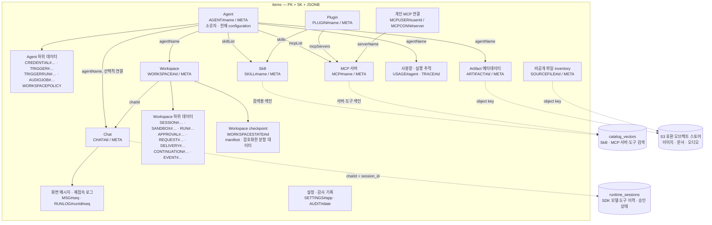

# 데이터베이스 구조

Agent Studio의 물리 테이블과 주요 업무 데이터의 논리 관계를 설명한다.
PostgreSQL 하나에 8개 테이블을 두며, Agent·Chat·Workspace 등의 업무 데이터는
`items`의 JSONB 행에 저장한다. 파일 본문은 선택적 S3 호환 오브젝트 스토어에 보관한다.

이 문서는 저장소의 현재 스키마 정의를 기준으로 한다. 특정 배포의 DB 조회 결과는 아니다.
전체 저장 키와 접근 패턴은 [아이템 테이블 설계](ARCHITECTURE.md#postgresql-아이템-테이블-설계),
보존·백업 절차는 [운영 문서](OPERATIONS.md#행-보존)를 따른다.

## 물리 테이블

주요 컬럼만 표시한다. `PK`는 기본키, `FK`는 외래키, `UK`는 유니크 제약이다.
`items.pk`와 `items.sk`는 함께 하나의 기본키를 구성한다.
연결선은 DB가 강제하는 외래키이며, 사용자 한 명에 Session·Account가 각각 0개 이상 연결된다.

```mermaid
erDiagram
    user ||--o{ session : "userId / ON DELETE CASCADE"
    user ||--o{ account : "userId / ON DELETE CASCADE"

    user {
        text id PK
        text email UK
        text name
        boolean emailVerified
        text tier
    }

    session {
        text id PK
        text userId FK
        text token UK
        timestamptz expiresAt
    }

    account {
        text id PK
        text userId FK
        text providerId "accountId와 복합 UNIQUE"
        text accountId
        text accessToken
        text refreshToken
    }

    verification {
        text id PK
        text identifier
        text value
        timestamptz expiresAt
    }

    items {
        text pk PK "복합 기본키"
        text sk PK "복합 기본키"
        jsonb data "업무 데이터"
        text gsi1pk "data에서 생성"
        text gsi1sk "data에서 생성"
        text gsi2pk "data에서 생성"
        text gsi2sk "data에서 생성"
        bigint expires_at "data.expiresAt에서 생성, Unix 초"
    }

    runtime_sessions {
        text session_id PK
        text owner_email
        text agent_name
        bigint revision
        text payload "압축하고 암호화한 SDK 이력과 승인 상태"
        boolean deleted
        timestamptz expires_at
        timestamptz updated_at
    }

    catalog_vectors {
        text key PK
        vector embedding "capability 검색 벡터"
        jsonb metadata
    }

    schema_migrations {
        integer version PK
        text name
        timestamptz applied_at
    }
```

- Better Auth는 `user`·`session`·`account`·`verification`을 사용한다.
  `user` 삭제 시 `session`과 `account`의 해당 행은 DB가 함께 삭제한다.
- `items`, `runtime_sessions`, `catalog_vectors`에는 다른 테이블을 가리키는 외래키가 없다.
  소유자·Agent 참조의 검증과 정리는 애플리케이션이 담당한다.
- `schema_migrations`는 초기화된 스키마의 기준선 버전을 기록한다.
  초기화 경로는 빈 DB에 스키마를 만들며, 인식하지 못하는 기존 스키마는 거부한다.

## 업무 데이터의 논리 관계

`items` 영역 안의 상자는 별도 SQL 테이블이 아닌 행 종류 또는 행 묶음이다.
`#` 뒤의 `name`, `id`, `seq` 등은 실제 식별자가 들어갈 자리다.
실선은 업무 데이터의 연결·하위 행 관계, 점선은 별도 저장 영역과의 연결이다.
이 그림의 연결선은 외래키를 뜻하지 않는다.



- **인증과 실행 Session:** `session`은 로그인 세션이다. `runtime_sessions`는
  Chat의 모델·도구 이력과 승인 상태를 보관하며, `revision`으로 동시 갱신 충돌을 검출한다.
- **화면 기록과 모델 이력:** `MSG#…`는 화면 표시용 메시지이고 `RUNLOG#…`는 재접속 버퍼다.
  SDK는 `runtime_sessions`의 native 이력을 사용한다. [Chat 저장 계약](design/chat.md#저장과-실행의-경계)을 따른다.
- **Workspace checkpoint:** 파일과 native CLI Session을 `WORKSPACESTATE#…` 행에 나누어 저장한다.
  Chat의 SDK Session과 저장 위치·수명이 다르다. [Workspace 설계](design/workspaces.md)를 따른다.
- **파일:** Artifact와 SourceFile 행은 메타데이터와 오브젝트 키를 보관한다.
  실제 파일 본문은 오브젝트 스토어에 있다.
- **개인 MCP 연결:** 사용자 ID와 MCP 서버에 귀속되며, 여러 Agent에서 공유한다.
  Agent 소유자의 연결을 호출자 연결로 대신 사용하지 않는다.

## 인덱스와 만료

`items`의 `gsi1*`, `gsi2*`, `expires_at`은 JSONB에서 자동 생성하는 저장 컬럼이다.
GSI는 보조 조회 인덱스이며, 인덱스 키가 없는 행은 포함하지 않는다.

| 인덱스 | 컬럼 | 주요 용도 |
|---|---|---|
| 기본키 | `pk`, `sk` | 개별 행, 파티션과 정렬 키 범위 조회 |
| `items_gsi1` | `gsi1pk`, `gsi1sk` | 종류·소유자·시각별 목록 |
| `items_gsi2` | `gsi2pk`, `gsi2sk` | Workspace 작업 큐, 개인 Artifact, 작업별 원본·파생 파일 등 |
| `items_expires` | `expires_at` | 만료 아이템 정리 |
| `runtime_sessions_expiry` | `expires_at` | 만료 SDK Session 정리 |

만료 행은 PostgreSQL이 자동으로 삭제하지 않는다. 인증된 schedule tick이
`sweepExpiredRows`를 실행하며, 읽기 경로도 만료된 데이터를 제외한다.
DB 행 정리는 오브젝트 스토어의 파일 삭제와 별개다. 보존 기간과 정리 주체는
[행 보존](OPERATIONS.md#행-보존)을 확인한다.

`catalog_vectors`의 벡터 차원은 배포에서 선택한 Embedding 모델에 따른다.
차원을 고정하지 않으며, HNSW 인덱스 없이 cosine 거리로 정확 검색한다.
모델 전환과 재색인은 [카탈로그 계약](design/capabilities.md#케이퍼빌리티-카탈로그)을 따른다.

## 코드에서 확인할 위치

| 확인할 내용 | 정본 |
|---|---|
| 테이블·컬럼·제약·인덱스 | [migrations.ts](../src/infrastructure/db/migrations.ts) |
| 업무 데이터의 저장 키 | [keys.ts](../src/infrastructure/db/keys.ts) |
| 아이템 조회·조건부 쓰기·트랜잭션 | [store.ts](../src/infrastructure/db/store.ts) |
| SDK Session 저장·revision 검사 | [runtimeSessionRepository.ts](../src/infrastructure/db/repositories/runtimeSessionRepository.ts) |
| Workspace checkpoint 분할 저장 | [workspaceCheckpointStore.ts](../src/infrastructure/db/repositories/workspaceCheckpointStore.ts) |
| 벡터 저장·검색 | [pgVectorStore.ts](../src/infrastructure/vector/pgVectorStore.ts) |
