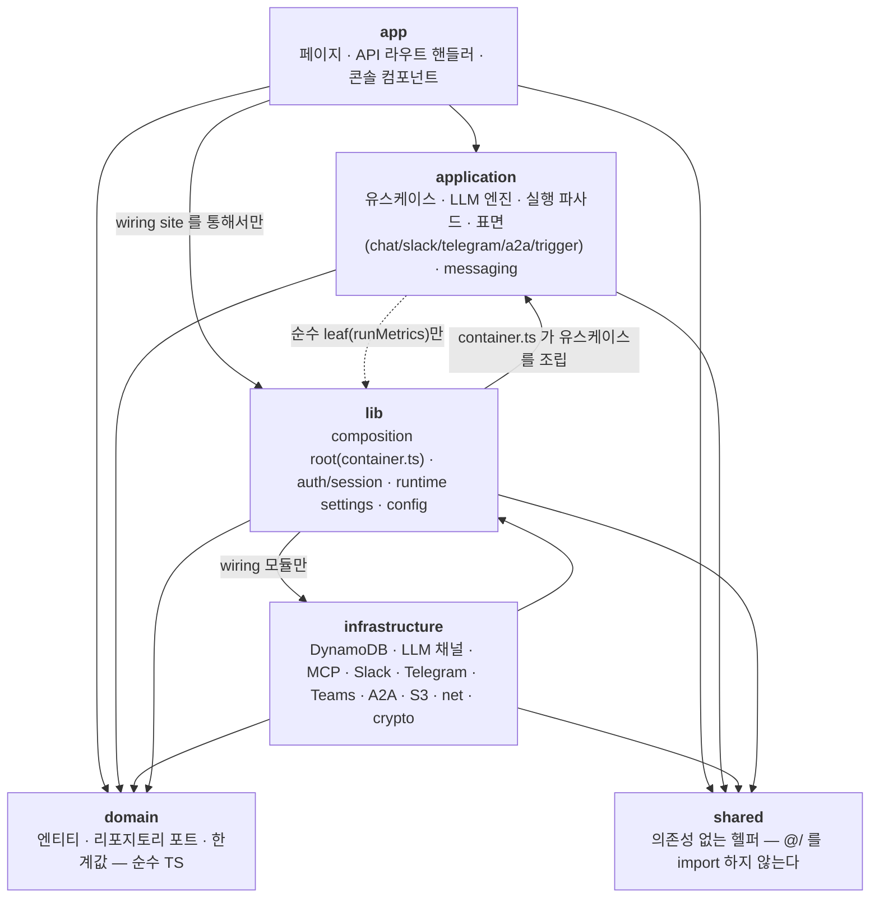
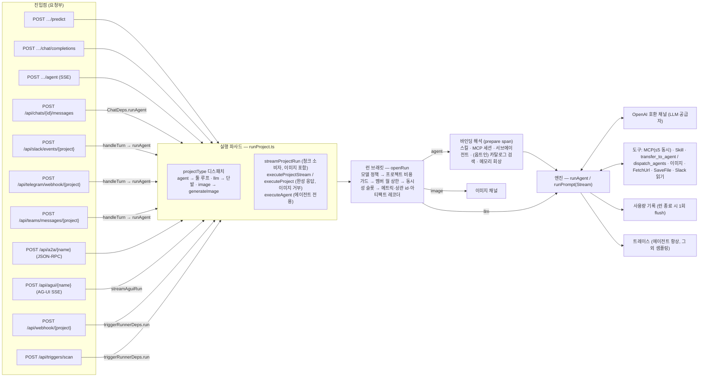
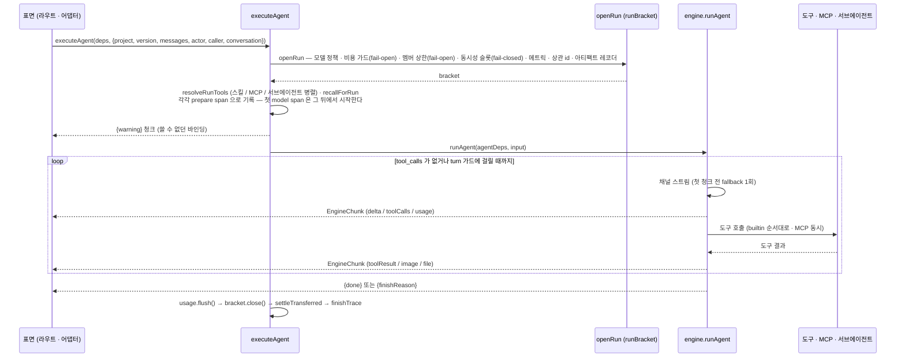
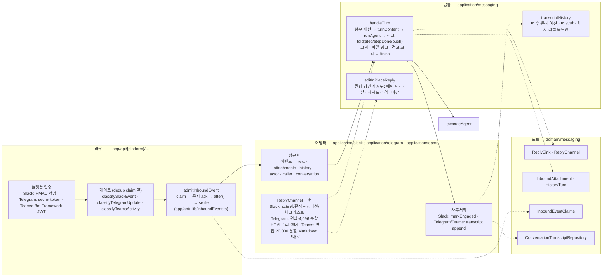
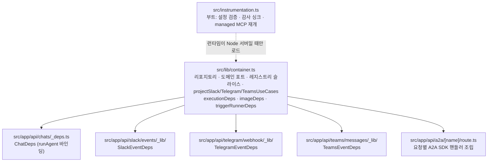
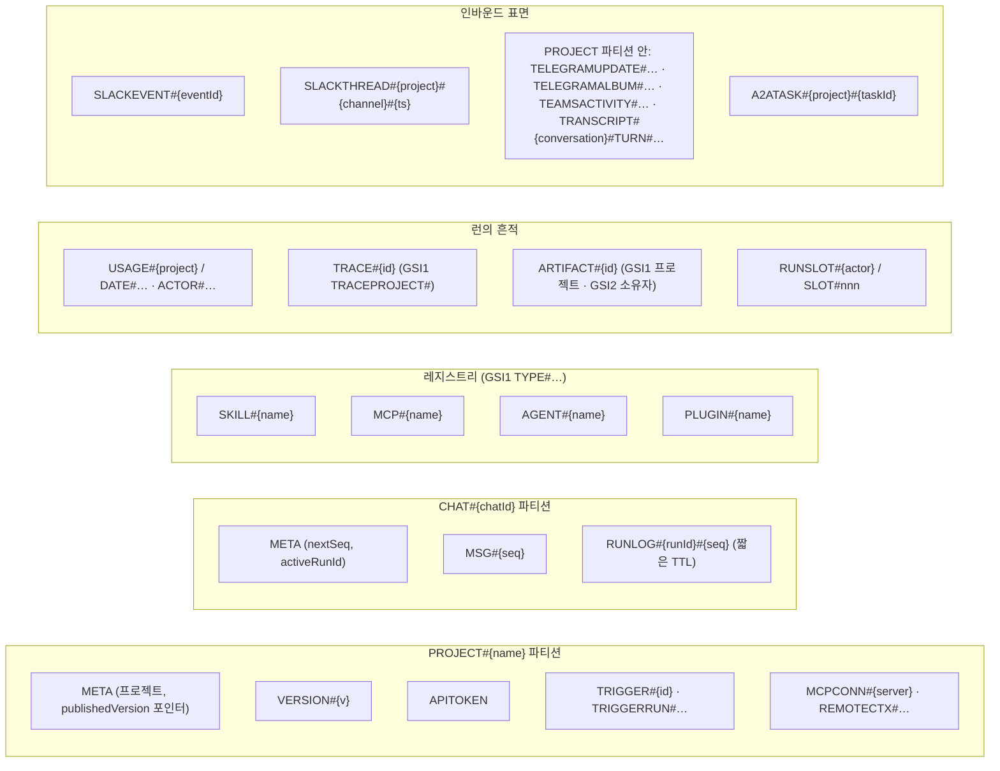

# 아키텍처 다이어그램

Agent Studio 전체를 그림으로 본다. 각 그림은 요약이고, 정본은 옆에 링크한 문서다 — 그림과 문서가
어긋나면 문서가 맞다. 그림은 [ARCHITECTURE.md](ARCHITECTURE.md) 의 순서를 따른다: 계층 → 요청
흐름 → 런 브래킷 → 엔진 루프 → 메시징 표면 → 조립 지점 → 저장 모델.

## 1. 계층과 의존 방향

`app → application → domain ← infrastructure`. 화살표는 import 가 허용되는 방향이다.
`tests/architecture.test.ts` 가 빈 허용 목록으로 강제한다 ([ARCHITECTURE.md#레이어](ARCHITECTURE.md#레이어)).

## 2. 요청 흐름 — 열 진입점, 하나의 파사드

모든 실행은 `src/application/execution/runProject.ts` 로 모인다. 표면은 *어떻게 들어오는지*
(HTTP 형태, 인증, 응답 모양)만 결정하고, *어떤 프로젝트 타입이 어떻게 도는지*는 파사드가
한 번 결정한다 ([ARCHITECTURE.md#요청-흐름](ARCHITECTURE.md#요청-흐름)).

응답 모양은 표면마다 다르다: `predict`·`chat/completions` 는 완성 응답(또는 SSE), `agent` 는
원시 청크 SSE, chat 은 자체 프레임 + 재생 로그, Slack·Telegram·Teams 는 플랫폼 메시지, A2A 는 태스크
이벤트, AG-UI 는 프로토콜의 이벤트 스트림, 트리거는 이력 행. 청크의 계약은
[ARCHITECTURE.md#enginechunk-계약](ARCHITECTURE.md#enginechunk-계약).

## 3. 런 브래킷 — 최상위 런을 감싸는 한 곳

네 함수(`executeVersion` · `executeVersionStream` · `executeAgent` · `generateImage`)가 최상위
런을 admit 하고, 각각 브래킷을 연다. 가드는 메트릭 *앞*에서, `close()` 는 사용량 flush *뒤*에서
([ARCHITECTURE.md#런-브래킷](ARCHITECTURE.md#런-브래킷)).

## 4. 메시징 표면 — 게이트웨이와 어댑터

Slack·Telegram·Teams 는 같은 파이프라인 위에 있다. 어댑터는 플랫폼이 결정하는 것만 갖고,
파이프라인은 플랫폼과 무관한 것을 한 번 갖는다 ([design/messaging.md](design/messaging.md),
[design/slack.md](design/slack.md), [design/telegram.md](design/telegram.md),
[design/teams.md](design/teams.md)).

## 5. 조립 지점 — 일곱 곳

유스케이스는 어댑터 위에 정확히 일곱 곳에서 조립된다. 라우트는 조립된 객체를 받는다
([ARCHITECTURE.md#조립은-의도적으로-고른-몇-곳에서만](ARCHITECTURE.md#조립은-의도적으로-고른-몇-곳에서만)).

## 6. 저장 모델 — 단일 테이블

한 테이블(`PK`/`SK` + `GSI1`/`GSI2`). 항목 단위 접근은 기본 키로, "종류별 목록" 은 GSI1 로.
전체 키 맵은 [ARCHITECTURE.md#dynamodb-단일-테이블-설계](ARCHITECTURE.md#dynamodb-단일-테이블-설계).

키 문자열은 `src/infrastructure/db/keys.ts` 만 만든다. 자라는 행은 `expiresAt` 을 갖고
([OPERATIONS.md#행-보존](OPERATIONS.md#행-보존)), 목록 조회는 페이지네이션한다.
