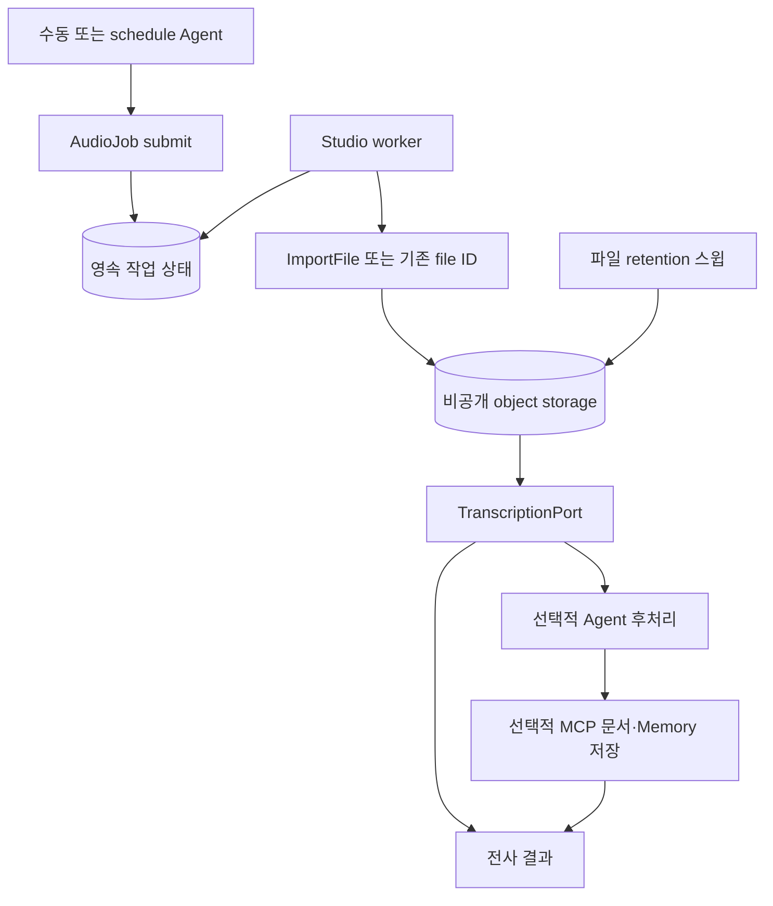

# 오디오 처리와 영속 작업

한 Agent가 plugin skill의 절차에 따라 도구를 호출하고 Artifact ID로 결과를
전달한다. HTTP API·Agent 도구·별도 worker가 긴 작업과 재시도를 담당한다. 외부 기록은 사용자
요청에 따라 같은 Agent가 수행한다. 결합된 처리가 필요한 호출자는 선택적 후처리·sink 계약도 사용할 수 있다.
개인 실행은 기존 MCP 인증과 검증된 email 문맥을 사용한다.

Agent Memory 수신 측은 문서 수집·멱등 저장 계약을 제공해야 한다. MCP 결과의 source reference
변환과 기본 설정·작업 UI를 제공한다. Studio의 delivery는 수신 서버가 필요한 도구와 idempotencyKey를
노출해야 활성화된다. 실행과 설치 조건은 [개발 안내](../DEVELOPMENT.md)와
[설치 안내](../INSTALL.md#오디오-worker)를 따른다. 운영 Agent 생성·OAuth·스케줄 활성화는 별도 운영 작업이다.

이 문서는 현재 Studio 구현의 계약이다. Agent Memory·출처 Plugin의 설명은 연동에 필요한
상대 시스템의 계약이며, 해당 배포가 그 기능을 제공하거나 설정됐다는 뜻은 아니다.

## 목표와 설계 원칙

Agent가 다양한 출처의 파일을 보관하고, 오디오를 지정 모델로 전사하고, 필요하면 다른 Agent로
후처리한 뒤 문서·Memory를 저장할 수 있게 한다. 오래 걸리는 단계는 영속 작업으로 실행한다.
출처 서비스, 회의록 같은 문서 종류, 실행 주기와 보존 기간은 Agent·skill·설정이 결정한다.
플랫폼 코드의 타입·도구·DB 키·화면에는 특정 서비스나 업무 이름을 넣지 않는다.

| 범용 개발 기능 | 구성으로 결정할 내용 |
| --- | --- |
| 파일 가져오기·비공개 저장 | MCP 파일 참조 또는 업로드 파일, 출처 ID, 대상 저장소 |
| 오디오 전사 | 모델·언어·지원 형식·분할 설정 |
| 비동기 작업·재개 | 활성 작업 수, 발생당 신규 작업 수, 재시도 정책 |
| Agent 후처리 | 대상 Agent 설정, skill·prompt·출력 schema |
| 문서·Memory 저장 | MCP 연결, 저장할 산출물과 개인 scope |
| 사용자 문맥 전달 | 로그인/설정 과정에서 확인한 실행 사용자 email |
| 원본 만료 | 기간의 단위·값·시간대, 삭제 대상과 완료 기록 유지 |

임의 DAG·스크립트 실행기나 시각적 workflow 편집기는 제공하지 않는다.
파일 가져오기, 전사, 선택적 Agent 후처리, 선택적 저장을 조합하는 작업 계약을 사용한다.
전사만 실행하거나 이미 보관된 파일을 사용하는 흐름도 같은 기능을 사용한다.

## Artifact 중심 Agent 구성

운영 Agent의 현재 설정을 schedule로 호출한다. 기본 구성은 Agent 하나와 `audio-processing`·
`meeting-minutes` skill이며 하위 Agent를 요구하지 않는다. 개인 기록을 제공할 때는 `personal-records`를
추가한다. 플랫폼에 특정 녹음 서비스나 업무 종류를 추가하지 않는다.

| 역할 | 호출과 산출물 |
| --- | --- |
| 운영 Agent | skill을 읽고 `AudioJob list/status`의 task·sourceIdentity·Artifact 관계로 진행 상태를 확인한다. 새 녹음은 프로젝트 설정으로 한 작업을 제출한다 |
| worker | 보관·전사·후처리를 이어가며 원본·전사·summary.md·dialogue.md·구조화 JSON을 비공개 Artifact로 저장한다 |
| 후처리 실행 | 같은 Agent의 접수 시점 설정을 `backgroundTask`로 실행한다. Skill 읽기만 제공하므로 새 작업 제출·MCP 쓰기·하위 Agent 호출은 수행하지 않는다 |
| 요청한 기록 | 같은 운영 Agent가 `File read` 후 연결된 MCP의 document_ingest 또는 remember를 호출한다. 개인 scope와 동일한 idempotencyKey를 사용한다 |

일부 단계만 필요한 요청은 `ImportFile`, `TranscribeAudio`, `AudioJob postprocess`를
직접 사용한다. 복잡한 별도 업무에 위임을 사용할 수 있지만 파일 처리 단계마다 Agent를 만들지는 않는다.
절차와 기록 규칙은 plugin skill, 모델·보존 기간·후처리 Agent 설정은 오디오 설정, 수집 범위·탐색 한도는
schedule 메시지에 둔다. 시스템 프롬프트에는 skill 선택과 사용자 요청 범위만 짧게 둔다.

여러 녹음 요청은 설정 한도 안에서 각각 영속 큐에 접수한다. worker는 프로젝트별로 접수 순서대로
한 건씩 실행한다. pending 작업은 완료로 보고하지 않으며 다음 실행에서 같은 job ID를 확인한다.
완료된 단계를 다시 실행하거나 만료된 원본을 자동 재다운로드하지 않는다.
이미 보관된 전사 Artifact로 후처리만 다시 수행할 수 있으며, 명시적인 재처리는 processing_revision을 구분한다.
`ImportFile`·`TranscribeAudio`·`AudioJob submit`은 같은 processing_revision을 재시도에 재사용한다.
연결 도구의 source_ref는 가져오기에 사용할 참조이며 다운로드 완료를 뜻하지 않는다. 원본 URL은 의도적으로
숨기므로 URL 부재를 처리 완료나 파일 만료의 근거로 삼지 않는다. 기존 sourceIdentity와 job 상태로 판단한다.
기록할 본문이 잘렸으면 전체 저장으로 보고하지 않는다. 저장 오류나 충돌을 피하려고
조직 scope로 바꾸거나 새 멱등 키를 무작정 발급하지 않는다.

MCP OAuth는 해당 서버를 호출하는 운영 Agent에 연결한다. 위임을 선택한 구성에서도 원본 참조·작업·
산출물은 메인 프로젝트에 보관하며, URL 갱신에 사용할 호출 프로젝트와 연결 세대는 별도로 유지한다.
schedule은 검증된 owner email 문맥을 사용하고, cron 기본 요청에는 외부 저장을 포함하지 않는다.

## 책임과 재사용 경계

| 소유자 | 재사용 | 오디오 처리에서 담당하는 기능 |
| --- | --- | --- |
| Studio `application/trigger/` | cron, 발생 claim, 동시 런 방지 | 선택적 실행 사용자 문맥 전달 |
| Studio MCP | 프로젝트 연결·OAuth refresh·schema discovery | 결과 파일 참조와 재조회 계약 |
| Studio 모델 카탈로그·runtime settings | Transcription 타입, provider·wire ID·가격 | 전사 포트·어댑터·사용량 집계 |
| Studio object store | S3 호환 storage·제한된 읽기·삭제 | streaming import, 파일별 retention |
| Studio 실행 facade | run bracket·Agent 실행·비용·trace | worker의 후처리 실행과 작업별 접근 범위 |
| Agent Memory | 기존 Bearer + email, 개인 ACL, `remember`, 문서 worker | 문서 수집 MCP와 수신 측 멱등 저장 |
| agent-plugins | 출처별 도구 안내, 업무별 skill | 구현된 범용 도구를 조합하는 사용 지침 |

`FetchUrl`과 문서 `File`은 현재 오디오 전사 수단이 아니다. 오디오 base64를 일반 tool 응답이나
모델 문맥으로 전달하지 않는다. 기존 조직 Agent Bearer는 MCP 전용이므로 문서 HTTP API를
직접 호출하는 대신 새 문서 MCP가 기존 문서 유스케이스를 재사용한다.

관련 정본: [triggers](triggers.md), [MCP](mcp.md), [documents](documents.md),
[보안](../SECURITY.md), [실행](execution.md), [단일 소유](../OWNERSHIP.md).
Agent Memory의 현재 인증·ACL·API 계약은 형제 저장소의 `docs/api.md`를 따른다.

## 책임과 실행 구조

Studio는 파일·전사·Agent 실행·작업 상태를 소유한다. Agent Memory는 문서 처리·검색·Memory·ACL을
소유한다. Plugin은 출처별 탐색 방법과 업무별 작성 지침을 소유한다. worker·MinIO 운영은 설치 환경이
소유한다. 특정 출처의 목록 필드·도구 이름·계정 정보를 범용 worker에 하드코딩하지 않는다.



Agent는 source를 선택해 작업을 제출하고 실제 작업은 worker가 이어받는다. source 목록 탐색은
기존 MCP와 skill로 수행한다. worker는 제출된 source만 처리하며 특정 서비스의 inventory를 직접
스캔하지 않는다. 목록 탐색은 source 도구의 cursor와 설정한 페이지 한도를 따른다. 별도의 source 탐색 cursor를 영속화하는 기능은 제공하지 않는다.
조회 실패·불완전 탐색을 `empty`로 표시하지 않는다.

같은 Studio 이미지의 전용 worker 모드가 PostgreSQL `items` 작업을 bounded polling·claim한다.
새 queue 서비스를 필수로 도입하지 않고 `after()`나 문서 변환용 30초 process pool에 장기 전사를
맡기지 않는다. Agent 런의 기본 10분 제한과 작업의 수명은 별개다.

후처리는 설정한 Project와 job에 고정한 configuration snapshot을 `streamProjectRun` facade로 호출한다.
직접 engine을 호출하지 않으며 run bracket·비용·trace를 유지한다. 후처리 origin은 서버가 주입하고
이 실행에서는 새 작업 제출 능력을 제공하지 않아 재귀 생성을 막는다. 저장은 모델의 완료 주장 대신
검증된 출력과 실제 receipt로 판정한다.
후처리 실행은 연결된 skill 읽기만 허용한다. MCP·동적 탐색·사전 Memory recall·subagent·URL 조회·
Slack 조회·이미지·파일 생성 능력은 실행 경계에서 차단하고 원격 저장은 worker가 담당한다.

## Agent Memory email 인증

기존 **인증된 MCP 연결 + `X-User-Email`** 계약을 사용한다. 새 개인 token, 별도 발급·회전 UI,
`ingestion_identity` 같은 전용 인증 도구는 개발하지 않는다. 여기서 email은 기존 MCP 인증 위에서
개인 사용자를 결정하는 값이며, 기존 Bearer 검증을 없애는 변경은 아니다.

- 대화 실행은 기존 인증 사용자 email을 사용한다.
- 무인 실행은 owner가 로그인 상태에서 해당 자동화에 본인 실행 문맥을 설정한다. 서버가 인증된
  owner email을 저장하고 클라이언트가 임의 email을 지정하는 입력은 받지 않는다.
- schedule actor는 그대로 유지하고, 이 설정이 있는 실행에만 검증된 email을 `RunOrigin.userEmail`로
  전달한다. 공용 MCP metadata 조립 함수가 `X-User-Email`을 생성한다. registry·Agent의 수동
  예약 header override는 계속 제거한다. 설정이 없는 기존 schedule 동작은 유지한다.
- job은 email과 원래 project·자동화 설정 revision을 보존한다. worker·후처리·저장 요청에도 같은
  문맥을 전달한다. 소유자 변경·멤버 비활성·연결 변경 시 현재 권한을 재검증하고 다른 사람으로
  조용히 전환하지 않는다. 현재 owner와 저장한 주체가 다르면 재설정 전 `blocked`로 처리한다.
- Memory는 email을 정규화해 설치 조직의 active 사용자로 해석하고 기존 ACL을 적용한다.
  개인 저장은 `scope.kind=user`로 요청하며 사용자 ID는 위임 사용자에서 결정한다.
  email 없음·잘못된 email·비활성 사용자일 때 조직 scope로 fallback하지 않는다.
- 기존 token의 암호화 저장·mask·폐기 검증을 재사용한다. token이나 email을 LLM에게 선택하게
  하지 않는다. 출처 OAuth와 Memory의 email 위임은 독립된 연결이며 계정을 임의 동일시하지 않는다.

이 사용자 문맥 기능은 특정 출처·문서 종류에 한정하지 않는다. 인증 관련 실제 구현은 위 범위의
권한 전달과 개인 ACL 회귀 검증을 포함한다.

## 범용 설정과 도구

프로젝트별 `AudioJobConfig`에 `enabled`, `model`, `language`, `postprocess?`,
`destination?`, `retention`, `maxActive`, `maxPerOccurrence`, `revision`을 둔다.
`postprocess`는 후처리 Agent를, `destination`은 저장할 결과와 MCP binding을 참조한다.
source 연결·사용자 문맥은 기존 프로젝트 연결과 자동화 설정을 사용한다. 작업 접수 시 후처리
Agent와 전달 대상의 현재 설정을 snapshot으로 고정해 이후 설정 변경은 새 작업에만 적용한다.
설정 저장은 대상 프로젝트가 존재하고 같은 소유자의 설정된 Agent인지 transaction에서 확인한다.
접수 때 사라졌거나 미설정인 대상은 명시적인 오류로 거절하며 다른 Agent로 대체하지 않는다.
기간이나 cron에 고정값을 넣지 않는다. 임의 코드·템플릿으로 서버 실행 로직을 주입하지 않는다.
AudioJob의 LLM 인수는 request 안의 operation별 union으로 분리한다. configured submit에는 source·
config_revision·processing_revision만 있고, 조회나 후처리 옵션을 채워 넣지 않는다. 선택값은 null이다.
ImportFile·TranscribeAudio는 source `{kind,id}`로 정확히 하나의 입력을 받는다. 절차와 호출 예시는
plugin의 audio-processing 스킬이 소유하며 사용자 요청에는 대상과 결과만 남긴다.

GET/PUT `audio-config`로 읽고 revision 조건부 저장한다. Agent는 `AudioJob config`를 읽고
`submit`에 `config_revision`을 지정한다. 참조와 요청별 설정을 섞지 않는다. 설정이 없으면 기존
요청별 설정과 활성·발생당 1건 제한을 적용한다. 설정 변경은 제출된 작업 snapshot을 바꾸지 않는다.

| 도구 | 계약 |
| --- | --- |
| `ImportFile` | 접근 가능한 `artifact_id`, `file_id`, `source_ref` 중 하나로 job ID 반환. 완료 후 status의 `artifacts.source`로 원본 Artifact 확인 |
| `TranscribeAudio` | 원본 Artifact ID·모델 선택으로 비동기 전사를 제출하고 job ID 반환. `artifacts.transcript`가 결과 Artifact ID |
| `AudioJob` `submit` | source ref 또는 file ID·설정 참조 → accepted/busy/duplicate/blocked와 job ID |
| `AudioJob` `postprocess` | 기존 전사 Artifact·후처리 Agent·retention으로 요약만 실행. model·language·destination·config_revision은 받지 않는다 |
| `AudioJob` `config` | 본인 프로젝트 작업 설정과 revision 또는 null |
| `AudioJob` `status` | job ID → 단계·처리 범위·오류·retry 시각·결과 참조 |
| `AudioJob` `list`의 작업 구분 | `task`와 비밀이 아닌 `sourceIdentity`로 완료된 다운로드·전사·후처리를 연결하고 이미 처리한 입력을 구분한다 |
| `AudioJob` `read` | job ID·결과 종류·cursor·limit → bounded 본문과 nextCursor |

`ImportFile`의 다운로드와 `TranscribeAudio`도 동일한 영속 task 실행기를 사용한다. 제한된 시간에
완료되지 않으면 task ID를 반환하고 `AudioJob status`로 진행을 확인한다. `AudioJob submit`은 이
공통 기능에 선택적 후처리·저장을 연결하는 편의 계약이며 다운로드·전사 로직을 복제하지 않는다.

`artifact_id`는 현재 사용자가 소유한 비공개 Artifact를 가리킨다. 다른 Agent 프로젝트에서 만든
파일도 입력으로 사용할 수 있다. 접수 시 실제 파일 위치로 고정하고 양쪽 프로젝트의 소유 권한을
확인한다. worker와 각 전사 요청에서도 원본 프로젝트 권한을 재확인하며 바이트는 복사하지 않는다.
파생 Artifact는 입력의 만료를 상속하고 `derivedFrom`·`model`로 원본과 생성 모델을 기록한다.
후처리 결과는 구조화 JSON과 `summary.md`로 각각 보관한다. `artifacts.processed`는 읽기용
Markdown, `artifacts.structured`는 원문 근거와 경고가 포함된 JSON Artifact ID다.
`artifacts.dialogue`는 `dialogue.md`다. ASR이 제공한 구간·화자 라벨·시간만 표시하고,
누락된 화자는 미상으로 표시한다. 구간별 화자 라벨을 같은 인물로 합치거나 실명을 추정하지 않는다.
구간 목록이 불완전해도 전체 전사문을 함께 보존한다. 대화 내용의 Markdown·HTML은 문자 그대로 표시한다.

`source_ref`는 서버가 발급한 불투명 참조다. 등록된 MCP tool의 파일 URL을
메인 Agent의 프로젝트에 보관한다. 하위 Agent가 조회한 경우에도 작업과 참조의 보관 범위는
같으며, 재조회 recipe는 하위 Agent의 프로젝트·현재 binding·OAuth 연결을 별도로 고정한다.
재조회 전후에 해당 프로젝트의 소유 권한과 연결 세대를 확인한다.

plugin.json의 `extensions.org.opspresso.agent-studio.mcpSourceOutputs`는 서버별 기본 파일 응답 매핑이다.
동기화는 검증된 매핑을 MCP 레지스트리에 저장한다. Agent의 sourceOutputs가 생략되면 기본값을 사용하고,
명시적 배열은 기본값을 덮어쓰며 빈 배열은 비활성화다. 기본 namespace는 프로젝트와 연결 fingerprint에
묶어 계정 간 입력을 구분한다. 매핑 변경은 기존 source refresh fingerprint를 무효화한다.
Plaud plugin은 get_file의 presigned_url·id·name·file_id 재조회 계약을 선언하므로 수동 매핑이 필요하지 않다.
스킬·MCP 설명은 사용 절차를 설명하며 URL 변환은 이 기계 판독 가능한 선언이 담당한다.
실행과 Prompt preview의 매핑된 도구 설명에는 `source_ref` 반환 계약을 덧붙인다. 서버의 원래
입력 스키마와 설명은 유지하고, 도구 alias를 기준으로 해당 매핑에만 적용한다. 기본 매핑을
비활성화한 Agent에는 안내를 붙이지 않으며 공유 discovery 캐시도 수정하지 않는다.

참조는 프로젝트·연결·외부 item ID에 연결한다. 직접 업로드는 비공개 file ID를 반환한다. JSON 안의 URL은 등록된 binding의 필드 mapping으로
정규화하며 worker는 원래 필드명을 알지 않는다. URL·인증정보를 job 입력에 그대로 복제하지 않는다.
필요한 경우 짧은 수명의 URL을 암호화해 임시 저장하고 가져오기 완료·만료 시 폐기한다.
갱신은 binding에 등록한 read tool·고정 argument mapping으로만 수행한다. 임의 tool 실행은 금지한다.
현재 mapping의 선택적 `refreshArgument`에 원래 item ID를 넣어 같은 조회 도구를 호출한다.
문자열·정수 ID 인수 하나를 지원한다. endpoint·credential·binding·OAuth flow 세대가 바뀌면
재조회하지 않으며 조회 중 변경도 결과 사용 전에 확인한다. recipe는 job에 유지하고 URL은 복제하지 않는다.

파일 응답은 structuredContent를 우선하고, 텍스트에서는 첫 JSON 객체·배열을 파싱한다.
제공자가 안내문 뒤의 태그 블록으로 JSON을 감싸면 단일 여는 태그와 정확히 일치하는 닫는 태그를
확인한다. JSON 문자열 안의 태그는 구분자가 아닌 데이터로 읽는다. 블록 밖의 안내문은 버리며,
불완전한 JSON·닫히지 않은 블록·여러 블록은 거절한다. 최초 등록과 URL 재조회 모두 모델용
응답 길이 제한 전에 비공개 필드를 추출한다.

목록 탐색 자체는 Agent가 기존 MCP tool을 사용한다. 구조화 파일 참조가 있는 응답은 서버가
source ref로 치환한 뒤 모델·trace에 전달한다. 선택한 출처가 이 계약을 제공하지 않으면
재조회 mapping을 등록하거나 파일 업로드를 사용한다. 서비스 이름별 분기를 추가하지 않는다.

read는 기본 12,000자·최대 20,000자를 반환한다. `result_kind`로 전사문 또는 후처리 본문을 선택한다.
Unicode 경계를 보존하는 문자 offset cursor로 남은 내용을 다음 호출에 제공한다. 작업 상태와 경고를 유지한다.
작업·파일 ID는 접근 권한이 아니며 시작 project와 실행 사용자를 확인한다.

## 파일 입력과 전사

현재 `src/infrastructure/llm/transcription.ts`는 지정 endpoint의 `/audio/transcriptions`를 호출한다.
`json`·`verbose_json`·`diarized_json` 응답과 선택적 `chunking_strategy=auto`를 설정으로 받는다.
자동 provider retry는 하지 않으며 인증 오류·일시 오류·잘못된 응답을 구분한다. 입력과 응답은
크기가 제한되고, 누락된 usage는 unknown으로 남는다. 형식은
[공식 Audio API 계약](https://developers.openai.com/api/reference/resources/audio/subresources/transcriptions/methods/create)을 따른다.

- 공개 URL은 기존 DNS·SSRF·redirect 검증을 모든 hop에 적용한다. 출처 인증 header를 다른
  다운로드 호스트로 전달하지 않는다. 내부 ASR·MinIO는 등록된 운영 endpoint를 사용한다.
- streaming으로 크기와 checksum을 확인한다. 제공자가 선언한 MIME은 메타데이터이며 실제
  디코더를 강제하지 않는다. ffmpeg는 바이트에서 MP3·WAV·FLAC·Ogg 형식을 판별하며,
  MP3로 선언된 Ogg/Opus도 처리한다. 허용 목록 밖의 컨테이너·playlist는 거절한다.
- 일시 URL 만료는 같은 외부 item의 참조를 갱신한다. OAuth 실패는 기존 `needs_reauth`를 사용한다.
  source identity와 item ID를 dedup에 사용하고 token refresh revision을 계정 ID로 쓰지 않는다.
- 안정적인 계정 ID가 없으면 연결 generation을 사용한다. 재인증 시 동일 계정인지 확인되지 않으면
  기존 작업을 새 계정으로 재개하지 않는다. 일반 파일 입력에는 checksum과 최초 file ID를 사용한다.
- `TranscriptionPort`는 file 참조·model·language·segment 범위·signal을 받고 text, 선택적 timestamp·
  speaker, 실제 model·usage·coverage·warnings를 반환한다. provider API는 infrastructure가 소유한다.
- endpoint·credential·wire ID는 runtime settings resolver가 결정하고 published 모델 사실은
  agent-models를 따른다. 실제 모델 선정 후 공식 provider 계약을 확인한다.
- 플랫폼 상한은 파일 512 MiB, 오디오 6시간, 다운로드와 구간 ASR 각각 10분,
  한 실행 구간 24시간이다. 모델과 플랫폼 중 작은 제한을 적용하고 외부 모델로 자동 fallback하지 않는다.
- 분할·변환은 이미지에 포함한 ffmpeg로 수행하고 network·CPU·메모리·scratch disk를 제한한다.
  구간 결과는 각각 보존해 성공한 구간을 재전사하지 않는다. timestamp 없는 모델에 시간이나
  구간 간 동일 화자를 만들어 붙이지 않는다. 무음과 전사 실패를 구분한다.

현재 분할 어댑터는 MP3·WAV·FLAC·Ogg 입력을 허용한 demuxer로 열고 로컬 file protocol만 사용한다.
한 번 PCM 16 kHz mono로 변환한 뒤 sample 단위로 잘라 WAV를 만든다. 전체 변환 시간 10분, 오디오
6시간, 단일 ffmpeg allocation 256 MiB 제한을 적용한다. 이는 process 전체 RSS 상한이 아니므로
worker 배포에서 메모리와 scratch volume 용량을 함께 제한한다. 사용법은
[ffmpeg 옵션](https://ffmpeg.org/ffmpeg.html)과 [protocol 제한](https://ffmpeg.org/ffmpeg-protocols.html)을 따른다.

## 작업·재시도·완료 계약

`status`와 `stage`는 독립된 값이다. `status`는 `queued`, `running`, `waiting`, `completed`,
`blocked`, `failed`, `cancelled`다. `stage`는 마지막으로 처리한 아래 단계이며 완료 후에도 유지된다.

```text
importing → transcribing → postprocessing(선택) → storing(선택) → cleaning
```

가져오기 전용은 importing 뒤 completed가 되고, 전사 전용은 후처리·저장을 건너뛰며,
기존 전사문 후처리는 transcribing을 건너뛴다. 실패 단계와 safe error code를 별도로 기록한다.
완료 여부는 stage 이름 대신 status로 판정한다.

job은 project·source identity·item ID·configuration snapshot·실행 email·stage·attempt·retryAt·
lease generation·file ref·checksum·expiry·segment manifest·output manifest·receipts를 저장한다.
본문은 object storage에 두고 DB에는 bounded metadata를 저장한다.

- project slot과 `(project, source identity, item ID, 처리 revision)` claim을 transaction으로 획득한다.
  `maxActive`는 대기·진행을 합친 비종료 작업 수이고 `maxPerOccurrence`는 한 Agent 실행의 접수 한도다.
  실제 실행은 여러 worker에서도 프로젝트별 한 건이다. `AUDIOSLOTS.jobIds`의 접수 순서를 사용하며,
  큐의 첫 작업만 due 인덱스와 claim에 노출한다. lease·heartbeat·대기 시각과 큐 인덱스를 함께 갱신한다.
  완료·실패·차단·취소는 slot 반환과 다음 작업 활성화를 한 transaction으로 처리한다.
  재시도 작업은 큐 끝에 추가한다. 한 프로젝트의 대기 목록이 다른 프로젝트의 due 조회 한도를 차지하지 않는다.
  접수 거절은 active_limit·occurrence_limit·conflict로 구분한다. Agent 도구는 Error로 전달하고,
  완료 후에도 복원되지 않는 발생당 한도를 worker 지연으로 오해해 반복 제출하지 않도록 안내한다.
- 발생당 신규 작업 상한은 서버가 전달한 occurrence ID에 귀속한다. 같은 발생의 Agent가 여러 번
  submit해도 초과하지 않는다. 완료 claim은 원본 만료 후에도 유지한다. 재처리는 명시적 revision 또는 종료 작업 삭제 후 새 제출로 요청한다.
- worker 기본 lease는 2분·heartbeat는 30초·poll은 10초다. 모든 checkpoint는 lease generation으로
  조건부 갱신한다. 소유권을 잃은 worker는 abort하며 외부 요청에는 안정적 idempotency key를 사용한다.
- 일시 오류는 최초 시도 포함 5회, 재시도 간격은 1·5·15·60분이다. 인증·입력 오류는
  즉시 blocked다. 최종 failed/blocked는 slot을 반환하고 명시적 재시도 전 다시 선택하지 않는다.
- 24시간 실행 구간은 최초 worker claim의 `startedAt`부터 계산하며 큐 대기는 포함하지 않는다.
  명시적 수동 재시도는 다음 claim에서 새 실행 구간을 시작한다. 자동 재시도는 실행 구간을 연장하지 않는다.
  원래 작업 생성 시각·완료 단계·중복 방지 키·파일 보존 만료는 유지한다.
- 취소는 새 단계를 시작하지 않게 하며 이미 성공한 외부 저장을 자동 삭제하지 않는다.
  응답 유실 시 receipt를 같은 키로 재조회한다. ASR이 멱등 호출을 지원하지 않으면 crash 후
  해당 구간 중복 과금 가능성을 표시한다. 중복 저장 방지와 과금 exactly-once를 혼동하지 않는다.
- `completed`는 output manifest의 모든 필수 산출물과 저장 receipt를 확인했음을 뜻한다.
  문서 저장을 선택했으면 ready까지, Memory를 선택했으면 고정된 후보별 ID까지 확인한다.
  선택하지 않은 저장·후처리를 강제하지 않는다.

## 후처리와 저장

업무 지침과 출력 schema는 Agent 설정·skill에서 가져온다. 인터뷰 정리·강의 요약·회의록은
같은 후처리 기능의 서로 다른 설정이다. 플랫폼은 파일/텍스트·선택적 Memory 후보·근거 참조·
warnings를 담는 결과 envelope만 정의한다. 업무별 필드를 engine에 추가하지 않는다.

긴 입력은 구간별 처리 후 통합하며 source/segment 근거를 유지한다. 구간 요약과 통합 요약은 같은
출력 상한을 적용하며, 여러 결과의 통합이 진행되지 않으면 중단한다. 불완전 전사의 저장 허용 여부와
검수 조건은 설정한 품질 정책으로 검증한다. source 내용은 실행 권한이나 목적지를 바꾸지 못한다.
생성 결과와 후보 payload를 먼저 고정·저장하고 원격 저장 retry에서 다시 생성하지 않는다.
후처리의 text는 비어 있지 않은 원문 언어 Markdown 요약이다. Memory 후보가 없어도 요약은 작성하며
경고만 반환하지 않는다. 후처리 입력은 요약 작업 지시와 원문 종류(transcript 또는 summary notes)를
명시하며 런타임 시각으로 녹음 날짜를 추정하지 않는다. 빈 요약은 checkpoint 저장 전에 postprocess_output_invalid로 차단한다.
Memory 추출이 필요 없는 실행과 통합 회차는 모델에서 Markdown 본문을 직접 생성하고,
런타임이 빈 memories·warnings 배열과 함께 내부 JSON envelope로 감싼다. Memory 저장을 선택한
추출 회차만 구조화 출력으로 본문과 근거 후보를 함께 생성한다.

후처리는 기존 run bracket의 예산·trace를 사용한다. ASR도 같은 프로젝트 예산 승인·정산 메커니즘을
확장하며 정책 소유자는 run bracket이다. 요청별 실제 audio seconds/token과 retry를 집계하고
unknown usage를 0으로 표시하지 않는다. 각 구간 전에 잔여 예산을 확인한다.

수신 기록 서비스에는 출처와 업무에 무관한 다음 MCP 계약이 필요하다.

| 도구 | 계약 |
| --- | --- |
| `document_ingest` | idempotencyKey·title·UTF-8 content·MIME·source·metadata·scope → document ID·status |
| `document_ingest_status` | document ID → pending/processing/ready/failed |
| `document_ingest_retry` | document ID·idempotencyKey·관측한 expectedAttempts → 기존 ID와 상태. 기존 문서 write 권한 필요 |
| `remember` | 기존 입력 + 선택적 idempotencyKey → 기존 Memory ID·version |

Studio는 도구 discovery에서 필요한 도구와 멱등 인자를 확인하고 저장된 결과를 직접 전달한다.
문서 본문을 LLM에게 다시 쓰게 하지 않는다. 수신 서버의 본문·chunk·quota 제한은 그 서버의
계약이며 Studio의 일반 문서 한도와 동일하다고 가정하지 않는다. 초과를 잘라 성공으로 표시하지 않는다.

수신 측은 `(설치 조직, 위임 user ID, operation, idempotencyKey)` 범위의 멱등성을 제공해야 한다. key에는 Studio가
발급한 job UUID·산출물 종류·ordinal을 넣어 다른 출처와 구분한다. 같은 키·같은 payload hash는
같은 ID를, 같은 키·다른 payload는 conflict를 반환한다. Bearer 교체로 identity를 바꾸지 않는다.
기존 receipt 반환에도 현재 email 권한을 검사한다. claim·resource·receipt는 하나의 DB transaction,
object upload·queue 등록의 갭은 staging cleanup과 기존 reconciliation으로 복구한다.
archive 뒤에도 tombstone을 유지해 자동 재생성을 막는다. 수정은 기존 revision API를 따른다.

source metadata는 source identity·job ID·파일 참조·checksum·model/config revision·coverage·
evidence를 사용한다. 원래 서비스의 필드명은 mapping이 변환한다. secret·서명 URL·storage key를
외부 metadata에 넣지 않는다. `urn:agent-studio:audio-job:<id>`는 출처 식별자이며
HTTP 조회 주소나 접근 권한이 아니다.

## 파일 보존·개인 접근·운영

비공개 원본 파일은 `savedFileName`의 MIME별 확장자 규칙으로 저장하고 다운로드한다.
MCP가 확장자 없는 녹음 제목을 반환해도 MP3는 `.mp3`로 내려받는다. 다운로드에서도 같은 규칙을
적용하므로 기존 파일의 메타데이터에 확장자가 없어도 재수집 없이 올바른 파일명을 제공한다.

원본 저장 어댑터는 multipart 완료 시 `If-None-Match: *`를 사용해 기존 파일을 덮어쓰지 않는다.
이는 [S3 조건부 쓰기 계약](https://docs.aws.amazon.com/AmazonS3/latest/userguide/conditional-writes.html)을
사용하며 기존 object와 충돌하면 호출자가 inventory를 다시 확인한다. `test:storage`는 로컬 endpoint만
허용하고 무작위 임시 bucket을 만들고 제거한다. 기본값은 Compose의 MinIO이며 별도 로컬 환경은
`STORAGE_TEST_ENDPOINT`, `STORAGE_TEST_ACCESS_KEY`, `STORAGE_TEST_SECRET_KEY`로 지정한다.

원본·전사·요약은 기존 `S3_BUCKET_NAME`의 비공개 `source-files/<fileId>`에 저장한다.
버킷과 key에는 업무 이름을 요구하지 않는다. 별도 원본 bucket 설정을 두지 않는다.
streaming multipart·checksum·abort·abandoned upload 정리를 제공하고 DB 갱신 전 crash에서도
최초 저장 시각을 복구한다.

retention은 `{unit: days | months, value, timezone}`으로 설정하고 최초 저장 완료 시각에 expiry를
계산한다. months는 달력 월을 더하고 없는 날짜는 대상 월 말일로 보정한다. 재시도·재다운로드로
연장하지 않는다. 원본 만료 이후 자동 재다운로드는 거절한다.
전사 구간·통합 전사문·Agent 중간 결과·최종 결과는 입력 파일의 만료를 `retainUntil`로 상속한다.
파일 정책으로 계산한 만료와 상속한 만료 중 이른 시각을 적용하며, 업로드 복구도 이 상한을 유지한다.

만료일부터 읽기를 거절하고 worker가 매분 최대 100건씩 삭제를 시도한다. object 본문 제거 확인 뒤
`deletedAt`을 기록하며 정리 전 inventory를 row TTL로 지우지 않는다. worker 중단·backlog에 따라 물리 삭제가 지연될 수 있다.
만료 sweep은 한 번에 하나만 실행하며 새 작업 조회와 병행한다. 종료 신호는 작업과 sweep에 함께 전달한다.
변환·분할 임시 파일은 정상 완료·오류·취소 시 정리한다. 강제 종료로 남은 scratch 파일의 정리는
설치 환경의 임시 volume 정책으로 보완한다. 복제·백업에도 파일 보존 정책을 적용한다.

원본과 파생 파일은 각각 inventory를 가지며 파생 파일의 만료는 입력보다 늦지 않다. 전사·후처리 checkpoint는 성공 후 cleaning 단계에서 정리한다.
원본·전사문·후처리 결과는 각각 저장된 비공개 파일을 그대로 참조해 Artifact 목록에 등록한다.
외부 문서·Memory 저장은 복사이며 최종 Artifact를 지우거나 보존 기간을 연장하지 않는다.
checkpoint는 목록에 공개하지 않는다. Artifact 다운로드·미리보기·삭제는 원본 파일 소유자와
현재 프로젝트 권한을 확인한다. 일반 Artifact의 읽기·쓰기·삭제·URL 발급과 bearer URL 조회는
`source-files/` 키를 거절한다. 파일 상태·보존 기한 확인과 Artifact 등록은 같은 transaction으로
보호하므로 삭제와 경합한 등록이 목록을 되살리지 않는다.
실패 복구 payload는 정해진 expiry까지 유지한다. 외부 저장 receipt와
완료 claim은 남겨 중복 처리하지 않는다. 삭제 실패는 cleaning 단계에서 재시도하며 전사·저장을
반복하지 않는다. 작업별 파일 인덱스를 100건씩 조회하며 원본은 이 인덱스에 넣지 않는다.
cleaning 이후에는 새로운 파생 파일 생성을 거절한다. 명시적으로 만료시킨 pending 업로드도
복구 과정에서 보존 기한을 연장하지 않는다.
삭제는 키를 0바이트 표식으로 교체한다. 지연된 multipart 완료는 기존 키가 있으므로 조건부 쓰기에
실패하고, stat/read는 표식을 없는 파일로 처리한다. 표식과 삭제 inventory는 유지하며 오디오 bytes는
남기지 않는다. 이는 공유 버킷의 versioning이 꺼져 있고 `source-files/`에 객체 일괄 만료 규칙이
없다는 전제다. object 요청은 10분, 삭제·multipart 정리는 30초로 제한하고 worker 취소를 조회에도 전달한다.

소유자는 종료된 작업을 명시적으로 삭제할 수 있다. 작업 행과 그 작업의 source claim을 revision 조건부
transaction으로 함께 삭제하며, 같은 입력을 다음 발생에서 다시 제출할 수 있다. 활성 작업은 먼저 취소한다.
원본·파생 파일과 외부 저장 결과는 기존 보존 정책을 유지하고, 발생당 접수 한도는 초기화하지 않는다.
삭제 후 가져오기·전사를 새로 요청해야 하며 import 전용 작업이 자동으로 transcribe로 바뀌지는 않는다.

범용 작업 UI는 작업 종류·단계·coverage·expiry·receipt·오류·retry·취소와 접수·갱신 시각을 제공한다.
전사는 전체 오디오 대비 완료 시간과 구간 수를, 후처리는 추출·통합 회차·결과 파일 저장의 완료 건수를
checkpoint에 기록해 표시한다. 진행 막대는 각 단계 기준이며 전체 작업의 예상 진행률이 아니다.
재시도에서 검증된 checkpoint를 다시 읽을 때 저장된 진행량을 낮추지 않는다.
오디오 처리 탭은 오디오 도구를 켠 Agent의 소유자에게만 노출한다. 현재 저장된 설정을 기준으로 한다. 직접 페이지 주소를 열어도 동일한 기능 설정을 확인한다.
화면에 펼친 모든 페이지의 진행 중인 작업을 5초마다 갱신하며, 완료된 행과 페이지 cursor를 유지한다.
탭이 숨겨지면 조회를 건너뛰고 동시에 최대 4건만 읽는다.
개인 파일·본문·후처리 run output·trace는 실행 사용자와 원래 project 범위로 제한하며 공개 project 갤러리에 노출하지 않는다.
owner 변경·삭제 시 worker를 중단하고 object 정리를 완료/예약한다. 외부 sink 자료는 자동 삭제하지 않는다.
목록은 cursor·limit으로 제한한다. 일반 로그에는 job·stage·safe error·model·크기·시간·attempt만
기록하며 파일 URL·token·본문은 제외한다. 외부 source 장애가 Studio의 필수 offline 경로를 막지 않는다.

## 최초 활용 설정: Plaud 녹음으로 회의록 작성

이 절은 운영 시 구성할 사례이며 공통 코드의 필수 조건이 아니다.

- 설치별 Studio 주소에 Agent를 구성하고 로컬에서 검증한 뒤 같은 설정을 운영 설치에 적용한다.
- 출처는 기존 Plaud MCP와 프로젝트 OAuth를 연결한다. 목록 탐색·조회 방법은 plugin이 소유한다.
  `list_files`·`get_file`과 실제 schema를 사용하고 임시 오디오 URL을 범용 source ref로 변환한다.
  출처별 pagination 제약은 해당 skill과 실제 도구 schema를 따른다.
  [Plaud 공식 계약](https://docs.plaud.ai/plaud-mcp-cli/mcp)을 참조한다.
- cron은 `0 * * * *`, timezone은 `Asia/Seoul`이다. 메인은 신규 녹음을 한 건만 선택하고,
  작업 설정은 maxActive=1, maxPerOccurrence=1로 두고 한 process 작업이 보관·전사·후처리를 이어간다.
  기존 작업이 진행 중이면 새 파일을 시작하지 않는다. 최초 수집 시작일은 활성화 전에 정한다.
  "최근 일주일 녹음을 가져와서 전사하고 요약해"처럼 기간을 지정할 수 있다. 한 요청에서 여러 건을
  접수하려면 두 접수 한도를 필요한 큐 크기로 설정한다. 한도를 늘려도 프로젝트 내 실제 실행은 한 건씩이다.
- 지정 Transcription 모델로 MP3를 전사하고 `meeting-minutes` skill로 후처리한다.
  결정·할 일·미결·담당자·기한·근거 검수는 이 skill과 Agent schema가 결정한다.
- 전사 JSON·summary.md·dialogue.md를 Artifact에 보관한다. 사용자 요청이 있을 때만 선택한 문서를
  Agent Memory Documents에, 원문 근거가 있는 내용을 Memory에 기록한다. 기존 MCP 연결과 검증된
  본인 email 문맥으로 개인 scope에 저장하며, 자동 수집 cron은 외부 저장을 호출하지 않는다.
- 이 사례의 MP3는 MinIO에 보관하고 retention을 `{unit: months, value: 3, timezone: Asia/Seoul}`로 지정한다.
  예: 2026-11-30 10:00 KST 저장 → 2027-02-28 10:00 KST 만료. 외부 Documents·Memory의 보존은 수신 서비스가 결정한다.

## 검증 기준

다음 경계를 회귀 검사로 확인한다.

- 같은 발생·여러 worker·수동 submit 경쟁에도 admission·동시성 상한 유지.
- 업로드 강의 녹음과 MCP 인터뷰 녹음을 서비스별 engine 분기 없이 처리.
- 단순 전사에는 문서 2개·회의록 schema·Memory 생성·시간별 schedule을 요구하지 않음.
- source token refresh, 다른 계정 재연결, URL 만료, 잘못된 MIME·크기·redirect 처리.
- ASR·후처리·Document/Memory 생성 직후 crash와 응답 유실에서 완료 단계 재사용.
- 잘못된/누락된/비활성 email 거부, 예약 header 위조 차단, 다른 사용자의 receipt 조회 거부.
- 원본 만료 뒤 재다운로드·중복 결과 생성 없음, sink 대기 중 payload 조기 삭제 없음.
- budget·quota·deadline·불완전 전사·prompt injection을 성공으로 숨기지 않음.

domain/application/infrastructure 경계, row key의 `keys.ts` 소유, 기존 wiring site를 유지한다.
새 도구 예약명·run entry point·단일 정책 소유는 architecture test와 OWNERSHIP에 반영한다.
Unit은 경계에서 network·clock·random을 mock한다. Studio는 typecheck·unit·integration·build,
Memory는 해당 저장소 verify·integration, 사용자 문맥·UI 변경은 E2E를 수행한다.
Studio integration DB는 `_test` 이름만 사용한다. 자원·retry 기본값과 소유 코드는
[CONFIGURATION.md](../CONFIGURATION.md#오디오-전사-설정)를 따른다.
