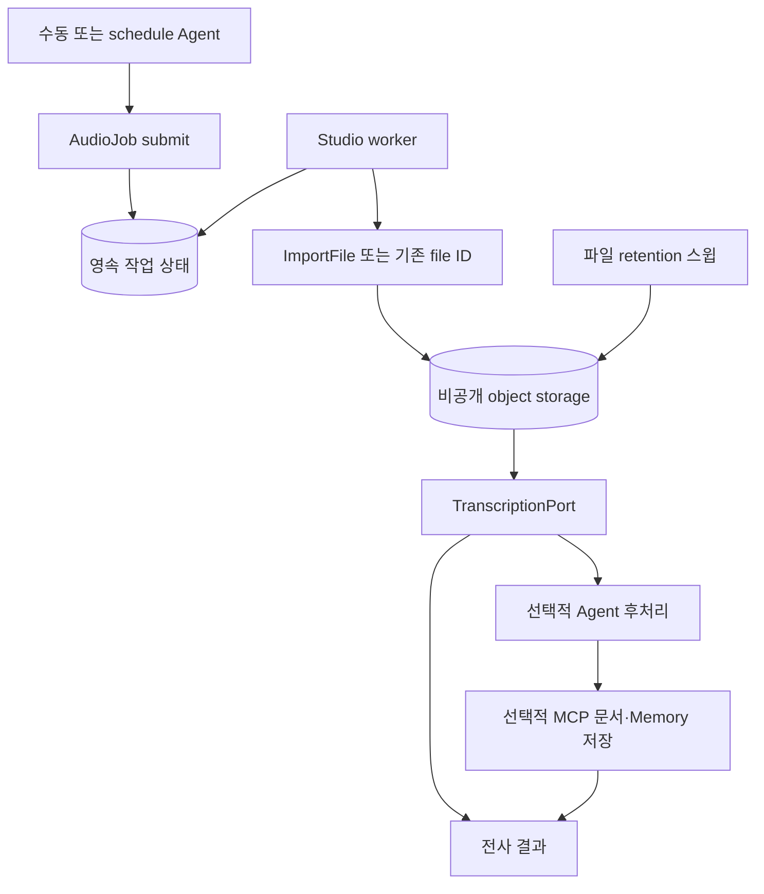

# 범용 오디오 처리·비동기 작업 개발 스펙

상태: **구현 중**. 전사 포트·결과 검증과 OpenAI 호환 multipart 어댑터를 구현했다.
영속 작업 repository는 발생당 admission·source dedup·lease·checkpoint·취소·재시도를 제공한다.
모델 설정 조립·worker 실행·도구 연결은 아직 없다.
파일의 달력 일·월 보존 계산은 `src/application/artifact/fileRetention.ts`가 제공하며 실제 삭제 스윕은 아직 없다.
아래 도구 이름은 구현할 계약이며 현재 제공 기능이 아니다.
구현은 [마일스톤](../MILESTONES.md#audio-processing-jobs)에서 추적한다.
운영 Agent 생성·인증 연결·스케줄 활성화는 개발 검증 후 수행한다.

## 목표와 설계 원칙

Agent가 다양한 출처의 파일을 보관하고, 오디오를 지정 모델로 전사하고, 필요하면 다른 Agent로
후처리한 뒤 문서·Memory를 저장할 수 있게 한다. 오래 걸리는 단계는 영속 작업으로 실행한다.
출처 서비스, 회의록 같은 문서 종류, 실행 주기와 보존 기간은 Agent·skill·설정이 결정한다.
플랫폼 코드의 타입·도구·DB 키·화면에는 특정 서비스나 업무 이름을 넣지 않는다.

| 범용 개발 기능 | 구성으로 결정할 내용 |
| --- | --- |
| 파일 가져오기·비공개 저장 | MCP 파일 참조 또는 업로드 파일, 출처 ID, 대상 저장소 |
| 오디오 전사 | 모델·언어·지원 형식·분할 설정 |
| 비동기 작업·재개 | 활성 작업 수, 발생당 신규 작업 수, 재시도 정책 |
| Agent 후처리 | 대상 project/version, skill·prompt·출력 schema |
| 문서·Memory 저장 | MCP 연결, 저장할 산출물과 개인 scope |
| 사용자 문맥 전달 | 로그인/설정 과정에서 확인한 실행 사용자 email |
| 원본 만료 | 기간의 단위·값·시간대, 삭제 대상과 완료 기록 유지 |

첫 구현에서 임의 DAG·스크립트 실행기나 시각적 workflow 편집기를 만들지 않는다.
파일 가져오기, 전사, 선택적 Agent 후처리, 선택적 저장을 조합하는 제한된 작업 계약부터 구현한다.
전사만 실행하거나 이미 보관된 파일을 사용하는 흐름도 같은 기능을 사용한다.

## 현재 구현과 필요한 변경

| 소유자 | 재사용 | 추가 개발 |
| --- | --- | --- |
| Studio `application/trigger/` | cron, 발생 claim, 동시 런 방지 | 선택적 실행 사용자 문맥 전달 |
| Studio MCP | 프로젝트 연결·OAuth refresh·schema discovery | 결과 파일 참조와 재조회 계약 |
| Studio 모델 카탈로그·runtime settings | Transcription 타입, provider·wire ID·가격 | 전사 포트·어댑터·사용량 집계 |
| Studio object store | S3 호환 storage·제한된 읽기·삭제 | streaming import, 파일별 retention |
| Studio 실행 facade | run bracket·Agent 실행·비용·trace | worker의 후처리 실행과 작업별 접근 범위 |
| Agent Memory | 기존 Bearer + email, 개인 ACL, `remember`, 문서 worker | 문서 수집 MCP와 수신 측 멱등 저장 |
| agent-plugins | 출처별 도구 안내, 업무별 skill | 구현된 범용 도구를 조합하는 사용 지침 |

`FetchUrl`과 문서 `File`은 현재 오디오 전사 수단이 아니다. 오디오 base64를 일반 tool 응답이나
모델 문맥으로 전달하지 않는다. 기존 조직 Agent Bearer는 MCP 전용이므로 문서 HTTP API를
직접 호출하는 대신 새 문서 MCP가 기존 문서 유스케이스를 재사용한다.

관련 정본: [triggers](triggers.md), [MCP](mcp.md), [documents](documents.md),
[보안](../SECURITY.md), [실행](execution.md), [단일 소유](../OWNERSHIP.md).
Agent Memory의 현재 인증·ACL·API 계약은 형제 저장소의 `docs/api.md`를 따른다.

## 책임과 실행 구조

Studio는 파일·전사·Agent 실행·작업 상태를 소유한다. Agent Memory는 문서 처리·검색·Memory·ACL을
소유한다. Plugin은 출처별 탐색 방법과 업무별 작성 지침을 소유한다. Dockpad는 worker·MinIO 운영을
소유한다. 특정 출처의 목록 필드·도구 이름·계정 정보를 범용 worker에 하드코딩하지 않는다.

Agent는 source를 선택해 작업을 제출하고 실제 작업은 worker가 이어받는다. source 목록 탐색은
기존 MCP와 skill로 수행한다. worker는 제출된 source만 처리하며 특정 서비스의 inventory를 직접
스캔하지 않는다. 대량 탐색은 범용 checkpoint에 cursor·source ID를 저장해 다음 발생에서 이어간다.
조회 실패·불완전 탐색을 `empty`로 표시하지 않는다.

같은 Studio 이미지의 전용 worker 모드가 PostgreSQL `items` 작업을 bounded polling·claim한다.
새 queue 서비스를 필수로 도입하지 않고 `after()`나 문서 변환용 30초 process pool에 장기 전사를
맡기지 않는다. Agent 런의 기본 10분 제한과 작업의 수명은 별개다.

후처리는 설정한 project와 job에 고정한 version snapshot을 `streamProjectRun` facade로 호출한다.
직접 engine을 호출하지 않으며 run bracket·비용·trace를 유지한다. 후처리 origin은 서버가 주입하고
이 실행에서는 새 작업 제출 능력을 제공하지 않아 재귀 생성을 막는다. 저장은 모델의 완료 주장 대신
검증된 출력과 실제 receipt로 판정한다.

## Agent Memory email 인증

기존 **인증된 MCP 연결 + `X-User-Email`** 계약을 사용한다. 새 개인 token, 별도 발급·회전 UI,
`ingestion_identity` 같은 전용 인증 도구는 개발하지 않는다. 여기서 email은 기존 MCP 인증 위에서
개인 사용자를 결정하는 값이며, 기존 Bearer 검증을 없애는 변경은 아니다.

- 대화 실행은 기존 인증 사용자 email을 사용한다.
- 무인 실행은 owner가 로그인 상태에서 해당 자동화에 본인 실행 문맥을 설정한다. 서버가 인증된
  owner email을 저장하고 클라이언트가 임의 email을 지정하는 입력은 받지 않는다.
- schedule actor는 그대로 유지하고, 이 설정이 있는 실행에만 검증된 email을 `RunOrigin.userEmail`로
  전달한다. 공용 MCP metadata 조립 함수가 `X-User-Email`을 생성한다. registry·version의 수동
  예약 header override는 계속 제거한다. 설정이 없는 기존 schedule 동작은 유지한다.
- job은 email과 원래 project·자동화 설정 revision을 보존한다. worker·후처리·저장 요청에도 같은
  문맥을 전달한다. 소유자 변경·멤버 비활성·연결 변경 시 현재 권한을 재검증하고 다른 사람으로
  조용히 전환하지 않는다. 현재 owner와 저장한 주체가 다르면 재설정 전 `blocked`로 처리한다.
- Memory는 email을 정규화해 설치 조직의 active 사용자로 해석하고 기존 ACL을 적용한다.
  개인 저장은 `scope.kind=user`로 요청하며 사용자 ID는 위임 사용자에서 결정한다.
  email 없음·잘못된 email·비활성 사용자일 때 조직 scope로 fallback하지 않는다.
- 기존 token의 암호화 저장·mask·폐기 검증을 재사용한다. token이나 email을 LLM에게 선택하게
  하지 않는다. 출처 OAuth와 Memory의 email 위임은 독립된 연결이며 계정을 임의 동일시하지 않는다.

이 사용자 문맥 기능은 특정 출처·문서 종류에 한정하지 않는다. 인증 관련 실제 구현은 위 범위의
권한 전달과 개인 ACL 회귀 검증을 포함한다.

## 범용 설정과 도구

프로젝트별 `AudioJobConfig`에 `enabled`, `transcriptionModel`, `language`, `postprocess?`,
`outputs`, `retention`, `maxActiveJobs`, `maxNewJobsPerOccurrence`, `revision`을 둔다.
`postprocess`는 project/version 선택과 출력 schema를, `outputs`는 저장할 결과와 MCP binding을
참조한다. source 연결·사용자 문맥은 기존 프로젝트 연결과 자동화 설정을 참조한다.
기간이나 cron에 고정값을 넣지 않는다. 임의 코드·템플릿으로 서버 실행 로직을 주입하지 않는다.

| 도구 | 계약 |
| --- | --- |
| `ImportFile` | 접근 가능한 `file_id` 또는 `source_ref`를 받아 비공개 파일 ID·MIME·크기·checksum 반환 |
| `TranscribeAudio` | file ID·모델 선택으로 비동기 전사를 제출하고 job ID 반환 |
| `AudioJob` `submit` | source ref 또는 file ID·설정 참조 → accepted/busy/duplicate/blocked와 job ID |
| `AudioJob` `status` | job ID → 단계·처리 범위·오류·retry 시각·결과 참조 |
| `AudioJob` `read` | job ID·결과 종류·cursor·limit → bounded 본문과 nextCursor |

`ImportFile`의 다운로드와 `TranscribeAudio`도 동일한 영속 task 실행기를 사용한다. 제한된 시간에
완료되지 않으면 task ID를 반환하고 `AudioJob status`로 진행을 확인한다. `AudioJob submit`은 이
공통 기능에 선택적 후처리·저장을 연결하는 편의 계약이며 다운로드·전사 로직을 복제하지 않는다.

`source_ref`는 서버가 발급한 불투명 참조다. 업로드·MCP resource link·MCP tool의 파일 URL을
프로젝트·연결·외부 item ID에 연결한다. JSON 안의 URL은 등록된 binding의 필드 mapping으로
정규화하며 worker는 원래 필드명을 알지 않는다. URL·인증정보를 job 입력에 그대로 복제하지 않는다.
필요한 경우 짧은 수명의 URL을 암호화해 임시 저장하고 가져오기 완료·만료 시 폐기한다.
갱신은 binding에 등록한 read tool·고정 argument mapping으로만 수행한다. 임의 tool 실행은 금지한다.

목록 탐색 자체는 Agent가 기존 MCP tool을 사용한다. 구조화 파일 참조가 있는 응답은 서버가
source ref로 치환한 뒤 모델·trace에 전달한다. 선택한 출처가 이 계약을 제공하지 않으면
재조회 mapping을 등록하거나 파일 업로드를 사용한다. 서비스 이름별 분기를 추가하지 않는다.

read는 기본 20구간·최대 100구간, 응답 최대 20,000자로 제안한다. 긴 단일 구간은 문자 offset을
cursor에 포함하고 남은 내용을 다음 호출로 제공한다. 미완료·누락 범위를 명시한다.
작업·파일 ID는 접근 권한이 아니며 시작 project와 실행 사용자를 확인한다.

## 파일 입력과 전사

현재 `src/infrastructure/llm/transcription.ts`는 지정 endpoint의 `/audio/transcriptions`를 호출한다.
`json`·`verbose_json`·`diarized_json` 응답과 선택적 `chunking_strategy=auto`를 설정으로 받는다.
자동 provider retry는 하지 않으며 인증 오류·일시 오류·잘못된 응답을 구분한다. 입력과 응답은
크기가 제한되고, 누락된 usage는 unknown으로 남는다. 형식은
[공식 Audio API 계약](https://developers.openai.com/api/reference/resources/audio/subresources/transcriptions/methods/create)을 따른다.

- 공개 URL은 기존 DNS·SSRF·redirect 검증을 모든 hop에 적용한다. 출처 인증 header를 다른
  다운로드 호스트로 전달하지 않는다. 내부 ASR·MinIO는 등록된 운영 endpoint를 사용한다.
- streaming으로 크기와 checksum을 확인하고 실제 MIME·decoder로 형식을 검증한다. 오디오는
  adapter 지원 형식으로 판정한다. 첫 검증 대상은 MP3이며 지원하지 않는 형식은 명시적으로 거절한다.
- 일시 URL 만료는 같은 외부 item의 참조를 갱신한다. OAuth 실패는 기존 `needs_reauth`를 사용한다.
  source identity와 item ID를 dedup에 사용하고 token refresh revision을 계정 ID로 쓰지 않는다.
- 안정적인 계정 ID가 없으면 연결 generation을 사용한다. 재인증 시 동일 계정인지 확인되지 않으면
  기존 작업을 새 계정으로 재개하지 않는다. 일반 파일 입력에는 checksum과 최초 file ID를 사용한다.
- `TranscriptionPort`는 file 참조·model·language·segment 범위·signal을 받고 text, 선택적 timestamp·
  speaker, 실제 model·usage·coverage·warnings를 반환한다. provider API는 infrastructure가 소유한다.
- endpoint·credential·wire ID는 runtime settings resolver가 결정하고 published 모델 사실은
  agent-models를 따른다. 실제 모델 선정 후 공식 provider 계약을 확인한다.
- 초기 플랫폼 상한 제안은 파일 512 MiB, 오디오 6시간, 다운로드와 구간 ASR 각각 10분,
  전체 활성 작업 24시간이다. 모델과 플랫폼 중 작은 제한을 적용하고 외부 모델로 자동 fallback하지 않는다.
- 분할·변환은 이미지에 포함한 ffmpeg로 수행하고 network·CPU·메모리·scratch disk를 제한한다.
  구간 결과는 각각 보존해 성공한 구간을 재전사하지 않는다. timestamp 없는 모델에 시간이나
  구간 간 동일 화자를 만들어 붙이지 않는다. 무음과 전사 실패를 구분한다.

## 작업·재시도·완료 계약

단계는 `queued → importing → transcribing → postprocessing? → storing? → completed`다.
선택하지 않은 단계는 건너뛴다. `blocked`, `failed`, `cancelled`와 실패 단계·safe error code를
별도 기록한다. 특정 종류의 문서 2개나 결정·할 일을 고정된 완료 조건으로 두지 않는다.

job은 project·source identity·item ID·config/version snapshot·실행 email·stage·attempt·retryAt·
lease generation·file ref·checksum·expiry·segment manifest·output manifest·receipts를 저장한다.
본문은 object storage에 두고 DB에는 bounded metadata를 저장한다.

- project slot과 `(project, source identity, item ID, 처리 revision)` claim을 transaction으로 획득한다.
  여러 worker·수동·schedule 호출에도 설정된 동시성 상한을 유지한다.
- 발생당 신규 작업 상한은 서버가 전달한 occurrence ID에 귀속한다. 같은 발생의 Agent가 여러 번
  submit해도 초과하지 않는다. 완료 claim은 원본 만료 후에도 유지하고 재처리는 명시적 revision이다.
- worker 기본 lease 2분·heartbeat 30초·poll 10초를 제안한다. 모든 checkpoint는 lease generation으로
  조건부 갱신한다. 소유권을 잃은 worker는 abort하며 외부 요청에는 안정적 idempotency key를 사용한다.
- 일시 오류는 최초 시도 포함 5회, 재시도 간격 1·5·15·60분으로 제안한다. 인증·입력 오류는
  즉시 blocked다. 최종 failed/blocked는 slot을 반환하고 명시적 재시도 전 다시 선택하지 않는다.
- 취소는 새 단계를 시작하지 않게 하며 이미 성공한 외부 저장을 자동 삭제하지 않는다.
  응답 유실 시 receipt를 같은 키로 재조회한다. ASR이 멱등 호출을 지원하지 않으면 crash 후
  해당 구간 중복 과금 가능성을 표시한다. 중복 저장 방지와 과금 exactly-once를 혼동하지 않는다.
- `completed`는 output manifest의 모든 필수 산출물과 저장 receipt를 확인했음을 뜻한다.
  문서 저장을 선택했으면 ready까지, Memory를 선택했으면 고정된 후보별 ID까지 확인한다.
  선택하지 않은 저장·후처리를 강제하지 않는다.

## 후처리와 저장

업무 지침과 출력 schema는 Agent version·skill에서 가져온다. 인터뷰 정리·강의 요약·회의록은
같은 후처리 기능의 서로 다른 설정이다. 플랫폼은 파일/텍스트·선택적 Memory 후보·근거 참조·
warnings를 담는 결과 envelope만 정의한다. 업무별 필드를 engine에 추가하지 않는다.

긴 입력은 구간별 처리 후 통합하며 source/segment 근거를 유지한다. 불완전 전사의 저장 허용 여부와
검수 조건은 설정한 품질 정책으로 검증한다. source 내용은 실행 권한이나 목적지를 바꾸지 못한다.
생성 결과와 후보 payload를 먼저 고정·저장하고 원격 저장 retry에서 다시 생성하지 않는다.

후처리는 기존 run bracket의 예산·trace를 사용한다. ASR도 같은 프로젝트 예산 승인·정산 메커니즘을
확장하며 정책 소유자는 run bracket이다. 요청별 실제 audio seconds/token과 retry를 집계하고
unknown usage를 0으로 표시하지 않는다. 각 구간 전에 잔여 예산을 확인한다.

Agent Memory에는 출처와 업무에 무관한 다음 MCP 계약을 추가한다.

| 도구 | 계약 |
| --- | --- |
| `document_ingest` | idempotencyKey·title·UTF-8 content·MIME·source·metadata·scope → document ID·status |
| `document_ingest_status` | document ID → pending/processing/ready/failed |
| `document_ingest_retry` | document ID → 기존 ID와 상태. 기존 문서 write 권한 필요 |
| `remember` 확장 | 기존 입력 + 선택적 idempotencyKey → 기존 Memory ID·version |

인증·email 해석·scope 검증은 기존 MCP 경계를 공유한다. 문서 유스케이스·quota·worker를 재사용하고
별도 개인 인증 경로를 만들지 않는다. Studio는 전사문을 LLM에게 다시 쓰게 하지 않고 저장된 결과를
직접 전달한다. MCP body 상한은 UTF-8 문서 10 MiB의 JSON escaping과 metadata를 포함해 정의하며
현재 문서 512-chunk 제한도 적용한다. 초과를 잘라서 성공시키지 않는다.

수신 측 unique key는 `(설치 조직, 위임 user ID, operation, idempotencyKey)`다. key에는 Studio가
발급한 job UUID·산출물 종류·ordinal을 넣어 다른 출처와 구분한다. 같은 키·같은 payload hash는
같은 ID를, 같은 키·다른 payload는 conflict를 반환한다. Bearer 교체로 identity를 바꾸지 않는다.
기존 receipt 반환에도 현재 email 권한을 검사한다. claim·resource·receipt는 하나의 DB transaction,
object upload·queue 등록의 갭은 staging cleanup과 기존 reconciliation으로 복구한다.
archive 뒤에도 tombstone을 유지해 자동 재생성을 막는다. 수정은 기존 revision API를 따른다.

source metadata는 source namespace·item ID·시각·job ID·checksum·model/config revision·coverage·
evidence refs를 사용한다. 원래 서비스의 필드명은 mapping이 변환한다. secret·서명 URL·storage key는
저장하지 않는다. 안정적인 job URI도 별도 인증된 조회 주소이며 자체 접근 권한을 부여하지 않는다.

## 파일 보존·개인 접근·운영

원본은 비공개 `source-files/<opaque-source>/<jobId>/<fileId>`에 저장한다. 버킷과 key에는 업무
이름을 요구하지 않는다. 공개 artifact 정책이 적용되지 않는 prefix 또는 별도 비공개 bucket을 사용한다.
streaming multipart·checksum·abort·abandoned upload 정리를 제공하고 DB 갱신 전 crash에서도
최초 저장 시각을 복구한다.

retention은 `{unit: days | months, value, timezone}`으로 설정하고 최초 저장 완료 시각에 expiry를
계산한다. months는 달력 월을 더하고 없는 날짜는 대상 월 말일로 보정한다. 재시도·재다운로드로
연장하지 않는다. 원본 만료 이후 자동 재다운로드는 거절한다.

만료일부터 읽기·서명을 거절하고 worker가 매분 최대 100건씩 삭제한다. object 삭제 확인 뒤
`deletedAt`을 기록하며 정리 전 행을 row TTL로 지우지 않는다. 서명 수명도 파일 expiry 이하로 제한한다.
정상 운영 삭제 지연 목표는 5분이며 중단·backlog 시 실제 지연을 보고한다. 변환·분할 임시 파일은
단계 완료 후 정리하고 늦어도 원본 expiry에 제거한다. versioning·복제·백업에도 보존 정책을 적용한다.

원본 보존과 산출물 보존은 별개다. sink로 이전한 중간본·고정 후보는 작업 완료 후 정리하며
전사만 수행한 작업은 결과별 retention을 적용한다. 실패 복구 payload는 정해진 expiry까지 유지한다.
이전한 본문 read는 sink 참조·`moved`를 반환하고, 완료 claim은 남겨 중복 처리하지 않는다.

범용 작업 UI는 단계·coverage·expiry·receipt·오류·retry·취소를 제공한다. 개인 파일·본문·후처리
run output·trace는 실행 사용자와 원래 project 범위로 제한하며 공개 project 갤러리에 노출하지 않는다.
owner 변경·삭제 시 worker를 중단하고 object 정리를 완료/예약한다. 외부 sink 자료는 자동 삭제하지 않는다.
목록은 cursor·limit으로 제한한다. 일반 로그에는 job·stage·safe error·model·크기·시간·attempt만
기록하며 파일 URL·token·본문은 제외한다. 외부 source 장애가 Studio의 필수 offline 경로를 막지 않는다.

## 최초 활용 설정: Plaud 녹음으로 회의록 작성

이 절은 운영 시 구성할 사례이며 공통 코드의 필수 조건이 아니다.

- 대상 Studio: `https://studio.opspresso.com`. Agent 생성은 개발 검증 후 수행한다.
- 출처는 기존 Plaud MCP와 프로젝트 OAuth를 연결한다. 목록 탐색·조회 방법은 plugin이 소유한다.
  `list_files`·`get_file`과 실제 schema를 사용하고 임시 오디오 URL을 범용 source ref로 변환한다.
  필터 사용 시 pagination이 무시되는 제약은 해당 skill에서 처리한다.
  [Plaud 공식 계약](https://docs.plaud.ai/plaud-mcp-cli/mcp)을 참조한다.
- cron은 `0 * * * *`, timezone은 `Asia/Seoul`, maxActiveJobs와 maxNewJobsPerOccurrence는 1이다.
  기존 작업이 있으면 새 파일을 시작하지 않는다. 최초 수집 시작일은 활성화 전에 정한다.
- 지정 Transcription 모델로 MP3를 전사하고 `meeting-minutes` skill로 후처리한다.
  결정·할 일·미결·담당자·기한·근거 검수는 이 skill과 Agent schema가 결정한다.
- `transcript.md`와 `minutes.md`를 Agent Memory Documents에, 확정 결정·사실을 Memory에 저장한다.
  둘 다 기존 MCP 연결과 설정한 본인 email로 개인 scope에 저장한다.
- MP3는 MinIO에 보관하고 retention을 `{unit: months, value: 3, timezone: Asia/Seoul}`로 지정한다.
  예: 2026-11-30 10:00 KST 저장 → 2027-02-28 10:00 KST 만료. Documents·Memory는 유지한다.

## 구현 순서와 수용 기준

| 순서 | 작업 / 소유 | 완료 검증 |
| --- | --- | --- |
| 1 | email 실행 문맥 / Studio | schedule·worker에 본인 email 유지, 임의 email 거부, owner 변경 시 중단 |
| 2 | 문서 MCP·멱등 저장 / Memory | 기존 Bearer+email 개인 ACL, 동시 동일 키 1건, 응답 유실 retry에 같은 ID |
| 3 | 범용 파일·task·전사 / Studio | 업로드와 서로 다른 MCP source 참조, lease fencing, 구간 복구, streaming 제한 |
| 4 | 선택적 후처리·sink / Studio | 전사만/요약/문서 저장 각각 실행, optional 단계 생략, 필수 output receipt로 완료 판정 |
| 5 | retention·UI·worker 운영 / Studio·Dockpad | 일·월 정책, 월말/윤년, 임시 파일·multipart 정리, 개인 trace 격리 |
| 6 | 활용 지침 / agent-plugins | 실제 도구 schema와 일치, 출처별 탐색과 업무별 prompt가 공통 코드와 분리 |

2·3은 4의 선행이다. 구현 후 모델·endpoint·source 시작 범위·MinIO·본인 email을 설정하고 시험 파일로
E2E를 확인한 뒤 Agent publish·schedule을 활성화한다. 스펙 작성에는 운영 연결이 필요하지 않다.

추가 회귀 기준:

- 같은 발생·여러 worker·수동 submit 경쟁에도 admission·동시성 상한 유지.
- 업로드 강의 녹음과 MCP 인터뷰 녹음을 서비스별 engine 분기 없이 처리.
- 단순 전사에는 문서 2개·회의록 schema·Memory 생성·시간별 schedule을 요구하지 않음.
- source token refresh, 다른 계정 재연결, URL 만료, 잘못된 MIME·크기·redirect 처리.
- ASR·후처리·Document/Memory 생성 직후 crash와 응답 유실에서 완료 단계 재사용.
- 잘못된/누락된/비활성 email 거부, 예약 header 위조 차단, 다른 사용자의 receipt 조회 거부.
- 원본 만료 뒤 재다운로드·중복 결과 생성 없음, sink 대기 중 payload 조기 삭제 없음.
- budget·quota·deadline·불완전 전사·prompt injection을 성공으로 숨기지 않음.

domain/application/infrastructure 경계, row key의 `keys.ts` 소유, 기존 wiring site를 유지한다.
새 도구 예약명·run entry point·단일 정책 소유는 architecture test와 OWNERSHIP에 반영한다.
Unit은 경계에서 network·clock·random을 mock한다. Studio는 typecheck·unit·integration·build,
Memory는 해당 저장소 verify·integration, 사용자 문맥·UI 변경은 E2E를 수행한다.
Studio integration DB는 `_test` 이름만 사용한다. 이 문서의 자원·retry 기본값은 구현 전 모델 시험과
기존 제한을 대조해 정책 소유자 한 곳에서 확정한다.
