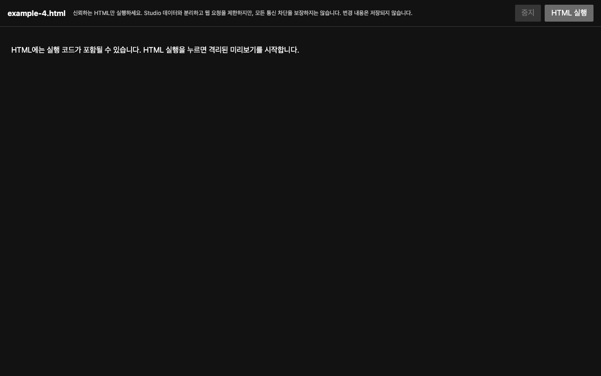
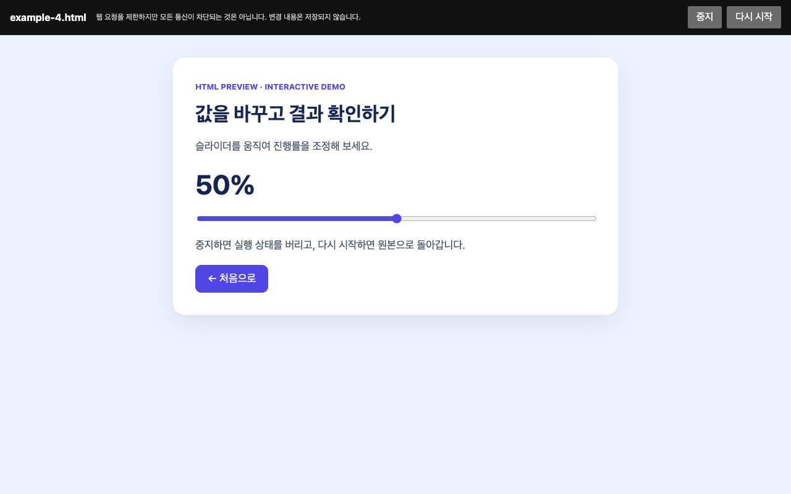
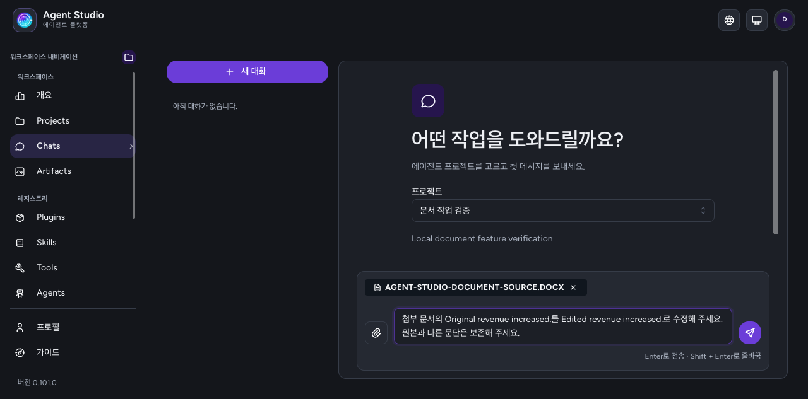
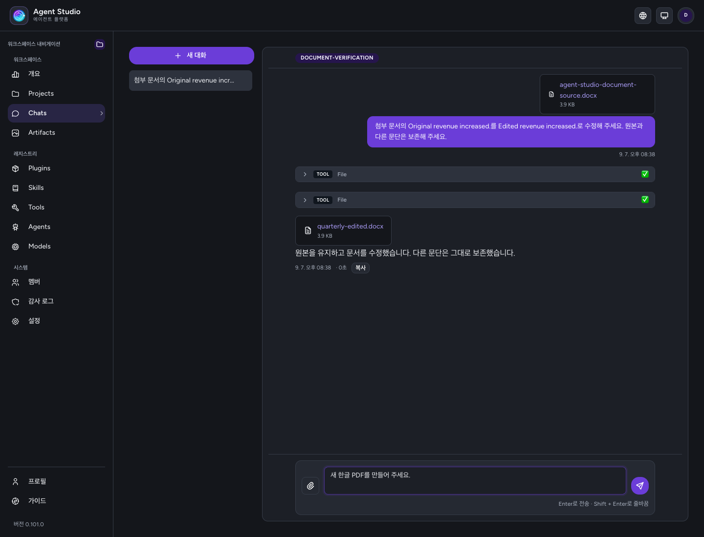

# 문서 엔진

문서 형식 처리는 `src/infrastructure/documents/`가 소유한다. MCP 서버 등록이나
프로젝트 Agent binding 없이 동작하며 파일 ID, 사용자 권한, 저장소, 다운로드 URL은
엔진 밖에서 관리한다. 문서의 외부 링크나 매크로는 실행하지 않는다.

## 읽기

첨부와 URL 읽기는 `DocumentExtractor` 포트를 공유한다. 배포는
`workerAdapters.ts`를 통해 작업을 자식 프로세스로 보내고, 그 안에서
`src/infrastructure/llm/documentExtractor.ts`가 형식별 추출을 수행한다.
PDF는 텍스트 레이어를 추출하고 HTML은 활성 내용을 제거하며 평문은 UTF-8을 검증한다.
Office 문서는 내부 `engine/read/`로 전달한다. DOCX, XLSX, PPTX, HWP 5.x, HWPX,
ODT/ODS/ODP, RTF를 지원한다. 암호화 파일, HWP 3.0, 구형 DOC/XLS/PPT는 지원하지 않는다.

RTF는 문서의 `ansicpg`로 연속 hex·원시 바이트를 해석한다. 기본값은 Windows-1252이며,
866·874·932·936·949·950·1250–1258·10000·10007·65001을 지원한다. 미지원 선언과
그룹·제어 경계에서 끊긴 바이트열은 오류로 거절한다. CP949는 번들에 포함한 decoder로
확장 한글까지 읽으며 런타임 다운로드가 없다. 폰트별 `fcharset`·`cpg` 전환은 지원하지 않는다.

Office 읽기는 Markdown으로 표현할 수 있는 내용과 구조를 추출한다. 원본 파일의
보존 편집을 뜻하지 않는다. 내부 Office 읽기 결과의 `complete`, `omissions`, `counts`는
추출 범위와 누락을 나타낸다. 외부 추출 포트는 `text`와 `note?`만 반환한다. 첨부는 `documentLimits.ts`의 더 작은 문자 예산을 적용한다.

## 형식별 작업 범위

| 형식 | 읽기 | File 검사 | 원본 편집 | 새 파일 생성 |
|---|---|---|---|---|
| UTF-8 평문·Markdown·CSV·JSON·HTML 등 | 텍스트(HTML은 활성 내용 제거) | 원문 텍스트 | 유일한 문자열 교체 | SaveFile의 지원 MIME |
| PDF | 텍스트 레이어 | 미지원 | 미지원 | File |
| DOCX·PPTX·HWPX | 텍스트와 구조 | 구조 또는 텍스트 대상 | 선택한 텍스트 요소 교체 | File |
| XLSX | 셀 텍스트 | 셀·수식·저장된 값 | 셀 값·수식 교체 | File |
| HWP 5.x·ODT/ODS/ODP·RTF | 텍스트와 구조 | 읽기 전용 구조 | 미지원 | 미지원 |
| 저장된 SVG | File로 마크업 읽기 | 원문 마크업 | 유일한 문자열 교체 | SaveFile |

SVG는 일반 문서 첨부의 대상이 아니며, 위 작업은 이미 보관된 SVG artifact에 적용한다.
PNG·JPEG는 문서 생성의 이미지 asset으로 사용한다. OCR과 원본 PDF 편집은 제공하지 않는다.

## 생성

`DocumentRenderer` 포트는 `src/domain/document/processor.ts`에 정의한다.
`renderer.ts`는 DOCX, PDF, HWPX, PPTX, XLSX 생성기를 조합한다. 앞의 네 형식은
Markdown을 받고 XLSX는 이름이 있는 시트와 셀 배열을 받는다. 수식은 명시적인
`formula` 셀로만 생성하며 `cachedValue`를 계산하거나 검증하지 않는다.

생성은 바이트와 MIME, 개수 정보, 검증 결과를 반환한다. 저장하거나 공개하지 않는다.
결과 파일은 다시 열어 구조를 검증하고, 지원하는 형식은 내부 reader로 내용도 읽는다.
`visual: not_run`은 시각 검증을 하지 않았음을 명시한다.
XML 직렬화는 XML 1.0 금지 문자와 짝이 없는 surrogate를 거절한다.

DOCX, PPTX, PDF는 PNG·JPEG asset을 삽입한다. PDF에 실제 삽입하는 PNG는 합계
16,777,216픽셀로 제한하며, 애니메이션·중복 IHDR·잘못된 할당 관련 헤더를 디코딩 전에 거절한다. HWPX와 XLSX에 asset을 전달하면
조용히 버리지 않고 거절한다. PDF의 한글 폰트는 `assets/document-fonts/`에 포함하며
런타임 다운로드를 요구하지 않는다. 폰트의 라이선스는 같은 디렉터리의 `OFL.txt`다.

문서 생성 시각은 호출자가 전달한다. 문서 엔진의 파서·렌더러 회귀 테스트는
`tests/documentEngine/`, 어댑터를 통과하는 읽기·생성 검증은
`tests/nativeDocumentExtractor.test.ts`와 `tests/documentRenderer.test.ts`에 있다.

## 검사와 원본 편집

`DocumentEditor` 포트의 `inspect`는 편집 대상을 돌려주고 `edit`는 원본을 수정하지
않은 채 새 바이트를 반환한다. DOCX·PPTX·HWPX는 `part`, `index`, `text`로 지목하는
텍스트 요소를 검사한다. `replace_text`는 현재 텍스트가 일치하는 단순 텍스트 요소만
교체한다. 문단 추가, 표 구조 변경, 줄바꿈 삽입은 이 연산의 범위가 아니다. 대상 요소
밖의 XML과 나머지 패키지 항목은 보존한다. 텍스트 길이에 따른 배치 변화는 시각 검증이
필요하며 엔진은 시각 검증을 수행했다고 보고하지 않는다.

XLSX 검사는 셀 주소·저장된 값·수식을 보여 준다. 숨긴 시트는 `File` 인자의
`include_hidden`(내부 포트의 `includeHidden`)으로
명시해야 포함한다. `set_cell`은 시트 이름과 셀 주소로 값을 바꾸거나 빈 위치에 셀·행을
추가한다. 셀 스타일과 관계없는 패키지 항목은 보존한다. 입력 셀이 다른 수식의 선행
값일 수 있으므로 모든 시트의 수식 캐시를 제거하고, 기존 계산 체인과 그 선언을
제거하며, 워크북에 열기 시 전체 재계산을 요청한다. 엔진은 수식을 계산하지 않는다.
공유·배열·data-table 수식이 있는 시트는 편집하지 않는다. 병합 영역은 왼쪽 위 셀만
수정할 수 있다.
시트 연결은 주석을 제외한 실제 relationship 요소로 해석하며 네임스페이스 접두사를 허용한다.
편집은 relationship으로 시트 경로를 확인해야 하며, 누락된 연결을 파일명 순서로 추정하지 않는다.
외부 relationship이 있는 워크북은 편집을 거절하며, 외부 시트를 로컬 파일로 대신 읽지 않는다.

한 번에 최대 100개 편집을 적용한다. 중복·겹침 대상, 불일치하는 원본 텍스트, 서명 문서의 편집,
매크로 워크북의 편집은 거절한다. 서명 문서의 읽기 전용 검사는 허용한다. OPC 서명은 관례적인 경로뿐 아니라
content type과 루트 relationship 선언으로 식별한다. 결과를 반환하기 전에 ZIP을 다시 열고 문서 reader로 읽는다.
`tests/documentEditor.test.ts`는 실제 생성 파일을 편집한 뒤 원본 불변성, 나머지 패키지
항목 보존, 수식 캐시 제거, 손상·모호한 입력 거절을 검증한다.

## 첨부 원본

Chat은 `prepareDocumentAttachments`로 원본을 기존 artifact 저장소에 보관한다.
메시지에는 bounded 추출문과 `file` 참조만 넣는다. 모델에는 파일 ID를 설명하고 저장소
키나 서명 URL을 전달하지 않는다. 조회 화면은 파일 참조를 서명해 원본을 다운로드할 수
있게 한다. 추출에 실패했거나 텍스트 예산을 다 쓴 파일도 보관된 원본 참조와 첨부 순서는 유지한다.
저장소가 없거나 저장에 실패하면 그 사실을 경고하고 추출문으로 대화를 계속한다.

## 실행 도구

`File`은 agent 실행과 Playground의 agent 실행에 같은 조건으로 제공하는 기본 도구다.
실행하지 않는 프롬프트 미리보기에는 파일 도구 호출이 없다.
MCP 등록은 필요하지 않으며 문서 엔진과 artifact 저장소가 구성되어야 한다.
`operation`은 `read`, `inspect`, `create`, `edit`이고 기존 파일은 `file_id`로 지목한다.
읽기와 검사 결과만 모델 문맥에 들어가며, 생성·편집 바이트는 `EngineChunk.file`로
나가 실행 브래킷이 저장한다. `SaveFile`과 `File`의 생성·편집 요청은 런당 파일 상한을
호출 순서대로 공유하며 실패한 쓰기 시도도 계산한다. 파일 ID는 저장 전 예약하며 결과와 실제 artifact 행이 같은
ID를 사용한다. 수정본 행의 `derivedFrom`은 원본 ID를 기록한다.

사용자는 자신에게 귀속된 파일을 읽을 수 있다. 프로젝트 토큰은 시작 프로젝트 안에서
자신의 소유자에게 귀속된 파일만 읽고, 메시징·trigger actor는 시작 프로젝트 안의
동일 actor 파일만 읽는다. 서브에이전트에서도 시작 프로젝트 범위는 유지한다. 파일 ID나
저장소 키를 안다는 이유만으로 접근을 허용하지 않는다.

`create`는 Markdown 또는 XLSX 시트 배열을 받는다. 이미지 `assets`는 이름에서
PNG·JPEG artifact ID로 가는 매핑이며, 문서에서는 `asset://name`으로 참조한다.
평문·Markdown·CSV·JSON·HTML·SVG 생성은 기존 `SaveFile`을 사용한다. UTF-8 텍스트의
`edit`는 `part: text`, `index: 0`과 한 번만 나타나는 기존 문자열로 교체 대상을 지정한다.
JSON 편집 결과는 구문을 검사한다. 텍스트 편집 결과도 기존 파일을 덮어쓰지 않는다.
텍스트 편집은 최종 결과뿐 아니라 각 교체 직전의 예상 UTF-8 크기를 검사해 중간 결과도
`MAX_SAVED_FILE_BYTES`를 넘지 않도록 한다.

## HTML 실행 미리보기

HTML 원본은 수정하지 않는다. `/view`는 HTML을 즉시 실행하고 중지·다시 시작 버튼을 제공하며,
원본을 별도 불투명 origin의 sandbox iframe에 넣는다. JavaScript·버튼·입력·canvas·SVG를
보존하므로 단계형 문서의 나머지 화면에도 접근할 수 있다. `#목차` 링크는 iframe 문서 안에서
이동하며 사용자 정의 클릭 처리도 유지한다. 원문을 바깥 DOM에 삽입하지 않는다.
일반 웹 요청과 외부 이동을 제한하지만 완전한 무통신 sandbox는 아니다. 미리보기를 여는
즉시 코드가 실행되므로 신뢰하는 파일을 다룬다는 전제로 사용한다. 세부 경계는 [보안](../SECURITY.md#데이터-노출과-보존)을 따른다.

SaveFile 안내는 외부 CDN·fetch·storage에 의존하지 않는 단일 HTML을 요구하고, 저장이
브라우저 실행 검증을 뜻하지 않는다고 명시한다. 파일 내부의 로직 오류까지 자동으로 고치지는 않는다. 실행 중 감지된 script 오류와 차단된 리소스는 고정 안내로 표시한다. 같은 안내는 반복 갱신하지 않고 script 오류를 우선하며, 다시 시작하면 초기화한다.
`pnpm test:html-preview`는 제어 동작과 주요 보안 경계를 실제 Chromium에서 검증한다.

## 실행 자원

배포의 composition root는 `workerAdapters.ts`를 연결한다. 추출 포트의 읽기와 문서
생성·검사·편집은 별도 Node 자식 프로세스에서 수행한다. `File`의 SVG 마크업 읽기와
평문·SVG 검사·편집, `SaveFile`은 앱 프로세스에서 바이트 제한 아래 수행한다.
워커 작업마다 새 프로세스를 만들고 결과 수신·취소·실패·타임아웃 뒤 종료한다. 프로세스가 실제 종료된
뒤에만 동시 실행 슬롯을 반환한다. 앱 프로세스당 동시 실행 2개, 대기 8개이며 대기
시간을 포함한 작업 기한은 30초다. 초과 대기는 즉시 거절한다.

자식에는 환경변수로 `NODE_ENV=production`만 전달한다. 파일·네트워크 접근 권한은
실행 계정의 OS 권한을 따른다. 앱의 DB·S3·LLM 자격증명은 전달하지 않는다.
XLSX 시트 입력 JSON의 크기는 UTF-8 바이트로 측정한다.
V8 old-space는 256MiB로 제한한다. 이 값은 프로세스 전체 RSS 제한은 아니며, 별도의
입력·ZIP 전개·XML·셀 개수 제한이 외부 버퍼와 파서 작업량을 제한한다.

`pnpm dev`와 `pnpm build`는 esbuild로 `build/document-worker.cjs`를 만든다.
워커 의존성과 한글 폰트는 standalone 배포물에 포함한다. 런타임 패키지 설치나
외부 폰트 다운로드는 필요하지 않다. `pnpm test:documents`는 실제 IPC와 다섯 형식의
왕복을 검증한다. 현재 CI의 verify job에는 이 검사가 없으므로 standalone 배포물의 번들·폰트
검증이 필요하면 별도로 실행한다. 자동 검사 범위는 [개발 문서](../DEVELOPMENT.md#ci)를 따른다.

## 채널 간 파일 참조

프로젝트 실행 API, Slack·Telegram·Teams도 같은 첨부 보관 유스케이스를 사용한다.
각 실행에 제공한 원본은 해당 actor와 project에 귀속되며, 이력에서 다시 첨부하는 바이트는
그 실행의 첨부 사본으로 보관한다. `File` 도구는 사용자에게 보인 문서의 ID를 받아 작업한다.

생성 파일의 HTTP·OpenAI 응답은 다운로드 URL과 `fileId`를 함께 제공한다.
URL이 만료돼도 원본이
보관 중이고 호출자의 권한이 맞으면 `File` 도구로 다시 읽을 수 있다.
비공개 파일 Artifact도 같은 ID로 `read`·`inspect`할 수 있다. 원본 프로젝트의 현재 권한과
만료를 다시 확인하고 비공개 저장소에서 제한된 크기로 읽는다. 일반 파일 출력 저장소로
내용이 옮겨가지 않도록 비공개 입력의 `edit`와 문서 생성용 asset 사용은 거절한다.

메시징은 대화와 actor별 별도 transcript 키 아래 출력 파일 참조를 보관한다.
바이트와 서명 URL은 기록하지 않는다. 최근 20개 기록을 읽고, 기록당 최신 20개 파일과
런당 20,000자의 참조 문맥을 유지한다. 참조는 일반 transcript와 같은 7일 보존 정책을
따른다. 잘리거나 저장·복원이 실패하면 경고한다. 파일 자체의 보존 기간은 artifact 정책이다.

## Chat 화면

원본을 첨부한 뒤 수정 작업을 요청한다. 처리 후 원본과 수정본은 별도 다운로드로 남는다.
아래는 로컬 모의 LLM과 테스트 문서로 확인한 화면이다.

