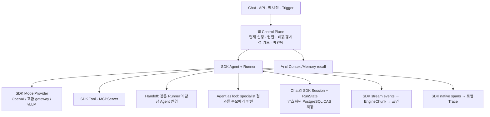

# 실행

Agent의 현재 설정, SDK 도구 실행, 이미지 도구와 실행 기록의 계약을 설명한다.

이것이 놓여 있는 형태 — 레이어, 진입점, 런 브래킷, `EngineChunk` 계약 — 는
[ARCHITECTURE.md](../ARCHITECTURE.md) 다. 여기서 이름 붙인 상한들은
[CONFIGURATION.md](../CONFIGURATION.md#코드에-고정된-제한) 에 고정돼 있다.

> 실행 불변식의 정본은 `src/application/runtime/AGENTS.md`다. SDK API는
> [OpenAI Agents SDK](https://openai.github.io/openai-agents-js/)의 계약을 직접 사용한다.

## Agent와 현재 설정

Agent는 이름으로 호출하는 Agent다. 공개 범위·소유권·연동·비용 정책과 현재
`AgentConfiguration`을 같은 Agent 행에 보관한다. 설정에는 모델·fallback·system prompt·
생성 파라미터·Skill·MCP·하위 Agent·실행 정책이 들어간다. 이미지 생성·편집은 Agent 도구다.

- `configurationUseCases`가 접근·소유자 검사, 모델 capability와 참조 검증, 시크릿 병합을 소유한다.
  저장은 전체 설정 교체이며 `expectedUpdatedAt`과 Agent의 `updatedAt`으로 동시 수정을 거절한다.
- `model`은 도구 호출을 지원하는 등록 텍스트 모델이다. `imageModel`은 이미지 도구의 모델이다.
  등록 모델의 capability 충돌은 거절하며 모델 선택과 가격 미확인 정책은
  [모델 설정](../CONFIGURATION.md#모델-등록과-사용)을 따른다.
- `mcpList`·`skillList`·`subagentList`의 중복과 새 참조를 검사한다. 기존 참조가 사라져도
  나머지 설정을 수정할 수 있다. MCP의 URL은 registry가 소유하고 Agent binding은 허용 도구와
  헤더를 설정한다. 헤더는 안정적인 Agent·서버 문맥으로 암호화하고 응답에서는 마스킹한다.
  저장 당시 URL fingerprint와 현재 URL이 다르면 옛 credential을 전송하지 않는다.
- `presencePenalty`는 -2부터 2까지이며 provider가 지원할 때 `presence_penalty`로 전달한다.
  미설정 값은 provider 기본값을 유지하며 하위 Agent는 자신의 설정을 사용한다.
- 모든 실행 창구가 Agent와 함께 읽은 현재 설정을 사용한다. 각 Agent는 준비 시점의 설정을
  유지한다. 로컬 하위 Agent는 실제 호출할 때 자기 Agent의 현재 설정을 읽으므로 부모 시작
  시점에 전체 하위 그래프가 고정되는 것은 아니다. 승인 대기에는 설정·연결 fingerprint를
  보존해 변경된 상태의 재개를 거절한다.
- 입력은 사용자 메시지이며 저장한 시스템 프롬프트와 함께 실행한다.

전체 HTTP 형태와 마스킹 규칙은 [Agent 설정 API](../API.md#agent-현재-설정),
Agent의 비용 정책은 [지출 가드](../OPERATIONS.md#지출-가드와-부하-가드)가 소유한다.

## Native Agent Runtime

이 앱은 Agent 운영 Control Plane이며 OpenAI Agents SDK가 기본 Agent Runtime이다.
앱은 현재 설정·바인딩·권한·자격 증명·한도·저장을 준비하고, SDK의 `Agent`와 `Runner`가
모델 턴·도구 실행·Handoff·Agent-as-Tool·Guardrail·승인 중단과 재개를 수행한다.
`src/application/runtime/`가 SDK 계약을 직접 사용한다. 자체 모델/도구 루프는 두지 않는다.
SDK의 각 기능을 어디까지 제공하는지와 선택적 실행 환경의 도입 조건은
[SDK 기능 적용 범위](sdk-capabilities.md)를 따른다.

### 역할과 소유권

| 개념 | 역할 |
|---|---|
| Skill | 읽을 수 있는 지식과 지침. `Skill` 도구로 필요한 본문/파일을 점진적으로 읽는다 |
| Tool | 실행 가능한 기능. SDK가 호출·결과를 관리하며 주입된 JSON Schema 검증기가 실행 전 인자를 검사한다 |
| MCP | 외부 도구 프로토콜. 앱이 검증한 연결과 alias 스냅샷을 SDK `MCPServer`로 제공한다 |
| Memory | Agent가 선택한 장기 지식/문맥. MCP recall 결과는 discovery와 프롬프트 준비에 사용한다 |
| Session | 특정 대화의 정확한 모델/도구 이력. Memory와 별도 저장·수명주기를 가진다 |
| Policy | 입력 Guardrail, 차단 도구, 승인이 필요한 도구 및 플랫폼 실행 한도 |
| Credential | 앱이 endpoint별로 해석하는 비밀. 모델 요청 시점과 도구 dispatch 경계에서 주입한다 |

`agentAssembly.ts`는 실제 실행과 Prompt preview의 도구·지침을 함께 조립한다. 실행할 수 없는
기능과 정책으로 차단한 기능은 모델에게 제공하지 않는다. MCP 연결의 SSRF 검증, OAuth,
사용자/대화 헤더와 연결 정리는 앱의 연결 경계가 소유하며 SDK의 전역 이름 기반 도구
캐시는 사용하지 않는다. 한 사용자에게 준비한 도구 목록을 다른 자격 증명으로 재사용하지 않는다.
선택적 Workspace·오디오 도구는 권한·설정 거부일 때만 목록에서 빠진다. 권한을 확인하는
저장소 읽기가 실패하면 실행 준비가 실패하며, 도구가 없던 것처럼 답하지 않는다.

### 모델과 실행

`runAgent`의 모델·도구 반복은 SDK가
수행하며, 앱 모델 wrapper는 모델별 설정·PII·사용량·컨텍스트 예산과 마지막 턴 정책을 적용한다.
마지막 허용 턴에는 도구를 제공하지 않고 현재 정보로 답하도록 지시한다. SDK의 `maxTurns`도
동시에 강제한다. 제공되지 않은 도구와 잘못된 인자는 SDK의 오류 결과/실패 계약을 따른다.

일반 JSON Schema를 SDK `tool()`에 전달하면 JSON 파싱만 제공하므로 별도의 실행 전 검증을
적용한다. `ToolSchemaValidator` 포트를 통해 MCP 패키지의 검증기를 주입하며 builtin·MCP·위임
도구의 선언을 그대로 검사한다. 필수 필드·타입·enum·중첩 구조·추가 필드 제한을 보존하고 값을
강제 변환하거나 삭제하지 않는다. PII 인자는 복원한 실제 dispatch 값을 검사한다. SDK 도구 입력
Guardrail은 승인 요청 전에 검사하며, 실패는 오류 도구 결과로 돌아가고 실행 슬롯과 부작용을
만들지 않는다. 승인된 호출도 실행 전
검증한다. 검증기가 없는 도구 실행, 해석할 수 없는 스키마와 외부 `$ref`는 거부한다.

`agentModels.ts`의 SDK `OpenAIChatCompletionsModel`은 배포가 지정한 endpoint로만 요청한다.
OpenAI, OpenAI-compatible gateway와 사내 vLLM은 같은 경로를 사용한다. 요청마다 endpoint와
credential을 다시 해석하며 bearer와 AWS SigV4를 지원한다. `store: false`를 사용하고 provider
conversation state에 의존하지 않는다. 숨은 HTTP 재시도는 없으며, 첫 출력 전 429/5xx에만
설정된 fallback 모델로 한 번 전환한다. 출력이 시작된 뒤에는 실패한 요청을 반복하지 않는다.
`/models` 진단도 같은 SDK 모델 어댑터를 사용한다.

SDK usage와 provider의 실제 청구 비용을 보존한다. 청구 비용이 없으면 모델 카탈로그의
가격으로 계산하고, agent 실행은 `createUsageAggregator`가 모델 호출별 값을 모아 종료 시
저장한다. `reasoning_content` dialect는 SDK 이력의 해당 모델 턴에 남긴다. `reasoningTrace`는
화면으로 보낼 reasoning만 제어하며 provider 재생 이력은 삭제하지 않는다.

SDK function tool 동시성은 5다. 실제 실행에 진입한 도구만 결과 예산 순서를 점유하므로,
승인 대기·인자 오류로 실행되지 않은 도구가 형제 도구의 완료를 막지 않는다. 텍스트 결과는
마스킹 → 예산 차감 → 복원한 화면 출력 순으로 처리하고 SDK에는 마스킹된 결과를 돌려준다.
파일 bytes는 모델 문맥에 넣지 않으며, 이미지는 domain 한도 내 inline bytes만 허용한다.
스트림 소비자의 backpressure와 취소는 자식 실행과 MCP 연결의 정리까지 기다린다.

### 호출 단위 모델 라우팅

Agent 설정의 `parameters.modelRouting`은 boolean 사용 여부만 저장한다. 모델 배정·작업별
정책·보안·예산·품질 기준은 Settings의 `modelRouting` 한 곳에 저장하며
Settings → Models → Model 사용 설정에서 관리한다. Agent 화면에는 스위치와 읽기 전용
tier 요약만 보인다. 미설정 Agent는 기존 도구와 주 모델을 그대로 사용한다.
설정한 Agent에는 같은 Run 안의 `ModelTask` 도구가 제공된다. 주 Agent의
SDK 턴은 항상 `model`을 사용하며 ModelTask의 `summary`, `classification`, `coding`,
`reasoning`, `vision` 호출만 별도 모델을 선택한다. 도구는 필요 문맥과 기존 이미지 핸들만
전달하며 다른 도구를 실행하거나 두 번째 Agent 루프를 만들지 않는다.

활성화 시 선택 순서는 명시적 모델 → 작업별 tier 정책 → Jev Choice → 주 모델이다.
비활성화하면 ModelTask도 주 모델을 사용하며 명시적 override와 Jev는 무시한다.
`tiers`는 관리자가 허용한 전역 등록 모델 목록이다. 명시적 모델은 이 목록 또는 주 모델에 있어야 하며,
잘못된 명시적 override는 다른 모델로 조용히 바꾸지 않고 거절한다. 작업별 정책의 모델이
사용 불가능하면 남은 후보를 Jev로 판단한다.

전역 정책은 Run 준비 시 스냅샷을 만들고 Handoff·위임에도 같은 스냅샷을 사용한다.
전역 정책 변경은 이미 진행 중인 Run을 바꾸지 않는다. 승인 대기에는 정책 fingerprint를
보관하고 재개할 때 비교하므로 다른 모델·예산·보안 조건으로 승인된 작업을 재생하지 않는다.
Agent가 라우팅 기능을 설정하지 않았으면 이 fingerprint 검사에 영향을 받지 않는다.

Jev에는 목적, 고정된 용어와 입력 크기로 만든 요약, 필요 기능, 예산과 사용 가능한 tier만
보낸다. 원문 substring, 모델 ID, 이미지 bytes, 도구·system prompt·자격증명은 보내지 않는다.
반환값은 `fast`, `general`, `coding`, `reasoning`, `vision` 중 실제 제공한 tier만 인정한다.
모델 등록·연결, 전역 모델 허용 목록, self-hosted 제한, 기능, 기존 context 예산과 비용 검사는
`callModelRouter.ts`가 모델 호출 직전에 다시 수행한다. 연결 해석 가능 여부와 Run 안의 실패
기록이 가용성 기준이며, 별도의 외부 health probe는 수행하지 않는다.

한 작업은 최대 네 번 시도한다. 같은 모델이 두 번 실패하거나 답변이 비어 있음·최소 길이
미달·출력 잘림·분류 JSON 형식 오류일 때 상위 tier로 승격한다. 텍스트 승격 순서는
fast → general → coding → reasoning이며 이미지 호출은 vision → reasoning 중 이미지 기능을
충족하는 모델을 사용한다. 마지막 시도는 주 모델 fallback에 남긴다. 취소는 즉시 전파하고,
기본 모델도 정책을 충족하지 못하거나 호출에 실패하면 도구 오류를 반환한다. 품질 검사는
출력의 구조·완결성을 검사하며 사실 정확성을 판정하지 않는다.

시도 전 카탈로그 가격과 보수적인 토큰 추정으로 예산을 예약하고 완료 응답의 실제 청구 비용으로
정산한다. 실패한 요청의 예약 비용은 청구 여부를 알 수 없으므로 보수적으로 남긴다. Jev의
비용도 같은 보조 호출 예산과 Run 사용량에 포함한다. 승인 체크포인트는 호출 수·소비 예산·
모델별 실패 횟수를 보존한다. `model-routing` native span에는 선택·거절·승격·실패 이유와
실제 모델만 저장하며 원문과 결과는 넣지 않는다. 각 생성 호출의 span과 usage는 실제 모델에
귀속된다. 결정 모델 미설정·오프라인·잘못된 tier 응답은 주 모델로 fallback한다.

### Handoff와 Agent-as-Tool

로컬 text agent는 `handoff_<name>`으로 담당 Agent를 바꾸거나, 최상위 Agent가 제공하는
`delegate_<name>`으로 specialist의 결과를 받은 뒤 계속 답할 수 있다. 인자는
`{ input: string, image_ids: string[] }`다. Handoff는 같은 Runner의 모델/도구 이력을 이어받고,
Agent-as-Tool은 SDK가 별도 실행을 관리한다. 후자의 요청에는 최신 SDK Session 이력에서
만든 한정된 배경 문맥을 전달한다.

앱은 요청된 대상의 현재 설정을 준비하고 순환, 깊이 5, 모델/비용 정책을 검사한다.
자식은 부모에게 남은 턴 수 이하로 제한되며 추가 Agent-as-Tool 병렬 위임을 제공하지 않는다.
필요한 로컬 Handoff와 이미지 도구는 자식에도 제공할 수 있다. 자식 실패는 부모의 오류
도구 결과와 경고가 되고, 부모는 남은 정보로 답할 수 있다.

`BoundAgent`는 SDK identity를 유지하면서 동시 호출의 모델·도구·Guardrail 자원을 분리한다.
각 위임 호출의 tool-call ID 공간도 분리한다. 승인 체크포인트를 읽을 때는 저장된 위임과
Handoff 선언을 먼저 복원하고, 승인된 SDK 객체를 실제 재개에도 사용한다.

### Session과 승인

Chat은 새 사용자 턴만 실행에 전달한다. SDK `Session`의 native items가 모델 이력이며,
화면용 `ChatMessage`의 합쳐진 응답이나 도구 행에서 이력을 다시 만들지 않는다.
Session은 `runtime_sessions`의 별도 행에 저장한다. 소유자·대화에 묶인 AES 인증 암호화와
revision CAS를 사용하고, 이력과 승인 대기 `RunState`를 한 번에 저장한다.

`parameters.policy`는 `maxInputChars`, `blockedTools`, `approvalTools`를 선언한다.
입력 크기는 PII 치환 전 텍스트를 기준으로 blocking SDK Guardrail로 확인한다. SDK가 처음
실행하는 Agent의 입력만 자동 검사하므로 Handoff는 대상 Agent의 같은 Guardrail을 명시적으로
실행하고 native span을 남긴다. Agent-as-Tool은 자식 Runner가 검사한다. 승인은 SDK `needsApproval`과
`RunState.approve/reject`를 사용한다. 승인 정책은 영속 Chat에서 지원한다. 다른 실행 표면은
해당 정책이 적용되는 실행을 거부한다. Handoff 대신 `delegate_<name>`에 승인 정책을 적용한다.
구체적인 HTTP 요청은 [Chat 승인 API](../API.md#chat-승인과-재개)를 따른다.

승인 대기 상태에는 현재 설정·도구/연결 fingerprint·이미지 핸들·소비한 예산·각 Agent의 PII 매핑을
보존한다. 재개 전 pending revision을 running으로 원자적으로 선점한다. 중복 결정과 바뀐
설정/바인딩은 거부한다. 승인 이후 프로세스가 중단되어 결과가 불확실하면 자동 재실행하지
않는다. 사용자는 기록을 확인한 뒤 미완료 실행을 폐기할 수 있다. 폐기는 화면 기록을 보존하고
미완료 실행만 이후 모델 문맥에서 제외한다.

기존 Chat의 Session이 없거나 만료되었으면 새 모델 문맥으로 시작한다는 경고를 전달한다.
일반 Session 문맥은 오래된 완전한 사용자 턴부터 생략하고 최신 턴은 보존한다. 가장 최근
inline 이미지 4개를 남기며 생략한 이미지에는 텍스트 표시와 경고를 남긴다. 생성된 이미지의
편집 핸들도 다음 턴에 전달한다. 전체 암호화 payload의 원문 크기에는 별도 저장 상한이 있다.
실행 오류·취소로 완료되지 않은 새 턴은 정상 Session 완료 이력으로 커밋하지 않는다.
Chat 삭제는 tombstone으로 늦게 끝난 실행의 이력 재생성을 막는다.

### 로컬 Tracing

SDK의 기본 공개 exporter는 로컬 `TracingProcessor`로 교체한다. 각 Agent의 앱 Trace에
native Agent·generation·function·MCP listing·Guardrail·Handoff span을 연결하며 native
span ID와 부모 ID를 보존한다. 모델 입력·출력, 도구 인자와 credential은 수집하지 않는다.
로컬 수집의 async context는 route bundle 사이에서도 프로세스 단위로 공유한다.
ModelTask는 청구된 generation span을 직접 소유하며 어댑터의 중첩 span은 수집하지 않는다.
승인 대기 실행은 `awaiting-approval` 상태다. 선택적인 운영 OTLP 전송은 배포가 구성한
기존 exporter를 통하며, 기본 실행에는 외부 tracing 서비스나 OpenAI API key가 필요 없다.

## Images

이미지의 생성·편집은 `ImageChannel` 포트에서 만난다. Agent와 하위 Agent 모두
`application/execution/imageTool.ts`의 GenerateImage·EditImage를 사용한다.
`parameters.imageGeneration`이 도구 제공을 제어하며 `imageModel` 또는 사용 가능한 첫 이미지
모델로 실행한다. Agent 행동 지침을 이미지 스타일로 복사하지 않는다.

원본 이미지가 있으면 편집하고 없으면 생성한다. `img_1` 같은 핸들은 사용자 첨부와 생성 결과를
지목하며 위임의 `image_ids`로 전달할 수 있다. 이미지 bytes는 같은 Agent 실행의 출력 축이다.
편집 미지원은 도구 오류로 보고하고 호출자 취소·deadline·provider 실패는 signal과 공통 종료
판정으로 구분한다.

### Provider adapter

현재 `infrastructure/llm/imageChannel.ts`는 다음 형태로 요청한다.
이는 adapter의 구현 계약이며 실제 모델·route의 지원 여부는 배포 채널에서 확인해야 한다.

| 대상 | 생성·편집 요청 | 응답·제약 |
|---|---|---|
| 일반 Images API | SDK의 `images.generate` / multipart `images.edit`; size·quality 전달 | `b64_json`, `mime_type`과 image usage를 읽는다 |
| xAI | JSON 요청, size를 `aspect_ratio`·`resolution`으로 변환 | base64 응답 요청, quality 생략, mask 편집 거절 |
| OpenRouter | `/images`; 편집은 `input_references`를 추가 | `media_type`과 completion usage를 읽고 quality·mask를 보내지 않는다. mask 요청은 거절한다 |

SigV4 image 채널은 지원하지 않는다. 응답 크기·base64·MIME·이미지 한도를 검사하고
이미지 모델의 endpoint와 credential은 함께 해석한다.
회귀 검사는 `tests/imageChannelAdapter.test.ts`가 각 wire 형태를 고정한다.

`toImageUsageRecord`가 text input·image input·image output을 Usage의 형태로 변환한다.
provider가 입력 종류를 구분하지 않으면 분할을 추측하지 않는다.
생성·편집은 같은 결과 처리에서 사용량을 한 번 정산하고 `EngineChunk.usage`로 전달한다.
응답·Chat의 사용량 합계에는 이미지 호출도 포함하며, Trace에는 호출한 이미지 모델의
generation span을 도구 span 아래에 기록한다. 이미지 bytes는 별도의 `image` 축으로 전달한다.
토큰 사용량이 없는 모델은 카탈로그의 장당 가격을 사용할 수 있으며, 이미지 비용은
provider 청구액을 그대로 보관하는 텍스트 경로와 다르다.
가격의 정본과 미등록 정책은 [CONFIGURATION](../CONFIGURATION.md#모델-등록과-사용)을 따른다.

이미지는 공통 chunk로 표면에 전달된다. Chat은 저장 참조와 라이브 bytes를 사용하고,
메신저는 플랫폼에 업로드하며, completion 응답은 `images` 확장을 사용한다.
화면의 서명 URL은 SDK Session의 inline 이미지 이력과 별개다.
후속 모델 턴이 사용자 지정 원격 URL을 provider에게 넘겨 가져오게 하지 않는다.

## Artifacts

Artifact는 보관한 파일의 metadata이며 bytes는 객체 저장소에 둔다.
사용자 첨부는 첨부 보관 유스케이스, 실행 출력은 최상위 `openRun`의 recorder가 저장한다.
producer마다 저장 로직을 두지 않아 이미지 builtin·하위 Agent·MCP 출력을 함께 다룬다.

| Chunk | `captureRunArtifacts`의 처리 |
|---|---|
| `image` | bytes를 저장하고 `artifactId`·`key`를 추가한다. 라이브 표시에 쓸 bytes는 유지한다 |
| `image.fetched` | 모델이 URL에서 읽은 이미지로, 생성 Artifact로 보관하지 않는다 |
| `file` | 저장 시도 후 bytes를 제거하고 파일명·크기·참조를 남긴다. 실패하면 다운로드가 없음을 알린다 |

recorder가 없는 배포에서는 캡처 wrapper가 원래 chunk를 통과시킨다.
파일 소비자는 `producedFiles.ts`로 저장 참조·URL·손실을 처리하며, bytes가 있다는 이유만으로
영속 다운로드를 제공했다고 보지 않는다. 파일 bytes는 모델 문맥에 들어가지 않는다.
파일 주소를 만들 수 없으면 해당 축만 경고로 바꾸고, 같은 chunk의 위임 출처와 다른 출력 축은 유지한다.

내장 File·SaveFile은 저장할 ID를 미리 예약하고 recorder가 같은 ID를 사용한다.
편집본의 `derivedFrom`은 원본을 지목하며 덮어쓰지 않는다. 다른 표면도 `fileId`로 파일을
참조할 수 있다.
읽기·편집 권한은 [문서 설계](documents.md#채널-간-파일-참조)를 따른다.

Artifact는 agent·actor·run ID·위임 경로를 기록한다.
`model`은 실제 생성자가 명시한 이미지 모델만 사용하고 부모 Agent 설정에서 추측하지 않는다.
MCP가 준 bytes나 첨부처럼 모델을 확정할 수 없는 경우에는 비운다.
저장 실패는 원래 응답을 실패로 바꾸지 않고 손실 건수와 제한된 원인 분류를 경고한다.

### 소유권과 읽기

`artifactOwnerEmail`은 email actor 또는 표면이 확인한 별도 이메일로 개인 귀속을 정한다.
이메일이 없는 결과는 Agent 목록에서 관리하며 Agent 소유자 이메일을 임의로 채우지 않는다.
개인 목록과 Agent 목록의 DB 주소는 [저장 키 지도](../ARCHITECTURE.md#postgresql-아이템-테이블-설계)에 있다.

일반 파일은 생성·첨부 소유자 또는 Agent 소유자/admin이 읽고 삭제한다.
일반적인 public Agent 실행 권한만으로 남의 출력에 접근하지 못한다.
비공개 오디오 source 파일은 파일 소유권·현재 Agent 접근·상태·만료를 별도로 검사한다.

일반 파일의 주소는 `ARTIFACT_ACCESS_MODE`에 따라 proxied·pre-signed·직접 URL로 해석한다.
proxied 모드의 bytes도 앱을 통해 전달되며 URL token이 읽기 credential이다.
다운로드·미리보기·원본 파일의 접근 방식은 같지 않다.
[보안](../SECURITY.md#데이터-노출과-보존)이 URL 수명과 CSP를 소유한다.

### 미리보기와 삭제

`inlineViewOf`가 텍스트 기반 파일의 미리보기 형태를 고른다.

| 형식 | 표시 |
|---|---|
| HTML | 선언한 charset으로 엄격하게 디코딩해 sandbox iframe에서 실행 |
| Markdown | Chat과 같은 Markdown 렌더러; raw HTML은 텍스트 |
| CSV | 표로 표시하고 행 상한을 넘으면 생략을 알린다 |
| JSON | 유효하면 들여쓰기, 아니면 원문과 오류 안내 |
| SVG | `data:` 이미지로 표시 |
| 평문 | 원문 텍스트 |

`/api/artifacts/{id}/view`는 매번 읽기 권한을 검사한다.
HTML의 Stop/Restart는 iframe 실행 상태만 바꾸며 원본을 저장하지 않는다.
다른 텍스트 미리보기는 스크립트를 실행하지 않는다. 지원 범위와 제한은
[문서 미리보기](documents.md#html-실행-미리보기)를 따른다.

삭제는 객체 먼저, metadata 행 나중에 처리해 중단되면 다시 시도할 수 있게 한다.
남의 출력을 제거하면 `artifact.delete` 감사 기록을 남긴다.
Chat은 파일 참조를 갖지만 Chat 삭제·만료가 일반 Artifact를 지우지는 않는다.
반대로 Artifact를 지우면 기존 대화의 파일은 사용할 수 없음으로 표시된다.

metadata TTL, 객체 lifecycle, 비공개 source 파일 정리는 서로 다른 경로다.
[OPERATIONS](../OPERATIONS.md#행-보존)에 따라 각각 설정한다.
