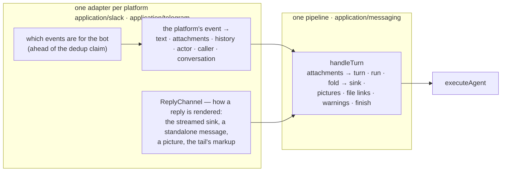

# Messaging surfaces

What every chat-bot surface — Slack, Telegram, and whatever comes next — shares, and where
the line sits between that and what each platform decides for itself.

The Slack surface was the first, and it was one file: which events are for the bot, how the
thread is read, who is asking, how attachments become a turn, how the run's chunks become a
reply, and what the reply carries beside the answer, all in one handler. Telegram was the
second, and it needs four of those six exactly as Slack has them. Two copies of a chunk fold
is how the image and file axes had already drifted apart across six other consumers, so the
shared part was pulled out before the second surface was written. **The rule of three was
met early on purpose**: the shape was already known from Slack, and Telegram is the shape's
first customer, not its second copy.

## The split

**The pipeline owns what does not depend on the platform.** `handleTurn`
(`src/application/messaging/handleTurn.ts`) takes a normalised turn and a `ReplyChannel` and
does the rest: it turns the attachments into content parts under the shared limits
(`attachments.ts` — the one copy of which files are pictures, which are documents, how many
and how large, and the sentence each dropped one earns), assembles the turn with
`turnContent`, opens the run's deadline and the status heartbeat, runs the agent, folds each
chunk onto the sink — text as `push`, tool calls as `step`, tool results as `stepDone`, only
a top-level error ends the run — and then delivers what sits beside the answer, in this
order: the pictures (a drawn one over a merely fetched one), links to the files a tool
produced, and every warning the run raised, "the run finished without producing an answer"
included when it did. It returns what it delivered so the adapter can log and record.

**The adapter owns everything a platform decides.** Which delivered events cause a run, and
that decision runs in the route *ahead of* the dedup claim so an event nobody addressed
costs a signature check and nothing else. How history is read — Slack asks the platform,
Telegram asks the transcript store below. Who is asking, in the shape `callerFrom` accepts.
The reply target and how a reply is rendered on it. And what happens after the reply: a
Slack thread records that the bot spoke there; a Telegram conversation writes both turns
down.

The **ports** are domain vocabulary (`src/domain/messaging/`), because both sides name them
and neither may import the other:

| Port | Says |
|---|---|
| `ReplySink` | The streamed answer and its progress: `status`, `step`, `stepDone`, `keepStatusAlive`, `push`, `finish`. One report, rendered however the surface can — Slack's status line and task rows, Telegram's typing indicator |
| `ReplyChannel` | The sink plus what a reply needs the surface to do beside it: `say` a standalone message, `sendImage`, and spell a `fileLink` and a `warningLine` in the surface's own markup — because a link is markup, and a name that is safe in mrkdwn is syntax in HTML |
| `InboundAttachment` / `HistoryTurn` | What the pipeline reads of a message: a name, a type, a size, and a `download` bound to the platform's credentials — or none, when the platform gave no address, which is reported as such rather than as a failed read |
| `InboundEventClaims` | Exactly-once admission of a delivery, as a lease settled afterwards. Slack keys it by `event_id`, Telegram by project and `update_id`; one repository (`createInboundClaimRepository`) serves both |
| `ConversationTranscriptRepository` | What a surface remembers of a conversation when the platform keeps no history it can read back — see [Telegram](telegram.md#history) |

The **webhook tail** is shared the same way (`src/app/api/_lib/inboundEvent.ts`): after the
platform's own verification and gate, `admitInboundEvent` claims the event, schedules the
work in the background under the event's own correlation id, and settles the claim. Every
platform requires a fast ack and redelivers without one, so the shape is the same; only the
id, the store and the work differ.

## What a third surface has to bring

An adapter is a directory under `application/<platform>` plus a client under
`infrastructure/<platform>` and a wiring site under `app/api/<platform>/…/_lib/`. It brings:

- a **client port** in `domain/<platform>/client.ts` and its fetch adapter;
- a **gate** — which of the platform's events are for the bot — run in the route before the
  claim;
- an **update handler** that resolves the project (published version only; the refusal
  wording is shared by convention), normalises the event into a `TurnInput`, opens a
  `ReplyChannel`, says "thinking" once, calls `handleTurn`, and does the platform's
  bookkeeping after;
- a **`ReplyChannel`** for the platform's rendering, with the tests every channel has to
  pass (`tests/messagingTurn.test.ts` states the contract from the pipeline's side);
- a **settings slice** for the per-project credentials, encrypted like every other secret;
- one line each in `RunActorKind`, `RunSurface`, `keys.ts`, `ttl.ts`, the logger's scopes,
  and the two lists in `tests/architecture.test.ts` that bound wiring sites and agent-run
  entry points — added *on purpose*, which is what the lists are for.

What it must **not** bring is a second copy of the fold, the attachment limits or the tail's
ordering. Those are the pipeline's, and a surface that answers differently in one of them is
a bug in the surface, not a variant.

## What deliberately stays outside

Chat, A2A and the triggers each consume the engine's stream too, and each keeps its own
loop. That is not an oversight this file will grow to cover: a chat *persists and replays*
tool traffic, an A2A task has a lifecycle, a firing has a history row — their output
contracts differ from a chat bot's and from each other's, and the facade already offers them
the two contracts they need (`streamProjectRun` for a chunk consumer, `executeProjectStream`
/ `executeProject` for a completion). What binds all of them is not a shared loop but the
pairing rule in `tests/architecture.test.ts`: a module that reads one output axis reads the
other. Slack's own concepts — the assistant thread's status line, the channel checklist,
`app_home_opened`, channel keywords, the workspace read tools — stay in Slack's adapter for
the same reason: they are how Slack renders the shared report, not the report.
