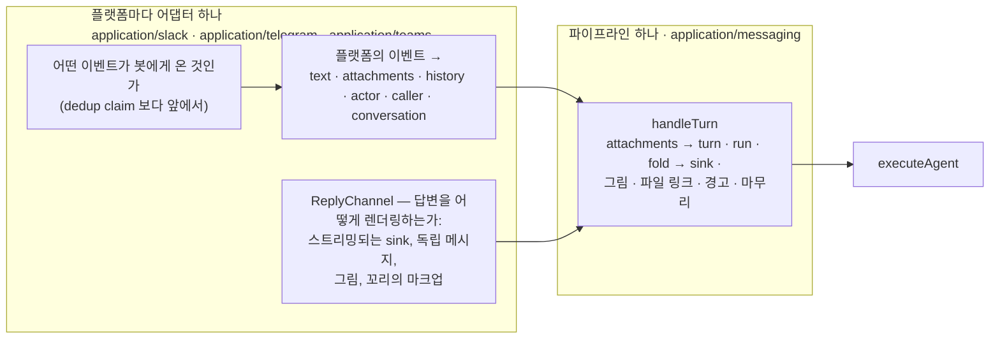

# 메시징 표면

모든 챗봇 표면 — Slack, Telegram, Microsoft Teams, 그리고 다음에 올 무엇이든 — 이 공유하는
것, 그리고 그것과 각 플랫폼이 스스로 정하는 것 사이의 경계가 어디인지.

공통 코드는 첨부·실행·chunk fold·파일 링크·경고·응답 마감을 맡는다.
플랫폼 adapter는 인증·참여 판단·이력 수신·렌더링을 맡는다.
Telegram·Teams의 편집 응답은 `editInPlaceReply.ts`, 대화 기록은
`transcriptHistory.ts`와 `rememberedTurn.ts`를 공유한다.

## 분할

**파이프라인은 플랫폼에 의존하지 않는 것을 소유한다.** `handleTurn`
(`src/application/messaging/handleTurn.ts`) 은 정규화된 턴과 `ReplyChannel` 을 받아 나머지를
한다: 공유 한도 아래에서 첨부를 content part 로 바꾸고 (`attachments.ts` — 어떤 파일이
그림이고 어떤 것이 문서인지, 몇 개까지 얼마나 큰 것까지인지, 그리고 버려진 첨부 하나하나가
받아 마땅한 문장의 유일한 사본이다), `turnContent` 로 턴을 조립하며, 런의 deadline 과 상태
heartbeat 를 열고, agent 를 실행하고, 각 chunk 를 sink 위로 fold 한다 — 텍스트는 `push` 로,
tool call 은 `step` 으로, tool result 는 `stepDone` 으로, 그리고 top-level 에러만이 런을
끝낸다 — 그런 다음 답 곁에 놓이는 것들을 이 순서로 전달한다: 그림 (단지 가져오기만 한 것보다
그린 것이 우선), tool 이 만들어 낸 파일로 가는 링크, 그리고 런이 올린 모든 경고 — 그런 일이
있었다면 "런이 답을 만들지 못한 채 끝났다"도 포함해서다. 어댑터가 로그를 남기고 기록할 수
있도록, 자신이 전달한 것을 돌려준다.

문서 첨부는 내장 추출기로 PDF·텍스트·Office 형식을 읽는다. Office 문서에도 MCP 연결이나
Agent binding이 필요하지 않으며, 파일 바이트를 외부 문서 서버로 전달하지 않는다.

**어댑터는 플랫폼이 정하는 모든 것을 소유한다.** 전달된 이벤트 중 어느 것이 런을 일으키는지,
그리고 그 판정은 라우트에서 dedup claim *보다 앞에서* 실행되므로 아무도 부르지 않은 이벤트는
서명 검사 하나만 쓰고 끝난다. 이력을 어떻게 읽는지 — Slack 은 플랫폼에 묻고, Telegram 과
Teams 는 아래의 transcript 저장소에 묻는다. 누가 묻고 있는지를 `callerFrom` 이 받는 모양으로. 답변
대상과 그 위에서 답변이 어떻게 렌더링되는지. 그리고 답변 이후에 일어나는 일: Slack 스레드는
봇이 거기서 말했다는 것을 기록하고, Telegram 과 Teams 대화는 두 턴을 모두 적어 둔다.

**port** 는 domain 어휘다 (`src/domain/messaging/`). 양쪽 모두가 그것을 이름으로 부르고
어느 쪽도 상대를 import 할 수 없기 때문이다:

| Port | 무엇을 말하는가 |
|---|---|
| `ReplySink` | 스트리밍되는 답과 그 진행 상황: `status`, `step`, `stepDone`, `keepStatusAlive`, `push`, `finish`. 보고는 하나이고 표면이 할 수 있는 방식대로 렌더링된다 — Slack 의 상태 줄과 작업 행, Telegram·Teams 의 입력 중 표시. 편집으로 답을 전달하는 표면(Telegram, Teams)은 `application/messaging/editInPlaceReply.ts` 의 공유 구현에 플랫폼의 호출·상한·렌더링(`EditInPlaceTransport`)만 건넨다 |
| `ReplyChannel` | sink 에, 답변이 그 곁에서 표면에 요구하는 것을 더한 것: 독립 메시지를 `say`, `sendImage`, 그리고 `fileLink` 와 `warningLine` 을 표면 자신의 마크업으로 적는 것 — 링크는 곧 마크업이고, mrkdwn 에서 안전한 이름이 HTML 에서는 문법이기 때문이다 |
| `InboundAttachment` / `HistoryTurn` | 파이프라인이 메시지에서 읽는 것: 이름, 타입, 크기, 그리고 플랫폼의 자격 증명에 묶인 `download` — 플랫폼이 주소를 주지 않았다면 없음이며, 그것은 읽기 실패가 아니라 없다는 사실 그대로 보고된다 |
| `InboundEventClaims` | 전달의 중복을 억제하는 조건부 claim과 settle이다. 실패·만료 lease의 재전달은 다시 받을 수 있으므로 외부효과의 exactly-once를 보장하지 않는다. Slack 은 `event_id` 로, Telegram 은 project·봇·`update_id` 로, Teams 는 project·App ID·activity id 로 키를 만든다. repository 하나 (`createInboundClaimRepository`) 가 모두 담당한다 |
| `ConversationTranscriptRepository` | 플랫폼이 되읽을 수 있는 이력을 보관하지 않을 때, 표면이 대화에 대해 기억하는 것 — [Telegram](telegram.md#히스토리) 참고. 읽기 예산·기록 규칙·화자 라벨은 `application/messaging/transcriptHistory.ts` 한 곳이다 |

**webhook 꼬리**도 같은 방식으로 공유된다 (`src/app/api/_lib/inboundEvent.ts`): 플랫폼 자신의
검증과 gate 를 지나면 `admitInboundEvent` 가 이벤트를 claim 하고, 이벤트 자신의 correlation
id 아래 백그라운드로 작업을 예약하며, claim 을 정산한다. 모든 플랫폼이 빠른 ack 를 요구하고
없으면 재전달하므로 모양은 같다. 다른 것은 id 와 저장소와 작업뿐이다.

## 새 표면을 추가하기

어댑터는 `application/<platform>` 아래의 디렉터리 하나에, `infrastructure/<platform>` 아래의
클라이언트와 `app/api/<platform>/…/_lib/` 아래의 wiring site 를 더한 것이다. 어댑터가
가져오는 것:

- `domain/<platform>/client.ts` 의 **클라이언트 port** 와 그 fetch 어댑터,
- **gate** — 플랫폼의 이벤트 중 어느 것이 봇에게 온 것인지 — claim 보다 앞서 라우트에서
  실행되는 것,
- **update handler** — 프로젝트를 해석하고 (현재 설정. 거절 문구는 관례로 공유한다),
  이벤트를 `TurnInput` 으로 정규화하고, `ReplyChannel` 을 열고, "생각 중"을 한 번 말하고,
  `handleTurn` 을 호출하며, 그 뒤에 플랫폼의 장부 정리를 하는 것,
- 플랫폼의 렌더링을 위한 **`ReplyChannel`** 과, 모든 channel 이 통과해야 하는 테스트
  (`tests/messagingTurn.test.ts` 가 파이프라인 쪽에서 본 계약을 진술한다),
- 프로젝트별 자격 증명을 위한 **설정 slice**. 다른 모든 시크릿과 마찬가지로 암호화된다,
- `RunActorKind`, `RunSurface`, `keys.ts`, `ttl.ts`, 로거의 scope, 그리고
  `tests/architecture.test.ts` 에서 wiring site 와 agent-run 진입점을 한정하는 두 목록에
  각각 한 줄씩 — *일부러* 추가하는 것이고, 그것이 그 목록이 존재하는 이유다.

가져오면 **안 되는** 것은 fold 의 두 번째 사본, 첨부 한도의 두 번째 사본, 꼬리의 순서에 대한
두 번째 사본, 그리고 답이 메시지 하나를 넘칠 때 어디서 끊는지에 대한 두 번째 사본
(`src/shared/messageCut.ts`, 상한만 표면이 건넨다)이다. 그것들은 파이프라인의 것이고, 그중 하나에서 다르게 답하는 표면은 변종이
아니라 그 표면의 버그다.

## 의도적으로 밖에 남겨 둔 것

Chat 과 A2A 와 trigger 도 각각 엔진의 스트림을 소비하며, 각자 자기 루프를 유지한다. 그것은
이 파일이 언젠가 자라서 덮게 될 누락이 아니다: Chat은 화면 기록과 SDK Session을 따로 영속화하며,
A2A task 에는 lifecycle 이 있고, 발화(firing) 에는 이력 행이 있다 — 이들의 출력 계약은
챗봇의 것과도, 서로의 것과도 다르며, 파사드는 이들에게 필요한 두 계약을 이미 제공한다
(chunk 소비자에게는 `streamProjectRun`, completion 에는 `executeProjectStream` /
`executeProject`). 이들 전부를 묶는 것은 공유된 루프가 아니라 `tests/architecture.test.ts`
의 pairing 규칙이다: 한 출력 축을 읽는 모듈은 다른 축도 읽는다. Slack 자신의 개념들 —
assistant 스레드의 상태 줄, 채널 체크리스트, `app_home_opened`, 채널 키워드, workspace 읽기
tool — 도 같은 이유로 Slack 의 어댑터 안에 남는다: 그것들은 공유된 보고를 Slack 이 렌더링하는
방식이지, 보고 자체가 아니다.
