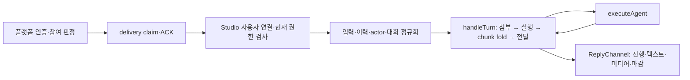

# 메시징 표면

Slack·Telegram·Teams는 같은 첨부·Agent 실행·chunk fold·결과 전달 파이프라인을 사용한다.
플랫폼별 인증·참여 판단·히스토리 수신·렌더링은 각 adapter가 소유한다.
설정과 수치는 [CONFIGURATION](../CONFIGURATION.md#코드에-고정된-제한),
HTTP 인증과 중복 처리는 [SECURITY](../SECURITY.md#머신-호출자의-요청-인증)를 따른다.

## 호출자 인증

메신저의 전달 인증과 Studio 사용자의 실행 권한은 별도로 검사한다.
사용자는 Profile → Messaging connections에서 Agent·플랫폼을 선택하고 인증 코드를 발급한다.
같은 Agent와의 개인 대화에 `auth <code>`를 보내면 서명된 전달의 발신자 ID와 Studio 사용자 ID를 연결한다.
코드는 10분 유효한 일회용 값이며 해시만 저장한다. 코드 소비와 연결 저장은 하나의 트랜잭션이다.
다른 Studio 사용자가 이미 소유한 발신자 연결은 덮어쓰지 않는다.

연결 키는 Agent·플랫폼·발신자 영역·발신자 ID다. Slack은 workspace ID, Teams는 tenant ID를
사용하고 Telegram은 전역 사용자 ID를 사용한다. 매 요청마다 연결한 Studio 사용자 ID로
현재 계정·member 등급·Agent 접근을 확인한다. 입력 이메일·플랫폼 표시 이름·Agent 소유자로
사용자 신원을 대신하지 않는다. 연결 해제는 그 Studio 사용자만 할 수 있으며 다음 요청부터 거절된다.

인증 명령은 첨부 다운로드·모델 입력·대화 기록 전에 처리한다. Slack의 과거 thread에서 읽은
인증 명령도 문맥에서 제외한다. Agent를 삭제하면 연결과 미사용 코드도 삭제한다.
메신저별 설정은 전달 자격 증명이고, Agent가 쓰는 외부 도구의 권한은 해당 Agent의 MCP 연결이다.

## 분할

```mermaid
flowchart LR
  gate["플랫폼 인증·참여 판정"] --> claim["delivery claim·ACK"]
  claim --> identity["Studio 사용자 연결·현재 권한 검사"]
  identity --> adapter["입력·이력·actor·대화 정규화"]
  adapter --> turn["handleTurn: 첨부 → 실행 → chunk fold → 전달"]
  turn --> facade["executeAgent"]
  facade --> turn
  turn --> reply["ReplyChannel: 진행·텍스트·미디어·마감"]
```

참여 판정은 dedup claim보다 앞에 둔다. 허용한 이벤트만 token 소유 조건으로 claim·settle하며
ACK 후 실행은 해당 웹 프로세스의 background 작업이다. 실패·만료 lease의 재전달은 다시
받을 수 있으므로 외부 효과의 exactly-once를 보장하지 않는다. 플랫폼이 재전달하지 않으면
유실 이벤트를 자동 재실행하지 않는다.

| 소유자 | 책임 |
|---|---|
| `app/api/_lib/inboundEvent.ts` | 플랫폼 검증 뒤 이벤트 admission·ACK·background 예약·claim 정산 |
| `application/<platform>/` | 참여 판정, Agent·현재 설정·actor·caller·conversation 해석, 이력, 플랫폼 bookkeeping |
| `application/auth/messagingIdentityUseCases.ts`·`authenticateSubject.ts` | 일회용 연결 코드·현재 사용자 권한 검사·인증 명령 분리 |
| `application/messaging/attachments.ts` | 현재 첨부 우선, 남은 예산으로 과거 첨부 수신·추출·생략 warning |
| `application/messaging/handleTurn.ts` | 실행·출력 fold·파일 주소·미디어 전달·warning·마감 |
| `application/messaging/editInPlaceReply.ts` | Telegram·Teams의 편집 pacing·메시지 분할·거절·최종 쓰기 처리 |
| `application/messaging/rememberedTurn.ts`·`transcriptHistory.ts` | 플랫폼 이력이 없는 Telegram·Teams의 bounded 문맥·질문/답 기록·화자 라벨 |

## 한 턴의 실행과 결과

1. 플랫폼이 보낸 현재 설정을 고정하고 첨부 다운로드 전에 status heartbeat를 시작한다.
2. 공통 image·document 한도를 적용한다. 문서는 내장 extractor로 텍스트를 읽고 가능한 경우
   원본을 Artifact에 저장한다. 누락·잘림·다운로드·추출·보관 실패는 warning으로 전달한다.
3. 현재 질문과 이력을 facade에 넘긴다. 사용자 signal과 인터랙티브 deadline을 합치며
   플랫폼의 분산 중단 검사는 모델 호출·결과 전달 경계에서도 수행한다.
4. 최상위 텍스트만 누적해 sink에 push한다. 자식 오류·warning은 남기고 최상위 오류만
   실행을 실패로 마감한다. 도구 호출과 실제 결과는 각각 step·stepDone으로 표시한다.
5. 이미지, 파일 링크, warning 순서로 전달한 뒤 finish한다. 생성한 이미지가 있으면 가져오기만
   한 이미지 대신 생성 결과를 보낸다. 이미 전송한 부분 응답은 실패·중단에도 보존한다.

최상위 turn·output 한도 종료는 failed로 마감하되 부분 응답과 warning을 전달한다.
자식의 한도 종료는 부모 상태를 바꾸지 않는다. `stepDone`은 `isToolErrorText`로 도구 실패를
판정하며 status 문구가 바뀌었다는 이유로 완료 처리하지 않는다.
사용자 중단은 cancelled로 구분하고 대기 중인 이미지·파일 전송을 생략한다.
중단 확인 실패도 이유를 알리고 미전송 파일을 보내지 않는다. heartbeat는 finally에서 해제한다.

파일 bytes는 실행 bracket이 저장하고 제거한다. 파이프라인은 전송 직전에 주소를 서명하며
후속 질문용 참조는 대화·actor별로 보관한다. bytes·서명 URL을 모델 이력에 기록하지 않는다.
권한·원본 보관·참조 한도는 [문서 설계](documents.md#채널-간-파일-참조)를 따른다.

## Port와 플랫폼 경계

Port는 `domain/messaging/`에 두어 파이프라인과 adapter가 서로를 import하지 않게 한다.

| Port | 계약 |
|---|---|
| `ReplySink` | status·step·stepDone·heartbeat·누적 text push·실제 상태에 따른 finish |
| `ReplyChannel` | sink와 독립 메시지·이미지 전송, 플랫폼별 fileLink·warningLine 마크업 |
| `InboundAttachment`·`HistoryTurn` | 이름·타입·크기·credential에 묶인 bounded download, 오래된 순서의 입력 이력 |
| `InboundEventClaims` | lease와 소유 token으로 claim·settle; 다른 처리의 claim을 늦은 완료로 변경하지 않음 |
| `ConversationTranscriptRepository` | 플랫폼이 되읽지 못하는 대화의 제한된 텍스트 기록 |

Slack은 플랫폼 thread를 읽고 상태 줄·stream task를 렌더한다. Telegram·Teams는 공통
transcript와 편집 sink를 사용한다. 상세 계약은 [Slack](slack.md), [Telegram](telegram.md),
[Teams](teams.md)를 따른다. 각 플랫폼의 token을 다른 플랫폼이나 임의 주소에 전달하지 않는다.

## 새 표면을 추가하기

- domain에 플랫폼 client port를, infrastructure에 fetch adapter를, application에 참여 판정·
  정규화 handler·ReplyChannel·Agent credential 설정을 둔다.
- 허용된 app wiring site에서 deps를 연결하고 공유 inbound admission과 handleTurn을 사용한다.
- actor·surface·대화 주소·row key·TTL·logger scope와 구조 테스트의 wiring/실행 호출 집합을 함께 갱신한다.
- 현재·과거 첨부, 최상위/자식 종료, 부분 응답·미디어·파일·warning·중단을
  `tests/messagingTurn.test.ts`와 해당 adapter 검사로 검증한다.

출력 fold·첨부 cap·경고 수집·messageCut 규칙을 adapter에 복제하지 않는다.
Chat은 화면 기록과 SDK Session, trigger는 발화 이력을 별도로 소유하므로 같은 메시징 루프에
편입하지 않는다. 실행 facade와 image/file 두 출력 축의 공통 계약은 유지한다.
